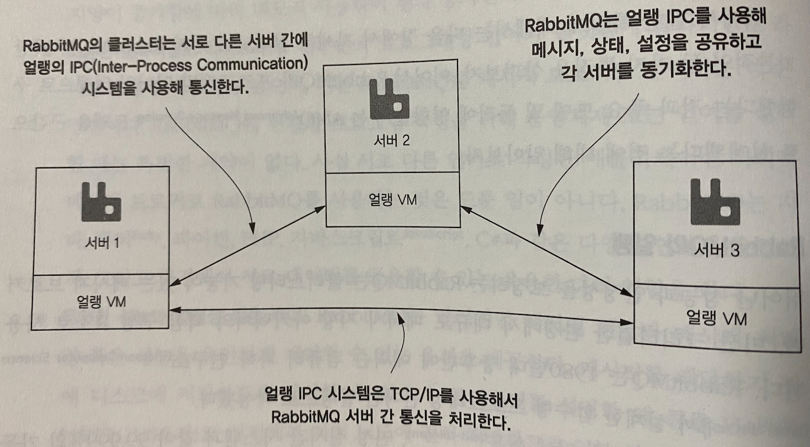
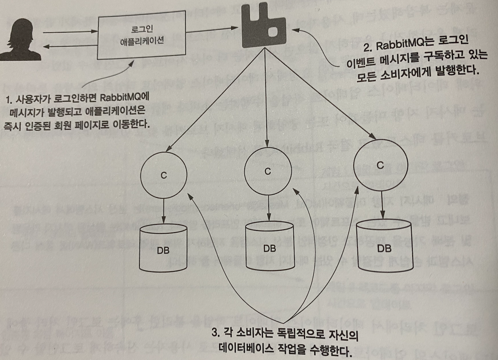
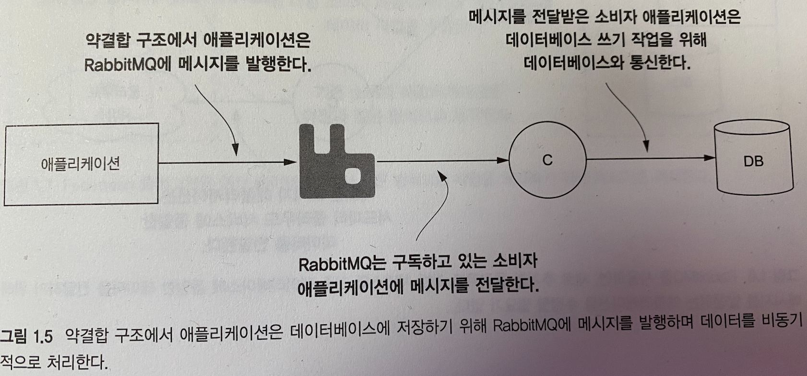
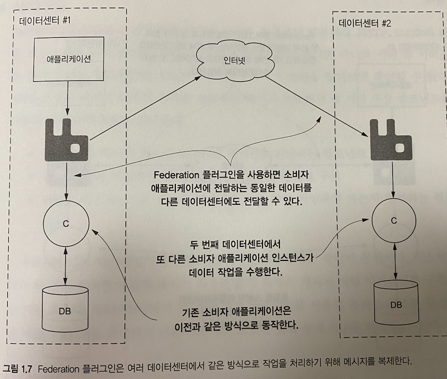
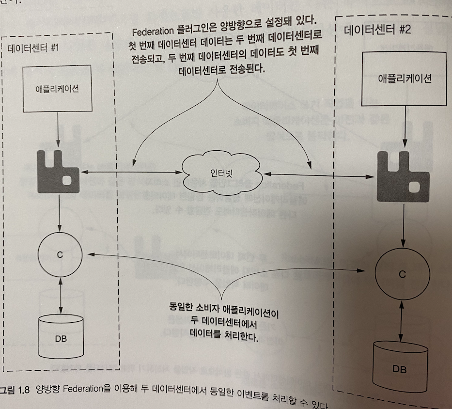
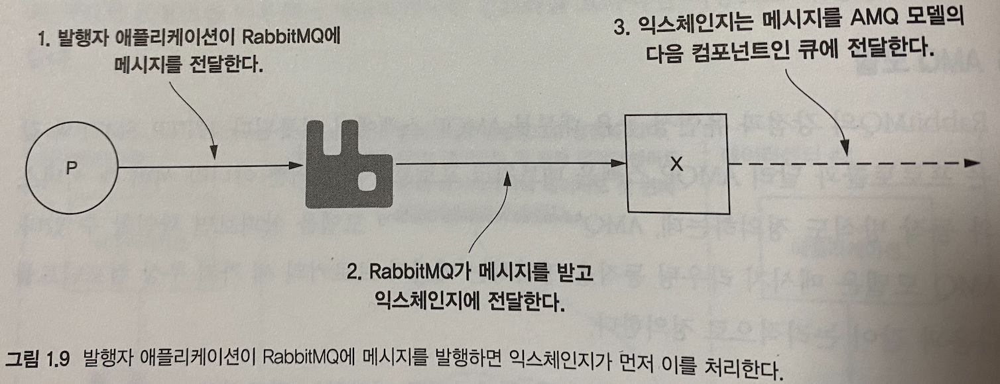
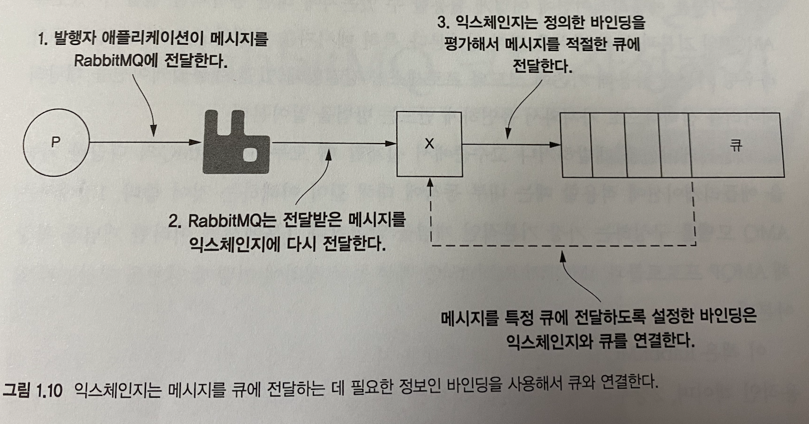

# RabbitMQ In Depth

## 1. RabbitMQ 살펴보기

### RabbitMQ 기능과 장점
- 오픈소스
  - 모질라 공공 라이센스 (Mozilla Public)
- 플랫폼과 업체 중립성
  - AMQP (Advanced Message Queuing Protocol) 스펙을 구현한 메세지 브로커
  - 대부분의 언어와 주요 플랫폼 클라이언트를 제공
- 경량성
  - RabbitMQ 는 관리자 UI 플러그인과 코어 애플리케이션 구동시 40MB 미만 메모리를 사용
- 다양한 클라이언트 라이브러리
  - 대부분의 언어와 주요 플랫폼 클라이언트 라이브러리를 제공
- 유연한 성능과 안정성 절충 제어
  - 안정적인 메세지 전달 및 메세지 처리량 혹은 성능을 유연하게 제어 가능한 옵션을 제공
  - 메세지 배달 전 디스크에 저장 가능하도록 설정이 가능하며, 클러스터 설정시 HA (고가용성) 설정이 가능하다.
- 대기 시간이 긴 네트워크 환경을 위한 플러그인
  - 실제 시스템의 네트워크 토폴로지와 아키텍쳐는 다양하게 구성된다.
  - 때문에 RabbitMQ 는 대기 시간이 짧은 네트워크 환경의 메세지 전달은 기본 코어 모듈로서 제공
  - 긴 대기시간을 가지는 네트워크 환경의 메세지 전달은 플러그인을 통해 제공한다.
  - RabbitMQ 를 이용해 동일한 로컬 네트워크에 클러스터 구성이 가능하며 Federation 플러그인으로 여러 데이터센터 간의 메세지 공유가 가능하다.
- 서드파티 플러그인
  - RabbitMQ 는 유연한 플러그인 시스템을 제공
  - RabbitMQ 를 사용해 메세지를 데이터베이스에 직접 저장하는 서드파티 플러그인 등을 제공
- 보안 계층
  - 보안을 여러 단계로 제공한다.
  - 클라이언트 접속은 SSL 만으로 제한하고, Vhost(가상 호스트) 로 사용자 접근을 관리하며, 구성 기능에 대한 접근/큐에서 읽기/익스체인지 쓰기 등은 정규식 패턴 매칭으로 관리한다.
  - LDAP 과 같은 외부 인증 시스템을 연동하는 플러그인 사용도 가능하다.

### RabbitMQ 와 얼랭
- RabbitMQ 는 클러스터링 기능이 있는 메세지 브로커 이다
- 미션 크리티컬한 환경에서 대규모 메시지 지향 아키텍처의 핵심 구성 요소로 사용된다.
- RabbitMQ 는 1980년대 중후반 에릭슨 컴퓨터 과학 연구소에서 설계한 함수형 언어인 얼랭으로 개발되었다.
- 얼랭은 분산처리, 장애허용, 연성 실시간 시스템과 같이 99.999% 의 가동율을 요구하는 애플리케이션을 위해 설계된 언어
- 얼랭은 실시간 시스템에서 경량 프로세스 간 메세지를 전달하고 공유하는 상태가 없도록 설계되어 높은 수준의 동시성을 지원한다.
- RabbitMQ 는 **얼랭의 프로세스간 통신 (IPC, Inter Process Communication)** 를 활용해 클러스터링 기능을 간단히 구현했다.

`실시간 시스템과 연성 실시간 시스템`
- 실시간 시스템 (Real-Time System) 특정 이벤트를 전달하면 반드시 응답을 반환하는 형태이다.
- 연성 실시간 시스템 (Soft-Real-Time System) 은 준 리얼타임 이라고도 한다.
- 작업 실행은 반드시 보장하나, 실행의 최종 기한은 보장하지 않는 시스템을 말한다.

### RabbitMQ 와 AMQP
- RabbitMQ 는 상호 운용성 (Interoperability), 성능, 안정성을 중요한 목표로 개발되었다.
- 2007년 출시 당시 **AMQP (Advanced Message Queuing Protocol)** 을 구현한 최초 메세지 브로커
- AMQP 스펙은 통신프로토콜 뿐 아닌, RabbitMQ 의 핵심 기능 구현을 위한 논리적인 모델에도 영향을 주었다.
- RabbitMQ 는 AMQP 기반으로 구현되었지만, MQTT, STOMP, XMPP 등 다양한 프로토콜도 제공한다.
- RabbitMQ 는 AMQP 스펙을 구현했으며, 주요 아키텍쳐와 통신 방식이 핵심
  - 다른 메세지 브로커와 비교시 중요한 차이점
  - 유연한 메세지 라우팅, 메세지 내구성 설정, 데이터센터 간 통신 등
  - 메세지 지향 아키텍쳐의 요구사항에 대한 벤더 중립적이고 플랫폼 독립적

### 메세지 지향 아키텍쳐
- 메세지 지향 아키텍쳐의 장점 중 주목할 부분은, 시스템 성능에 영향을 줄 수 있다는 점이다.
- 네트워크 문제에서 RabbitMQ 의 메세지 **스로틀링 (Throttling)** 에 이르기 까지 다양한 문제가 메세지 발행자의 성능에 영향을 줄 수 있다.
- 소비자 애플리케이션의 수평 확장 뿐 아닌 메세지 브로커의 수평 확장도 고려해 처리량과 발행자 성능을 개선하는 것이 좋다.

### 애플리케이션의 의존성 제거
- RabbitMQ 를 사용해 느슨하게 결합된 설계로 변경함으로 인해 애플리케이션 아키텍쳐는 더이상 **데이터베이스의 쓰기 성능에 영향을 받지 않으며** 핵심 애플리케이션 코드를 수정하지 않아도
- 데이터를 처리하는 새로운 애플리케이션을 쉽게 추가할 수 있다.

### 데이터베이스 쓰기 의존성 제거
- 데이터베이스와 강결합된 애플리케이션은 데이터베이스 서버가 트랜잭션을 완료하고 응답할때 까지 대기해야 한다.
- 또한 동기 애플리케이션/비동기 애플리케이션 모두 성능상 병목이 발생할 가능성이 있다.
- 데이터베이스 서버에 문제가 생기면 애플리케이션에 영향이 미친다.
- 이에 의존성을 분리해 느슨한 구조로 변경하면 RabbitMQ 는 데이터 중개자 역할을 수행한다.
- 소비자 애플리케이션은 RabbitMQ 를 통해 데이터를 가져와 데이터베이스 작업을 수행하는 구조

### 새로운 기능 추가하기
- RabbitMQ 를 사용하는 느슨한 구조에서는 데이터를 원활하게 다른 용도로 사용할 수 있다.
- RabbitMQ 는 다양한 용도의 작업을 처리하는 다수 애플리케이션에 메세지를 전달하기 위해 본문을 복제한다.

### 데이터와 이벤트 복제
- RabbitMQ 는 데이터센터 간에 배포된 애플리케이션의 데이터 동기화와 데이터의 전달을 위한 플러그인을 제공한다.
- **Federation 플러그인** 은 WAN 허용 오차 및 네트워크 단절을 고려해 RabbitMQ 인스턴스에 메세지를 전달한다.
- Federation 플러그인을 사용하면, 다른 데이터센터에 존재하는 RabbitMQ 서버 혹은 클러스터를 쉽게 추가할 수 있다.

### 다중 마스터 Federation
- 이 개념을 확장해 두 번째 데이터센터에도, 동일한 프론트엔드 애플리케이션을 추가하고, **양방향 데이터를 처리** 하도록 RabbitMQ 를 구성하면, 물리적으로 다른 지역에 고가용성 애플리케이션을 구성할 수 있다.
- 메세지는 두 데이터센터의 소비자에게 전송되므로 중복해서 데이터를 저장하고, 동일하게 메세지를 처리한다.
- 애플리케이션 아키텍처에 수평 적인 확장성을 제공하고, 사용자의 지리적 근접성을 이용해 애플리케이션 인프라를 효과적인 비용으로 구성할 수 있게 한다.

### AMQ 모델
- RabbitMQ 의 강점과 유연성은 대부분 AMQP 스펙에서 비롯된다.
- HTTP, SMTP 와 같은 프로토콜과 달리 AMQP 스펙은 **네트워크 프로토콜뿐 아닌 서버측 서비스와의 동작도 정의** 한다.
  - Exchange : 메세지 브로커에서 큐로 메세지를 전달하는 컴포넌트
  - Queue : 메세지를 저장하는 디스크/메모리상의 자료 구조
  - Binding : 익스체인지에 전달된 메세지가 어떤 큐에 전달되어야 하는지 정의하는 컴포넌트

### 익스체인지
- 익스체인지는, RabbitMQ로 전송한 **메세지를 수신하고, 메세지를 보낼 위치를 결정** 한다.
- 메세지에 적용할 라우팅 동작을 정의하는데, 서로 다른 라우팅 동작을 정의하는 여려 유형의 익스체인지가 존재한다.
  - 일반적으로 전달한 데이터 속성이나 메세지에 포함된 속성을 이용해 처리한다.
  - 플러그인을 활용한 커스텀 익스체인지도 정의할 수 있다.

### 큐
- 큐는 수신한 **메세지를 저장** 하는 역할을 수행한다.
- 메세지에 수행하는 작업을 정의하는 설정정보를 포함한다.
  - 설정정보에는, 메세지를 **메모리에만 보관** 하거나. 소비자에게 전달하기전 FIFO 순서로 메세지를 **디스크에 저장할지 여부** 가 있다.

### 바인딩
- AMQ 모델은 바인딩을 이용해 **큐와 익스체인지의 관계를 정의** 한다.
- 바인딩과 바인딩 키는 (Binding-Key), **익스체인지가 어떤 큐에 메세지를 전달해야 하는지 의미** 한다.
- 익스체인지에 메세지 발행시, 애플리케이션은 **라우팅 키 (Routing-Key) 속성을 사용** 한다.
  - 이는 큐의 이름이거나, 메세지를 설명하는 문자열이 될 수 있다.
- 익스체인지는 라우팅 키를, 바인딩 키에 맞춰 평가한 뒤 큐에 전달한다.
- 즉, 바인딩 키는, 큐를 익스체인지에 연결하고 라우팅 키를 평가하는 기준이 된다.
  - 익스체인지 유형마다 다르지만, 단순하게 사용한다면 라우팅 키는 큐의 이름이다.
  - RabbitMQ 는 익스체인지를 다른 익스체인지에 연결하는 방식도 제공한다.
  - 이는 메세지 라우팅시 상당한 유연성을 제공한다.

