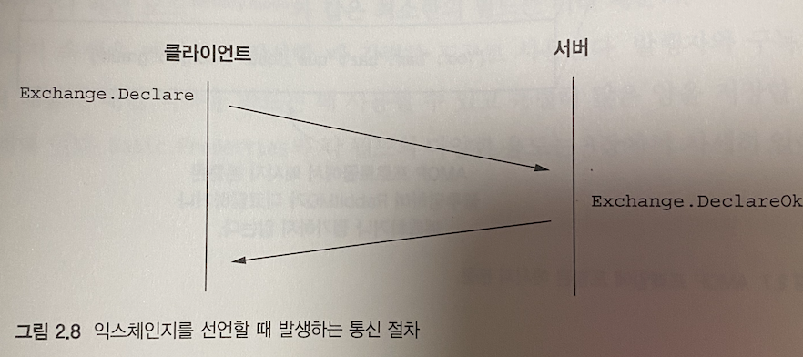

# RabbitMQ In Depth

## 1. RabbitMQ 살펴보기

### RabbitMQ 기능과 장점
- 오픈소스
  - 모질라 공공 라이센스 (Mozilla Public)
- 플랫폼과 업체 중립성
  - AMQP (Advanced Message Queuing Protocol) 스펙을 구현한 메세지 브로커
  - 대부분의 언어와 주요 플랫폼 클라이언트를 제공
- 경량성
  - RabbitMQ 는 관리자 UI 플러그인과 코어 애플리케이션 구동시 40MB 미만 메모리를 사용
- 다양한 클라이언트 라이브러리
  - 대부분의 언어와 주요 플랫폼 클라이언트 라이브러리를 제공
- 유연한 성능과 안정성 절충 제어
  - 안정적인 메세지 전달 및 메세지 처리량 혹은 성능을 유연하게 제어 가능한 옵션을 제공
  - 메세지 배달 전 디스크에 저장 가능하도록 설정이 가능하며, 클러스터 설정시 HA (고가용성) 설정이 가능하다.
- 대기 시간이 긴 네트워크 환경을 위한 플러그인
  - 실제 시스템의 네트워크 토폴로지와 아키텍쳐는 다양하게 구성된다.
  - 때문에 RabbitMQ 는 대기 시간이 짧은 네트워크 환경의 메세지 전달은 기본 코어 모듈로서 제공
  - 긴 대기시간을 가지는 네트워크 환경의 메세지 전달은 플러그인을 통해 제공한다.
  - RabbitMQ 를 이용해 동일한 로컬 네트워크에 클러스터 구성이 가능하며 Federation 플러그인으로 여러 데이터센터 간의 메세지 공유가 가능하다.
- 서드파티 플러그인
  - RabbitMQ 는 유연한 플러그인 시스템을 제공
  - RabbitMQ 를 사용해 메세지를 데이터베이스에 직접 저장하는 서드파티 플러그인 등을 제공
- 보안 계층
  - 보안을 여러 단계로 제공한다.
  - 클라이언트 접속은 SSL 만으로 제한하고, Vhost(가상 호스트) 로 사용자 접근을 관리하며, 구성 기능에 대한 접근/큐에서 읽기/익스체인지 쓰기 등은 정규식 패턴 매칭으로 관리한다.
  - LDAP 과 같은 외부 인증 시스템을 연동하는 플러그인 사용도 가능하다.

### RabbitMQ 와 얼랭
- RabbitMQ 는 클러스터링 기능이 있는 메세지 브로커 이다
- 미션 크리티컬한 환경에서 대규모 메시지 지향 아키텍처의 핵심 구성 요소로 사용된다.
- RabbitMQ 는 1980년대 중후반 에릭슨 컴퓨터 과학 연구소에서 설계한 함수형 언어인 얼랭으로 개발되었다.
- 얼랭은 분산처리, 장애허용, 연성 실시간 시스템과 같이 99.999% 의 가동율을 요구하는 애플리케이션을 위해 설계된 언어
- 얼랭은 실시간 시스템에서 경량 프로세스 간 메세지를 전달하고 공유하는 상태가 없도록 설계되어 높은 수준의 동시성을 지원한다.
- RabbitMQ 는 **얼랭의 프로세스간 통신 (IPC, Inter Process Communication)** 를 활용해 클러스터링 기능을 간단히 구현했다.

`실시간 시스템과 연성 실시간 시스템`
- 실시간 시스템 (Real-Time System) 특정 이벤트를 전달하면 반드시 응답을 반환하는 형태이다.
- 연성 실시간 시스템 (Soft-Real-Time System) 은 준 리얼타임 이라고도 한다.
- 작업 실행은 반드시 보장하나, 실행의 최종 기한은 보장하지 않는 시스템을 말한다.

### RabbitMQ 와 AMQP
- RabbitMQ 는 상호 운용성 (Interoperability), 성능, 안정성을 중요한 목표로 개발되었다.
- 2007년 출시 당시 **AMQP (Advanced Message Queuing Protocol)** 을 구현한 최초 메세지 브로커
- AMQP 스펙은 통신프로토콜 뿐 아닌, RabbitMQ 의 핵심 기능 구현을 위한 논리적인 모델에도 영향을 주었다.
- RabbitMQ 는 AMQP 기반으로 구현되었지만, MQTT, STOMP, XMPP 등 다양한 프로토콜도 제공한다.
- RabbitMQ 는 AMQP 스펙을 구현했으며, 주요 아키텍쳐와 통신 방식이 핵심
  - 다른 메세지 브로커와 비교시 중요한 차이점
  - 유연한 메세지 라우팅, 메세지 내구성 설정, 데이터센터 간 통신 등
  - 메세지 지향 아키텍쳐의 요구사항에 대한 벤더 중립적이고 플랫폼 독립적

### 메세지 지향 아키텍쳐
- 메세지 지향 아키텍쳐의 장점 중 주목할 부분은, 시스템 성능에 영향을 줄 수 있다는 점이다.
- 네트워크 문제에서 RabbitMQ 의 메세지 **스로틀링 (Throttling)** 에 이르기 까지 다양한 문제가 메세지 발행자의 성능에 영향을 줄 수 있다.
- 소비자 애플리케이션의 수평 확장 뿐 아닌 메세지 브로커의 수평 확장도 고려해 처리량과 발행자 성능을 개선하는 것이 좋다.

### 애플리케이션의 의존성 제거
- RabbitMQ 를 사용해 느슨하게 결합된 설계로 변경함으로 인해 애플리케이션 아키텍쳐는 더이상 **데이터베이스의 쓰기 성능에 영향을 받지 않으며** 핵심 애플리케이션 코드를 수정하지 않아도
- 데이터를 처리하는 새로운 애플리케이션을 쉽게 추가할 수 있다.

### 데이터베이스 쓰기 의존성 제거
- 데이터베이스와 강결합된 애플리케이션은 데이터베이스 서버가 트랜잭션을 완료하고 응답할때 까지 대기해야 한다.
- 또한 동기 애플리케이션/비동기 애플리케이션 모두 성능상 병목이 발생할 가능성이 있다.
- 데이터베이스 서버에 문제가 생기면 애플리케이션에 영향이 미친다.
- 이에 의존성을 분리해 느슨한 구조로 변경하면 RabbitMQ 는 데이터 중개자 역할을 수행한다.
- 소비자 애플리케이션은 RabbitMQ 를 통해 데이터를 가져와 데이터베이스 작업을 수행하는 구조

### 새로운 기능 추가하기
- RabbitMQ 를 사용하는 느슨한 구조에서는 데이터를 원활하게 다른 용도로 사용할 수 있다.
- RabbitMQ 는 다양한 용도의 작업을 처리하는 다수 애플리케이션에 메세지를 전달하기 위해 본문을 복제한다.

### 데이터와 이벤트 복제
- RabbitMQ 는 데이터센터 간에 배포된 애플리케이션의 데이터 동기화와 데이터의 전달을 위한 플러그인을 제공한다.
- **Federation 플러그인** 은 WAN 허용 오차 및 네트워크 단절을 고려해 RabbitMQ 인스턴스에 메세지를 전달한다.
- Federation 플러그인을 사용하면, 다른 데이터센터에 존재하는 RabbitMQ 서버 혹은 클러스터를 쉽게 추가할 수 있다.

### 다중 마스터 Federation
- 이 개념을 확장해 두 번째 데이터센터에도, 동일한 프론트엔드 애플리케이션을 추가하고, **양방향 데이터를 처리** 하도록 RabbitMQ 를 구성하면, 물리적으로 다른 지역에 고가용성 애플리케이션을 구성할 수 있다.
- 메세지는 두 데이터센터의 소비자에게 전송되므로 중복해서 데이터를 저장하고, 동일하게 메세지를 처리한다.
- 애플리케이션 아키텍처에 수평 적인 확장성을 제공하고, 사용자의 지리적 근접성을 이용해 애플리케이션 인프라를 효과적인 비용으로 구성할 수 있게 한다.

### AMQ 모델
- RabbitMQ 의 강점과 유연성은 대부분 AMQP 스펙에서 비롯된다.
- HTTP, SMTP 와 같은 프로토콜과 달리 AMQP 스펙은 **네트워크 프로토콜뿐 아닌 서버측 서비스와의 동작도 정의** 한다.
  - Exchange : 메세지 브로커에서 큐로 메세지를 전달하는 컴포넌트
  - Queue : 메세지를 저장하는 디스크/메모리상의 자료 구조
  - Binding : 익스체인지에 전달된 메세지가 어떤 큐에 전달되어야 하는지 정의하는 컴포넌트

### 익스체인지
- 익스체인지는, RabbitMQ로 전송한 **메세지를 수신하고, 메세지를 보낼 위치를 결정** 한다.
- 메세지에 적용할 라우팅 동작을 정의하는데, 서로 다른 라우팅 동작을 정의하는 여려 유형의 익스체인지가 존재한다.
  - 일반적으로 전달한 데이터 속성이나 메세지에 포함된 속성을 이용해 처리한다.
  - 플러그인을 활용한 커스텀 익스체인지도 정의할 수 있다.

### 큐
- 큐는 수신한 **메세지를 저장** 하는 역할을 수행한다.
- 메세지에 수행하는 작업을 정의하는 설정정보를 포함한다.
  - 설정정보에는, 메세지를 **메모리에만 보관** 하거나. 소비자에게 전달하기전 FIFO 순서로 메세지를 **디스크에 저장할지 여부** 가 있다.

### 바인딩
- AMQ 모델은 바인딩을 이용해 **큐와 익스체인지의 관계를 정의** 한다.
- 바인딩과 바인딩 키는 (Binding-Key), **익스체인지가 어떤 큐에 메세지를 전달해야 하는지 의미** 한다.
- 익스체인지에 메세지 발행시, 애플리케이션은 **라우팅 키 (Routing-Key) 속성을 사용** 한다.
  - 이는 큐의 이름이거나, 메세지를 설명하는 문자열이 될 수 있다.
- 익스체인지는 라우팅 키를, 바인딩 키에 맞춰 평가한 뒤 큐에 전달한다.
- 즉, 바인딩 키는, 큐를 익스체인지에 연결하고 라우팅 키를 평가하는 기준이 된다.
  - 익스체인지 유형마다 다르지만, 단순하게 사용한다면 라우팅 키는 큐의 이름이다.
  - RabbitMQ 는 익스체인지를 다른 익스체인지에 연결하는 방식도 제공한다.
  - 이는 메세지 라우팅시 상당한 유연성을 제공한다.

## 2. AMQP 와 RabbitMQ 코드 작성

### RPC 전송으로서의 AMQP
- RabbitMQ 는 AMQP 메세지 브로커로 거의 모든 부분에서 **RPC (Remote Procedure Call)** 패턴으로 엄격하게 통신한다
  - RPC 란 ?
    - 한 컴포터에서 다른 컴퓨터의 다른 프로그램이나 메소드를 원격에서 실행하게 해주는 통신 유형
    - 원격 API 와 통신하는 웹 프로그램이 있다면 이는 일반적인 RPC 패턴 적용의 예
- RabbitMQ 와 통신할 때 발생하는 RPC 는 일반적인 웹 API 와는 많이 다르다
  - AMQP 스펙은 서버와 클라이언트 모두 **명령을 실행 할 수 있다**
  
### RabbitMQ 와 통신할 때 연결 협상 과정
- 어떤 사람과 대화를 나눠야할 때 둘 중 한명은 인사말로 대화를 시작한다.
- 이는 **두 사람이 모두 알고 있는 언어를 서로 확인하는 과정**
- AMQP 에서는 **프로토콜 헤더 (Protocol Header)** 에 해당하며, 클라이언트 => 서버로 전송한다
  - 프로토콜 헤더는 요청으로 간주 되어서는 안되고, 다른 통신과 달리 명령도 아니다.
- Connection.Start
  - 클라이언트 요청을 받은 RabbitMQ 가 응답
- Connection.StartOk
  - 클라이언트는 응답 프레임으로 RPC 요청에 응답

> RabbitMQ 접속을 완료하기 위한 세 가지 동기식 RPC 요청인 start, tune, open 을 기억해 두어야 한다

### 올바른 채널로 튜닝
- AMQP 스펙에는 RabbitMQ 와 통신하기 위한 채널이 정의되어 있다
  - 이는 양방향 라디오 채널과 유사함
- 연결 협상이 완료된 AMQP 연결을 전송 전송을 위한 파이프라인 처럼 사용하고, **다른 채널로의 대화로 부터 전송을 격리** 한다
- AMQP 연결은 여러 채널이 있어, 클라이언트와 서버 간의 여러 대화를 수행할 수 있다
- 이를 **멀티 플렉싱 (multiplexing)** 이라고 하며 멀티스레드 혹은 비동기에 애플리케이션에서 유용함

### AMQP 의 RPC 프레임 구조
- AMQP 스펙은 프로그래밍 언어의 객체지향 개념과 유사한 **클래스와 메소드** 를 사용하면서 클라이언트/서버 간의 공통 모델이 정의되어 있다.
  - AMQP 클래스 : 기능의 범위를 정의
  - AMQP 메소드 : 특정 기능

> 그림과 같이 Connection.Start 명령에는 AMQP 클래스/메소드 라는 두 가지 구성요소가 존재함

### AMQP 프레임 컴포넌트
- RabbitMQ 에서 AMQP 명령을 전송/수신할 때 필요한 모든 인자들은 데이터 구조로 캡슐화된 **프레임** 으로 인코딩 되어 전송됨
  - 프레임 => 명령과 해당 인자를 인코딩해 **각 프레임이 서로 구분되도록 하는 효율적인 방법**
  - 지하철 열차 한 칸과 유사하다고 생각하면 된다

- 저수준 프레임의 경우 다음 5가지 구성요소로 이뤄진다
  1. 프레임 유형
  2. 채널 번호
  3. 프레임 크기 (바이트 단위)
  4. 프레임 페이로드 (본문)
  5. 끝 바이트 표식 (ASCII 값 206)

- 저수준 AMQP 프레임은 세 개의 필드로 구성된 프레임 헤더로 시작됨
  - 첫번째 필드는 **프레임 유형** 을 표현하는 단일 바이트
  - 두번째 필드는 **프레임이 속하는 채널** 을 표현
  - 마지막 필드는 **프레임 본문의 크기** 를 표현
- 프레임 헤더와 마지막 바이트 마커 사이에 페이로드가 존재한다

### 프레임 유형
- AMQP 스펙 기준 5가지 유형의 프레임이 정의되어 있다
  - **프로토콜 헤더 프레임**
    - RabbitMQ 연결시 1번만 사용됨
  - **메소드 프레임**
    - RabbitMQ 와 주고 받는 RPC 요청/응답 을 전달
  - **콘텐츠 헤더 프레임**
    - 메세지의 크기와 속성을 포함
  - **바디 프레임**
    - 메시지의 내용을 포함
  - **하트비트 프레임**
    - RabbitMQ 와 연결된 클라이언트와 서버가 주고받으며 서로 사용가능한 상태인지 확인하는 용도
> 하트비트 동작은 AMQP 가 양방향 RPC 프로토콜임을 보여주는 완벽한 예시 이다

### 메세지를 프레임으로 마샬링
- RabbitMQ 에 메세지 발행시 **메소드, 헤더, 바디** 프레임이 사용된다
- **메소드 프레임** 은 가장 먼저 전송되는 프레임이며, 익스체인지와 라우팅 키를 함께 전송한다
- 콘텐츠 헤더 프레임과 바디 프레임이 그 다음으로 전송된다
  - 콘텐츠 헤더는 본문 크기와 메세지 속성이 포함되어 있다
- 하나의 메세지 는 **항상 메소드 > 콘텐츠 헤더 > 바디 프레임 순으로 전송된다**
- **메세지 본문이 AMQP 에 정의된 최대 프레임 크기 초과시 여러 바디 프레임으로 분할되어 전송됨**

> 프레임의 기본 크기는 131KB 이다.  
> 클라이언트 라이브러리는 연결 과정 중 최대 32비트로 표혐가능한 범위 내에서 최대 프레임 크기를 서버와 협상한다

### 메소드 프레임 해부

- 메소드 프레임은 **RPC 요청이 처리할 클래스/메소드 와 실행을 위한 인자를 함께 전달** 한다
- 처음 두 필드는 RPC 명령을 표현하는 클래스/메소드 가 전달됨
- 그 다음 익스체인지 와 라우팅 키가 전달
- 마지막으로 mandatory 플래그가 전달
  - RabbitMQ 에 메세지가 **정상 전달되었는지 확인하는 용도**

### 콘텐츠 헤더 프레임

- 콘텐츠 헤더 프레임은 메세지 크기와 그 외 데이터 들을 전달
- RabbitMQ 서버와 주고 받은 **메세지를 설명하는 속성** 들을 가지고 있다
  - Basic.Properties 테이블의 값
  - 데이터가 포함 되거나 비어있을 수 있음
- 대부분의 라이브러리는 콘텐츠 타입/Delivery Mode 필드는 미리 채워주는 형태로 구현됨

### 바디 프레임

- 메세지 바디 프레임은 전송되는 **데이터 유형에 대해 독립적**
  - 이진 또는 텍스트 데이터를 포함
  - JPEG/JSON/XML 데이터 전송 가능
- 메세지 속성과 본문으로 구분되어 저장됨
- 속성과 본문이 의존적이지 않으므로 이를 결합해 다양한 유형의 데이터를 표현할 수 있다

### 프로토콜 사용하기
- 메세지를 큐에 발행하기 전 몇가지 단계가 필요하다
  - 최소한 익스체인지/큐에 설정후 연결이 필요

### 익스체인지 선언
- AMQP 모델에서 익스체인지는 큐와 같이 **1급 시민** 으로 취급된다
- Exchange.Declare 명령으로 익스체인지의 이름/유형 메세지 처리시 사용할 기타 메타데이터를 조합해 익스체인지를 생성한다
- Exchange.Declare 명령 실행시 익스체인지 생성후 Exchange.DeclareOk 메소드 프레임으로 응답한다
  - 실패시 채널이 닫힌 이유를 나타내는 응답을 Channel.Close 명령에 포함시켜 전송한다

### 큐 선언
- 익스체인지 생성 이후, Queue.Declare 명령으로 큐를 생성한다
- Exchange.Declare 명령과 유사한 절차로 진행 된다
- 큐 선언시 중복 된 요청을 전송해도 문제되지 않는다
  - 중복 큐 선언을 감지해 이를 처리

### 큐와 익스체인지 연결
- Queue.Bind 명령으로 큐를 익스체인지와 연결할 수 있다 (한번에 하나의 큐만 지정)
  - Exchange.Declare 명령과 유사하게 처리된다

### RabbitMQ 메세지 발행
- RabbitMQ 에 메세지를 발행할 때 여러 종류의 프레임 들이 서버로 전송하는 메세지의 **데이터를 캡슐화** 한다
- 메세지 본문을 RabbitMQ 에 전달하기 전 Basic.Publish 메소드 프레임, 콘텐츠 헤더 프레임, 바디 프레임 을 전송한다
- 메세지의 모든 프레임을 수신한 후 RabbitMQ 는 이들을 검증하는 과정을 거친다
- 메소드 프레임에 포함된 **익스체인지/라우팅 키를 평가해 해당하는 큐를 찾는다**
- 여기까지 과정이 완료된 후 RabbitMQ 는 FIFO 형태로 메세지를 큐에 삽입한다
  - 실제 메세지가 아닌, 메세지에 대한 참조가 큐에 추가됨
  - 하나의 메세지로 여러 큐에 발행될 수 있기 때문에, 실제 메세지는 RabbitMQ 가 한벌만 가지고 있고, 큐에는 메세지에 대한 참조를 넣는다고 생각하면 됨
> 여러 큐에 발행된 메세지는 이 참조를 이용해 최적화됨

### RabbitMQ 메세지 소비
- 애플리케이션은 Basic.Consume 명령으로 특정 큐를 구독한다
- RabbitMQ 판단에 따라 Basic.Deliver 메소드 프레임, 콘텐츠 헤더 프레임, 바디 프레임으로 메세지를 전달 받음
- Basic.Consume 이 수행되면 특정 상황 이전까지 활성 상태를 유지한다
  - Basic.Cancel 명령으로 구독을 취소할 수 있음
- Basic.Consume 에 no_ack 옵션이 있다
  - 이는 메세지 구독을 동기/비동기 설정 값
  - 비동기 설정시 Basic.Cancel 또는 연결을 끊을때 까지 계속 메세지를 보낸다
  - 비동기 설정이 아니라면 메세지를 보낼 때 마다 잘 도착했는지 확인 요청을 한다

## 3. 메세지 속성 심층 탐사

### 메세지 속성 적절히 사용하기
- 콘텐츠 헤더 프레임에 존재하는 메세지 속성은 **Basic.Properties** 데이터 구조로 사전에 정의한 값을 사용한다
  - delivery-mode 와 같이 AMQP 스펙에 정의된 것을 사용하기도 하지만 type 과 같이 명확한 스펙이 없는 속성도 존재

> RabbitMQ 에서 MQTT 와 같은 프로토콜 사용시 AMQP 에 정의된 속성을 사용할 수 없는 속성이 있기 때문에 이를 유의해야 한다

### content-type
- 메세지 본문의 **데이터 형식** 을 표현하기 위한 속성
- HTTP 스펙의 content-type 처럼 메세지 본문의 MIME 유형을 전달한다
- 메세지 수신시 이를 활용해 올바른 디코딩 처리를 할 수 있음
- 라이브러리 에서 이를 활용해 특정 데이터 유형으로 직렬화에 사용한다

### gzip, content-encoding
- AMQP 를 이용해 전달만 메세지는 기본적으로 압축되지 않음
- XML 과 같은 마크업 문법이나 JSON/YAML 과 같이 마크업을 사용하지 않는 경우에도 문제가 될 수 있음
- 웹페이지를 gzip 으로 압축후 랜더링 전에 해제하는 것처럼 메세지 발행 전 압축하고, 전달 받아 풀 수 있음
- AMQP 에서는 `content-encoding` 속성을 이용해 처리한다
  - content-type 과 혼동하지 않아야 한다
  - 일부 클라이언트는 content-encoding 을 UTF-8 로 자동설정하는 데 이는 잘못된 것임

> 운영 환경에서는 메세지 계약을 운영중에 변경하지 않는 것이 좋음

- MIME 이메일 마크업은 병렬 처리가 가능하도록 `content-encoding` 필드를 사용해 각 파트에 대해 인코딩을 표현한다
  - 가장 일반적인 것은 Base64 와 QP (Quoted-Printable)
- 메세지 본문의 콘텐츠는 그대로 전송되며 메세지 마샬링 및 언마샬링 과정에서 인코딩되거나 변환되지 않음
  - 모든 본문은 프로토콜 위반 없이 다양한 형식으로 전달된다

### message-id 와 correlation-id 를 이용한 메세지 참조
- AMQP 스펙에서 message-id 와 correlation-id 는 애플리케이션 용도로 지정되었으며, 공식적으로 정의된 동작은 없음
  - 애플리케이션 에서 원하는 용도로 자유롭게 사용 가능
- 최대 255 바이트의 UTF-8 인코딩 값을 가질 수 있다

`message-id`
- 판매 주문이나 지원 요청과 같은 경우 메세지를 쉽게 파악하는데 활용됨
- message-id 속성은 메세지가 느슨하게 결합된 시스템의 다양한 구성 요소를 통과할 때 마다 **고유 식별 용도** 로 헤더로 전달된다

`correlation-id`
- AMQP 에서는 공식적인 정의가 없지만, 현재 메세지와 관련된 메세지의 message-id 값을 지정함으로 인해, **다른 메세지의 응답임을 표현** 할 수 있다
- 또 다른 예는 트랜잭션 ID 나 메세지가 참조하는 다른 데이터를 전달하는 데 이 속성을 사용하는 것

### timestamp 속성
- message-id 와 마찬가지로 애플리케이션 용도로 지정되었다
- 애플리케이션에서 이를 사용한 필요가 없다고 하더라도 RabbitMQ 를 통한 메세지흐름에서 예상치 못한 동작을 확인하고자 할 때 매우 용하다
- 이를 활용해 메세지 생성 시점을 기록하면 메세지 발행시 성능 측정도 가능하다
- 애플리케이션에서 이 속성을 평가해 메세지 처리 여부를 결정하거나 메세지 수명으로 활용할 수도 있다

### 자동으로 메세지 만료하기
- expiration 속성은 RabbitMQ 에서 소비하지 않은 메세지를 버려야 할 때 파악하는 용도로 사용된다
- AMQP 0-8/0-9-1 에 모두 존재하지만 RabbitMQ 3.0 버전 이전에는 지원되지 않았다
  - 속성의 스펙을 보면 구현시 사용할 순 있지만 공식적인 동작은 없다 고 되어 있다
- timestamp 와 동일하게 유닉스 시간을 갖지만 255 자의 짧은 문자열이다
- 스펙이 모호하기 때문에 다른 메세지 브로커나 다른 버전을 사용할 경우 다른 의미로 사용될 수 있음
- `expiration` 속성 사용시 메세지가 서버 도착 후 만료된 경우 큐로 삽입 되지 않고 삭제된다

### 배달 모드를 이용해 안전성과 속도 조절
- `delivery_mode` 속성은 소비자에게 전달 전 메세지를 디스크에 저장할 지 여부를 지정한다
  - 1바이트 공간 차지
- 메세지를 디스크에 저장하면, RabbitMQ 서버 재시작시 메세지 소비전까지 큐에 남아있게 된다
  - 1: 메모리 모드
  - 2: 디스크에 저장
- 메모리 모드를 사용하면 메세지 발행 속도가 빠름
  - 본질적으로 Disk I/O 가 느림

### app-id/user-id 를 통해 메세지 출처 확인
- app-id/user-id 는 메세지에 대한 다른 수준의 정보를 제공하고, 다양한 용도로 활용될 수 있다
- 소비자 애플리케이션에서 메세지 처리전 **유효성 검증** 용도로써 활용 된다

`app-id`
- AMQP 스펙에서 app-id 속성은 최대 255 자의 UTF-8 문자열
- 애플리케이션이 API 중심으로 설계돼 버전관리가 필요한 경우 app-id 로 버전을 전달할 수 있음
- 또 다른 사용법은 통계 데이터로 수집 하는 것
  - 특정 플랫폼의 아이디를 수집

`user-id`
- 로그인한 사용자 식별을 위해 이를 사용하는 것은 권장되지않음
- RabbitMQ 는 메세지 발행하는 사용자에 대해 user-id 속성으로 모든 메세지를 검사하고 값이 일치하지 않는다면 메세지가 거부된다

### type 속성으로 메세지 특정하기
- AMQP 0-9-1 버전에서 type 소성은 **메세지 유형 이름** 으로 정의되어 있지만, 애플리케이션 전용으로 공식적인 동작은 정해지지 않았다
- 익스체인지와 결합된 라우팅 키는 메세지 결정시 많은 정보를 전달하지만 type 속성은 애플리케이션이 메세지 처리 방법을 결정하는데 다른 수단으로 사용된다
  - 메세지 유형을 정의하는데 주로 사용됨

### 동적인 작업 흐름을 위한 reply-to 속성 사용하기
- AMQP 스펙에서 reply-to 속성은 공식적으로 정의된 동작은 없다
  - 애플리케이션 용도로만 지정되어 있음
- 메세지에 대한 응답을 위한 개인 응답 큐를 지정하는데 사용될 수 있다
- 특정 큐 이름이나 메세지가 발행된 동일한 익스체인지의 응답 키를 전달하는데 사용할 수 있다

### headers 를 사용하 사용자 속성 지정하기
- headers 속성은 임의의 사용자 정의 키와 값을 갖는 테이블
- 키는 최대 255 자 길이를 갖는 ASCII 나 유니코드 문자열을 설정할 수 있다
- 다른 속성과 달리 원하는 모든 데이터를 추가할 수 있음
- 라우팅 키 대신 헤더에 채워진 값을 기반으로 라우팅을 할 수 있다

### priority 속성
- RabbitMQ 3.5.0 부터 AMQP 스펙에 맞춰 priority 필드가 구현됨
- 큐에 포함된 메세지의 우선순위 지정에 사용된다
  - 0 ~ 9 까지 값을 가지며 숫자가 낮을 수록 우선순위가 높다

### 사용할 수 없는 속성 : cluster-id/reserved
- cluster-id 는 0-8 에서 정의되었고 0-9-1 에서 제거되었다
- 이 속성은 가급적 사용하지 않는 것이 좋음