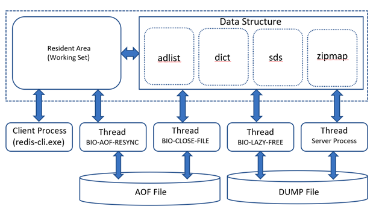

# 빅데이터 저장 및 분석을 위한 NoSQL & Redis

## 1. NoSQL & Redis 소개

### 1.1 NoSQL
- 기존에는 파일 시스템 혹은 DBMS 와 같은 저장 및 관리 기술을 주로 사용해왔지만 이들 만으로는 최근의 데이터양을 처리하는데 한계가 있다.
- 기존 RDBMS 는 클라이언트/서버 플랫폼 기반, NoSQL 은 클라우드, 클라이언트/서버 플랫폼 모두를 기반으로 한다.
- NoSQL 은 SQL 이 아니다 라는 말보단, 기존에 SQL 이 제공하는 기능 뿐 아니라 SQL 이 할 수 없는 영역의 일 까지 가능한 기술 이다.

`장점`
- 클라우드 환경에 적합하다.
    - 오픈 소스이며, Dual Licence 를 제공함
- 유연한 데이터 모델이다.
    - RDBMS 의 경우 분석, 설계, 구측을 위해 3가지 모델링 단계 (개논물) 과 정규화 및 반정규화를 수행 한뒤 테이블을 생성한다.
    - 하지만 NoSQL 은 비정형 데이터 구조 (RDBMS 에 비해 유연함)
- 빅데이터 처리에 효과적이다.
    - NoSQL 은 처음부터 빅데이터를 고려하고 만들어진 SW
    - RDBMS 에 비해 보장된 성능을 보여준다.

### 1.2 NoSQL 종류

`NoSQL 제품`
- MongoDB, Redis, Cassandra, Neo4j 등이 존재한다.
- 이들이 모두 같은 데이터 구조를 사용하지는 않는다.
- Key-Value, Column-Family, Document, Graph 와 같이 4가지 유형의 구조를 제공한다.

> 4가지 유형으로 나뉘는 이유는 데이터의 **유용성 (Availability)**, **일관성 (Consistency)**, **지속성 (Partitioning)** 을 고려한 결과

`빅데이터 데이터 모델링을 위한 가이드 라인`
- 초당 5만건 이상의 데이터가 발생하는가 ?
- 트랜잭션 제어가 필요한가 ?
- 데이터 무결성이 요구되는가 ?
- 수평적 DataSets 인가 ?
    - RDBMS 의 테이블 구조를 2차원 수평적 데이터 구조라고 한다.
- 계층형 데이터인가 ?
    - 일반적인 경우 Document DB 로도 충분히 커버가 가능하지만 Depth 가 10~20을 넘어간다면 Graph DB 를 권장한다.

### 1-3. Key-Value DB 의 활용

`장점`
- In-Memory 기반 데이터 저장구조
- 하나의 Key 와 데이터 값으로 구성됨
- 가공처리가 요구되는 비즈니스 환경에 적합

> Redis 는 대부분 보조 DB 로 많이 사용된다.

`활용 영역`
- 실시간 분석
- IOT 영역
- 계측 정보수집 영역
- 개인화 정보관리 영역
- 전자 상거래 비즈니스 영역

### 1-4. NoSQL 선정 방법
- SimpleAPI 를 지원하는가 ?
- Easy Distributed 기술을 제공하는가 ?
- Easy Replication 이 지원되는가 ?
- Scale-Out 이 가능한가 ?
- 유지보수 비용이 저렴한가 ?
- 비정형 데이터 구조를 지원하고, 트랜잭션 제어가 가능한가 ?
- 오픈소스인가 ?

## 2. Redis 설치 및 데이터 처리

### 2-1. 주요 특징
- Redis 는 Key-Value 데이터베이스로 분류되는 NoSQL이다.
- Key-Value DB 이면서 대표적인 In Memory 기반 데이터 처리 및 저장기술을 제공한다. 이 때문에 빠른 Read/Write 가 가능하다.
- String, Set, Sorted Set, Hash, List, HyperLogLogs 유형의 데이터 저장이 가능
- Dump 파일과 AOF (Append Of File) 방식으로 메모리 상의 데이터를 **디스크에 저장** 이 가능하다.
- Master/Slave Replication 기능을 통해 데이터 분산, 복제 기능을 제공한다.
- **Query Off Loading** 기능을 통해 Master 는 Read/Write, Slave 는 Read 만 수행할 수 있다.
- 파티셔닝을 통해 동적인 스케일 아웃이 가능하다.
- Expiration 기능은 일정 시간이 지난뒤 메모리상 데이터를 자동 삭제할 수 있다.

`Redis 의 주요 업무 영역`
- InMemory DB 의 최대 장점인 빠른 읽고 쓰기가 가능하지만 메인 DB 로 사용하기엔 제한적이다.
- 주된 사용처는 데이터 캐싱, IOT Device 를 통한 데이터 수집 및 처리, 실시간 분석 및 통계
- Message-Queue, 머신러닝, Application Job Management, 검색 엔진 에서 RDB 와 다른 NoSQL 에 비해 효율적인 사용이 가능하다.

### 2-2. 제품 유형
- 다른 NoSQL 과 마찬가지로 듀얼 라이센스를 제공하고 있다.
- 듀얼 라이센스는, 하나의 제품에 2가지 유형의 라이센스가 제공된다는 것이다.
- 이를 용도에 따라 선택할 수 있다.

1. 커뮤니티 에디션
    - 오픈소스 라이선스를 기반으로 개발 및 지원되는 기술
2. 엔터프라이즈 에디션
    - 해당 SW 를 사용하면서 발생하는 기술 문제에 대해 기술 지원을 받을 수 있다.

`Redis 시스템의 전체 아키텍쳐 구성`
- 데이터 저장 엔진
- 분산 시스템
- 복제 시스템
- Index Support
- 관리 툴 (Redis-Server, Redis-Cli, Redis-BenchMark 등)
- 서드파티 모듈을 이용해 더 다양한 활용이 가능함
    - Redis Search Engine : 검색 엔진
    - RedisSQL : SQLite DB 연동
    - RedisGraph : GraphDB 연동
    - Redis sPiped : 암호화

### 2.3 다운로더 및 설치

### 2.4 Redis 시작과 종료

### 2.5 데이터 처리

`용어 설명`
- Table: 하나의 DB 에서 데이터를 저장하는 논리적인 구조
- Data Sets: 테이블을 구성하는 논리적인 단위, 하나의 데이터셋은 **하나의 KEY 와 하나 이상의 FIELD/ELEMENT 로 구성** 된다.
- Key: 하나의 Key 는 하나 이상의 조합된 값으로 표현 가능하다.
- Values: 해당 Key 에 대한 구체적인 데이터 값을 표현한다.

`데이터 입력/수정/삭제/조회`

| 종류 | 설명 |
| --- | --- |
| set | 데이터 저장 |
| get | 데이터 조회 |
| rename | 저장된 데이터 값 변경 |
| randomkey | 저장된 Key 중 하나의 Key 를 랜덤하게 검색 |
| keys | 저장된 모든 Key 를 검색 |
| exists | 검색 대상 Key 존재 여부 확인 |
| mset / mget | 다수의 Key, Value 를 한번에 저장 및 검색 |

`데이터 타입`

| 종류 | 설명 |
| --- | --- |
| strings | 문자, Binary 유형 데이터를 저장 |
| List | 하나의 Key 에 여러 개의 배열 값을 저장 |
| Hash | 하나의 Key 에 여러 개의 Fields 와 Value 로 구성된 테이블을 저장 |
| Set, Sorted Set | 정렬되지 않은 String, Set 과 Hash 를 결합한 타입 |
| Bitmaps | 0 과 1 로 표현하는 데이터 타입 |
| HyperLogLogs | Element 중 Unique 한 개수의 Element 만 계산 |
| Geo | 좌표 데이터를 저장 및 관리 |

> Redis 에서 데이터를 표현하는 기본 타입은 Key 와 Field/Element 를 저장하는 방식 \n
> Key 에는 아스키 값을 저장할 수 있고, Value 는 기본적으로 Strings 와 Container 타입 (Hash, List, Set, Sorted Set) 을 저장할 수 있다.

- **Hash**
    - RDB 에서 PK 와 컬럼으로 구성된 테이블과 매우 유사한 데이터 유형
    - 하나의 Key 는 오브젝트 명과 하나 이상의 필드 값을 콜론 (:) 으로 조합해 표현할 수 있다.
    - 필드 개수의 제한은 없다.
    - hmset, hget, hgetall, hkey, hlen 명령어를 사용한다.
- **List**
    - 일반적인 프로그래밍 언어에서 배열과 유사한 데이터 구조
    - 기본적으로 Strings 타입의 경우 배열에 저장가능한 크기는 **512MB**
    - lpush, prange, rpush, rpop, llen, lindex 명령어를 사용한다.
- **Set**
    - Set 은 여러개의 엘리먼트로 데이터 값을 표현한다. (Object 처럼 표현한다고 생각하면 쉬움)
    - sadd, smembers, scard, sdiff, sunion 명령어를 사용한다.
- **Sorted Set**
    - Set 과 동일한 데이터 구조이고, 데이터 값이 정렬된 상태
    - zadd, zrange, zcard, zcount, zrank, zrevrank 명령어를 사용한다.
- **Bit**
    - Redis 에서 제공되는 Bit 타입은 사용자의 데이터를 0과 1로 표현하여 가장 빠르게 저장 및 해서이 가능하도록 표현하는 구조
    - setbit, getbit, bitcount 명령어를 사용한다.
- **Geo**
    - 위치 정보 데이터를 효율적으로 저장 관리할 수 있는 데이터 구조
    - geoadd, geopos, geodist, georadius, geohash 명령어를 사용한다.
- **HyperLogLogs**
    - RDB 테이블에서 Check 제약조건과 유사한 개념
    - 특정 필드 혹은 엘리먼트에 저장되어야 할 값을 미리 생성하여 저장 한 뒤 필요에 따라 연결하여 사용할 수 있는 데이터 구조
    - pfadd, pfcount, pfmerge 명령어를 사용한다.

### 2.6 Redis 확장 Module

`REJSON`
- Redis 서버에서 JSON 데이터 타입을 저장할 수 있게 해주는 확장 모듈

`REDISQL`
- Redis 서버와 RDB 인 SQLite 와 연동해서 사용할 수 있게 해주는 확장 모듈

`RediSearch`
- Redis DB 에 저장된 데이터에 대해 검색엔진을 사용할 수 있게 해주는 확장 모듈

`Redis-ML`
- 머신러닝 모델 서버를 Redis 서버에서 사용할 수 있게 해주는 확장 모듈

`Redis-sPiped`
- Redis Server 로 전송되는 데이터를 암호화 할 수 있게 해주는 확장 모듈

### 2.7 Lua Function & Script
- Redis Server 에 내장된 Lua Interpreter 를 통해 미리 작성된 Lua Script/Function 을 사용할 수 있다.
- 기본적으로 다양한 Lua Function 을 제공한다.

## 3. 트랜잭션 제어 & 사용자 관리

### 3.1 Isolation & Lock
- Hadoop 과 같은 파일 시스템 기반은 기본적인 단위의 트랜잭션을 제어할 수 없다.
- 이 때문에 제공되는 기술이 NoSQL (하지만 모든 NoSQL 제품이 트랜잭션을 지원하는 것은 아님)
- RDB 의 Commit, Rollback 처럼 트랜잭션 제어가 가능한것 중 하나가 Redis (이를 Read UnCommitted 라고 표현한다.)
- Commit, Rollback 을 지원하면 초당 10만 ~ 20만 이상의 빠른 쓰기/읽기 성능을 보장하기 힘들다.
- 이를 보완하기 위해 Redis 는 Read Committed 트랜잭션 제어도 제공한다.

`DBMS 락 매커니즘`
- Global Lock
- Database Lock
- Object Lock
- Page Lock
- Key/Value Lock (Data Sets Lock)

> Redis 4.0 버전은 데이터-셋 레벨의 락 매커니즘을 제공한다.

### 3.2 CAS (Check And Set)
- 트랜잭션 충돌시 이를 인지할 수 있어야 하는데, 이를 Redis 에서는 CAS (Check And Set) 라고 표현한다.

> Redis 의 Watch 명령어를 통해 다중 트랜잭션이 발생하는지 여부를 모니터링 한다.

### 3.3 commit & rollback
- Redis 는 변경한 데이터를 최종 저장할때 EXEC, 취소시 DISCARD 명령어를 사용한다.

### 3.4 Index 유형과 생성
- Redis 는 기본적으로 하나의 Key 와 Field/Element 값으로 구성된다.
- Key 는 빠른 검색을 위해 기본적으로 인덱스가 생성되는데 이를 **Primary Key Index** 라고 한다.
- 사용자 필요에 따라 추가적으로 인덱스 생성이 가능한데 이를 **Secondary Index** 라고 한다.
- 인덱스 키를 통해 검색시 유일한 값을 검색하는 경우 **Exact Match by a Secondary Index**
- 일정 범위의 값을 검색조건으로 사용하는 경우 **Range by a Secondary Index** 라고 한다.

### 3.5 사용자 생성 및 인증/보안/Roles

`Access Control Privilege`
- 가장 기본적인 접속 권한 중 하나인 액세스 컨트롤
- 미리 사용자 계정 및 암호를 생성해두고, Redis 접근시 인증을 받는 방식
- Standalone Redis 서버 접속시 기본적인 액세스 컨트롤 권한을 부여할 수 있지만, 여러대의 서버로 분산 및 복제 시스템으로 구축하는 경우에는
- Master, Slave, Sentinel, Partition, Replication 서버 간에 **네트워크 액세스 컨트롤 권한** 이 추가로 필요하다.
- 이를 활성화 시키려면 conf 파일내에 requirepass, masterauth 파라메터로 설정해 주어야함

`Authorization Method`
- Redis 는 2가지 인증 방법을 제공한다.
- 1) OS 인증 방법, conf 파일에 접속할 IP 주소를 미리 지정해 둔다.
- 2) Internal 인증 방법, Redis 에 접속한 뒤 auth 명령어로 미리 생성한 계정과 암호로 권한을 부여 받는다.
    
> 커뮤니티 에디션은 Standalone 서버를 구축하는 경우 기본적으로 사용자 계정을 사용자가 직접 생성할 수 없다. \n
> 엔터프라이즈 에디션은 직접 설계 및 생성할 수 있으며, 사용자 정의 롤을 생성하여 부여할 수 있다.

## 4. Redis Data Modeling

### 4.1 Key Value Data Modeling

`용어`
- RDB 에서 데이터를 저장하는 논리적인 구조는 Table, Redis 에서도 Table 이라고 한다.
- Table 을 구성하는 요소가 Column 이라고 하는데, Redis 에서는 Field, Element
- RDB 의 제약조건, Check 조건에 대응하는 것은 HyperLogLogs 데이터 속성을 지원한다.

`데이터 모델링 가이드 라인`
- 1) Hash 데이터 모델
    - RDB 의 Parent-Child 구조와 가장 유사함
- 2) List 데이터 모델
    - RDB 의 Master-Detail 구조와 가장 유사함
    - 예) 주문 공통 정보와 주문 상세 (각 항목들)
- 3) Set / Sorted Set 데이터 모델
    - RDB 의 계층형 구조와 가장 유사함
    - 예) Self 참조 관계, 사원 테이블
- 4) HyperLogLogs
    - RDB 의 Check-제약조건 과 가장 유사함

`데이터 모델`
- Redis 서버에서 설계가능한 데이터 모델 유형은 크게 5가지가 있다.
  
- 1) Hash-Hash 모델
    - 주문 -> 운송 테이블 대표적인 구조
        - 주문 번호를 참조하는 구조
- 2) Hash-List 모델
    - 주문공통 -> 주문 상세 테이블과 같은 구조
        - 주문 공통1, 주문상세 N
- 3) List-List 모델
    - 제품과 카테고리
    - N:M 관계 구조
- 4) Set / Sorted Set - List 모델
    - RDB 의 계층형 구조

### 4.2 논리적 DB 설계
- 하나의 Redis 서버는 여러 개의 데이터베이스로 구성된다.
- 기본적으로 논리적인 데이터베이스를 16개 생성할 수 있는데 필요에 따라 데이터베이스를 추가 생성할 수 있다.
- 사용자가 생성하는 수십 ~ 수백개의 테이블은 데이터 성격 / 비즈니스 / 관리 / 성능 이슈 등에 따라 여러 개의 논리적 DB 에 분산 하는것이 원칙
- 이런 분산 저장 기술을 **스트라이핑 (Striping)** 기법이라고 하며 가장 보편적인 설계 및 저장 기술이다.
- 하나의 데이터베이스에 모든 데이터를 저장하다보면 장애 발생시 장애 범위가 너무 넓어 대응하기 힘든 문제가 있다.
- 또한 CRUD 작업시 다양한 Lock 이 발생하는데 이는 성능 이슈로 이어질 수 있다.
- 때문에 이를 최소화 하기 위해 여러 개의 데이터베이스로 분산 설계 및 구축하는 것이 좋다.
- conf 설정파일에 database 파라메터에 의해 개수가 결정된다.

### 4.3 Swap DB 설계
- 대용량 데이터 및 가공 처리를 수행하다 보면 빅데이터의 분류 작업을 하다보면 메모리 부족 현상이 종종 발생한다.
- 이를 보완하기 위해 Redis 4.0 부터 SwapDB 기능을 제공한다.
- RDB 의 임시테이블스페이스 혹은 임시 데이터베이스와 유사한 구조

## 5. Redis 아키텍쳐

### 5.1 Redis 아키텍쳐



`메모리 영역`
- Resident Area
    - Client 가 Redis 서버에 접속해서 처리하는 모든 데이터가 가장 먼저 저장되는 영역
    - 실제 작업이 수행되는 공간이라고 해서 **Working Set** 영역이라고 한다.
- Data Structure
    - Redis 서버의 다양한 정보와 서버 상태를 모니터링하기 위해 수집한 정보들을 저장 및 관맇나느 메모리 영역

`파일 영역`
- AOF 파일
    - Redis 는 기본적으로 In-Memory 기반으로 동작하지만, 중요한 데이터의 경우 필요에 따라 지속적으로 저장할 필요가 있다.
    - 이를 위해 제공되는 디스크 영역이 AOF 파일 (스냅샷)
- DUMP 파일
    - AOF 과 동일하게 디스크에 저장하는 영역이지만, 소량의 데이터를 일시적으로 저장할때 사용한다.

`프로세스 영역`
- Server Process
    - redis-server 혹은 redis-sentinel 실행 코드에 의해 활성화 되는 프로세스를 **서버 프로세스** 라고 한다.
    - 이 영역은 Redis 인스턴스 관리 및 사용자가 요구한 작업을 수행하는 프로세스 이다.
    - 서버 프로세스는 4개의 **멀티 스레드** 로 구성된다.
    - main thread, sub thread1 (BIO-Close-File), sub thread2 (BIO-AOF-Resync), sub thread3 (BIO-Lazy-Free)
- Client Process
    - redis-cli 혹은 애플리케이션에 의해 실행되는 명령어를 실행하기 위해 제공되는 프로세스

`메모리 영역 살펴보기`
- info 명령어를 사용해 Redis 모니터링이 가능하다.
```shell
info memory

# Memory
used_memory:864568              -- 현재 할당된 Redis 서버의 크기
used_memory_human:844.30K       -- 사용자가 사용중인 Redis 메모리 크기
used_memory_rss:3235840
used_memory_rss_human:3.09M
used_memory_peak:922728         -- Redis 에게 할당되었던 최대 메모리 크기
used_memory_peak_human:901.10K
used_memory_peak_perc:93.70%
used_memory_overhead:822712     -- 사용자 메모리 크기에 대한 오버헤드
used_memory_startup:802144      -- 최초 할당되었던 Redis 메모리 크기
used_memory_dataset:41856       -- 사용자 데이터가 저장된 메모리 크기
used_memory_dataset_perc:67.05%
allocator_allocated:939592
allocator_active:1204224
allocator_resident:3571712
total_system_memory:1927020544  -- 시스템 메모리 총 크기
total_system_memory_human:1.79G -- 사용자가 사용 가능한 메모리 크기
used_memory_lua:37888
used_memory_lua_human:37.00K
used_memory_scripts:0
used_memory_scripts_human:0B
number_of_cached_scripts:0
maxmemory:0                     -- maxmemory 파라메터에 설정된 메모리 크기
maxmemory_human:0B              -- 사용자가 실제 사용가능한 Redis 크기
maxmemory_policy:noeviction
allocator_frag_ratio:1.28
allocator_frag_bytes:264632
allocator_rss_ratio:2.97
allocator_rss_bytes:2367488
rss_overhead_ratio:0.91
rss_overhead_bytes:-335872
mem_fragmentation_ratio:3.93    -- 메모리 단편화 상태율
mem_fragmentation_bytes:2412296
mem_not_counted_for_evict:0
mem_replication_backlog:0
mem_clients_slaves:0
mem_clients_normal:20496
mem_aof_buffer:0
mem_allocator:jemalloc-5.1.0
active_defrag_running:0
lazyfree_pending_objects:0
```

`메모리 영역의 HIT 과 MISSES`

```shell
info stats

# Stats
total_connections_received:6
total_commands_processed:103
instantaneous_ops_per_sec:0
total_net_input_bytes:4274
total_net_output_bytes:123295
instantaneous_input_kbps:0.00
instantaneous_output_kbps:0.00
rejected_connections:0
sync_full:0
sync_partial_ok:0
sync_partial_err:0
expired_keys:1
expired_stale_perc:0.00
expired_time_cap_reached_count:0
expire_cycle_cpu_milliseconds:4842
evicted_keys:0
keyspace_hits:25    -- 메모리로 부터 동일한 데이터가 발견된 경우 HIT 수 증가
keyspace_misses:11  -- 메모리로 부터 동일한 데이터를 발견하지 못한경우 MISSESS 수 증가
pubsub_channels:0
pubsub_patterns:0
latest_fork_usec:1000
migrate_cached_sockets:0
slave_expires_tracked_keys:0
active_defrag_hits:0
active_defrag_misses:0
active_defrag_key_hits:0
active_defrag_key_misses:0
tracking_total_keys:0
tracking_total_items:0
tracking_total_prefixes:0
unexpected_error_replies:0
total_reads_processed:120
total_writes_processed:114
io_threaded_reads_processed:0
io_threaded_writes_processed:0
```

`스레드`
- main thread
    - Redis 서버에서 수행되는 대부분의 명령어와 이벤트를 처리한다.
- sub thread1 (BIO-Close-File)
    - AOF (Append Only File) 에 데이터를 Rewrite 할 때 기존 파일은 Close 하고 새로운 AOF 파일에 Write 시 사용한다.
- sub thread2 (BIO-AOF-Resync)
    - AOF 에 쓰기 작업을 할 때 사용된다.
- sub thread 3 (BIO-LAZY-Free)
    - UNLINK, FLUSHALL, FLUSHDB 명령어 실행시 빠른 성능을 보장하기 위해 백그라운드에서 사용된다.
    
```shell
ps -eLF | grep redis

deploy   25494     1 25494  0    5 40594  3148   0  6월02 ?      00:06:02 ./src/redis-server *:6379
deploy   25494     1 25495  0    5 40594  3148   1  6월02 ?      00:00:00 ./src/redis-server *:6379
deploy   25494     1 25496  0    5 40594  3148   1  6월02 ?      00:00:00 ./src/redis-server *:6379
deploy   25494     1 25497  0    5 40594  3148   1  6월02 ?      00:00:00 ./src/redis-server *:6379
deploy   25494     1 25498  0    5 40594  3148   1  6월02 ?      00:00:00 ./src/redis-server *:6379
```

### 5.2 시스템 & Disk 사양

| - | 최소 사양 | 권장 사양 |
| --- | --- | --- |
| of nodes per cluster | 3 nodes | >= 3 nodes |
| of cores per node | 4cores | >= 8 cores |
| RAM | 15 GB | >= 30 GB |
| Storage | SATA (Redis on Flash Mode 는 RAM * 10) | SSD |
| Persistent Storage | RAM * 3 | >= RAM * 6 / >= RAM + Flash * 5 |
| Network | 1G | >= 10G |

`노드 수 (of nodes per cluster)`
- 하나의 standalone 서버를 구축하는 경우, 마스터 1대 / 슬레이브 1대 / FailOver 및 LoadBalancing 을 위한 센티널 서버 1대 가 필요
- 마스터 / 슬레이브는 실제 데이터를 저장하는 서버기 때문에 최적화된 사양을 사용해야한다.
- 하지만 센티널 서버의 경우 최소 사양으로 구성 (데이터 저장을 하지 않음)

`CPU 코어 수 (of cores per node)`
- Small Biz : 4 core 이하
- Medium Biz : 4 ~ 8 core
- Big Biz : 8 ~ 16 core

`RAM 크기`
- 최소 권장사양은 14 ~ 15 GB
- 서버가 16 GB 라면, 90 ~ 95% 는 Redis 가 사용할 수 있어야 한다.
- 하나의 서버에 여러 SW 를 구동하는 것은 좋지 않은 방법
- Small Biz : 16 GB
- Medium Biz : 32 ~ 64 GB
- Big Biz : 64 ~ 128 GB

`스토리지`
- 가능하다면 SSD 를 사용하되, 기본적으로 인메모리이기 때문에 비중이 크진 않다.

`스토리지 크기`
- Redis 서버 구축지 중요한 항목 중 하나
- 스토리지 크기는 처리하려는 초당 발생량 / 젖아 보관 빈도 / 저장해야 할 총 데이터 양 등을 고려 해야 한다.
- 최소 권장 크기 = 데이터의 총 크기 + (RAM * 3)
- 권장 크기 = 데이터의 총 크기 + (RAM * 6)

`네트워크`
- 최소 1G / 권장 10GB 이상

### 5.3 메모리 운영 기법
- Redis 는 기본적으로 In-Memory 기반으로 동작한다.
- 하지만 Redis 도 필요에 따라 디스크에 DUMP, AOF 형태로 저장할 수 있다.
- 메모리 기반 저장 기술이기 때문에 메모리 크기는 디스크에 비해 제한적일 수 밖에 없는데, 이런 문제를 개선하기 위해 4.0 버전부터 LRU, LFU 알고리즘을 제공하고 있다.

`LRU (Least Recently Used) 알고리즘`
- 가장 최근에 처리된 데이터들을 메모리에 남기는 방법

`LFU (Least Frequently Used) 알고리즘`
- 가장 자주 사용되는 데이터들을 메모리에 남기는 방법

`메모리 정책 설정`
- maxmemory-policy 설정 값으로 지정한다.
- redis.conf 혹은 config set 명령어로 설정이 가능하다.
```shell
vim redis.conf

Maxmemory 30000000
maxmemory-policy allkeys-lru
```

`캐시를 지우지 않는 정책`
- noeviction
    - MAXMEMORY 설정값을 초과하면 에러 발생

`ALL KEY 메모리 정책`
- allkeys-lru
    - LRU 알고리즘을 기반으로 키를 삭제한다.
- allkey-random
    - 랜덤하게 키를 삭제한다.
- allkeys-lfu
    - Redis 4.0 부터 추가된 정책
    - 가장 적게 사용된 키가 삭제된다.

`volatile 메모리 정책`
- EXPIRE SET 에 존재하는 키들만 정리하기 때문에 ALL KEY 와 상반된다.
- volatile-lru
    - LRU 알고리즘을 기반으로 키를 삭제한다.
- volatile-random
    - 키들을 랜덤하게 삭제한다.
- volatile-ttl
    - TTL 이 짧은 순으로 삭제한다.
- volatile-lfu
    - Redis 4.0 부터 추가된 정책
    - 가장 적게 사용된 키가 삭제된다.
    
`메모리 삭제 프로세스`
- 클라이언트에서 레디스에 data set 커맨드 요청
- 레디스가 메모리 사용량 확인, maxmemory 보다 큰 경우 메모리 정책에 따라 키를 삭제
- 클라이언트 요청 처리

> 메모리를 지속적으로 정리하는 것이 아닌, 한계점을 계속해서 유지하는 방식이라는 점에 유의해야 한다.

`Redis LRU`
- Redis 의 LRU 는 전체 데이터중 가장 오래된 키를 삭제하지 않고, 키를 샘플링 한 뒤 이중에서 가장 사용한지 오래된 키를 제거한다.
- 3.0 기준 샘플링 수를 10으로 설정하면 그나마 가장 실제 LRU 기능과 유사해진다.
- maxmemory-samples 설정 값을 이용하면 REDIS LRU 에서 사용하는 샘플링수 설정이 가능하다.

> 샘플의 개수를 늘리면 실제 LRU 와 유사해지지만, 샘플의 수를 늘릴수록 레디스 응답 속도가 늦어질 수 있다.

`Redis LFU`
- LFU 는 특정 조정가능한 매개변수가 존재한다.
- 더 이상 객체에 액세스하지 않게 되면 랭크를 얼마나 더 빨리 감소시킬것인가 ? 에 대한 설정이 가능
- Redis 4.0 기준으로 다음과 같이 구성된다.
    - 100만건 요청에 카운터를 포화시킴
    - 카운터를 분마다 감소한다.

```shell
lfu-log-factor 10 (default)
lfu-decay-time 1
```
- lfu-decay-time 는 분단위로 사용되며 0으로 지정시 카운터 스캔시 마다 카운터를 감소 시킨다.
- lfu-log-factor의 범위는 0-255 이며, factor 가 높을수록 최대 ㄱ밧에 도달하기 위해 더 많은 액세스가 필요하다.
- factor 가 10 이상일때 1M 이상 히트가 발생하는 경우 가장 이상적이다.

| factor | 100 hits | 1000 hits | 100k hits | 1m hits | 10m hits |
| --- | --- | --- | --- | --- | --- |
| 0 | 104 | 255 | 255 | 255 | 255 | 
| 1 | 18 | 49 | 255 | 255 | 255 |
| 10 | 10 | 18 | 142 | 255 | 255 |
| 100 | 8 | 11 | 49 | 143 | 255 |

> http://redis.io 를 통해 벤치마킹 확인 가능

`LRU 알고리즘 적용시 레디스 서버 모니터링`

```shell
./src/redis-cli --lru-test 1000000

143000 Gets/sec | Hits: 32082 (22.43%) | Misses: 110918 (77.57%)
145250 Gets/sec | Hits: 74874 (51.55%) | Misses: 70376 (48.45%)
149250 Gets/sec | Hits: 100878 (67.59%) | Misses: 48372 (32.41%)
144250 Gets/sec | Hits: 111158 (77.06%) | Misses: 33092 (22.94%)
137250 Gets/sec | Hits: 112906 (82.26%) | Misses: 24344 (17.74%)
148500 Gets/sec | Hits: 127436 (85.82%) | Misses: 21064 (14.18%)
148000 Gets/sec | Hits: 130869 (88.42%) | Misses: 17131 (11.58%)
146750 Gets/sec | Hits: 132386 (90.21%) | Misses: 14364 (9.79%)
146250 Gets/sec | Hits: 133797 (91.49%) | Misses: 12453 (8.51%)
146000 Gets/sec | Hits: 135272 (92.65%) | Misses: 10728 (7.35%)
144250 Gets/sec | Hits: 134430 (93.19%) | Misses: 9820 (6.81%)
144750 Gets/sec | Hits: 135878 (93.87%) | Misses: 8872 (6.13%)
143500 Gets/sec | Hits: 135522 (94.44%) | Misses: 7978 (5.56%)
137500 Gets/sec | Hits: 130552 (94.95%) | Misses: 6948 (5.05%)
134750 Gets/sec | Hits: 128550 (95.40%) | Misses: 6200 (4.60%)
137000 Gets/sec | Hits: 131136 (95.72%) | Misses: 5864 (4.28%)
142250 Gets/sec | Hits: 136664 (96.07%) | Misses: 5586 (3.93%)
```

### 5.4 LazyFree 파라메터
- Redis 메모리가 임계치에 도달하는 경우 Key 를 삭제하는 오퍼레이션이 연속적으로 발생할 수 있다.
- 이런 경우 메모리 부족 및 프로세스 지연응로 성능 저하가 발생한다.
- 위 문제를 해결하는 방법은 Redis 의 메모리를 충분히 할당하고, LazyFree 파라메터를 지정해 주는것
- 이는 별도의 백그라운드 스레드를 통해 입력 / 삭제 작업이 지연되지 않도록 해준다.

```shell
lazyfree-lazy-eviction no 
lazyfree-lazy-expire no
lazyfree-lazy-server-del no
replica-lazy-flush no
```
- lazyfree-lazy-eviction
    - unlink 로 삭제하고, 새 키를 저장한다.
    - YES 권장
- lazyfree-lazy-expire
    - unlink 로 만료 된 키를 삭제한다.
    - YES 권장
- lazyfree-lazy-server-del
    - unlink 로 데이터를 변경한다
    - YES 권장
- replica-lazy-flush
    - 레플리카 서버 삭제후 복제시, FlushAll async 명령어로 삭제한다.
    - YES 권장
    
> 메모리 영역이 가득 차게 되면 DEL 명령어로 삭제하게 되는데 main thread 에 의해 실행되면서 Blocking 상태가 된다.

### 5.5 Data Persistence
- Redis 는 필요에 따라 데이터를 파일로 저장 할 수 있다.
- 또한 재시작 후 파일에 저장해둔 데이터를 다시 메모리에 올리는 것이 가능함
- 데이터를 지속적으로 저장하는 방법은 SAVE 명령어를 사용하는 방법과 AOF 명령어를 이용하는 방법이 있다.

`RDB 파일을 이용해 저장하기`
- SAVE 명령어를 이용해 일정 주기 마다 일정 Key 데이터-셋 값을 dump.rdb 파일로 저장하는 방법
- **저장주기와 저장 단위를 결정** 할 수 있고 **시스템 자원이 최소한으로 요구** 된다는 장점이 있다.
- 하지만 데이터 저장 주기 이전에 시스템 장애 발생시 데이터 유실시 발생할 수 있다.
- RDB 파일에는 SAVE 명령어 실행시 모든 데이터를 스냅샷으로 저장된다.

`AOF (Append Only File) 명령어로 저장`
- AOF 명령어를 이용해 appendonly.aof 파일로 저장할 수 있다.
- redis-shell 에서 bgrewriteaof 명령어를 실행한 이후의 모든 데이터를 저장한다.

| AOF | RDB |
| --- | --- |
| 시스템 자원이 지속적으로 사용됨 | 시스템 자원이 최소한으로 요구 |
| 마지막 시점까지 데이터 복구가 가능하다 | 일정 주기마다 저장되기 때문에 데이터 유실 여지가 있음 |
| 대용량 데이터 파일로 복구작업시 복구 성능이 떨어진다 | 복구 시간이 빠름 |
| 저장 공간이 압축되지 않음 | 저장 공간이 압축되기 때문에 최소 필요 |

### 5.6 Copy on Write
- Copy on Write 란, 메모리 상에 로드된 데이터를 부모 프로세스와 자식 프로세스가 동시에 참조하는 경우 부모 프로세스는, 해당 데이터를 별도 메모리영역 혹은 디스크 영역에 저장 (Copy on Write) 한 뒤 처리한다.
- 이런 작업이 반벅되면 성능 지연 문제 및 메모리 효율이 저하된다.

> 최대한 덜 발생하고 빨리 해소될 수 있도록 충분히 메모리 영역을 확보하는 것이 중요하다.

`Copy on Write 가 발생하는 경우`
- SAVE 파라미터로 인해 RDB 파일을 생성할 때
    - SAVE 명령어 혹은 관련 파라메터는 Redis WorkingSets 영역에 저징된 데이터를 dump.rdb 파일로 저장할때 사용됨
- BGSAVE 명령어에 의해 RDB 파일을 저장할 때
    - SAVE 와 동일한 방법으로 발생한다.
- BGREWRITEAOF 로 인해 AOF 파일을 저장할 때
- AUTO-AOF-REWRITE-PERCENTAGE 파라메터로 인해 AOF 파일을 재저장할 때
    - AOF 파일이 가득찬 상황에서 AOF 파일을 비우고 다시 작업해야 하는 경우가 있다.
    - 성능이슈가 발생하는 Biz 환경에서 해당 설정을 사용하지 않는 것이 좋다.
- MASTER-SLAVE, PARTITION-REPLICATION SERVER 환경으로 구동할 때
    - MASTER 의 데이터를 SLAVE 로 복제할 때 발생

### 5.7 Benchmark
- redis-benchmark 를 통해 실제와 같은 데이터를 임의로 발생시켜 성능 이슈가 발생할 수 있는 가상상태를 만들 수 있다.
- 이를 통해 최적화 작업이 가능함

### 5.8 관리 명령어

| - | 설명 |
| info | Redis Server 상태 확인 |
| select | Redis Server 에 생성된 DB 로 Switch |
| dbsize | 현재 데이터베이스에 생성된 Keys count |
| swapdb | 현재 데이터베이스에 할당할 swap DB 생성 |
| flushall / flushdb | 모든 Keys , DB 삭제 |
| client list, client getname, client kill | Client 정보 조회 , 이름 조회, 제거 |
| time | Redis Server 시간 |

### 5.9 Data Export & Import

### 5.10 Redis Serialization Protocol & Mass Insertion

`Luke Protocol 을 이용`
- 일반적으로 대량의 데이터를 Redis 에 저장해야 하는 경우 Redis 명령어를 이용해 작성된 데이터 파일을 이용해 입력 하는 방식을 사용한다.
- 하지만 이런 방식은 좋은 방법이 아니다..
    - 네트워크를 통한 Request/Response 로 이뤄지기 때문에 빠른 성능을 보장할 수 없다.

`Request Response Potocol 을 이용한 업로드`
- Luke Protocol 을 이용한 업로드 방식의 단점은 업로드 성능 지연 문제
- 이를 해소 시킬 방법은 RESP (Redis Serialization Protocol) 방식
- 이는 RAW 형식의 Redis Protocol 이 내장된 텍스트 파일을 사전에 작성해 호출하는 방식이다.

| 구분자 | 용도 | - |
| --- | --- | --- |
| + | 문자열 | "+JMJOO\r\n" |
| : | 숫자 | ":1000\r\n |
| $ | 대용량 문자열 | "$1001\r\n Ski Boots\r\n" |
| * | 배열 | "*0\r\n" |
| - | 에러 | "-Error message\r\n" |

- 위 방식의 장점은, 쉽고 간단하게 데이터를 표현할 수 있고, 문자열이 아닌 기호를 사용해 데이터를 표현하기 때문에 빠른 파싱이 가능하다.
- 또한 정수, 문자, 배열 데이터를 직렬화 할 수 있고 Redis 클라이언트 및 서버에서만 사용되는 프로토콜이기 때문에 보안 에 대한 안정성이 높다.
- Redis 1.2 버전부터 시작해 2.0 버전부터 표준 프로토콜이 되었다.

