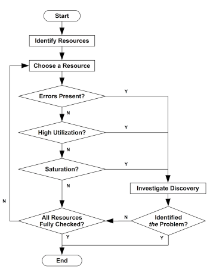

# 서버 인프라 모니터링

## 마이크로 서비스의 변화
- 2019년 (130개) -> 2021년 (236개) 로 증가
- 컨테이너 기반의 오케스트레이션을 사용하고 있다.
    - DS/OS
        - 컨테이너 오케스트레이션 엔진
    - vamp
        - MSA 서비스 디스커버리를 지원하는 API Gateway
- istio / K8s 환경으로 전환 했다. (Service Mesh)
- influxdb / telegraf 로 모니터링 하고 있었음
    - 프로메테우스 / 타노스를 메인 모니터링으로 사용했다.
> 사이드카 패턴을 이용해서 서킷브레이커 / 리트라이 코드를 애플리케이션에서 분리할 수 있었다.

## 애플리케이션 레이어 메트릭
- 오류와 가장 상관관계가 높은 단계의 메트릭

## 네트워크 레이어 메트릭
- 서비스와 서비스간의 통신 (롱 트랜잭션)
- 요청자체가 **ingress** 로 들어오지 못하는 경우도 있다.

서비스 디스커버리 이슈
- 사용할 타겟 서비스 인스턴스의 IP 를 모두 알고 있어야 한다.
- UH (No Healthy upstream hosts)
    - 헬스체크 실패시 발생
- UO (Upsteream overflow)
    - 요청이 게속 실패하여 서킷이 열릴경우 발생
- NR (No route configured)
    - 인스턴스 아이피가 없을 경우 발생

요청 커넥션 이슈
- DC (Downstream connection termination)
    - 리드 타임아웃으로 커넥션이 끊어질 경우 발생
- UC (Upstream connection termination)
    - 서버에서 응답이 제대로 안하는 경우 발생
- UT (Upstream request timeout)
- UF (Upstream connection failure)
- URX (The Request was rejected because the upstream retry limit)

AWS Route 53 을 통해 블랙박스 모니터링중
- 두개의 IDC 에 대한 헬스체크를 수행중

## OS 레이어 메트릭
- OS 리소스 관련 지표
- 오류와 가장 상관관계가 낮음

OS 매트릭의 경우 판단하기가 어렵다
- USE - Method 를 활용함

프로메테우스 단점
- 스스로 애플리케이션의 메트릭을 수집하는 방식이라 프로메테우스가 내려가면 수집이 불가능
- 메모리 사용량이 높다.
- 메트릭 수집이 안되면 프로메테우스가 OOM 인 경우가 많음
- tsdb 의 용량을 줄이는 것이 관건
- 부하 분산을 위해 **hashmod** 를 이용해 샤딩처리

