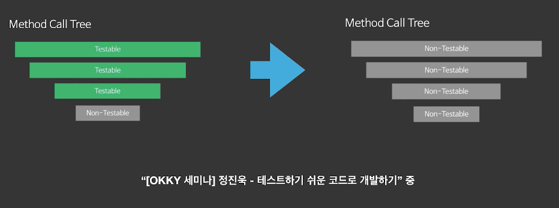
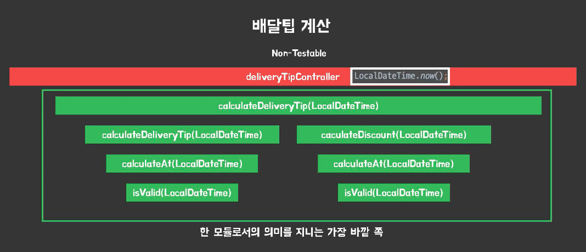
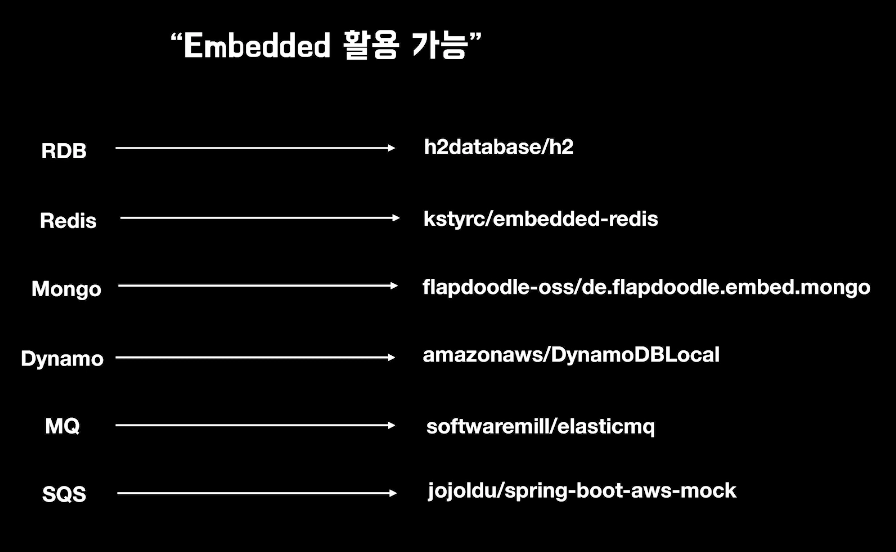

# 무엇을 테스트할 것인가 ? 어떻게 테스트할 것인가 ?

## 테스트로 부터 얻을 수 있는것 
- 유지보수 용이
- 버그 발견 용이

> 현실적으로 봤을땐 안정감과 자신감 이다.

- 안정감과 자신감을 누가 얻어야 할까 ?
    - 현재와 미래의 **나** 그리고 **동료**

> 좋은 프로젝트는 많은 개발자들에게 **안정감과 자신감** 을 줄 수 있어야 한다.

## 무엇을 테스트할 것인가?
- 로또 시스템 구현
    - 요구사항
        - 6개의 숫자 반환
        - 중복되지 않는 숫자
        - 랜덤하게 반환

```java
class LottoNumbersGenerator {
	private static final int LOTTO_TICKET_LIMIT_NUM = 6;

	private final LottoNumberCollection collection;

	public LottoNumberGenerator(LottoNumberCollection collection) {
		this.collection = collection;
    }
    
    public List<Integer> generateTicket() {
		Set<Integer> ticket = new HashSet<>();
		List<Integer> lottoNumbers = collection.createNumbers();
		shuffleNumber(lottoNumbers);
		
		for (int i = 0; ticket.size() < LOTTO_TICKET_LIMIT_NUM; i++) {
			ticket.add(lottoNumbers.get(i));
		}
		
		return new ArrayList(ticket);
    }
    
    private void shuffleNumber(List<Integer> lottoNumbers) {
		Collections.shuffle(lottoNumbers);
    }
}

class LottoNumbersGeneratorTest {
	
	@Test
    @DisplayName("6개의 숫자를 반환")
    void generateTicket() {
		LottoNumbersGenerator generator = new LottoNumberGenerator(new LottoNumberCollection());
		
		List<Integer> ticket = generator.generateTicket();
		
		assertThat(ticket.size()).isEqualTo(6);
    }
	
}
```
- 위 테스트가 잘 짜져 있는 것일까 ?..
- 중복되지 않은 숫자에 대한 테스트는 하지 않아도 되는가 ?
    - Set 으로 구현되어 있기 때문에 테스트를 하지 않아도 된다 ?

> 단발성 코드가 아닌 이상, 구현은 변할 수 있다.

- 6개의 숫자는 중복되지 않는다에 대한 테스트도 작성을 해야한다.

> 지금까지의 테스트는 **구현** 에 대한 테스트이다. \n
> 내가 작성한 코드이고, 구현을 알기 때문에 구현에 대한 테스트가 되어버린다.

- 우리는 구현 테스트가 아닌, **설계에 대한 테스트** 를 작성해야 한다.

`구현 테스트`

```java
public A actA() -> void actATest()
public B actB() -> void actBTest()
public C actC() -> void actCTest()
private D actD() -> ??? 어떻게 테스트 해야 할까
```

- 가장 많은 사례
- 테스트를 메소드 단위로 만든다.
    - private method 는 테스트를 작성해야 할까?
    - 편법을 사용하거나, 접근 제어자를 변경하는 등으로 처리...

> 위 내용에 공감한다면, 구현 테스트를 하고 있을 확률이 높다.

```java
public A actA() -> void actATest()
public B actB() -> void actBTest()
public C actC() -> void actCTest()
                -> void actC2Test()
```
- 내부 구현을 테스트 할 필요는 없다.
- 기존 flow 에서 테스트 케이스만 추가하면 된다.
- 어설프거나, 이상하다면 private method 가 있어야 하지 않을 가능성이 크다.

> 설계를 테스트 코드로 옮겨져서 테스트 해야 한다.

## 테스트가 가능한 것과 불가능 한 것



- 내부에 테스트할 수 없는 부분이 있다면, 결국 전체를 테스트 할 수 없는 것이다.

`테스트할 수 없는것`
- 제어할 수 없는 영역
- Random, Shuffle, LocalDateTime.now()
- 외부 세계
    - HTTP
    - 외부 저장소

> 제어할 수 없는 영역은, 멱등한 결과를 보장할 수 없다.

- 로또 - **랜덤** 하게 반환 => 테스트가 불가능한 영역
    - 애초에 테스트할 수 없다는 것을 인지
    - 의도한 전략대로 반환 하는 등 으로 비즈니스를 변환해야 한다.
    
> 항상 성공할 수 있는것, 항상 동일한 결과가 나올 수 있는것을 테스트 해야한다.

## 어떻게 테스트할 것인가 ?


- 테스트할 수 없는 영역을 Boundary Layer 까지 올려서, **테스트 가능한 영역을 최대한 확보** 해야 한다.
- Boundary Layer 에 대한 기준이 가장 어렵다.
- 한 모듈로서 의미를 가지는 가장 바깥쪽이 Boundary Layer

`Java, Spring Framework`
- 로또를 웹으로 구현하라.
- @SpringBootTest
- 자바, 스프링 개발자는 스프링 없이는 테스트하지 못한다 ?
- 테스트 할 때 굳이 스프링이 필요한지 고민을 해보아야 한다.

> Spring Context 는 느리다. -> 빠른 피드백을 받을 수 없다.


```java
// Non-null
@Autowired
private Hello hello;

// Nullable
private Hello hello;
```
- Java 와 Spring 간에는 갭이 존재한다.
- 그외에도 몇가지 이유가 존재하면, 이런 이유 때문에 Spring Team 에서도 생성자 인젝션을 권장한다. 

> Context 나 Framework 종송적이지 않은 테스트를 우선시 해야 한다.


## Test Double
- 테스트 할 수 없는 영역에 대한 외부 요인을 부여할 수 있도록 도와주는 도구
- Mockito

> Test Double 을 사용하는 것은 테스트가 구현을 알아야 한다는 것이다.

- 테스트를 포기하는 이유 중 하나 -> 구현을 알고 있는 상태에서 테스트를 하려고 하다보니 변경이 일어 났을때 굉장히 힘듦
    - 파라메터 변경, 반환타입 변경 등.. Test Double 의 남용

> Test Double 의 남용은 구현 테스트로 유도할 수 있다.

- Boundary Layer 까지 끌어올린 Test 할 수 없는 영역에 대한 통합 테스트에 대해서만 Test - Double 을 사용한다.
    - 이것이 정답은 아니다.

## Embedded



- 테스트 정확도 : Local > Embedded
- 피드백 속도 : Local < Embedded
- 테스트 안정성 : Local < Embedded

## End-Point Test
- MockMvc
- REST Assured
- WebTestClient

> End-Point Tests 는 요청/응답 스펙 검증만으로 제한하는 것이 정신 건강에 좋음

## Spring-Cloud Contract
- 계약에 의한 설계
- Contract 에 대한 DSL 지원
- PR 을 날리면, 해당 케이스에 대한 테스트가 동작, 성공시 executable Jar 로 실행 가능
- 회사나 팀 단위로 해야하는 부분이라 힘들다.

# 참고
- https://www.youtube.com/watch?v=YdtknE_yPk4&t=1121s