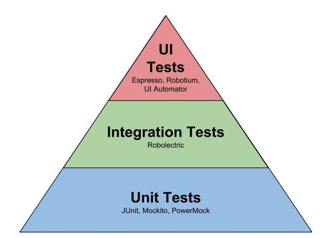

# 성공적인 팀을 위해 당신이 찾던 마지막 열쇠 E2E 테스트 자동화

#### 팀 효율이 어떻게 향상될까 ?
- 팀의 효율은 얼만큼 자동화 되었는가에 달려있다.

#### 소프트웨어 테스트
- 전통적인 개발방식의 테스트
- 폭포수 개발론
    - 역할별로 정해져 있다.
    - 테스트가 상당히 뒷부분에 있다.
    - 최종적인 확인..
- 애자일 (Agile) 문화
    - 스크럼
    - 칸반
    - XP 등..
    - 개발과 테스트를 경계를 허물어 가야한다.
    - 개발-테스트 사이클이 빨라야 한다.
    
#### 데브 옵스 (Dev Ops) 시대의 도래
- 개발에서 배포에 이르기까지 개발자의 역할이 확장됨
- 효율성 및 전문성을 고려한다.
- 개발자가 테스트 주제가 되어가는 트랜드

#### 소프트웨어 테스트 종류
- 단위 테스트
    - 변경사항이 의도한 대로 작동하는가
- 통합 테스트
    - 변경사항이 관련 모듈을 포함하여 의도한 대로 작동하는가
- 시스템 테스트
    - 변경사항을 포함한 전체 시스템이 의도한 대로 작동하는가
- 회귀 테스트
    - 변경사항이 있음에도 그와 무관한 기존 모듈은 의도한대로 작동하는가
- 성능 테스트
    - 변경사항으로 인해 성능하락은 발생하지 않았는가
- 인수 테스트
    - 변경사항이 최종적으로 사용자에게 전달될 수 있는가
    
    
#### 테스트 피라미드: 마틴파울러 (2009)
- 마틴 파울러가 발표한 테스트 피라미드

> UI TEST 가 가장 최종적인 테스트
> 유저 행동을 고려한 **최종적** 테스트이다.

#### E2E (End to End) 테스트 자동화
- 사용자 행동기반 UI 기능 테스트
- 프론트엔드 결함 수정 최후의 보루이다.

#### 테스트 보틀넥
- 심리적 스트레스 (개발후 테스트를 해야한다.)
- 비용적 스트레스
- 책임 지각적 스트레스
- 테스트의 보틀넥 진단 - 늦은 배포주기

> 테스트가 팀을 억제하고 있지 않은가? 되돌아 봐야한다.

일을 더 잘하고 싶다면? - 불편함을 되돌아 보라