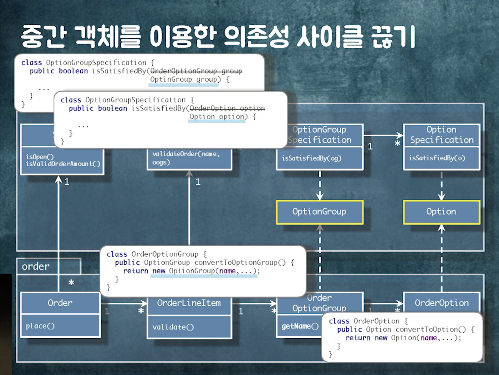
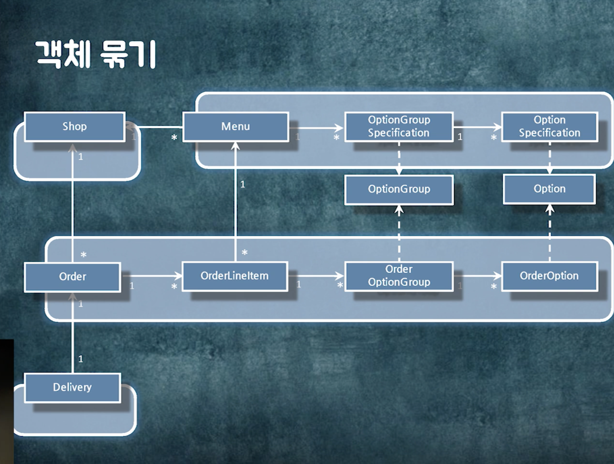
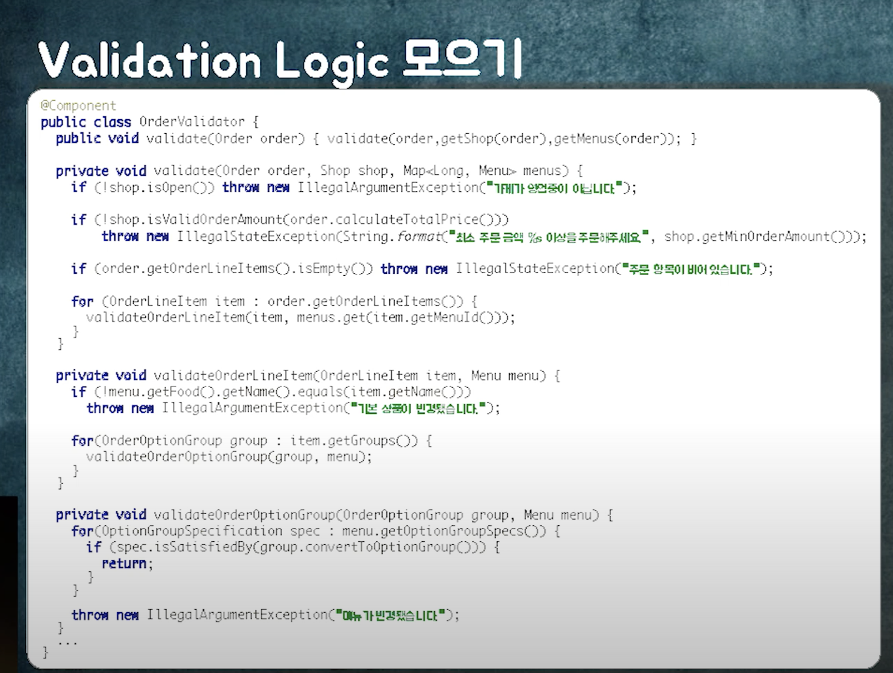
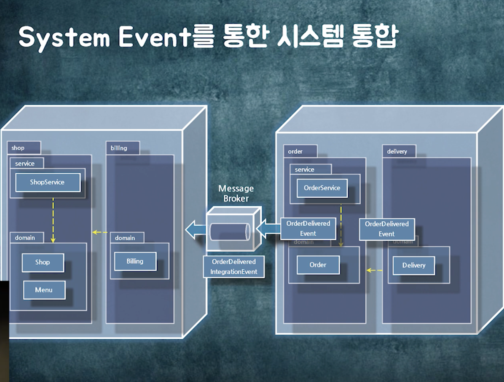

# 우아한 객체지향
- 설계 ? -> 코드를 어떻게 배치할 것인가.
    - 클래스, 패키지, 프로젝트 각각에 어떤 코드를 배치할 것인가
    - 변경에 초점을 맞추는것이 중요하다.
    - 같이 변경되는 것들을 같이 놓아야 한다.
    - 핵심은 의존성.

## 의존성 (Dependency)
의존성은 A 가 B 에 의존 할경우 
A ----> B (점선으로 표기하는것이 핵심)
> B가 변경될때 A 가 변경될 수도 있다.
> **변경될 가능성** 이 있음을 얘기하는것이 의존성이다.
> 의존성이 있다고해서 무조건 바뀌는것은 아니다.

클래스, 패키지 의존성으로 크게 나뉜다.

### 클래스 의존성
1. 연관관계 
   - A -> B 로 객체 참조를 가지고 있다.
2. 의존관계
   - 파라미터, 리턴타입, 메소드내에서 해당 타입 인스턴스를 생성하는 경우 의존관계이다.
   - 의존 관계는 일시적인 관계
3. 상속관계
   - B 가 변경될때 A 도 변경된다.
4. 실체화 관계
   - 인터페이스 구현 관계

> 상속관계와 실체화 관계의 차이는, 상속은 구현이 바뀌어도 영향을 받을 수 있다. 실체화 관계는 인터페이스 시그니쳐가 바뀔때만 영향을 받는다.

### 패키지 의존성
- 패키지에 포함된 클래스 사이의 의존성
  - 어떤 패키지에 존재하는 클래스가 다른 패키지에 존재하는 클래스에 의존하는 경우를 말한다.

### 양방향 의존성을 피하라
- 좋은 의존성 관리를 위한 규칙

`양방향 의존성`
```java
class A {
    private B b;

    public void setA(B b) {
        this.b = b;
        this.b.setA(this);
    }
}

class B {
    private A a;

    public void setA(A a) {
        this.a = a;
    }
}
```

> 양방향 의존을 가질 경우 양쪽의 **싱크를 맞춰 주어야 한다.**
> 양방향 의존성을 피할수 있다면 단방향 연관관계로 바꾸어야 한다.

### 다중성이 적은 방향을 선택하라
OneTo-Many 보단, Many-To-One 관계를 선택하는것이 좋다.

`OnetoMany`
```java
class A {
    private Collection<B> bs;
}

class B {

}
```

`ManyToOne`
```java
class A {
    
}

class B {
    private A a;
}
```

> 컬렉션을 연관관계로 가지게 될경우 성능 이슈도 발생할 뿐더러 해당 의존관계를 유지하기 위한 비용이 크다.

### 의존성이 필요없다면 제거하라

### 패키지 사이의 의존성 사이클을 제거하라
- 양방향 의존성을 제거하는것이 좋다.
- 설계의 원칙은 무조건 **변경** 이다.

## 예제

`주문 플로우`
1. 가게 선택
2. 메뉴 선택
3. 장바구니 담기
4. 주문 완료

`도메인 컨셉 - 가게 와 메뉴`
```
메뉴
- 이름
- 설명

가게
- 이름
- 영업여부
- 최소주문금액
- 수수로율
- 수수료누적액

옵션
- 이름
- 가격

옵션 그룹
- 이름
- 베타선택여부
- 기본옵션여부
```  

`도메인 컨셉 - 주문`
```
주문
- 주문시간
- 상태

주문 항목
- 이름
- 갯수

주문 옵션
- 이름
- 가격

주문 옵션 그룹
- 이름
```

- 사용자가 장바구니에 담아 두었던 메뉴와, 업소가 메뉴를 변경하였을때 불일치 하는 경우가 발생한다.
> 주문이 발생할때 마다 주문 데이터와 업소 메뉴가 일치하는지 검증을 해야한다.

### 주문 벨리데이션
1. 메뉴 명과 주문 항목의 이름 비교
2. 옵션 그룹 명과 주문 옵션 그룹 명 비교
3. 옵션 명과 주문 옵션 명 비교
4. 옵션 가격과 주문 옵션 가격 비교
5. 가게의 영업중인지 확인
6. 주문금액이 최소주문금액 이상인지 비교

### 협력 설계하기
1. 주문하기 메시지 송신 (벨리데이션 시작)
2. 가게가 영업중인가 ?, 주문금액이 최소주문 금액 이상인가 ? (주문 -> 가게)
3. 메뉴 명과 주문항목 명 검증 (가게 -> 메뉴)
4. 옵션그룹 명과 주문 옵션 그룹 명 검증 (메뉴 -> 옵션 그룹)
5. 옵션 명과 옵션 가격 검증 (옵션 그룹 -> 옵션)
6. 모두 통과할 경우 주문에 성공한다.

> 동적인 구조로 설계를 했지만, 정적인 구조(코드) 로 만들어야한다. 
> 관계에는 방향이 필요하다. (실제 코드에 그려주어야 한다.)

관계의 방향 
    = 협력의 방향
    = 의존성의 방향

### 관계의 종류 결정
- 연관관계: 협력을 위해 영구적인 탐색구조
  - 객체간의 협력이 빈번하다.
- 의존관계: 협력을 위해 일시적으로 필요한 의존성
  - 파라미터, 리턴타입, 지역변수 등...

### 연관관계 = 탐색가능성
Order -> OrderLineItem
> Order 를 알면, Order 를 통해 OrderLineItem
> 연관관계란, 어떤 객체가 있는데 이 객체를 알면 다른 객체를 찾아갈 수 있다.

- 두 객체사이에 협력이 필요하고, 두 객체의 관계가 **영구적** 이라면, 연관관계를 사용한다.
- 일반적으로 **객체 참조 (구현방법)** 를 사용해 연관관계(개념) 를 구현한다.

> 개념과, 구현방법을 1:1로 매핑해선 안된다. 구현방법은 다양할 수 있다.

```java
class Order {
    private List<OrderLineItem> orderLineItems;

    public void place() {
        validate();
        ordered();
    }

    private void validate() {
        ...
        for (OrderLineItem orderLineItem: orderLineItems) {
            orderLineItem.validate();
        }
    }

    private void ordered() {

    }
}
```

- 메시지를 결정하고, 메소드를 만들어야 한다.

### Layered Architechture
- Presentation
- Service
- Domain (Entity) > 실제 비즈니스 로직이 존재
- Infrstructure

### 중간 점검
```java
@Service
class OrderService {
    @Transacitonal
    public void placeOrder(Cart cart) {
        Order order = orderMapper.mapFrom(cart);
        order.place();
        orderRepository.save(order);
    }
}

@Entity
class Order {
    // ...
}
```

## 설계 개선하기
- 의존성 관점에서 설계를 개선 진행해야 한다.
- 설계를 개선하기 위해선 -> 의존성을 먼저 살펴보라.
  - 의존성을 직접 그려보고 문제점을 찾아라.
- 처음부터 완벽하게 짤수는 없다.
- 우선 절차적으로 짜도 상관이 없음.. 구현을 먼저 한뒤 의존성을 관점으로 개선을 진행하라.

- 두가지 문제점
  - 객체 참조로 인한 문제
  - 패키지 의존성 사이클

- 같이 사용된다면, 같은 패키지에 두어야 한다.

- A 패키지에서 B 패키지를 의존하고 있고, B 패키지에서 A 패키지를 의존하고 있는 상황

### 중간 객체를 이용한 의존성 사이클 끊기
- 자칫 이상해 보일 수 있지만... 양방향 매핑을 단방향 매핑으로 끊어내는 방법



#### 의존성 역전 원리 (DIP)
- 클래스는 구체화된 것에 의존하지 말고, 추상화된 것에 의존해야 한다.
- 추상화 라는것에 대한 선입견이 있다. -> 인터페이스 혹은 추상클래스 여야만 한다는 선입견
- 잘 변하지 않는다면 **추상적인것** 이다.

### 객체참조로 구현한 연관관계의 문제
- 협력을 위해 필요하지만, 두 객체 간의 **결합도** 가 높아진다.

1. 성능 문제 - 어디까지 조회할것인가 ? 
   - 객체들이 모두 연결되어 있다. Lazy 로딩 이슈 등..
2. 수정시 도메인 규칙을 함께 적용할 경계는 어디까지 인가? 
   - Order 상태를 변경할때 관련된 규칙을 함께 적용해야 하는 범위는 어디까지인가 ?
   - 결국 Long Transaction 으로 묶인다.
   - 트랜잭션 경계가 애매모호 해진다.
   - 요구사항이 추가될수록 트랜잭션이 길어진다..

> 트랜잭션 경합으로 인한 성능 저하가 빈번하게 발생한다.
> 객체 참조는 결합도가 가장 높은 의존성 (영구적인 의존성)
> 필요한 경우 객체 참조를 끊어야 한다.

`해결책`
- Repository 를 통한 탐색 -> ID 만 참조하고, Repository 를 이용해 해당 객체를 조회해온다. (약한 결합도)
- 비즈니스 로직은 단방향으로 깔끔해지지만, 조회로직이 들어가기 시작하면 양방향 매핑이 되기 쉽다.
- Repository에 존재하는 Operation 들도 마찬가지이다..

### 어떤 객체를 묶고 어떤 객체들을 분리할 것인가 ?
- 같이 생성되고 같이 삭제되는 객체들을 묶어라
- 도메인 제약사항을 공유하는 객체들을 묶어라
- 가능하다면 분리하라

- 장바구니 와 장바구니 항목을 묶어야할 필요가 있을까 ?
  - 일반적으로는 묶어야 한다고 생각..

### 객체 묶기


> 경계 안의 객체는 참조를 이용해 접근 (연관관계 매핑)
> 경계 밖의 객체는 ID 를 이용해 접근

- 경계 그룹 단위로 트랜잭션 단위와 조회 단위를 유지
- 경계 그룹 단위의 영속성 저장소도 변경이 가능하다.

### Validation Logic 모으기

- 좋은 설계일까 ? -> YES
- Why ?
  - 객체지향은 여러 객체를 오가며 로직을 파악해야 한다. -> 한눈에 알 수 있다.
  - Order 에 로직이 존재 했을때, 응집도가 낮았다..
  - 응집도 -> 같이 변경되는 로직들이 모여있다면 응집도가 높은것이다.
- 객체안에 벨리데이션 로직을 다 넣을 필요가 없다.

> 때로는 절차지향이 객체지향 보다 좋을 수 있다.

### 패키지 의존성
- 패키지 간의 사이클이 돌경우
  - 중간 객체를 만들자.
  - 인터페이스나 추상클래스로 의존성을 역전 시키자.

### 서비스
- 로직을 한군데 모아서 잘 보이게 한다.

### 도메인 이벤트 퍼블리싱
- 로직을 잘 찢어서 느슨하게 한다.
  
### 도메인 단위 모듈 = 시스템 분리의 기반



- SystemEvent -> 외부로 나가는 Event (External Event 라고도 한다.)

## 요약
- 의존성을 관점으로 설계를 개선해야 한다.
- 양방향 의존성을 피하라 (객체, 패키지 모두)
- 객체 참조는 가장 강한 의존성이다.
- 의존성을 끊는 방법은 3가지가 있다.
- 1. 중간 객체를 사용해 의존성을 끊는다.
- 2. 인터페이스나 추상클래스를 통해 의존성을 역전시킨다.
- 3. 패키지를 분리한다.
- 때로는 절차지향이 객체지향 보다 좋을 수 있다.
- 절차지향적 방식 (Service 객체 사용) 은 로직을 한데 모아 볼수 있지만, 강결합일 확률이 높고, 의존성이 사이클이 돌 확률이 높다.
- 도메인 이벤트 퍼블리싱 방식을 사용해 느슨한 설계 -> 시스템 분리의 기반이 된다.


## 관련 자료
- https://www.youtube.com/watch?v=dJ5C4qRqAgA&list=PLgXGHBqgT2TtGi82mCZWuhMu-nQy301ew&index=13