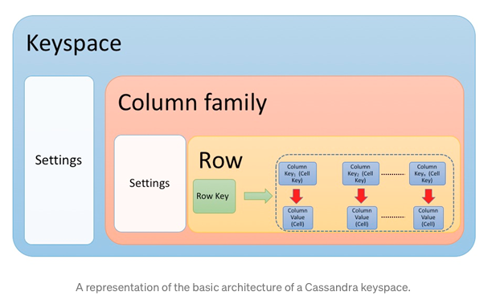
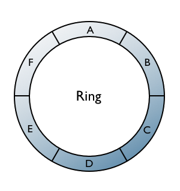
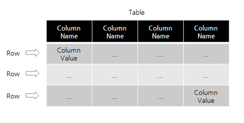
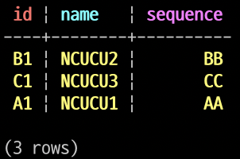

# Apache Cassandra

## 특징
- 카산드라는 확장성과 고 가용성에 최적화된 대표적인 **분산형** 데이터 저장소이다.
- Consistent hashing 을 이용한 링 구조와 **Gossip protocol** 을 구현하였다.
- 링 구조를 채택하였기 때문에, 노드의 장비 추가 / 제거가 자유롭고 데이터 복제로 인한 안정성이 높으며 샤딩을 고려할 필요가 없다.
- Join, Transaction 등을 지원하지 않고, Index 등 검색을 위한 기능도 매우 단출하며, RDBMS 의 Paging 을 구현하는것이 매우 힘들다.

### Gossip Protocol
- 바이러스가 퍼지는 방식으로 동작하며, **전염병 프로토콜 (epidemic protocol)** 이라고도 불린다.
- 마스터가 없고, 각 노드가 주기적으로 UDP/TCP 로 서로 메타정보를 주고받는다.
- 이와 같은 방식으로 서로간의 노드의 생존여부를 파악함
- MASTER / SLAVE 구조의 문제 ? -> **SPOF (Single Point Of Failure)** 가 존재한다.
- 이러한 문제를 해결하기 위해 나타남
> 정보가 생기면 마치 사람들이 수군수군 대듯이 여러 **분산형 노드** 에서 **전체 노드** 로 퍼지는 형태

## 데이터 구조


- 카산드라의 데이터구조는 논리적 크게 3 계층이라고 본다.
1. 최상위 저장소인 Keyspace (RDBMS 의 DB)
2. Keyspace 하위에 존재하는 Table (RDBMS 의 Table)
3. Table 에 존재하는 다수의 Row (RDBMS 의 Row)
4. Row 는 Key-Value 쌍으로 이뤄진 Column 들로 이뤄짐 (RDBMS 의 Column)



- 카산드라는 다음과 같이 링구조를 띄고 있으며, **Partition Key (Row Key)** 를 기준으로 링을 구성하는 각 노드에 데이터를 분산 저장한다.
- 각 노드가 링에 참여하면, 카산드라의 설정을 통해 노드마다 고유의 해시 범위를 부여받는다.
- 외부로 부터 데이터 요청이 오면, 해당 데이터의 Partition Key 의 해시 값을 이용해 특정 노드에 접근한다. (저장/조회 등..)
- 카산드라는, 이 해시 값을 **Token** 이라고 부른다.
- 초기 데이터 구조는 Keyspace > Column Family > Row > Column(name + value) 로 구성 되어 있었으며, 
- Keyspace 와 Column Family 에 대한 정보는 모든 카산드라 노드의 메모리에 저장된다.
- 실제 데이터인 Row 는 Row Key를 가지고 있으며, Row 에 속하는 Column 들은 name 을 기준으로 정렬되어 저장된다.

> 1.2 버전 이후로 Keyspace > Table > Row > Column 으로 명칭이 변경된다.

- CQL 은 이를 그대로 표현하지 않고, **추상화** 하여 표현한다.



- CQL 에서의 Row 와 Column 은 Data Layer 의 Row 와 Column 을 의미하지 않는다.
- CQL 의 Row 와 Column 은 RDB 의 Tuple, Attribute 와 유사하다.
- CQL Table 은 최소 1개 이상의 컬럼을 Primary Key 로 지정해야 한다.
- 카산드라는 Primary Key 로 지정된 컬럼 중 Partition Key 로 지정된 컬럼의 value 로 데이터를 분산한다.

`Sample`
```sql
CREATE TABLE tacocloud.mytable (
    id text,
    name text,
    sequence text,
    PRIMARY KEY (id, name)
);

INSERT INTO tacocloud.mytable (id, name, sequence) values ('A1', 'NCUCU1', 'AA');
INSERT INTO tacocloud.mytable (id, name, sequence) values ('B1', 'NCUCU2', 'BB');
INSERT INTO tacocloud.mytable (id, name, sequence) values ('C1', 'NCUCU3', 'CC');
```
- PRIMARY KEY 로 id 와 name 을 지정하면, CQL 문법에 의해 id 가 Partition Key, name 이 **Cluster Key** 가 된다.

`Result`




### Partition Key 와 Row Key
- Partition Key 는 **CQL (Cassandra Query Language)** 에서 사용하는 용어이며, Row Key 는 Cassandra Data Layer 에서 사용되는 용어이다.
- 이 둘의 용어가 달라지게 된 이유는, 현재 CQL 사용이 권장되지만, 초기부터 CQL 이 제공되었던것은 아니다.
- 초기에는 Cli 사용하였으나, 카산드라 1.2버전 이후에 Native Protocol 을 기반으로한 API 와 CQL 이 추가되었다. 그후 3.0 버전부터는 Cli 는 Deprecated 됨
- 또한 많은 스펙 변화가 일어나면서 명칭이 변경되는 등 이러한 과정속에서 CQL 은 새롭게 구성된 Cassandra Data Layer 를 추상적으로 표현하는 문법으로 구성되었다.

### CQL Key
1. Partition Key
    - 데이터를 분산저장하기 위한 기준, Unique Key
    - table 당 반드시 하나이상 지정되어야 하며, 여러개가 될 수 있다.
    - 하나 일 경우 해당 컬럼의 value 가 Row key로 저장되며, 다수일 경우 다음과 같이 콜론 (:) 을 구분자로 Row key 로 저장됨
    - ex) A1:NCUCU1:AA
2. Cluster Key
    - 정렬에 대한 기준을 담당
    - Cassandra Data Layer에서의 Column Name = CQL cluster key의 Column value와 primary key에 속하지 않은 Column Name들 및 ":" 문자의 조합이다.
    - ex) (name=NCUCU1:sequence, value=AA)
    - 만약 클러스터키가 없다면, CQL 의 Column name 이 Data Layer 의 Column name 이 된다.
3. Primary Key
    - CQL Table 에서 각 Row를 구분하는 Unique 한 Key
    - Primary Key 1개 이상의 Partition Key 와 0개 이상의 Cluster Key 로 구성된다.
4. Composite Key
    - 1개 이상의 CQL Column 으로 구성된 Primary Key 를 의미한다. Compound Key 라고도 한다.
5. Composite Partition Key
    - 2개 이상의 다수 CQL Column 으로 구성된 Partition Key

## Virtual Node
- 카산드라 1.2 버전부터 추가된 기능
- 이전 버전에는 각 노드별 토큰 값을 **initial_token** 이라는 옵션으로 해시값을 수동으로 지정해 주어야했다.
- 특정 노드를 추가/삭제할 경우 특정 노드에 데이터가 몰리지 않도록 토큰값을 갱신한뒤, 재구동, bin/nodetool 을 사용해 MOVE, REMOVE, DECOMMISSION, CLEANUP 등 명령어를 사용해야 했음
- Virtual Node 는 카산드라 노드내에 가성 노드를 여러대 두어, 잘게 나누어진 토큰 범위를 가상 노드들에게 할당하여 데이터를 분산한다.
- 가상 노드를 이용해 데이터를 균일하게 분산하고, **데이터 추가/제거시 데이터 이동, 복제, 리밸런싱에 성능향상** 의 이점을 가져온다.
- **num_tokens** 옵션을 통해 노드당 몇개의 가상노드를 운영할 것인지 설정이 가능하다.
- 또한 Virtual Node 사용시 노드 추가 및 제거에 따른 토큰값의 변화를 Gossip Protocol 을 통해 서로 범위를 정하고, 데이터 리밸런싱까지 처리해준다.

## 참고
- https://blog.insightdatascience.com/the-total-newbies-guide-to-cassandra-e63bce0316a4
- https://www.slipp.net/wiki/pages/viewpage.action?pageId=23199821
- https://meetup.toast.com/posts/58