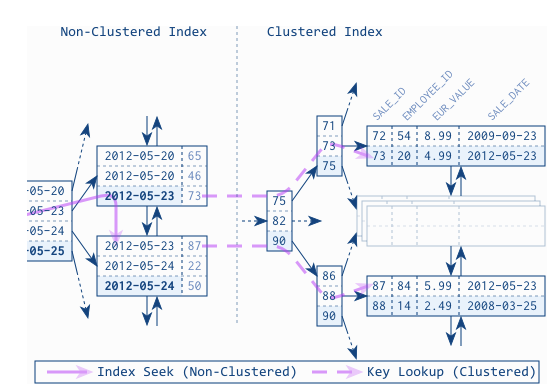

#### 클러스터링 인덱스
- 클러스터란 여러 개를 하나로 묶는다는 의미이다.
- 인덱스에서 클러스터링은 값이 비슷한 것을 묶어서 저장하는 형태로 구현되는데
- 주로 비슷한 값들을 동시에 조회하는 경우가 많다는 점에서 착안한 것

> MySQL은 InnoDB와 TokuDB 엔진에서만 지원한다.

클러스터링 인덱스는 테이블의 PK 에서만 적용되는 내용이다.

> PK값이 비슷한 레코드끼리 묶어서 저장하는 것

**중요한 점은 PK 값에 의해 레코드 저장위치가 결정 된다. 
PK 값이 변경된다면 해당 레코드의 물리적인 저장위치도 함께 바뀌어야 한다.**

일반적으로 B-Tree 인덱스도 인덱스의 키값으로 정렬되어 저장된다.
이 또한 인덱스의 키 값으로 클러스터링 된 것으로 생각할 수 있지만 B-Tree 인덱스를 클러스터링 인덱스라고 하진 않는다.

> 테이블의 레코드가 프라이머리 키 값으로 정렬되어 저장된 경우만 클러스터링 인덱스 혹은 클러스터링 테이블 이라고 한다.

구조를 보면 B-Tree 인덱스와 많이 비슷하지만 클러스터링 인덱스의 리프 노드에는 레코드의 모든 컬럼이 같이 저장된다.

**클러스터링 테이블은 그 자체 하나가 거대한 인덱스 구조로 관리된다.**

#### MySQL의 데이터 저장 방식
MyISAM 테이블 혹은 기타InnoDB를 제외한 테이블의 데이터는 PK 나 인덱스 키값이 변경된다고 해서
실제 데이터 레코드의 위치가 변경되진 않는다.

> 데이터가 INSERT 될 때 데이터 파일의 끝에 저장된다. 한번 저장된 위치는 절대 바뀌지 않고, 
> 레코드가 저장된 주소는 MySQL 내부적으로 레코드를 식별하는 아이디로 인식된다.
> **레코드가 저장된 주소를 ROW-ID 라고 표현한다.**

#### InnoDB 엔진의 클러스터 키 선정 방식
> 1. PK 가 존재할 경우 PK 를 클러스터 키로 선정
> 2. NOT NULL 속성의 유니크 인덱스 중 첫번째 인덱스를 클러스터 키로 선정
> 3. 자동으로 유니크한 값을 가지도록 증가되는 컬럼을 내부적으로 추가한 뒤, 클러스터 키로 선정

#### 보조 인덱스에 미치는 영향

레코드가 저장된 주소는 ROW-ID 역할을 한다.
PK 나 보조 인덱스의 각 키는 ROW-ID 를 이용해 실제 레코드를 찾아오게 된다.

만약 InnoDB 테이블에서 보조 인덱스가 실제 레코드가 저장된 주소를 가지고 있게 된다면 ?
- 클러스터 키 값이 변경될 때 마다 레코드의 주소가 변경되게 되므로 그 때마다 모든 인덱스에 저장된 주소 값을 변경해야한다.

> 이런 문제를 방지하기 위해 InnoDB의 모든 보조인덱스는 해당 레코드가 저장된 주소가 아닌 PK 값을 저장하도록 구현되어 있다.
  
#### InnoDB(클러스터링 테이블) 에서 데이터 조회시 처리 과정
`MyISAM`
1. 인덱스를 검색해 레코드의 주소를 확인
2. 레코드의 주소를 이용해 최종 레코드를 가져온다.

`InnoDB`
1. 인덱스를 검색해 해당 레코드의 PK 값을 확인
2. PK값을 이용해 다시 한번 테이블을 검색한 뒤 최종 레코드를 가져온다.

> InnoDB가 MyISAM 보다 조금 더 복잡하게 처리되지만, PK로 레코드를 읽어오는 과정은 매우 빠르게 처리되므로 성능 문제는 없다.

#### 클러스터 인덱스의 장단점
`장점`
1. PK검색시 처리 성능이 매우 빠르다. (특히 PK 범위검색시 성능이 매우 좋음)
2. 테이블의 모든 보조 인덱스가 PK를 가지고 있기 때문에 인덱스만으로 처리가능한 경우가 많음 (이를 커버링 인덱스라고 한다)

`단점`
1. 테이블의 모든 보조인덱스가 PK를 가지기 때문에 키값의 크기가 클 경우 전체적인 인덱스의 크기가 커진다.
2. 보조 인덱스를 통해 검색시 PK로 다시 한번 검색해야 하기 때문에 처리 성능이 조금 느리다.
3. INSERT 시 PK에 의해 저장위치가 결정되기 때문에 처리 성능이 느리다.
4. PK 변경시 레코드를 삭제후, 다시 등록하는 작업을 하기 때문에 처리 성능이 느리다.

#### 클러스터 테이블 사용시 주의 사항

`1.인덱스 키의 크기를 설정할때 주의하라`
- 클러스터 테이블은 모든 보조인덱스가 PK값을 포함하기 때문에 PK의 크기가 커지면 보조인덱스의 크기도 자동으로 커지게 된다.

> PK의 크기가 커질수록 레코드의 크기가 기하급수적으로 증가하게 된다. PK 선정은 신중하게 할것

`2.PK 선정시 업무적인 컬럼이 있다면 해당 컬럼을 PK로 선정할것`
- PK로 검색하는 경우 매우 빠른 처리속도를 자랑하기 때문에 해당 컬럼의 크기가 크더라도
- 업무적으로 해당 레코드를 대표할 수 있다면 해당 컬럼을 PK로 선정할것

`3.PK는 반드시 지정할것`
- 간혹 PK가 존재하지 않는 테이블이 있는데 가능하다면 AUTO-INCREMENT 칼럼을 이용해서라도 PK를 설정할것을 권장
- InnoDB에서는 PK를 정의하지 않을 경우 내부적으로 AUTO-INCREMENT와 같은 자동증가 컬럼을 사용한다.
- 따라서 AUTO-INCREMENT로 PK를 지정한것과 동일하지만, SQL에서는 전혀 사용할 수 없다.
- 결국 동일한 형태로 구성된다면 사용자가 사용할 수 있게 PK를 AUTO-INCREMENT로 지정해주는 것이 좋다.

`4.인조 식별자를 고려하라`
- 복합키를 사용할 경우 PK의 크기가 커지는 경우가 존재한다.
- 만약 보조 인덱스도 필요하고, PK의 크기도 동일하다면 AUTO-INCREMENT 컬럼을 생성하여 이를 PK로 사용할것

> 로그성 테이블과 같이 조회 보다는 등록위주의 테이블은 인조 식별자를 PK로 설정하는것이 성능 향상에 도움이 된다.