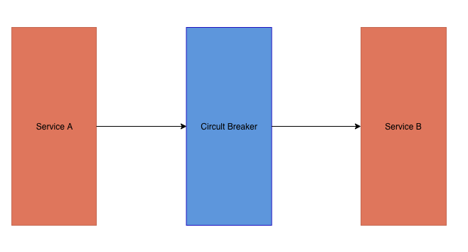

#### CircuitBreaker Pattern

##### MSA의 한계
- MSA 는 시스템을 여러 서비스 컴포넌트로 나누고, 각 컴포넌트 끼리 서로를 호출하는 패턴이다.
- 이 패턴의 한계는 서버가 서로 종속적 이라는 점
- serverA 가 serverB를 호출했을때, B가 응답을 하지못하는 상태이거나, 응답시간이 길어진다면 serverA는 무한정 기다려야 한다.
- 이러한 문제를 극복하기 위해 등장한 것이 Circuit Breaker Pattern 이다.

##### CircuitBreaker Pattern
- 전기의 회로차단기에서 차용한 개념이다.
- 회로가 close 될때는 정상적으로 전기가 흐르다 문제가 생기면 회로를 open 하여 전기가 흐르지 않도록 한것처럼
- 평소에는 정상 동작하다가 오류 발생시 더이상 동작하지 않도록 한다.
- 문제가 되는 기능 자체를 동작하지 않게 해서 리소스를 점유하지 않게 하는 방식이다.

serverA가 serverB를 호출할 때 circuit breaker가 모든 트래픽을 bypass 한다.
이 때 serverB가 응답이 없다면, circult breaker가 serverB의 호출을 강제로 끊어, serviceA에서 쓰레드들이 더이상 요청을
기다리지 않도록 해서 장애가 전파하는 것을 방지한다. 이런 방식은 장애전파를 막을 수 있지만 serviceA에서 장애 처리에 대한
별도의 로직이 필요하게 되는데 이를 발전 시킨것이 **fall-back 메시징**이다.

> CircuitBreaker 에서 serviceB가 정상적인 응답을 할수 없을때 룰에 따라 다른 메세지를 리턴하게 하는 방법이다.

##### CircuitBreaker Pattern 적용 방법
- 넷플릭스의 Hystrix
    - 자바언어에 종속적이며 코드 수정이 필요하다.
    
- envoy.io
    - 코드수정 및 언어에 종속적이지 않지만 프록시 서버를 운영해야한다.
