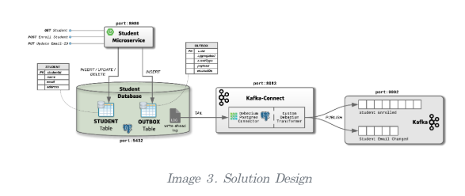

# Outbox Pattern
- 분산 트랜잭션을 구현하는 방법 중 하나인 outbox pattern

## MSA 환경에서 메세지 트랜잭션 처리하기
- 비동기 메세지를 통해 상호간에 통신하는 방식을 **메세징** 이라고 한다.
- 이런 메세지 발행 방식의 큰 문제점은 **메세지 브로커는 DB 트랜잭션과 함께 사용할 수 없다.**
- 이는 데이터 일관성이 깨질 수 있는 중요한 문제이다.
- 이를 해결하는 방법 중 하나은 **Outbox Pattern** 에 대해 살펴본다.

## Transactional-Outbox-Pattern
- [Outbox-Pattern](https://microservices.io/patterns/data/transactional-outbox.html) 이란 ?
- 메세지 브로커에 메시지를 바로 발행하지 않고, **Outbox 라는 임시테이블** 에 메세지를 저장해 둔다.
- Outbox 에 저장해둔 데이터를 메세지 브로커를 통해 브로커로 발행한다.
    - Kafka Connect 등을 활용한다.
- Outbox 테이블은 같은 데이터베이스에 위치하기 때문에 데이터베이스 트랜잭션으로 다룰 수 있다.

`Outbox-Table-Schema-Example`

| Column | Type |
| --- | --- |
| id | UUID |
| aggregatetype | varchar |
| aggregateid | varchar |
| type | varchar |
| payload | jsonb |
