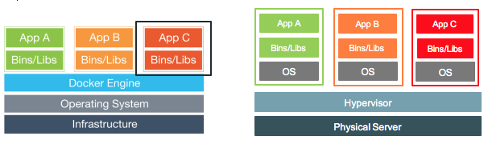
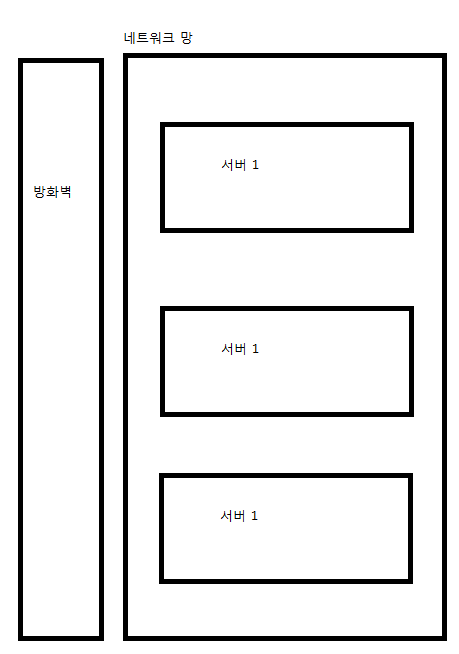

# Docker 의 개념
PC를 사용하다보면 PC의 자원이 100% 활용되지 경우가 없는 경우가 있음
그럴때 PC자원을 절반으로 나눠 하나는 게시판으로 쓰고싶고 다른 하나는 분석용으로 쓰고싶다.
- 문제점은 서버를 하나로 합쳐서 사용하게되면 서로 영향을 미치게된다.

이때 VM을 활용하게 되면 PC자원을 절반으로 나누어 사용하게된다.
- VM1은 게시판 , VM2는 분석으로 사용한다

Docker는 VM과는 좀 다른 개념이다.
- VM은 새로운 OS를 만들게 된다.
- Docker는 OS위에 구동하게 되지만 OS도 약간 포함하고 있다.
- 하나의 프로세스를 생성한다.

#### Background

S/W 개발자
- 소프트웨어를 만드는 개발자

SE 개발자
- 인프라 개발자
- H/W, Network, OS, Middleware

On-Premises
- Cloud와 반대대는 개념이다.
- 서버실에 직접 장비를 구축하는 것
- 내부망 등 보안문제가 있다면 대부분이 이 경우이다.
- 인트라넷

아래 서버들을 네트워크망으로 가둬버리면 인트라넷이다
들어오지도 못하고 나가지도 못하는 내부망의 개념

외부와 통신이 필요한 경우 방화벽을 설치하여 통신한다.
보통 80 포트만 허용한다.
80 은 Http 포트이다.

Cloud
- AWS, GCP, KT, etc..

다수의 서버가 존재하는데 하나의 서버를 수십개로 나눈다.
점유율에 따라 자원을 동적으로 늘였다 줄였다 할수 있게 한다.

Orchestration

DB, WAS 

DB와 WAS를 분리하면 서로 자원을 침해하지 않기 때문에 자원을 효율적으로 사용 가능하다.

같은 세팅을 100대를 해야한다면 ?
Docker를 사용하면 세팅이 매우 손쉽게 가능하다.

로드 밸런싱 장비
L3, L4, L7

숫자가 커질수록 고가이다

사용자 접속시 L3로 접근하여 WAS중 여유로운 WAS에게 보내준다.

L4 는 어떠한 프로그램을 입힐수 있음
D-DOS 등 , 1분당 n번 실행되면 차단하는 등 프로그램을 심을 수 있음

이런식으로 서버들이 여러대로 펼쳐져서 운영되는것을 Orchestration 이라고 한다.

쿠버네티스를 많이 사용함.

Docker 란 ?

리눅스 컨테이너는 서버를 분리해서 나눠주는데, Docker는 프로그램적으로 이뤄지기때문에 실시간으로 가능하고 손쉽다.
GO 로 되어있다.

Immutable 하다 
한번 정해지면 상태가 변하지 않는다.

커뮤니티 에디션, 엔터프라이즈 에디션 이 존재한다.

리눅스 기반

64비트 OS 이다.

14분 40초

Docker 용어

Engine
- 자동차에 엔진이 있듯이 Docker에도 엔진이 존재한다.

Client
- Docket Engine을 구동하는 OS 

Window인데 Linux 를 쓰고싶다면 Linux 컨테이너를 올려야함
Window라는 OS위에 Docker Engine을 올리는것이다.

Window 자체가 Client가 되는것이다.
컨테이너 내부의 디렉터리와 Client의 디렉터리를 링크할 수 있다.

Host OS 
- window 등 

Machine
- 런타임 환경, 컨테이너가 3개 떠있다면, 3개 전체를 통틀어 머신이라고 한다.

Compose
- Docker 여러개를 편하게 사용가능한것을 의미한다.

Image 와 Container

WAS/DB를 하나로 구성한것을 100대로 만들어야 한다면 ? 
WAS/DB 를 하나로 구성한것을 이미지로 만들면된다.
하나의 단위를 이미지라고 한다. Class파일과 비슷한 개념
실제 구동되는것은 Container 이다.
Container를 만드는것은 Image이다

Docker Container
- 논리적인 구역이다.

H/W 위에 Host OS 위에 Docker가 올라가게 된다.
Container는 하나의 프로세스일뿐이다.

디렉터리, IP를 공유한다.

VM 은 각각 새로운 OS를 띄우게 된다.
자원을 상당히 잡아먹게된다.
PC한대가 여러대로 쪼개지는것이다.

Docker Image
- Container 를 띄우기 위한 스냅샷 같은 개념

Image 하나로 서로 다른 환경에서 컨테이너를 실행시킬 수 있다.
모두 같은 리눅스기반 도커엔진에서 구동되기 때문

Docker 원리
- Namespace 기반으로 분리되어있다.
- 키/값 쌍으로 딕셔너리가 구성되어있는것이다.

docker0 NIC (Network Interface Controller)
- eth0: 유선 랜카드

ipv4 1~255 , 1~255, 1~255 , 1~255

NAT 란 ? 
- Network Address Translation

naver.com 은 어디서든 접근이 가능하지만
개인 PC는 접근이 불가능하다.

naver.com 은 공인 IP이기 때문

하지만 어디서든 접근을 하고싶다면 ? 공인 IP를 발급받아 등록을 해야한다.
공인 IP를 발급받아 등록이 되었다면 라우터에 의해 내부 IP로 포워딩을 해주게 되는데 이것을 NAT라고한다.

NAPT
- Port까지 Translation 해주는것이다.
