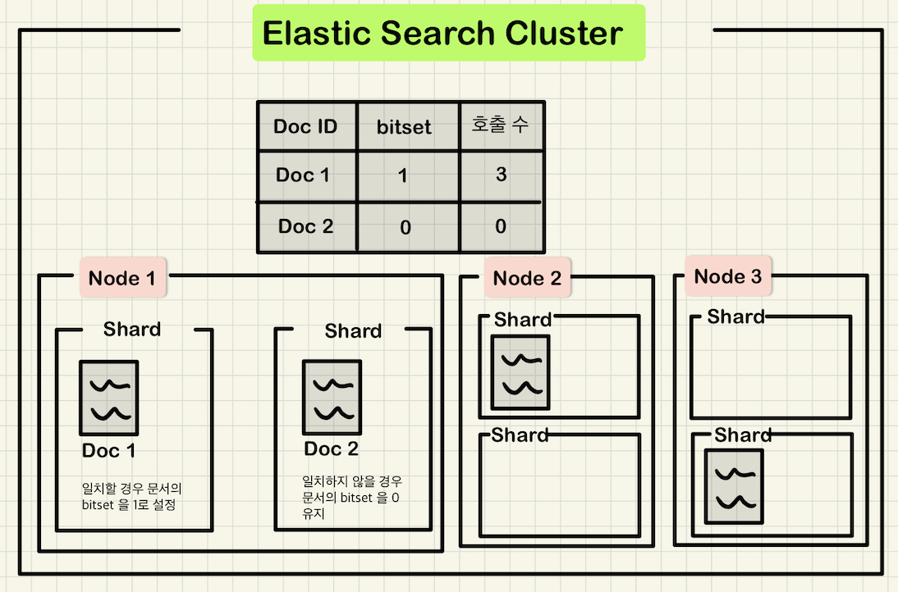
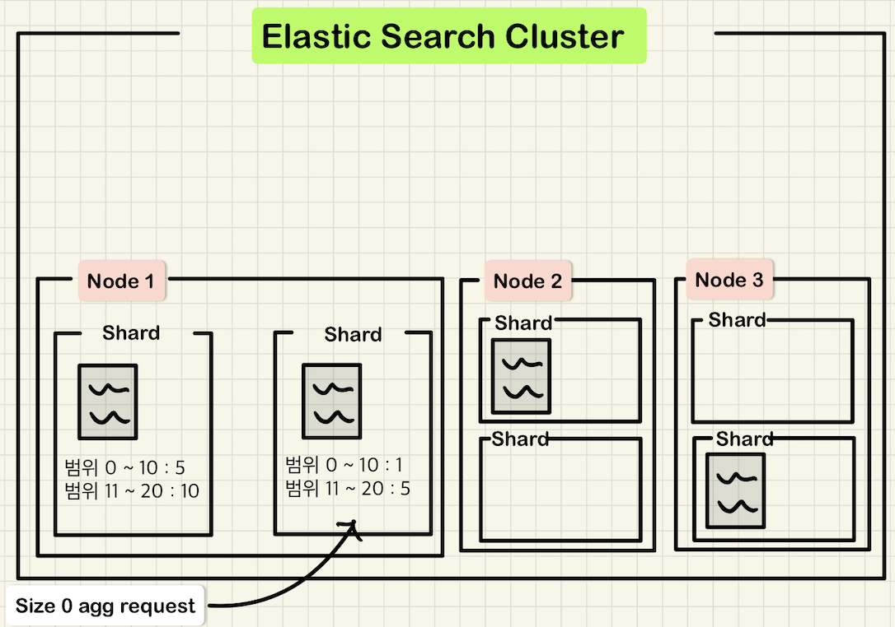
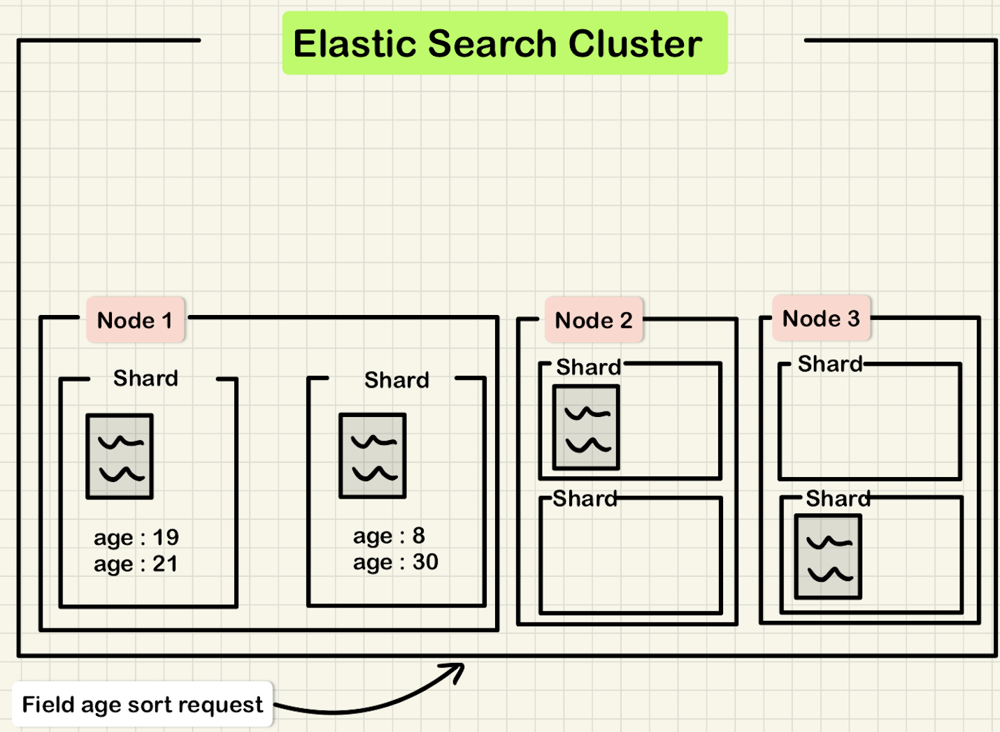

# 기초부터 다지는 ElasticSearch 운영노하우

## 11장 검색 성능 최적화
- ES 캐시의 종류와 특성
- 검색 쿼리 튜닝
- 샤드 배치 결정
- forcemerge API 활용
- 그 외 검색 성능 확보 방법

### ES 캐시의 종류 와 특성
- ES 는 다양한 검색 쿼리에 대해서 빠른 응답을 주기 위해 해당 쿼리의 결과를 캐싱한다.

`ES 의 캐시 영역`

| 캐시 영역 | 종류 |
| --- | --- |
| Node Query Cache | 쿼리에 의해 각 노드에 캐싱되는 영역 |
| Shard Request Cache | 쿼리에 의해 각 샤드에 캐싱되는 영역 |
| Field Data Cache | 쿼리에 의해 필드를 대상으로 각 노드에 캐싱되는 영역 |

#### Node Query Cache



- Node Query Cache 는 **filter context** 에 의해 검색된 문서가 캐싱되는 영역이다.
- filter context 에 의해 쿼리되면 각 문서에 0과 1로 설정가능한 bitset 을 지정한다.
  - 이는 사용자의 호출 여부를 마킹 하는 것
- ES 는 문서별로 bitset 을 지정하면서 사용자 쿼리 횟수와 bitset 1 인 문서간의 연관관계를 확인하고, 자주 호출되는 문서를 노드의 메모리에 캐싱한다.
- **검색 엔진에서 활용하기 좋은 캐시 영역**

> 주의할 점은, 세그먼트 하나에 저장된 문서의 수가 10,000개 미만 혹은 쿼리가 요청된 인덱스가 전체 인덱스 사이즈의 3% 미만인 경우 캐싱되지 않는다.

```shell
// 사용된 QCM (Query Cache Memory) 조회
curl -s 'http://localhost:9200/_cat/nodes?v&h=name,qcm'

name    qcm
ncucu-1  0b

// 1개의 샤드로 구성된 인덱스이며 2개의 문서가 저장되어 있음
curl -s 'http://localhost:9200/_cat/segments/users?v&h=index,shard,segment,docs.count'
index shard segment docs.count
users 0     _6               2
```

Node Query Cache 는 기본적으로 **활성화** 되어 있고, 활성/비활성화 설정이 가능하다.
- 이 설정은 dynamic setting 이 아니기 때문에 인덱스의 상태를 open/close api 를 통해 close 상태로 만들어야 한다.

> 캐시 메모리 영역이 가득차면 LRU (Least Recently Used Algorithm) 에 의해 캐싱된 문서를 제거한다.\
> 또한 각 노드의 elasticsearch.yml 설정을 통해 캐시 메모리 영역을 조정할 수 있다.

`elasticsearch.yml`

```yaml
indices.queries.cache.size: 10%
```

> 위 설정을 적용하면 노드의 재시작이 필요하며, 값 변경이 필요한 경우 충분히 테스트를 거친 뒤 변경해야 하낟.

#### Shard Request Cache



- Shard Request Cache 는 **샤드를 대상으로 캐싱** 되는 영역
- 특정 필드에 의한 검색이기 때문에 전체 샤드를 대상으로 캐싱된다.
- 이는 문서를 캐싱하는 것이 아닌, 집계 쿼리의 결과 / RequestBody 파라미터의 size 를 0으로 지정할 경우 쿼리 응답 결과에 포함된 **문서의 수** 에 대해서만 캐싱한다.
- 기본적으로 활성화 되어 있다.
- **분석 엔진에서 활용하기 좋은 캐시 영역**

> 주의할 점은, 샤드에 refresh 동작을 수행하면 캐싱된 내용이 초기화 된다.\
> 즉, 지속적인 색인이 발생하는 인덱스에서는 큰 효과가 없음.

```shell
// 사용된 RCM (Request Cache Memory) 조회
curl -s 'http://localhost:9200/_cat/nodes?v&h=name,rcm'

name    rcm
ncucu-1  0b0
```

> Shard Request Cache 는 **size 가 0** 이여야 캐싱된다는 점을 주의해야 한다.

Shard Request Cache 는 기본적으로 **활성화** 되어 있다.
- 이 설정은 dynamic setting 이기 때문에 인덱스를 대상으로 온라인 중 설정이 가능하다.
- 추가 적으로 검색 시 에도 활성/비활성화 설정이 가능하다.
- Node Query Cache 와 마찬가지로 캐시 영역 설정이 가능하다.

`elasticsearch.yml`

```yaml
indices.request.cache.size: 10%
```

#### Field Data Cache



- 인덱스를 구성하는 필드에 대한 캐싱
- 검색 결과 **정렬/집계** 쿼리 수행시 지정한 필드를 대상으로 해당 필드의 모든 데이터를 메모리에 저장한다.

```shell
// 사용된 FM (Fielddata Memory)
curl -s 'http://localhost:9200/_cat/nodes?v&h=name,fm'

name    fm
ncucu-1 0b
```

> Field Data Cache 는 Text 타입에 대해 캐싱을 하지 않는다.\
> Text 타입의 경우 비교적 데이터의 크기가 크기 때문에 메모리 과부하를 막기 위함이다.\
> 또한 집계를 수행한 필드의 모든 데이터를 메모리에 로드하기 때문에 집계 시 데이터의 양을 고려하여 사용해야 한다.


