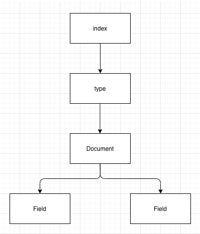
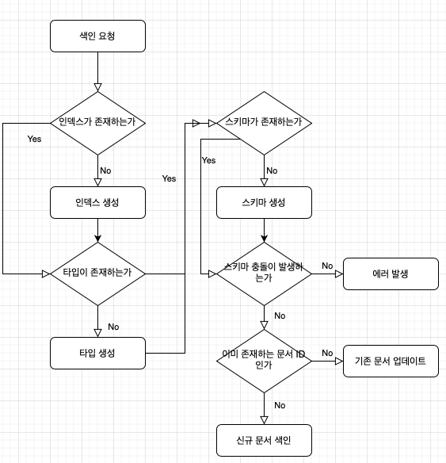

# 기초부터 다지는 ElasticSearch 운영노하우

## 2장 엘라스틱 서치 기본 동작
- 엘라스틱 서치에서 제공하는 기본적인 기능들의 '맛보기'


### ES 실행
- bin/elasticsearch
- -d, -p 옵션을 제공한다.
- -d: 백그라운드로 실행
- -p <파일명>:  엘라스틱서치의 프로세스 id를 <파일명>으로 지정한 파일에 저장한다.
- pid 파일은 실행중인 프로세스가 종료되면 자동으로 삭제된다.
- 별도 설정이 없다면, 9200 포트를 기본으로 사용한다.

> 0.90.x 이전 버전에서는 백그라운드 실행이 기본 옵션 이었다.
> -f 옵션을 지정해야지만 포그라운드로 실행이 가능했다.


### 문서 색인과 조회
- ElasticSearch 는 **JSON** 형태의 문서를 저장할 수 있고, 스키마리스를 지원하기 때문에 최초 색인시, 스키마 정의가 필요 없다.
  - 주의 할점은, '최초' 색인시 라는 점
  - 스키마리스를 지원한다는 말은, 스키마가 필요없다는 의미가 아니다.
  - 동적인 스키마 구성을 지원한다는 의미
  - 최초 1회 색인을 하고나면 해당 데이터 구조로 스키마가 자동생성 된다.
  - 그 후 다른 구조의 데이터를 색인하려고 하면, 에러가 발생한다.

- 실습은 shell 로 진행한다.
- 우선 실습에 앞서 엘라스틱서치의 데이터구조에 대해 간단하게 살펴보자.

`엘라스틱 서치의 데이터 구조`



- 엘라스틱 서치의 데이터구조는 크게 인덱스 > 타입 > 도큐먼트 > 필드 4가지로 구성되어 있다.
- **인덱스 (index)** 는 데이터의 '저장 공간' 이다.
  - RDBMS 와 비교하면 MySQL의 데이터베이스와 비슷한 개념이라고 볼 수 있다.
- **타입 (type)** 은 인덱스의 '논리적인 구조' 이다.
  - '논리적인 구조' 라는 표현을 기억해두면 좋다.. 그 이유는 추후 알게됨...
  - RDMBS 의 테이블과 비슷한 개념이라고 볼 수 있다.
  - 멀티 타입 관련해서는 추후 살펴볼 예정.
- **문서 (document)** 는 데이터가 저장되는 최소 단위이며 색인이 가능한 기본 단위 이다.
  - 기본적으로 JSON 포맷을 지원하고, 다수의 필드로 구성되어 있다.
  - 중첩 구조를 지원하기 때문에 문서안에 문서를 저장하는것도 가능하다.
- **필드 (field)** 는 문서를 구성하는 속성이다.
  - 관계형 데이터베이스의 컬럼과 대비되는데, 필드는 좀 더 동적인 데이터 타입이다.
  - 하나의 필드는 다수의 데이터 타입을 가질 수 있다.
> 예를 들어 제목을 검색할 때 매칭 검색, 초성 검색 모두 지원하도록 2개의 데이터 타입을 지정할 수 있다. 

`색인 Flow Charts`



- 색인 요청을 받고나면, ES 에서는 위와 같은 Flow 로 진행된다.

#### 문서 색인
- 엘라스틱 서치의 도큐먼트는, POST, PUT 메소드를 사용해서 입력이 가능하다.
- 아래 예시는 users 인덱스에 1번 도큐먼트를 생성하는 예제이다.
  - PUT API 를 사용해 user 인덱스에 _doc 타입으로 1번 문서를 색인해 달라는 요청을 보낼것이다.
  - 데이터는 { "username": "ncucu" }

`최초 문서 색인` 
```shell
curl -XPUT -H 'Content-Type: application/json' http://localhost:9200/users/_doc/1?pretty -d '
{
    "username": "ncucu"
}
'
```
- 요청 URI 를 살펴보면 /users/_doc/1?pretty 이게 무엇을 의미할까 ?
- /{인덱스명}/{타입}/{문서 ID}?pretty=true
  - pretty=true 옵션을 주면 사람이 보기 좋은 포맷으로 응답이 포매팅 되어 온다.
  - true 는 생략가능

`실행 결과`
```json
{
  "_index" : "users",
  "_type" : "_doc",
  "_id" : "1",
  "_version" : 1,
  "result" : "created",
  "_shards" : {
    "total" : 2,
    "successful" : 1,
    "failed" : 0
  },
  "_seq_no" : 0,
  "_primary_term" : 1
}
```

- 이미 존재하는 문서에 같은 요청을 보내게 되면, ES 는 문서를 **수정** 한다고 인식한다.
- 동일한 문서에, username: ncucu2 로 요청을 보내보면 다음과 같이 update 되었음을 알 수 있다.

`실행 결과`
```json
{
  "_index" : "users",
  "_type" : "_doc",
  "_id" : "1",
  "_version" : 2,
  "result" : "updated",
  "_shards" : {
    "total" : 2,
    "successful" : 1,
    "failed" : 0
  },
  "_seq_no" : 1,
  "_primary_term" : 1
}
```

> 인덱스/타입/문서 등에 대한 자세한 설명은 이후에 알아볼 것..

#### 문서 조회
- 문서의 조회는 GET 메소드 로 수행이 가능하다.

`문서 조회`
```shell
curl -XGET http://localhost:9200/users/_doc/1?pretty
```

`실행 결과`
```json
{
  "_index" : "users",
  "_type" : "_doc",
  "_id" : "1",
  "_version" : 1,
  "_seq_no" : 0,
  "_primary_term" : 1,
  "found" : true,
  "_source" : {
    "username" : "ncucu"
  }
}
```
- 문서 조회시 해당 문서의 메타 데이터가 함께 조회된다.
- 메타 데이터는 인덱스 정보, 타입 정보, 문서 정보 가 포함된다.

#### 문서 삭제
- 문서의 삭제는 DELETE 메소드 로 수행이 가능하다.

`문서 삭제`
```shell
curl -XDELETE http://localhost:9200/users/_doc/1?pretty
```

`실행 결과`
```json
{
  "_index" : "users",
  "_type" : "_doc",
  "_id" : "1",
  "_version" : 2,
  "result" : "deleted",
  "_shards" : {
    "total" : 2,
    "successful" : 1,
    "failed" : 0
  },
  "_seq_no" : 2,
  "_primary_term" : 1
}
```
- 특이점은 문서를 삭제하고 난 뒤 이다.
- 우리는 문서를 삭제했지만, version 과 seq_no 가 증가 했다는 응답을 받았다.
- 삭제한 문서를 다시 조회할 경우 응답은 다음과 같다.

`삭제한 문서 조회 응답`
```json
{
  "_index" : "users",
  "_type" : "_doc",
  "_id" : "1",
  "found" : false
}
```
- 삭제한 문서를 보면, 메타 정보가 여전히 남아있고 검색을 할 수 없다.
- 그럼 이번에는 삭제한 도큐먼트에 다시 데이터를 입력해보자.

`삭제한 문서에 데이터 재입력 요청 응답`
```json
{
  "_index" : "users",
  "_type" : "_doc",
  "_id" : "1",
  "_version" : 3,
  "result" : "created",
  "_shards" : {
    "total" : 2,
    "successful" : 1,
    "failed" : 0
  },
  "_seq_no" : 5,
  "_primary_term" : 1
}
```
- 우리가 기대한 값은 도큐먼트가 삭제되었기 때문에 version 이 1인 상태로 생성되는것이다.
- 하지만 version 이 3으로 증가했다.

> 도큐먼트의 삭제는 도큐먼트가 실제로 삭제 되는것이 아닌, 도큐먼트의 데이터 값이 빈 값으로 수정되고 검색이 되지 않도록 상태가 변경되는 것이다.

#### 문서의 스키마 확인
- 스키마 확인은 매핑 API 를 통해 수행할 수 있다.
  
`스키마 확인`
```shell
curl -XGET http://localhost:9200/users/_mapping?pretty
```

`실행 결과`
```json
{
  "users" : {
    "mappings" : {
      "properties" : {
        "username" : {
          "type" : "text",
          "fields" : {
            "keyword" : {
              "type" : "keyword",
              "ignore_above" : 256
            }
          }
        }
      }
    }
  }
}
```

#### 동적 스키마 변경
- 동적 스키마 변경 기능을 사용하기 위해 기존의 users 인덱스에 새로운 필드를 추가한 문서를 색인해보자.

`추가 필드 문서 색인`
```shell
curl -XPUT -H 'Content-Type: application/json' http://localhost:9200/users/_doc/2?pretty -d '
{
    "username": "ncucu2",
    "korname": "박준영",
    "age": 28
}
'
```

- 색인 요청을 한뒤 매핑 API 를 통해 매핑정보를 확인하면 다음과 같이 age, korname 필드가 추가되었음을 확인할 수 있다.
  
`실행 결과`
```json
{
  "users" : {
    "mappings" : {
      "properties" : {
        "age" : {
          "type" : "long"
        },
        "korname" : {
          "type" : "text",
          "fields" : {
            "keyword" : {
              "type" : "keyword",
              "ignore_above" : 256
            }
          }
        },
        "username" : {
          "type" : "text",
          "fields" : {
            "keyword" : {
              "type" : "keyword",
              "ignore_above" : 256
            }
          }
        }
      }
    }
  }
}
```

#### 문서 검색
- 문서의 검색은 검색 API 로 수행이 가능하다.
- 검색 API 는 기본적으로 **질의 (Query)** 를 기반으로 동작한다.
- 검색 질의는 URI 검색과, Request Body 검색 두가지로 나뉜다.
  

- **URI 검색** 은 HTTP GET 요청을 활용하는 방식
- **쿼리스트링** 을 통해 파라미터를 전달한다.
- 때문에 단순하고 사용하기 편리하지만, 복잡한 질의를 하기엔 제한된다는 단점


- **Request Body 검색** 은 HTTP POST 요청을 활용하는 방식
- **요청 본문** 을 통해 파라미터를 전달한다.
- 요청 본문에 검색할 칼럼, 검색어를 JSON 형태로 전달하는 방식
- 효율적인 질의를 위해 **Query DSL** 이라는 문법을 지원한다.


`문서 검색 QueryString`
```shell
curl -XGET http://localhost:9200/users/_search?pretty&q=username:ncucu
```

`문서 검색 RequestBody`
```shell
curl -XPOST -H 'Content-Type: application/json' http://localhost:9200/users/_search?pretty -d '
{
    "query": {
        "query_string": {
            "default_field": "username",
            "query": "ncucu"
        }
    }
}
'
```

`실행 결과`
```
{
  "took" : 5,
  "timed_out" : false,
  "_shards" : {
    "total" : 1,
    "successful" : 1,
    "skipped" : 0,
    "failed" : 0
  },
  "hits" : {
    "total" : {
      "value" : 1,
      "relation" : "eq"
    },
    "max_score" : 0.2876821,
    "hits" : [
      {
        "_index" : "users",
        "_type" : "_doc",
        "_id" : "1",
        "_score" : 0.2876821,
        "_source" : {
          "username" : "ncucu"
        }
      }
    ]
  }
}
```
- 응답 결과의 다양한 속성들은 이후에 살펴볼 예정이므로, 현재는 hits 내부에 존재하는 응답을 살펴보자.
- index 정보, type 정보, 문서의 id, _source 필드에는 해당 문서의 정보가 있음을 알 수 있다.

## 정리
- ElasticSearch 의 매우 기본적인 부분만 살펴보았다.
- ES 를 통해 JSON 포맷의 문서를 색인하고 조회, 검색 등 다양한 작업을 할 수 있다.
- 스키마리스 기능을 지원한다. 이는 스키마가 없다는 의미가 아닌, 동적인 스키마 정의를 지원한다는 의미이다.
- 이미 정의해둔 스키마와 다른 형태의 데이터가 입력될 경우 예외가 발생하며 해당 문서는 색인되지 않는다.