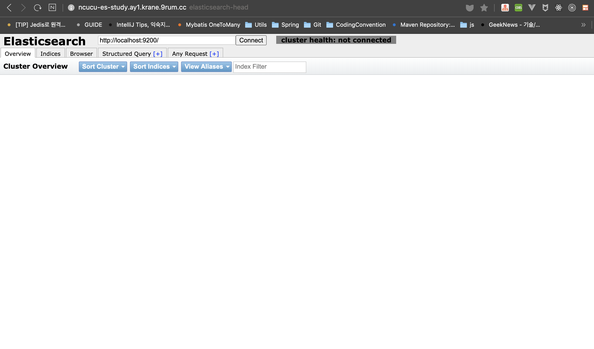
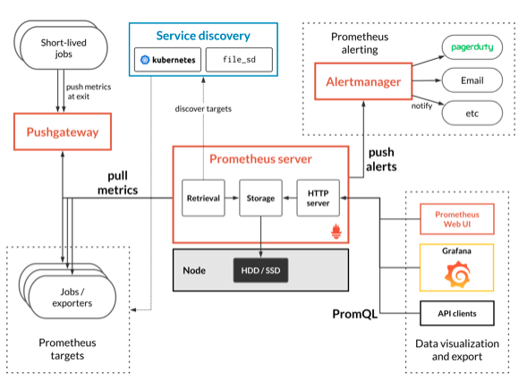

# 기초부터 다지는 ElasticSearch 운영노하우

## 3장 엘라스틱 서치 모니터링
- 오픈소스 프로젝트인 Head, 프로메테우스, X-Pack 을 활용한 클러스터 모니터링

### Head 를 이용한 모니터링
- **ElasticSearch-Head** 는 엘라스틱서치에서 제공하는 ElasticSearch cluster 의 상태를 모니터링하기 위한 도구
- 클러스터의 여러 정보를 웹 UI 로 제공한다.
- 가장 큰 장점은 샤드의 배치 정보를 시각적으로 제공한다는 점

#### 설치 및 실행하기
- ElasticSearch-Head 설치 및 실행하는 방법은 다양하다
1. Built In Server (현업에서 사용중)
2. Docker
3. Chrome Extension
4. Plugin
5. Local Proxy

`Built in Server`
- git clone git://github.com/mobz/elasticsearch-head.git
- cd elasticsearch-head
- npm install
- npm run start
- open http://localhost:9100/

`Docker`
- for Elasticsearch 5.x: docker run -p 9100:9100 mobz/elasticsearch-head:5
- for Elasticsearch 2.x: docker run -p 9100:9100 mobz/elasticsearch-head:2
- for Elasticsearch 1.x: docker run -p 9100:9100 mobz/elasticsearch-head:1
- for fans of alpine there is mobz/elasticsearch-head:5-alpine
- open http://localhost:9100/

`Chrome Extension`
- https://chrome.google.com/webstore/detail/elasticsearch-head/ffmkiejjmecolpfloofpjologoblkegm/
- CORS 를 활성화할 필요가 없다.

`Plugin`
- 5.x, 6.x, 7.x 는 플러그인으로 지원하지 않는다.
    - 보안 이슈
- for Elasticsearch 2.x: sudo elasticsearch/bin/plugin install mobz/elasticsearch-head 
- for Elasticsearch 1.x: sudo elasticsearch/bin/plugin -install mobz/elasticsearch-head/1.x
- for Elasticsearch 0.x: sudo elasticsearch/bin/plugin -install mobz/elasticsearch-head/0.9
- open http://localhost:9200/_plugin/head/
> 이 방법은 github 에서 적절한 버전의 엘라스틱 서치 헤드가 자동으로 설치되어 클러스터내의 플러그인으로 실행된다.
> 또한 자동적으로 클러스터 노드가 연결됨

`Local Proxy`
- 원격지 클러스터에 파일을 생성 (see. localhost9200.json)
- 노드버전 6.0이상
- npm install
- npm run proxy
- grunt server
- open http://localhost:9100

> https://github.com/mobz/elasticsearch-head
> 모든 방식을 살펴보는것도 좋지만... Built In Server 방식만 살펴보자.

##### Built In Server
- 빌트인 서버 구축방식
  - git clone git://github.com/mobz/elasticsearch-head.git
  - cd elasticsearch-head
  - npm install
  - npm run start
  - open http://localhost:9100/
- git clone 을 받은뒤, npm 을 이용해서 grunt 서버로 구동하는 방법이다.
- 이 방법은 Head 에서 각 클러스터의 노드에 접근하려면 해당 클러스터에서도 CORS 허용 작업이 필요함.
- {elasticsearch_root}/config/elasticsearch.yaml

`elasticsearch.yaml`
```yaml
http.cors.enable: true
http.cors.allow-origin: "*"
```

> https://www.elastic.co/guide/en/elasticsearch/reference/current/modules-http.html

- 클러스터에 대한 정보들을 모니터링 가능..




### 프로메테우스를 활용한 모니터링
- ES 6.3버전 부터 X-Pack 베이직 라이선스를 기본으로 탑재하고 있다.
- 이전 버전에서는 매년 갱신을 해주어야 했기때문에 사실상 이용하기가 불편했다.
- **프로메테우스 (Prometheus)** 데이터를 시간의 흐름대로 저장가능한 시계열 데이터베이스
  - 다차원 데이터 모델 (메트릭 이름과 키/ 값 쌍으로 식별됨)
  - Key-Value 형태로 LevelDB 에 저장됨




## 정리
- ES-Head 모니터링은 클러스터의 전반적인 동작상태를 확인하기에 용이하지만, 성능 지표 등 자세한 정보를 확인하긴 어렵다.
- 프로메테우스는 다수의 클러스터 운영시 구축하기 수월하지만 X-Pack 대비 정보가 적다.
- X-Pack 은 가장 많은 정보를 확인할 수 있으며, 6.3 버전 이후에는 라이선스 갱신이 필요없다.
