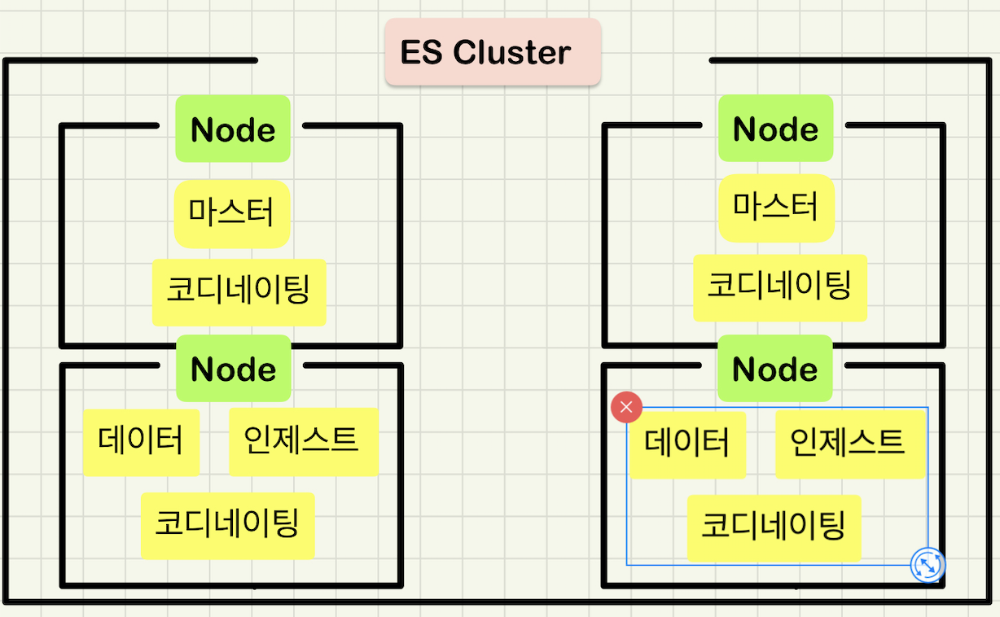
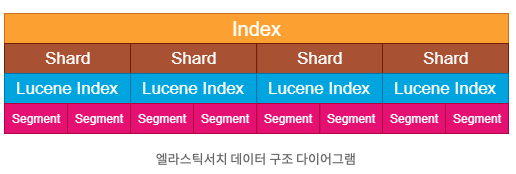

# 기초부터 다지는 ElasticSearch 운영노하우

## 4장 엘라스틱서치 기본 개념
- 클러스터와 노드
- 인덱스와 타입
- 샤드와 세그먼트
- 매핑

### 클러스터와 노드
- **클러스터** 란? 여러 대의 컴퓨터 혹은 구성 요소들을 논리적으로 결합하여 전체를 하나의 컴퓨터 혹은 하나의 구성요소처럼 사용 할 수 있게 해주는 기술
- ES 역시 클러스터링 제공하고, 여러 프로세스들을 논리적으로 묶어 하나의 ES 처럼 사용할 수 있게 제공한다.
- 이 때 클러스터를 구성하는 각 ES 프로세스 들을 **노드** 라고 한다.
- 노드는 클러스터에 포함된 단일 서버로서 데이터를 저장하고 클러스터의 색인화 및 검색 기능에 참여한다.
- 클러스터와 동일하게 이름으로 색별되는데, 기본 값은 **UUID** 이다.
- 클러스터명을 통해 특정 클러스터로 구성할 수도 있으며, 클러스터 명의 기본 값은 **elasticsearch** 이다.
- 별도의 설정 없이 네트워크에서 다수의 노드를 실행할 경우, 이 노드들은 elasticsearch 라는 단일 클러스터를 구성하고 이를 구성한다.
> 클러스터링을 안하는곳을 찾아보기가 힘들 정도..

`클러스터 정보 확인`

```shell
curl http://localhost:9200
```

`요청 결과`

```shell
{
  "name" : "ncucu-1",
  "cluster_name" : "ncucu",
  "cluster_uuid" : "f1iz_G1PSJ6TG-vLK35OHg",
  "version" : {
    "number" : "7.7.1",
    "build_flavor" : "default",
    "build_type" : "tar",
    "build_hash" : "ad56dce891c901a492bb1ee393f12dfff473a423",
    "build_date" : "2020-05-28T16:30:01.040088Z",
    "build_snapshot" : false,
    "lucene_version" : "8.5.1",
    "minimum_wire_compatibility_version" : "6.8.0",
    "minimum_index_compatibility_version" : "6.0.0-beta1"
  },
  "tagline" : "You Know, for Search"
}
```
- 클러스터명의 기본값이 elasticsearch 라고 했는데, ncucu 라고 나온다. -> 별도로 설정을 해주었음 이후에 살펴볼 예정

### 노드의 종류
- 관계형 데이터베이스의 경우 모든 요청을 하나의 서버에서 처리하지만, 엘라스틱 서치는 분산 처리가 가능하기 때문에 대용량 처리도 가능하다.
- 분산 처리를 위해서는 다양한 노드들을 조합해서 클러스터를 구성해야 한다.
- 노드들도 각 유형이 존재하며, 엘라스틱 서치가 제공하는 노드의 유형은 다음과 같다.

#### 마스터 노드
- 마스터 노드는, **클러스터의 메타데이터를 관리** 하는 작업을 수행한다.
  - 인덱스 생성, 삭제 등..
  - 클러스터 내에 존재하는 모든 노드는 현재 상태, 성능정보 등 자신이 가지고 있는 샤드 정보를 마스터 노드에게 알린다.
- 네트워크 속도가 빠르고, 지연이 없는 노드를 마스터 노드로 선정해야 하며, 하나의 노드만이 마스터 노드로 선출된다.

#### 데이터 노드
- 데이터 노드는 문서가 저장되는 노드이며, 샤드가 배치되는 노드이기도 하다.
- 색인 작업은 리소스를 많이 소모하기 때문에, **마스터 노드와 분리해서 구성** 해야 한다.
- 검색 요청을 처리하는 노드이기도 한데, 직접 처리가능한것은 본인이 수행하고, 다른 데이터 노드들이 처리해야 한다면, 해당 노드에 전달한다.
- 어떤 데이터 노드로 요청을 전달할 것인지는, 마스터 노드를 통해 받은 클러스터의 상태 정보를 기반으로 수행한다.

#### 인제스트 노드
- 색인에 앞서 **데이터 전처리** 를 위한 노드
- 데이터 포맷을 변경하기 위해 스크립트로 전처리 파이프라인을 구성하고 실행할 수 있다.

#### 코디네이팅 노드
- 요청을 단순히 분산 (Round-Robin 방식) 시켜주는 노드이다.

#### 노드의 역할
- 하나의 노드는 하나의 역할만 수행할 수 있는 것이 아니다.
- 하나의 노드가 다수의 역할을 수행할 수 있음
  - 이는 fail-over 를 위함과 성능을 챙기기 위한 방식
- 다음과 같이 구성이 가능하다.




### 인덱스와 타입
- **인덱스** 는, 데이터 저장공간이며 하나의 타입만을 가진다.
- 인덱스 생성시 기본적으로 5개의 프라이머리 샤드와 1개의 레플리카 세트를 구성한다.
  - 프라이머리 샤드의 개수는 최초 인덱스 생성시 개수를 결정한다.
  - 하지만 최초 결정된 샤드의 수를 이후에 변경할 수 없다.
  - 프라이머리 샤드의 개수를 지정하는것은 매우 신중해야 한다.
  - 레플리캬 샤드의 개수는 최초 생숭된 이후에도 유동적으로 조절이 가능하다.
- 데이터 검색시 활용되며, 이름은 **소문자** 여야만 한다. 
- RESTful API 를 제공하기 때문에 이를 통한 조작이 가능하며, 인덱스가 없는 상태에서 데이터를 추가할 경우 자동적으로 인덱스를 생성한다.
> 인덱스의 이름은 클러스터 내에서 유일해야 하며, 동일한 이름을 가지는 다른 인덱스를 생성할 수 없다.

- **타입** 은, 인덱스의 **논리적인 구조** 를 의미한다.
  - 앞에서 잠깐 얘기 했는데, 그 이유가 나온다.
- 6.0 이하 버전에서는 하나의 인덱스에 다수의 타입을 설정할 수 있었지만, 6.1 버전 부터는 불가능하다.
- 6.0 이하에서 **특정 카테고리 분류** 의 목적으로 사용했지만 타입 사용을 권장하지 않는다.
- 카테고리분류가 필요하면 각 카테고리 별로 인덱스를 생성해서 사용해야 한다.

#### 프라이머리 샤드의 개수를 변경할 수 없는 이유 ?
- ElasticSearch 가 갹 샤드로 분산하는 방법을 보면 그 이유를 알 수 있다.
- 다음은 데이터 색인시 어떤 번호의 프라이머리 샤드에 문서를 저장할지 결정하는 알고리즘 이다.
```
샤드번호 = Hash(Doucment ID) % 프라이머리 샤드 개수
```

- 위 알고리즘에 의해 어떤 샤드로 할당하지 결정된다.
    - 샤드 번호는 0 ~ 샤드의 개수-1 사이의 번호를 부여 받는다.
- 만약 프라이버리 샤드 샤드가 개수가 변경된다면, 현재까지 저장된 문서의 샤드 번호가 모두 변경되어야 하기 때문..

#### 멀티 타입을 지원하지 않는 이유 ?
- 기존에 제공하던 멀티 타입기능을 지원하지 않게된 이유는 무엇일까 ?
- **같은 인덱스 이면서 서로 다른 매핑타입에 존재하는 field 는 내부적으로 같은 루씬필드를 사용** 한다.
- /a/user 의 user_name 필드와, /a/team 의 user_name 필드는 정확히 동일한 필드에 저장된다.
- 같은 인덱스 내에서 타입이 다르더라도 필드명이 동일하다면, 모두 동일한 매핑 (해당 필드 정의) 을 가져야 한다는 문제가 있다.

> 필드를 지우거나, 문서를 압축하는 과정 등에서 문제가 발생할 수 있기 때문에 이를 제거하기로 하였고, 7버전 부터는 완전히 제거되었다.

### 샤드와 세그먼트



- 엘라스틱 서치는, 문서를 인덱스로 만든뒤, 샤드로 분리하여 관리한다.
- 각각의 샤드는 **루씬 인덱스** 이기도 하다.
- 루씬은 새로운 데이터를 저장할때 **세그먼트 (Segment)** 를 생성하는데, 이를 조합하여 데이터를 검색할 수 있다.
- 색인작업이 일어날때 마다 세그먼트의 개수가 점점 늘어나 읽기 성능이 저하될 수 있다.
- 따라서 루씬은 백그라운드에서 주기적으로 세그먼트 파일을 병합하는 작업을 수행한다.
- 일정시간이 지난뒤 추가적인 색인작업이 없다면, 최종적으로 하나의 세그먼트만 남게 된다.

> 색인 처리량이 중요할때는 세그먼트를 더 생성하기도 하지만, 루씬은 순차적으로 세그먼트를 검색하기 때문에 세그먼트 수가 많아질수록 검색속도는 느려진다.

`샤드`
- **샤드** 는 인덱스에 색인되는 문서들이 저장되는 논리적인 공간을 의미한다.
  - 인덱스 내부에 색인된 데이터는 물리적인 공간에 여러 개의 파티션을 나누어 구성된다.
  - 이 파드션을 샤드 (Shard) 라고 한다.
  - 샤드로 문서를 분산저장하고 있기 때문에 데이터 유실 위험을 최소화 할 수 있다.
  
`세그먼트`
- 엘라스틱서치에 새로운 데이터를 저장하면, 바로 검색이 가능한 것은 아니다.
  - 최초에는 메모리 버퍼 캐시에 저장됨
- 새로 검색가능한 세그먼트를 만들기 위해 새로운 세그먼트를 디스크에 기록하여 Refresh 한다.
- 이러한 과정을 **Searchable Segment** 라고 한다.
    - 이 과정을 거친 후 에서야 검색이 가능해진다.
- 엘라스틱서치는, 세그먼트를 fsync 하는 flush 를 주기적으로 진행하고, 불필요한 트랜젝션 로그를 제거한다.
- 이를 **Committed Segment** 라고 한다.
- 세그먼트를 항상 불변성을 유지하며, 수정이 일어났을때, 삭제된 데이터를 표시하고, 새로운 데이터를 가리킨다.
- 이를 **Merge Process** 라고 한다.
  - DELETE API 를 통해 삭제했을때 나타난 결과의 이유

### 매핑
- 엘라스틱서치에서는 색인시 문서의 데이터 유행에 따라 적절한 데이터 타입을 지정해야한다.
- 이러한 과정을 **매핑 (Mapping)** 이라고 한다.
- 사전 매핑을 하지 않으면, 엘라스틱 서치가 자동으로 필드 생성 및 타입까지 모두 결정하게 된다.
- 이를 스키마리스 기능이라고 하는데, 이는 성능과 직접적인 연관이 있기 때문에 되도록이면 사용하지 않는것을 권장한다.
  
- 매핑시 고려해야할 사항은 세가지가 있다.
1. 문자열을 분석할 것인가 ?
2. _source 에 어떤 필드를 정의할 것인가 ?
3. 날짜 필드를 가지는 필드는 무엇인가 ?

#### 매핑 생성
- 매핑을 정의할때는 properties 필드에 필드명 / 타입 등 옵션을 지정해서 정의할 수 있다.

`Mapping API Format`
```json
{
  "mappings": {
    "properties": {
      <매핑 내용>
    }
  }
}
```

`Mapping 생성 예제`
```shell
curl -XPUT -H 'Content-Type: application/json' http://localhost:9200/pubsub?pretty -d '
  {
    "mappings": {
      "properties": {
        "name": { "type": "keyword" },
        "age": { "type": "integer" },
        "desc": { "type": "text", "analyzer": "standard" },
        "organization": {
          "properties": {
            "orgCd": { "type": "keyword" },
            "orgNm": { "type": "keyword" }
          }
        }
      }
    }
  }
'
```

`실행 결과`
```shell
{
  "acknowledged" : true,
  "shards_acknowledged" : true,
  "index" : "pubsub"
}
```

`Mapping 정보 확인`
```shell
// format
GET <host>/<index>/_mapping
GET <host>/<index>/<type>/_mapping

curl -XGET http://localhost:9200/pubsub/_mapping?pretty
```

`실행 결과`
```shell
{
  "pubsub" : {
    "mappings" : {
      "properties" : {
        "age" : {
          "type" : "integer"
        },
        "desc" : {
          "type" : "text",
          "analyzer" : "standard"
        },
        "name" : {
          "type" : "keyword"
        },
        "organization" : {
          "properties" : {
            "orgCd" : {
              "type" : "keyword"
            },
            "orgNm" : {
              "type" : "keyword"
            }
          }
        }
      }
    }
  }
}
```
- analyzer ? 이런것들은 뭔가 ? .. => 매핑 파라미터

#### 매핑 파라미터
- 매핑 파라미터는, 색인할 필드의 데이터 저장에 대한 다양한 옵션들을 제공한다.

`analyzer`
- 해당 필드는 **형태소 분석** 을 사용하겠다는 의미
- 색인 및 검색시 지정한 분석기로 형태소 분석을 수행한다.
- text 데이터 타입은, analyzer 파라미터를 사용해야 하고, 기본 값은 **Standard Analyzer**

`normalizer`
- term query 에 분석기를 사용하기 위해 사용된다.
  - 검색 API 챕터에서 살펴볼 예정
- keyword 데이터는, **원문을 기준으로 색인** 된다.
- cafe, Cafe 는 서로 다르게 인식되지만, normalizer 를 이용하면 같은 데이터로 인식한다.

`boost`
- 필드에 가중치를 부여한다.
- 가중치에 따라 _score 점수가 달라지는데, 이는 **검색 결과의 노출 순서에 영향** 을 미친다.
- 색인 시점에 boost 설정을 하면, 재색인 전까지 가중치 변경이 불가능하다.
- 검색 시점에만 사용하는 것을 권장하며, 7.x 이후부터는 deprecated 되었다.

`coerce`
- 색인시 타입의 자동변환 허용 여부
- "10" -> 10 자동 형변환

`copy_to`
- 해당 필드의 값을 지정한 필드로 복사
- keyword 타입 필드에 copy_to 파라미터를 이용해 text 타입을 지정하여 형태소 분석이 가능하다.

`fielddata`
- HEAP 영역에 생성하는 메모리 캐시
- 메모리 이슈와 잦은 GC 때문에 잘 사용되지 않으며, 최신 버전에서는 doc_values 라는 새로운 캐시를 제공한다.

`doc_values`
- 최신버전에서 제공하는 기본 캐시
- **Text 타입을 제외한 모든 타입에서 기본으로 활성화** 되어 있다.
- 루씬 기반 캐시이며, 운영체제의 파일 시스템 캐시를 이용한 빠른 액세스가 가능하다.

`그외..`
- 이 외에도 다양한 매핑 파라미터들이 존재하지만 생략..

#### 메타 필드 (내장 필드)
- 엘라스틱 서치 매핑시 메타 정보를 설정하고, 데이터 처리 방법 지정이 가능하다.
- 최초 인덱스 생성시 매핑에 설정 혹은 mapping API 를 사용하여 기존에 생성된 인덱스에도 지정이 가능하다.

`인덱스 최초 생성시 지정`
```shell
PUT <호스트>/<인덱스> -d '
{
	"mappings": {
		"<내장필드명>": {
			...<필드 내용>
		}
	}
}
'
```

`생성된 인덱스에 지정`
```shell
PUT <호스트>/<인덱스>/_mapping/<타입> -d '
{
	"mappings": {
		"<내장필드명>": {
			...<필드 내용>
		}
	}
}
'
```

- 다음으로 각 메타 필드들에 대해 살펴보자.

`_index`
- 해당 문서가 속한 인덱스 명을 가지는 필드
- 집계 API 를 활용해서 해당 인덱스에 존재하는 문서를 확인할 수 있다.

`_type`
- 해당 문서가 속한 타입 정보를 가지는 필드

`_id`
- 문서를 식별하는 유일한 키 정보를 가지는 필드
- index 옵션과 store 옵션을 사용 (매핑 파라미터 파트 참고) 해, 색인 여부 및 저장 여부 설정이 가능하다.

`_uid`
- 특수한 목적의 식별키 이다.
- '#' 태그를 사용해 _type, _id 값을 조합해서 사용할 수 있다.
- 검색시 조회되지 않는다.

`_source`
- 문서의 원본 데이터를 제공하는 필드
- _source의 enabled 옵션을 false로 설정하면 색인시 원본 데이터는 저장하지 않는다.
- _reindex API 나 스크립트를 사용해 해당 값 계산시 해당 메타 필드 활용이 가능하다.

`_all`
- 색인에 사용된 모든 필드 정보를 가진 메타 필드
- 모든 필드의 내용이 **하나의 텍스트로 합쳐져 제공** 된다.
  - 각 필드의 include_in_all 옵션을 false 로 지정하면 해당 필드를 제외할 수 있다.
> 6.x 이후부터는 deprecated 되었으며 필요시 copy_to 매핑 파라미터를 활용해야 한다.

#### 필드 데이터 타입
- 매핑시 지정가능한 각 필드의 데이터 타입에 대해 살펴보자.
- 필드 데이터 타입은 문자열, 실수, 논리형 등 기본형 타입과 객체와 같은 확장 타입으로 구분된다.

`Keyword`
- 키워드 형태로 사용될 데이터에 적합하다.
- 분석기를 거치지 않고, **원문 그대로 색인** 된다.
- 검색시 필터링 되는 항목, 정렬이 필욯나 항목, 집계 항목에 많이 사용된다.
- 주요 매핑 파라미터는 boosts, doc_values, index, null_value, store 가 있다.
> PS. 당근마켓 면접 질문에 나왔다. 
> ES Keyword 타입 검색과 RDBMS '%'text'%' 검색의 차이점 은 ?..

`Text`
- 색인시 지정된 분석기가 문자열 데이터를 분석한다.
- 별도의 분석기를 지정하지 않았다면, 기본 값인 **Standard Analyzer** 를 사용한다.
- 전체 텍스트가 **토큰 화** 되며, 전문 검색 및 특정 단어 검색이 가능하다.
- 주요 파라미터는 analyzer, boost, fielddata, index, norms, store, search_analyzer, similarity, term_vector
> 검색 뿐 아니라 정렬/집계가 필요하다면 멀티 필드로 keyword 타입을 지정해서 사용할것

`Array`
- 2차원 이상의 데이터를 표현하고 싶다면 Array 데이터 타입을 사용해야 한다.
- 기본 데이터 타입으로 지정할 수도 있지만, 객체 형태로 정의도 가능하다.
> Array 타입은 매핑시 타입을 명시적으로 지정하지 않는다. 최초 색인될 값이 배열 데이터 타입인지를 결정한다.

`Numberic`
- ES 는 숫자 타입을 여러가지 종류로 제공 한다.
- 데이터 크기에 맞는 타입을 제공함으로써 색인 및 검색을 효율적으로 처리한다.

| 타입 명 | 설명 |
| --- | --- |
| long | 64비트 정수. 범위는 -2의 63승 ~ 2의 63승 -1 |
| integer | 32비트 정수. 범위는 -2의 31승 ~ 2의 31승 -1 |
| short | 16비트 정수. 범위는 -32,768 ~ 32,767 |
| double | 64비트 부동 소수점을 갖는 수 |
| float | 32비트 부동 소수점을 갖는 수 |
| half_float | 16비트 부동 소수점을 갖는 수 |

`Date`
- 문자열로 처리되며 포맷 지정이 가능하다.
- 기본 값은 **yyyy-MM-ddTHH:mm:ssZ**
- 크게 3가지 형태를 제공하며, UTC 밀리초 단위로 변환해 저장한다.
- 문자열이 포함된 형식
  - 2018-04-20
  - 2018/04.20
  - 2018-04-20 10:55:00
  - 2018/04/20 10:55:00
- ISO_INSTANT 포맷의 날짜 형식
  - 2018-04-10T10:50:00Z
- 밀리초
  - 1524449145579

`Range`
- 범위가 있는 데이터 저장시 사용된다.
- 10 ~ 20 사이의 정수라면 시작과 끝만 정의

| 타입 | 설명 |
| --- | --- |
| integer_range | 최솟값/최대값을 갖는 부호 있는 32비트 정수 범위 |
| float_range | 부동 소수점을 갖는 32비트 실수 범위 |
| long_range | 최솟값/최대값을 갖는 부호있는 64비트 정수의 범위 |
| double_range | 부동 소수점 값을 갖는 64비트 실수 범위 |
| date_range | 64비트 정수 형태의 밀리초로 표시되는 날짜값의 범위 |
| ip_range | IPv4, IPv6 주소를 지원하는 IP 값 |

`Boolean`
- 논리 값은 가지는 데이터 타입
- 해당 값을 문자열로 표현하는 것도 가능하다.

`Geo-Point`
- 위치 정보를 가지는 데이터 타입
  - 위도, 경도 등
- 반경 내 쿼리, 위치 기반 집계, 정렬 등에 사용이 가능

`IP`
- IP 주소 데이터를 저장할때 사용
- IPv4, IPv6 모두 지정 가능

`Object`
- 내부 데이터를 계층적인 표현 가능
- 특정 키워드나 타입 지정없이 필드 값으로 문서의 구조를 입력하면 된다.

`Nested`
- Object 객체 배열을 독립적으로 색인하고 질의하는 타입
- 객체를 배열 형태로 저장 가능하다.
> Array 데이터 타입 내부에 존재하는 검색은 모든 데이터를 기준으로 **OR 검색** 이 된다. 
> 다수의 조건을 모두 만족하는 검색이 되지 않는 문제를 해결하기 위해 Nested 타입이 고안되었다.

## 정리
- ES는 노드들의 역할을 정의하고 클러스터로 구성하며, 클러스터 단위로 색인/검색 요청을 받아 처리한다.
- 인덱스는 문서가 저장되는 가장 큰 논리적인 단위이다.
- 문서는 인덱스 내 샤드라는 단위로 저장된다.
- 샤드에 저장되는 문서는 세그먼트라는 물리적인 파일에 저장된다.
- 샤드는 하나 이상의 세그먼트들로 구성된다.
- 샤드는 원본데이터를 가리키는 프라이머리 샤드와 복제본인 레플리카 샤드로 나뉜다.

## 읽어보면 좋은글
- https://ncucu.me/172?category=874845