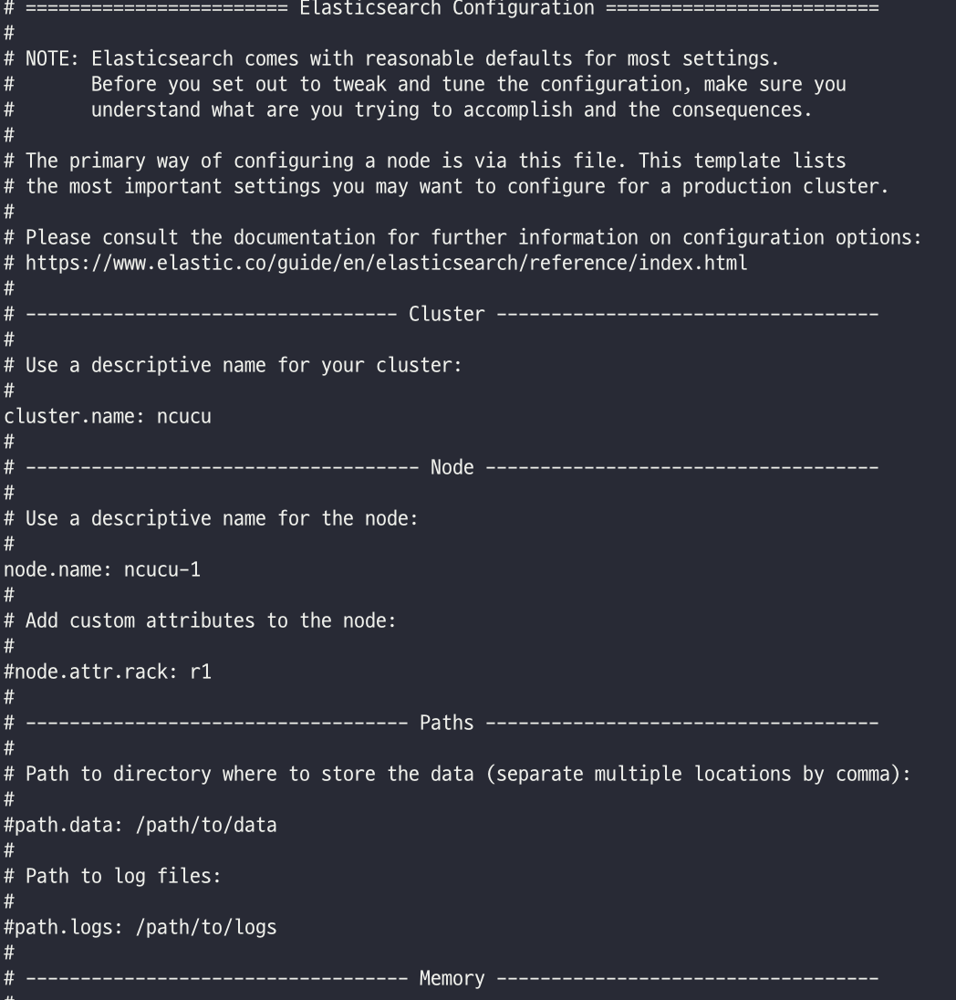

# 기초부터 다지는 ElasticSearch 운영노하우

## 5장 클러스터 구축하기
- elasticsearch.yml
- jvm options
- 클러스터 구축을 위한 노드 설정
- 고가용성을 위해 설계된 클러스터 사용 및 검증 방법
- log4j2.properties 

> 엘라스틱서치는 기본설정이 잘 되어있으며, 많은 설정을 필요로 하지 않는다.
> 실행 중인 클러스터에서 대부분의 설정은 [Cluster update settings](https://www.elastic.co/guide/en/elasticsearch/reference/current/cluster-update-settings.html) API를 통해 수행할 수 있다.

### Cluster update settings API
- ES 보안 기능이 활성화 된 경우, 이를 통해 [클러스터 권한](https://www.elastic.co/guide/en/elasticsearch/reference/current/security-privileges.html#privileges-list-cluster) 을 관리할 수 있다.
- persistent/transient 두 가지 방식을 지원
  - persistent 는 영구적, transient 는 임시 설정
  - transient 는 전체 클러스터가 재시작 될 경우 초기화
- 위 두가지 설정을 초기화 하고 싶다면, 속성 값에 null 을 지정하는 방식을 사용할 수 있음
- transient 값이 초기화되면 다음 순서대로 설정값이 지정된다.
  - persistent
  - configuration file
  - default value

`클러스터 설정의 우선순위`
1. transitent cluster setting
2. persistent cluster setting
3. elasticsearch.yml setting

> Best practice 는, 설정 API 를 사용해서 전체 클러스터 설정을 적용하고, elasticsearch.yml 은, 로컬 설정 파일로 사용하는 것

`Parameters`
- flat_settings
  - Optional
  - 결과를 flat format 으로 반환
  - 기본값 false
- include_defaults
  - Optional
  - 모든 클러스터 기본 설정을 반환
  - 기본값 false
- master_timeout
  - Optional
  - master node 의 connection timeout
  - 기본값 30s
- timeout
  - Optional
  - response timeout
  - 기본값 30s

`API 사용 예제`
- PUT /_cluster/settings

```shell
// persistent
PUT /_cluster/settings
{
  "persistent" : {
    "indices.recovery.max_bytes_per_sec" : "50mb"
  }
}

// transient
PUT /_cluster/settings?flat_settings=true
{
  "transient" : {
    "indices.recovery.max_bytes_per_sec" : "20mb"
  }
}

// response
{
  ...
  "persistent" : { },
  "transient" : {
    "indices.recovery.max_bytes_per_sec" : "20mb"
  }
}

// reset
PUT /_cluster/settings
{
  "transient" : {
    "indices.recovery.max_bytes_per_sec" : null
  }
}

// 와일드 카드를 사용한 설정도 가능
PUT /_cluster/settings
{
  "transient" : {
    "indices.recovery.*" : null
  }
}
```

### elasticsearch.yml
- ES 를 구성하기 위해 기본이 디는 환경설정 파일
- {ES_ROOT}/config 디렉토리 내부에 존재한다.

`elasticsearch.yml`



- elasticsearch.yml 파일을 열면, 다음과 같이 환경 설정을 영역별로 확인해 볼 수 있는데, 이는 ES 에서 제공하는 주석일뿐, 설정에 대한 순서는 중요하지 않다.

#### Cluster 영역
- 클러스터 영역은, 클러스터 전체에 적용되는 글로벌 설정이다.

```yaml
# ---------------------------------- Cluster -----------------------------------
#
# Use a descriptive name for your cluster:
#
cluster.name: ncucu
#
```
- cluster.name
  - 클러스터 명을 지정할 수 있다.
  - Elasticsearch 의 노드들은 클러스터명을 기반으로 그루핑 된다.
  - 클러스터명이 다르다면, 동일한 물리 장비나 바인딩 가능한 네트워크 상에 존재하더라도 서로 다른 클러스터로 그루핑 된다.
  - 기본 값은 **elasticsearch** 이며 충돌을 방지하기 위해 클러스터명은 반드시 고유한 이름으로 지정할 것을 권장한다.

#### Node 영역
- 해당 노드에만 적용되는 설정이다.

```yaml
# ------------------------------------ Node ------------------------------------
#
# Use a descriptive name for the node:
#
node.name: ncucu-1
#
# Add custom attributes to the node:
#
#node.attr.rack: r1
#
```
- node.name
  - elasticsearch 의 노드들을 구분할 수 있는 고유 이름
  - 클러스터 내에서 유일한 값을 사용해야 한다.
  - ES 에서는 ${HOSTNAME} 이라는 호스트 명을 인식가능한 변수값을 미리 정해두었기 때문에 다음과 같은 형태로 설정이 가능하다.
  - node.name: ${HOSTNAME}
  - 값을 지정하지 않으면 7.x 부터는 자동으로 호스트명을 사용한다.
  - 6.x 이하 버전은 UUID 의 앞 7글자를 사용한다.
  - 운영중 변경이 불가능하며, 변경시 노드를 재시작 해야 한다.
- node.attr.rack
  - 노드에 설정가능한 커스텀한 항목
  - 사용자 정의 rack 을 통해 HA 구성과 같이 샤드 분배가 가능한 기능
- node.roles
  - 노드의 role 을 지정한다.
  - master, data, ingest, remote-eligible, ml, transform ...
  - 여러개의 role 을 지정할 수 있음

#### Path 영역
- Path 영역은 데이터 와 로그의 저장 위치 등과 관련된 설정이다.

```yaml
# ----------------------------------- Paths ------------------------------------
#
# Path to directory where to store the data (separate multiple locations by comma):
#
#path.data: /path/to/data
#
# Path to log files:
#
#path.logs: /path/to/logs
#
```
- path.data
  - 색인된 데이터를 저장하는 경로
  - 다수의 경로 값 입력이 가능하다
  - 기본 값은 <ES_ROOT>/data
- path.logs
  - ES 로그를 저장하는 경로 설정
> 설정 값들 중 유일하게 주석이 없는 설정이다.
> 위 설정들이 지정되어 있지 않다면 애플리케이션 실행이 되지 않음.

#### Memory 영역
- ES 프로세스에 할당되는 메모리를 어떻게 관리할 것인지 설정한다.

```yaml
# ----------------------------------- Memory -----------------------------------
#
# Lock the memory on startup:
#
#bootstrap.memory_lock: true
#
# Make sure that the heap size is set to about half the memory available
# on the system and that the owner of the process is allowed to use this
# limit.
#
# Elasticsearch performs poorly when the system is swapping the memory.
#
```
- bootstrap.memory_lock
  - 시스템 스왑 메모리 영역을 사용하지 않도록 하는 설정
  - 활성화시 다른 JVM 프로그램이 간섭을 하지 못하기 때문에 성능이 보장된다.
  - 하지만 시스템 메모리 부족시 OOM 발생하여 노드 장애로 이어질 수 있음
  - 대부분의 경우 문제가 없지만, JVM 힙 메모리가 시스템 메모리의 절반 이상이 되면 OOM 발생 여지가 있다.
  - OS /etc/security/limits.conf 파일 수정도 필요하다.
  - ES 개발자는 항상 true 로 사용할것을 권장

`/etc/security/limits.conf`
```shell
sudo vi /etc/security/limits.conf
elasticsearch soft memlock unlimited
elasticsearch hard memlock unlimited
```
- memlock 항목을 unlimited 로 변경해 주어야한다.

`systemd 사용시 설정`
```shell
sudo mkdir /etc/systemd/system/elasticsearch.service.d
sudo vi /etc/systemd/system/elasticsearch.service.d
override.conf
[Service]
LimitMEMLOCK=infinity
sudo systemctl daemon-reload
```

> 이러한 추가 설정을 하지 않을 경우, ES 가 실행되지 않는다.

#### Network 영역
- ES 애플리케이션이 외부 통신시 사용하게 될 IP 설정 영역
- 외부 통신뿐 아니라 노드간의 통신에도 사용하기 떄문에 주의해서 설정

```yaml
# ---------------------------------- Network -----------------------------------
#
# Set the bind address to a specific IP (IPv4 or IPv6):
#
#network.host: 192.168.0.1
#
# Set a custom port for HTTP:
#
#http.port: 9200
#
# For more information, consult the network module documentation.
#
```
- network.host
  - 네떡 통신시 사용할 IP 주소
  - 기본값은 루프백 아이디 (127.0.0.1)
  - 주석 처리 혹은 루프백일 경우 개발모드로 실행된다.
  - 서버의 내/외부 주소를 모두 지정하는데 내부망 주소와 외부망 주소가 다르다면 다음 값을 활용해 구분이 가능하다.
  - network.bind_host: 내부
  - networkd.publish_host: 외부
  - 또한 미리 지정된 변수값이 존재한다.
    - \_local_ : 루프백 주소
    - \_site_ : 로컬 네트워크 주소로 설정, 실제 클러스터 구성시 주로 설정한다.
    - \_global| : 외부에서 바라보는 주소로 설정한다.
> 실제 클러스터 구성시 network.host: \_site_ 지정시 네트워크 주소가 변경되어도 설정은 변경하지 않아도 된다. 
> network.host 항목 설정 보단 bind_host 와 publish_host 를 각각 설정한다. -> 이유 정리 필요

- http.port
  - 클라이언트와 통신하기 위한 http 포트 설정
  - 기본값은 9200
  - 이미 사용중이라면 9200 ~ 9299 사이 값을 차례로 사용

#### Discovery 영역
- 노드 간의 클러스터링을 위해 필요한 설정

```yaml
# --------------------------------- Discovery ----------------------------------
#
# Pass an initial list of hosts to perform discovery when this node is started:
# The default list of hosts is ["127.0.0.1", "[::1]"]
#
#discovery.seed_hosts: ["host1", "host2"]
#
# Bootstrap the cluster using an initial set of master-eligible nodes:
#
#cluster.initial_master_nodes: ["node-1", "node-2"]
#
# For more information, consult the discovery and cluster formation module documentation.
```
- discovery.seed_hosts
  - 7.x 부터 추가된 기능이다.
  - 6.x 이전 버전에서는 젠 디스커버리를 사용했음.
  - file 로 설정할 수도 있다.
- discovery.zen.ping.unicast.hosts
  - 클러스터링을 위한 다른 노드의 IP 혹은 도메인 주소
  - 주소만 작성하는 경우 기본값은 9300 ~ 9305 포트 사이를 검색하며, 범위를 벗어나는 경우 포트까지 나열해 주어야 한다.
  - 원격에 있는 노드들을 찾아 바인딩 하는 과정을 **디스커버리** 라고 한다.
- cluster.initial_master_nodes
  - 7.x 부터 추가된 기능
  - 6.x 이전 버전에서는 젠 디스커버리 사용
  - 7.x 부터는 마스터 후보 노드의 크기가 능동적으로 변경된다.
- discovery.zen.minimum_master_nodes
  - 클러스터 구축을 위해 필요한 최소한의 마스터 노드 개수 지정

##### 디스커버리
- ES 애플리케이션 실행시 동일한 서버 혹은 discovery 설정에 지정된 노드들을 찾아 클러스터로 바인딩 하는 과정
- 디스커버리 설정이 다음과 같이 되어 있다고 가정하고, 디스커버리 과정을 살펴보자.
```yaml
discovery.seed_hosts: ["10.10.10.10"]
cluster.initial_master_nodes: ["ncucu-1"]
```
1. 애플리케이션 실행후 IP가 10.10.10.10 인 서버에 ES 애플리케이션 구동 확인
  - 1-1. 구동중인 경우 -> cluster.name 확인
    - 일치하는 경우 -> 동일 클러스터로 바인딩
    - 불일치하는 경우 -> 다음 노드 확인후 반복
  - 1-2. 구동중이지 않은 경우 -> 다음 노드를 확인
2. discovery.zen.minimum_master_nodes 에 존재하는 모든 네트워크를 탐색하였으나 노드를 찾지 못한 경우
  - 새로운 클러스터 시작

> cluster.initial_master_nodes (discovery.zen.minimum_master_nodes) / spin brain 현상 정리
> 7.x 이후로는 split brain 현상은 발생하지 않는다.

- https://discuss.elastic.co/t/avoid-split-brain-with-new-elasticsearch-7-0-after-discovery-zen-minimum-master-nodes-removal/176877

#### Gateway 영역
- 클러스터 복구와 관련된 설정

```yaml
# ---------------------------------- Gateway -----------------------------------
#
# Block initial recovery after a full cluster restart until N nodes are started:
#
#gateway.recover_after_nodes: 3
#
# For more information, consult the gateway module documentation.
#
```
- gateway.expected_nodes
  - 로컬 샤드를 복구하기 위해 클러스터에 존재해야하는 노드의 수
  - 기본값은 0
  - 7.7버전 이후로 depreacted
  - gateway.expected_data_nodes 를 사용할것.
- gateway.recover_after_time
  - 복구를 진행하기전 지정한 시간만큼 대기한다.
  - expected_nodes 가 지정되어 있어야 한다.
  - 기본값은 5m
  - 지정된 시간이 지나면, 다음 설정의 조건이 만족할때 복구가 시작된다.
- gateway.recover_after_nodes
  - 클러스터 내의 모든 노드를 재시작할 때 최소 몇개의 노드가 정상적인 상태라면 복구를 시작할 것인지 지정한다.
  - 7.7버전 이후로 deprecated
  - gateway.recover_after_data_nodes 를 사용할것.

> ES의 버전 업그레이드나, 전체 노드 장애로 인한 클래스터의 모든 노드를 재시작할 경우 **Full Cluster Restart** 라고 한다.
> 이런 경우 순차적으로 다시 클러스터링을 진행하는데, 클러스터링 진행시 인덱스 데이터들을 복구하기 시작한다.
> 이때 지정한 수의 노드가 클러스터에 참여하면 그 때부터 인덱스 데이터에 대한 복구를 시작한다.
> 안정적인 클러스터 복구를 위해 적절한 수치 설정이 필요하다.

#### 노드 역할 정의

`Node Roles`
| 역할 | 항목 | 기본 값 |
| --- | --- | --- |
| 마스터 | node.master | true |
| 데이터 | node.data | true |
| 인제스트 | node.ingest | true |
| 코디네이팅 | 없음 | true |

> 모든 역할의 기본 값은 true 이며, 아무런 설정을 하지 않는다면 노드는 모든 역할을 수행 한다.

`마스터 노드 설정`
```yaml
node.master: true
node.data: false
node.ingest: false
```
> 마스터 노드로 설정한다고 해서 마스터 노드가 되는것이 아닌 **마스터 노드의 후보군** 이 된다.
> 마스터 노드 장애 발생시 후보군 중 하나가 새로운 마스터 노드가 된다.

`데이터 노드 설정`
```yaml
node.master: false
node.data: true
node.ingest: false
```

`인제스트 노드 설정`
```yaml
node.master: false
node.data: false
node.ingest: true
```

`코디네이팅 노드 설정`
```yaml
node.master: false
node.data: false
node.ingest: false
```
> 코디네이팅 노드를 클라이언트 노드라고도 한다.
> 코디네이팅 노드를 별도로 분리하는 이유는, 데이터 노드와 코디네이팅 노드의 역할을 동시에 수행하는 경우 해당 노드의 사용량이 높아질수 있음을 방지 (OOM 발생)

## 참고
- https://www.elastic.co/guide/en/elasticsearch/reference/current/settings.html
- https://esbook.kimjmin.net/02-install/2.3-elasticsearch/2.3.2-elasticsearch.yml