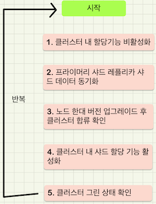
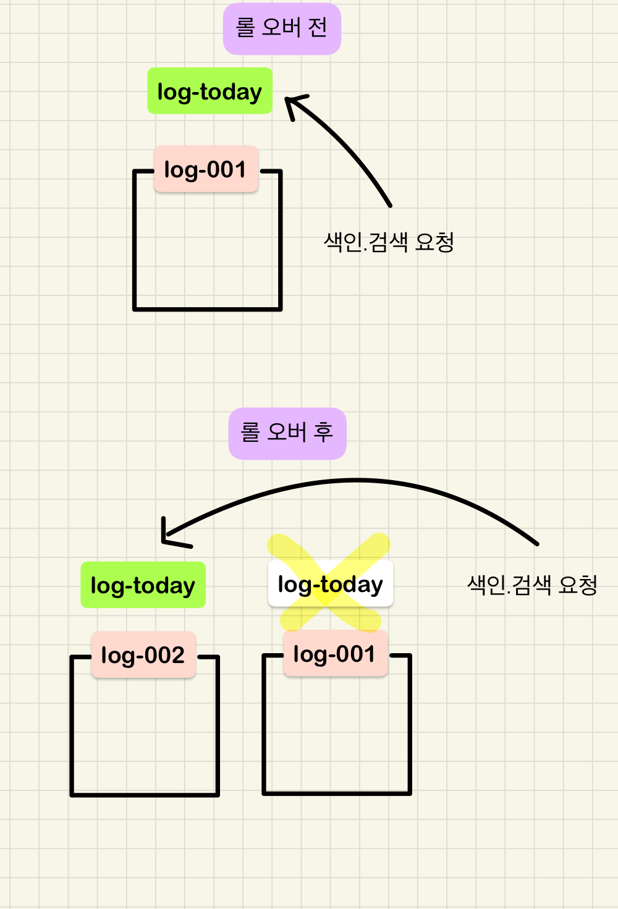
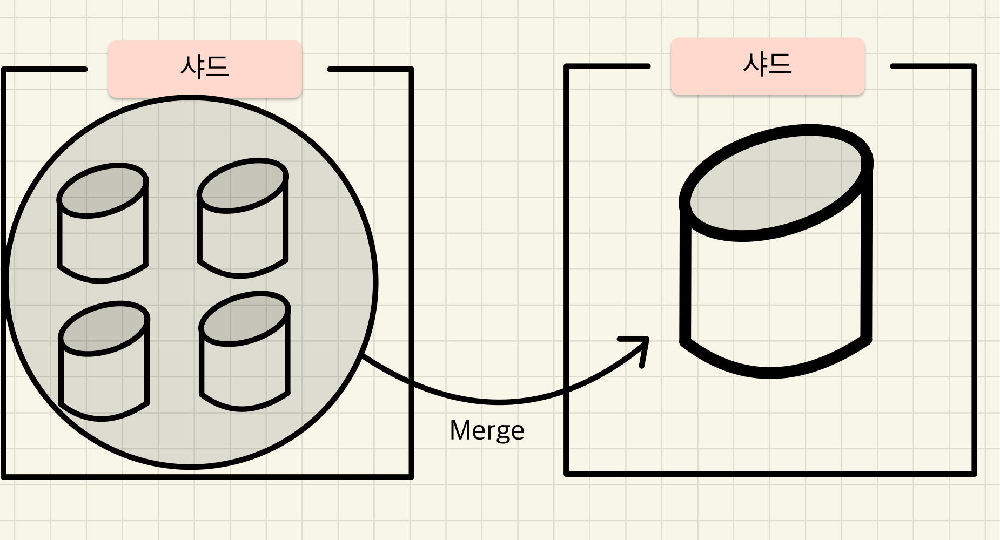

# 기초부터 다지는 ElasticSearch 운영노하우

## 6장 클러스터 운영하기
- ES 클러스터 구축후 안정적으로 운영하기 위한 내용들
- ES 버전 업
- 인덱스의 샤드 배치 방식 변경
- 운영 중 온라인으로 클러스터 / 인덱스 설정 변경
- 인덱스 API 활용
- 템플릿 활용

### ES 버전 업
- ES 의 버전 업그레이드 방법은 두가지
  
`ES 버전업 방식`

| 옵션 | 설명 |
| --- | --- |
| Full Cluster Restart | 전체 노드를 동시에 재시작하는 방식, 다운 타임이 발생하지만 빠른 수행시간이 특징 |
| Rolling Restart | 노드를 순차적으로 한대씩 재시작하는 방식, 다운 타임은 없지만 노드 개수에 따라 소요 시간이 길어질 수 있음 |

`Rolling Restart scenario`

| 대상 버전 | 최신 버전 (7.8.0 기준) 업그레이드 방법 |
| --- | --- |
| 5.0 ~ 5.5 | 1. v5.6 Rolling Restart Upgrade<br/>  2. v6.8 Rolling Restart Upgrade<br/> 3. v7.8.0 Rolling Restart Upgrade |
| 5.6 | 1. v6.8 Rolling Restart Upgrade<br/> 2. v7.8.0 Rolling Restart Upgrade<br/> |
| 6.0 ~ 6.7 | 1. v6.8 Rolling Restart Upgrade<br/> 2. v7.8.0 Rolling Restart Upgrade<br/> |
| 6.8 | 1. v7.8.0 Rolling Restart Upgrade  |
| 7.0 ~ 7.7 | 1. v7.8.0 Rolling Restart Upgrade |

`Full Cluster Restart Flow`



- 위 Flow 로 진행하는 이유..
  - ES 는 고 가용성을 위해 레플리캬 샤드를 생성할 수 있다.
  - 하지만 버전 업그레이드는 장애 상황이 아닌 의도적인 상황이기 때문에 샤드를 재분배 해서는 안됨

`1. 클러스터 내 샤드 할당 기능 비활성화 하기`
```shell
curl -XPUT -H 'ContentType: application/json' http://localhost:9200/_cluster/settings?pretty -d '
{
    "persistent": {
        "cluster.routing.allocation.enable": "none"
    }
}
'
```
- cluster.routing.allocation.enable
  - 클러스터 내 샤드 할당과 관련된 설정
  - "none" 으로 지정하여 샤드를 재분배 하지 않도록 한다.

| 옵션 | 설명 |
| --- | --- |
| all | 프라이머리 샤드와 레플리카 샤드 전부 배치 허용 |
| primaries | 프라이머리 샤드만 배치 허용 |
| new_primaries | 새롭게 생성되는 인덱스에 한해 프라이머리 샤드만 배치 허용 |
| none | 모든 샤드의 배치 작업을 비활성화 |
| null | 해당 설정 삭제, 기본값인 all 로 지정 |

- cluster.routing.allocation.node_concurrent_recoveries
  - 클러스터 내 unassinged 샤드 발생시 노드당 **'몇개의 샤드 를 동시에 복구할 것인지'** 설정
  - 기본값은 2
  - 동시에 많은 샤드를 복구하면 오버헤드가 발생하기 때문에 클러스터 성능을 고려한 수치조절 필요

`2. 프라이머리 샤드와 레플리카 샤드의 데이터 동기화`
```shell
curl -XPOST -H 'Content-Type: application/json' http://localhost:9200/_flush/synced?pretty -d
```
- 데이터 정합성을 위해 프라이머리 샤드와 레플리카 샤드의 데이터 싱크를 맞춰야 한다.

`3. 노드 한 대를 버전 업그레이드 이후 기존 클러스터 합류 확인`
```shell
sudo systemctl stop elasticsearch.service
sudo rm -Uvh ./elasticsearch-6.6.1.rpm
sudo systemctl start elasticsearch.service
```
- 작업이 완료되면 클러스터에 노드가 다시 합류한다.
> 클러스터 내 샤드 할당 기능을 **비활성화** 해두었기 때문에, 버전 업그레이드 후 클러스터에 합류하더라도 노드는 unassinged 상태의 샤드를 분배받지 못한다.
> 하지만 실제로는 해당 노드들을 가지고 있는 상태... (HEAD 툴에서 감지를 못하고 있는것 뿐.. 실제 물리적인 데이터는 이놈이 가지고 있다.)

`4. 클러스터 내 샤드 할당 기능 활성화`
```shell
curl -XPUT -H 'ContentType: application/json' http://localhost:9200/_cluster/settings?pretty -d '
{
    "persistent": {
        "cluster.routing.allocation.enable": null
    }
}
'
```
- 옵션을 null 로 지정하면, 해당 옵션이 초기화 되며, "persistent" 옵션을 지정했었기 때문에 기본 값으로 초기화 된다.
  - 기본 값은 "all"
> 이 작업 이후 unassigned 상태의 샤드를 할당 받고 HEAD 툴에서 정상적으로 샤드 배치가 된 모습을 확인할 수 있다.

### 샤드 배치 방식 변경
- 대부분의 경우 자동으로 샤드를 재 배치를 수행한다.
- 하지만 특정한 상황에서는 샤드 배치 방식을 변경해 주어야한다.
  - 특정 노드 노드에 장애가 발생 해서 unassinged 샤드에 대한 재 배치 작업이 5회 이상 실패
  - 오래된 인덱스의 샤드를 특정 노드에 강제로 재배치

| 옵션 | 설명 |
| --- | --- |
| reroute | 샤드 하나하나를 특정 노드에 배치시 |
| allocation | 클러스터 전체에 해당하는 샤드 **배치** 방식 변경시 |
| rebalance | 클러스터 전체에 해당하는 샤드 **재분배** 방식 변경시 |
| filtering | 특정 조건에 해당하는 샤드를 특정 노드에 배치시 |

`샤드배치가 실패하는 경우`
- 노드 디스크 사용량이 높아지는 경우
- 샤드 배치를 시도해도 해당 샤드를 배치할수 있는 노드가 없기 때문에 실패한다.
- 불필요한 인덱스 삭제 또는 데이터 노드 증설이 필요함

`샤드 재배치 임계치 설정`
- 샤드의 재배치는 아무때나 일어나는 것이 아니다.
- 클러스터 내의 노드중 한대 이상의 디스크 사용량이 임계치를 초과 했을경우 동작한다.
- 기본 값은 true 로 활성화 되어 있다.

| 옵션 | 설명 | 기본 값 |
| --- | --- | --- |
| cluster.routing.allocation.disk.watermark.low | 특정 노드에서 임계치가 넘어가면 더이상 할당하지 않는다.<br/> 새롭게 생성된 인덱스에 대해서는 적용되지 않음 | 85% |
| cluster routing.allocation.disk.watermark.high | 임계치를 넘어선 노드를 대상으로 즉시 샤드 재할당을 진행한다.<br/> 새롭게 생성된 인덱스에 대해서도 적용됨 | 90% |
| cluster.routing.allocation.disk.watermark.flood_stage | 전체 노드가 임계치를 넘어서면 인덱스를 read-only 모드로 변경한다. | 95% |
| cluster.info.update.interval | 임계치 설정을 체크할 주기를 설정한다. | 30s |

> cluster.routing.allocation.disk.watermark.flood_stage 에 지정한 값 보다 높아지면 해당 노드가 가진 샤드들이 속한 모든 인덱스에 대해 읽기 전용 모드로 전환되기 때문에 문서를 색인할 수 없게 된다. 위 설정들은 매우 중요하며, 모니터링해야할 주요 지표중 하나
> 읽기 전용 모드가 되면 API 를 통해 인덱스 단위로 읽기 전용 모드를 해제할 수 있다.
> 7.4 버전 부터는 설정한 임계치 보다 디스크 사용량이 적어지면 자동으로 읽기 전용모드가 해제됨

### 클러스터와 인덱스

#### 클러스터 API
- 클러스터 API 를 이용해 설정을 진행하는 부분은 앞장에서 살펴보았기 때문에 생략..
- 설정 이외에 다양한 정보를 확인할 수 있는데 이를 살펴보자.

`explain`
- 마스터 노드의 로그에서 원인을 좀 더 자세히 살펴볼 수 있지만, explain 기능을 통해 빠른 파악이 가능하다.

```shell
curl -XGET http://localhost:9200/_cluster/allocation/explain?pretty
```

```json
{
  "index" : "users",
  "shard" : 0,
  "primary" : false,
  "current_state" : "unassigned",
  "unassigned_info" : {
    "reason" : "CLUSTER_RECOVERED",
    "at" : "2021-02-21T00:02:41.840Z",
    "last_allocation_status" : "no_attempt"
  },
  "can_allocate" : "no",
  "allocate_explanation" : "cannot allocate because allocation is not permitted to any of the nodes",
  "node_allocation_decisions" : [
    {
      "node_id" : "8h8cJZBXRhe3GbKvvu8BNw",
      "node_name" : "ncucu-1",
      "transport_address" : "127.0.0.1:9300",
      "node_attributes" : {
        "ml.machine_memory" : "1927020544",
        "xpack.installed" : "true",
        "transform.node" : "true",
        "ml.max_open_jobs" : "20"
      },
      "node_decision" : "no",
      "deciders" : [
        {
          "decider" : "same_shard",
          "decision" : "NO",
          "explanation" : "the shard cannot be allocated to the same node on which a copy of the shard already exists [[users][0], node[8h8cJZBXRhe3GbKvvu8BNw], [P], s[STARTED], a[id=IOPcbOlHT3ql7UjhtxL1EQ]]"
        }
      ]
    }
  ]
}
```
- unassigned_info.reason
  - unassigned 샤드가 발생한 원인정보 제공
- unassigned_info.details
  - 1에서 보다 자세한 정보를 알 수 있음
- allocate_explanation
  - 현재 클러스터의 샤드 배치 정보
  - 배치되지 않은 샤드가 존재할때만 메시지가 노출된다.

#### 인덱스 설정 API
- 인덱스를 대상으로 동적으로 설정을 확인/변경 하는 API

`인덱스의 레플리카 샤드 개수 변경`
- users 인덱스의 레플리카 샤드의 수를 0으로 지정하는 예제
```shell
curl -XPUT -H 'Content-Type: application/json' http://localhost:9200/users/_settings?pretty -d '
{
  "index.number_of_replicas": 0
}
'
```

`색인된 결과를 디스크에 반영하는 주기 설정`
- 앞선 장에서 색인을 한다고해서 바로 검색가능한 상태가 되진 않는다 라고 설명을 했다.
- 메모리 버퍼에 존재하는 데이터를 세그먼트 (디스크) 에 반영하는 'Refresh' 라는 작업이 필요한다.
- refresh_interval 설정은 이 Refresh 작업의 주기를 설정한다.

```shell
curl -XPUT -H 'Content-Type: application/json' http://localhost:9200/users/_settings?pretty -d '
{
  "index.refresh_interval": "30s"
}
'
```

- 지금 까지는 특정 인덱스에 대한 설정을 진행했는데, 동시에 여러 인덱스에 설정을 하는방법이 있다.
- _all 지시자와 와일드카드 사용 2가지가 있다.
  - _all 지시자는 모든 인덱스에 대해 적용한다.
  - 와일드 카드 지시자는 정규식을 이용해 특정 인덱스에 적용할 수 있다.
  - ex) user*, *-2019.07.01

#### 인덱스 API

| 옵션 | 설명 |
| --- | --- |
| open/close | 인덱스를 open/close |
| aliases | 인덱스에 별칭을 부여 |
| rollover | 인덱스를 새로운 인덱스로 분기 |
| refresh | 문서를 세그먼트로 내리는 주기를 설정 |
| forcemerge | 샤드 내 세그먼트를 병합 |
| reindex | 인덱스를 복제 |

`open/close api`
- 인덱스를 의 상태를 사용 가능/사용 불가능 상태로 만드는 API
- 인덱스를 새로 생성하면 색인 및 검색이 가능한 상태로 생성되는데 이를 **open 상태** 라고 한다.
- 이를 구성하는 샤드들은 클러스터를 구성하는 전체 샤드에 포함된다.
- 인덱스를 close 하면 색인/검색이 불가능한 상태가 되는데 이를 **close 상태** 라고 한다.
- close 상태가 되면 해당 인덱스에는 접근이 불가능하지면 open API 를 통해 open 상태로 언제든지 변경할 수 있다.

```shell
// close api
curl -XPOST -H 'Content-Type: application/json' http://localhost:9200/users/_close?pretty

// open api
curl -XPOST -H 'Content-Type: application/json' http://localhost:9200/users/_open?pretty
```

`aliases API`
- 인덱스에 별칭을 부여하는 API
- 지정된 별칭을 통해 인덱스에 접근할 수 있다.

`별칭 적용`
```shell
curl -XPOST -H 'Content-Type: application/json' http://localhost:9200/_aliases?pretty -d '
{
  "actions": [
    { 
      "add": {
        "index": "users", 
        "alias": "my_users"
      }
    }
  ]
}
'
```

`별칭 적용 확인`
```shell
// 요청
curl http://localhost:9200/my_users?pretty

// 응답
{
  "users" : {
    "aliases" : {
      "my_users" : { }
    },
    "mappings" : {
      "properties" : {
        "age" : {
          "type" : "long"
        },
        "korname" : {
          "type" : "text",
          "fields" : {
            "keyword" : {
              "type" : "keyword",
              "ignore_above" : 256
            }
          }
        },
        "username" : {
          "type" : "text",
          "fields" : {
            "keyword" : {
              "type" : "keyword",
              "ignore_above" : 256
            }
          }
        }
      }
    },
    "settings" : {
      "index" : {
        "refresh_interval" : "30s",
        "number_of_shards" : "1",
        "provided_name" : "users",
        "creation_date" : "1613691741281",
        "number_of_replicas" : "0",
        "uuid" : "EDpgqstLQ0usvk8OAFAPIg",
        "version" : {
          "created" : "7070199"
        }
      }
    }
  }
}
```
> 다수의 인덱스에 걸쳐서 알리아스를 지정할 수 있는데, 다수의 인덱스에 설정된 별칭은 '색인' 에 사용이 불가능하며 '검색' 만 가능하다.

`rollover API`



- 인덱스에 특정 조건을 설정하고, 해당 조건을 만족하면 인덱스를 새로 생성한뒤 그 인덱스로 요청을 받는 API
- aliases API 를 통해 별칭 설정이 반드시 필요하다.
- 쉽게 생각하면 인덱스에 대해 rolling 처리를 해준다고 이해하면 된다.

`rollover api 설정`
```shell
// 최초 별칭 생성
curl -XPUT -H 'Content-Type: application/json' http://localhost:9200/log-001?pretty -d '
{
  "aliases": { "log-today": {} }
}
'

// rollover 조건 지정
curl -XPUT -H 'Content-Type: application/json' http://localhost:9200/log-today/_rollover?pretty -d '
{
  "conditions": {
    "max_age": "7d",
    "max_docs": 2,
    "max_size": "5gb"
  }
}
'
```

| 옵션 | 설명 |
| --- | --- |
| max_age | 인덱스가 생성된 순간부터의 시간 |
| max_docs | 인덱스에 저장된 문서 건수 |
| max_size | 인덱스 프라이머리 샤드 크기 |

`dry-run 모드`

- 롤 오버가 진행되면 새롭게 인덱스가 생성되므로 의도치 않게 롤오버가 되는 경우 롤백이 어려울 수 있다.
- 이런 문제를 해결하기 위해 dry_run 모드를 지원한다.
- dry_run 모드는 실제 적용이 되지 않고, 적용시 어떤게 변화되는지 확인하는 모드

```shell
curl -XPOST -H 'Content-Type: applicaion/json' http://localhost:9200/log-001/_rollover/new_index?dry_run&pretty -d '
  ... 생략
'
```

> 인덱스의 용량이 너무 커져서 새로운 인덱스를 새롭게 생성해야 하는등에 활용할 수 있다.
> 클라이언트 입장에서는 설정된 별칭을 바라보기 때문에 영향이 없음
> VIP 와 같다고 이해하면 쉬울듯..

`refresh API`

- refresh api 는 refresh_interval 설정과 상관없이 메모리 버퍼캐시에 존재하는 문서를 바로 세그먼트에 저장하는 API
- 일종의 flush 기능을 제공하는 api 라고 이해하면 쉽다.

```shell
curl -XPOST -H 'Content-Type: application/json' http://localhost:9200/users/_refresh?pretty
```

`forcemerge API`



- 인덱스의 샤드를 구성하는 세그먼트들을 강제로 병합하는 API

```shell
curl -XPOST -H 'Content-Type: application/json' http://localhost:9200/users/_forcemerge?max_num_segments=10&pretty
```

- max_num_segments 파라메터로 샤그 내 세그먼트들을 몇 개의 세그먼트로 합칠 것인지 지정한다.
- 이는 성능과 직결되는 부분이므로 유의해야한다.
- 너무 많은 대상의 세그먼트를 지정하면 오버헤드가 발생함
- 문서의 색인작업이 진행중인 인덱스라면 세그먼트에 대한 작업이 게속 일어나기 때문에 forcemerge api 는 호출하지 않는것이 좋다.
- 과거에 색인된 로그 데이터와 같은 인덱스에 적용하는 것이 좋다.
  - 디스크 용량도 절약되며 검색 성능이 향상됨

`reindex API`

- 인덱스를 복제하는 기능
- 인덱스의 analyzer 변경 혹은 클러스터 마이그레이션시 주로 사용된다.
- 기존에 색인된 인덱스는 검색 결과나 성능 향상을 위해 analyzer 를 변경한다고 해도 이미 색인이 완료된 상태이기 때문에 효과가 없다.
- 이를 위해 reindex API 로 인덱스를 복제해서 새롭게 변경된 analyzer 로 색인 된다.

```shell
curl -XPOST -H 'Content-Type: application/json' http://localhost:9200/_reindex?pretty -d '
{
  "source": {
    "index": "users"
  },
  "dest": {
    "index": "new_users"
  }
}
'
```

`클러스터간 마이그레이션시`

- elasticsearch.yml 설정 파일의 whitelist 설정을 이용해야 한다.
- 원본 클러스터에 접근 가능한 도메인 혹은 IP 를 기준으로 와일드카드 패턴 매칭 지원
- 목적지 클러스터의 노드들에 존재하는 whitelist 설정을 통해 원본 클러스터로 부터 인덱스 복제가 가능하다.

```yaml
reindex.remote.whitelist: "data1-es-com:9200, 127.0.10.*:9200, localhost:*"
```

```shell
curl -XPOST -H 'Content-Type: application/json' http://localhost:9200/_reindex?pretty -d '
{
  "source": {
    "remote": {
      "host": "http://data-1.es.com:9200"
    },
    "index": "test"
  },
  "dest": {
    "index": "dest_test"
  }
}
'
```

### 템플릿 활용

- 인덱스 생성시 마다 인덱스 API 를 통해 동적으로 설정을 변경해야 한다면 이는 매우 번거로운 일이다.
- 이를 위해 ES 에서는 템플릿 API 를 제공한다.
- 특정 패턴의 이름을 가진 인덱스에 설정이 자동 반영되도록 하는 인터페이스를 제공

`템플릿으로 정의 가능한 항목`

| 항목 | 설명 |
| --- | --- |
| settings | 인덱스 설정값 |
| mappings | 인덱스 매핑정보 |
| aliases | 인덱스 alias 정보 |

`인덱스 템플릿 생성`

```shell
curl -XPUT -H 'Content-Type: application/json' http://localhost:9200/_template/mytemplate1?pretty -d '
  {
    "index_patterns": ["test*"],
    "order": 1,
    "settings": {
      "number_of_shards": 3,
      "number_of_replicas": 1
    },
    "mappings": {
      "properties": {
        "test": {
          "type": "text"
        }
      }
    },
    "aliases": {
      "alias1": {}
    }
  }
'
```
- order
  - 동일한 매칭이 되는 템플릿이 존재한다면, order 에 따라 적용 우선순위를 설정한다.
- 7.x 부터 매핑정보에 type 명시가 무의미해짐 제거..
- 7.8 버전 부터 _index_template 으로 변경됨.. 문서 참조

`템플릿 설정 정보 확인`

```shell
curl http://localhost:9200/_template/mytemplate1?pretty

{
  "mytemplate1" : {
    "order" : 1,
    "index_patterns" : [
      "test*"
    ],
    "settings" : {
      "index" : {
        "number_of_shards" : "3",
        "number_of_replicas" : "1"
      }
    },
    "mappings" : {
      "properties" : {
        "test" : {
          "type" : "text"
        }
      }
    },
    "aliases" : {
      "alias1" : { }
    }
  }
}
```

`전체 템플릿 목록 확인`

```shell
curl http://localhost:9200/_cat/templates?pretty

.monitoring-logstash            [.monitoring-logstash-7-*]   0          7000199
.monitoring-kibana              [.monitoring-kibana-7-*]     0          7000199
.watches                        [.watches*]                  2147483647 11
.slm-history                    [.slm-history-2*]            2147483647 2
.ml-config                      [.ml-config]                 0          7070199
.triggered_watches              [.triggered_watches*]        2147483647 11
.monitoring-beats               [.monitoring-beats-7-*]      0          7000199
.ml-anomalies-                  [.ml-anomalies-*]            0          7070199
.ml-stats                       [.ml-stats-*]                0          7070199
.ml-inference-000001            [.ml-inference-000001]       0          7070199
.monitoring-es                  [.monitoring-es-7-*]         0          7000199
.ml-notifications-000001        [.ml-notifications-000001]   0          7070199
.watch-history-11               [.watcher-history-11*]       2147483647 11
mytemplate1                     [test*]                      1
.transform-notifications-000002 [.transform-notifications-*] 0          7070199
.logstash-management            [.logstash]                  0
.ml-meta                        [.ml-meta]                   0          7070199
ilm-history                     [ilm-history-2*]             2147483647 2
.monitoring-alerts-7            [.monitoring-alerts-7]       0          7000199
.transform-internal-005         [.transform-internal-005]    0          7070199
.ml-state                       [.ml-state*]                 0          7070199
```


`인덱스 생성 후 확인`

```shell
// 인덱스 생성
curl -XPUT -H 'Content-Type: application/json' http://localhost:9200/test-1?pretty

// 인덱스 정보 확인
curl http://localhost:9200/test-1?pretty

{
  "test-1" : {
    "aliases" : {
      "alias1" : { }
    },
    "mappings" : {
      "properties" : {
        "test" : {
          "type" : "text"
        }
      }
    },
    "settings" : {
      "index" : {
        "creation_date" : "1614341135710",
        "number_of_shards" : "3",
        "number_of_replicas" : "1",
        "uuid" : "Eke_IDPaS8yWfrrOjK0X0Q",
        "version" : {
          "created" : "7070199"
        },
        "provided_name" : "test-1"
      }
    }
  }
}
```

## 정리

- ES 클러스터 운영 중 버전업이 필요하다면 RollingRestart 방식을 사용할 수 있다.
- 클러스터 API를 통해 샤드 배치 방식등 수정이 가능하다.
- 인덱스 API 를 통해 인덱스의 다양한 설정값 변경이 가능하다.
- 템플릿 API 를 통해 인덱스가 생성될 때 기본으로 적용되는 설정값을 변경할 수 있다. 