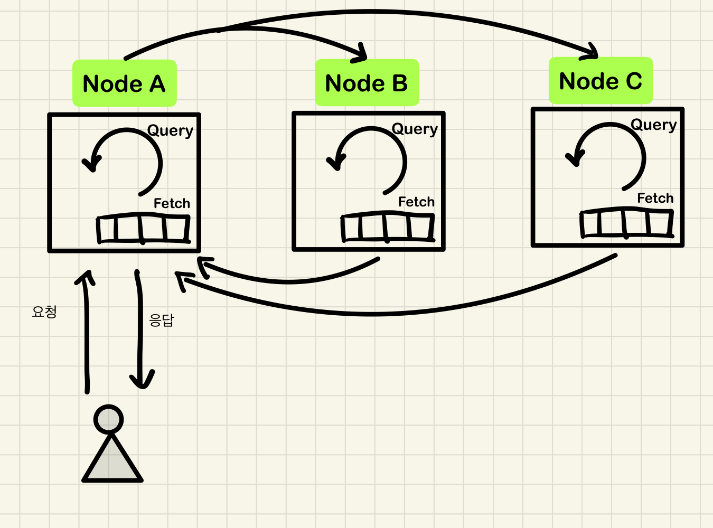

# 기초부터 다지는 ElasticSearch 운영노하우

## 7장 클러스터 성능 모니터링과 최적화
- 클러스터 상태 확인 방법
- 클러스터를 구성하는 노드 상태 및 정보 확인 방법
- 인덱스와 샤드의 상태 및 정보 확인 방법
- 성능 지표 확인 방법
- 성능과 관련된 문제 해결 방법

### 클러스터 상태 확인
- ES 는 cat API 를 통해 클러스터, 노드, 샤드의 상태 등 다양한 정보를 확인할 수 있도록 인터페이스를 제공한다.
- _cat/health 는 클러스터의 상태를 확인할 수 있다.

`상태 확인 요청`
```shell
curl http://localhost:9200/_cat/health?v
```
- 상태 확인요청시 v 옵션 파라미터를 제공하는데, v 옵션 파라미터를 추가할 경우 해당 값들이 어떤 것을 의미하는지 헤더값이 함께 제공된다.

`요청 결과`
```shell
// v 옵션을 제거한 상태
1614675511 08:58:31 ncucu yellow 1 1 26 26 0 0 25 0 - 51.0%

// v 옵션을 추가한 상태
epoch      timestamp cluster status node.total node.data shards pri relo init unassign pending_tasks max_task_wait_time active_shards_percent
1614675567 08:59:27  ncucu   yellow          1         1     26  26    0    0       25             0                  -                 51.0%
```
- 위 옵션 외에도 format, pretty 옵션을 제공한다.
- 각 필드가 나타내는 의미는 다음과 같다.

| 필드 명 | 설명 |
| --- | --- |
| epoch | API 호출 시간을 UNIX 로 표현 |
| timestamp | API 호출 시간을 타임스탬프로 표현 |
| cluster | 클러스터의 이름 |
| status | 클러스터의 상태, green/yellow/red |
| node.total | 클러스터를 구성하는 전체 노드의 수 |
| node.data | 클러스터를 구성하는 데이터 노드의 수 |
| shards | 클러스터에 존재하는 전체 샤드의 수 *샤드수가 너무 많으면 성능에 영향을 미친다. 때문에 모니터링 대상중 하나* |
| pri | 클러스터에 존재하는 프라이머리 샤드의 수 *모니터링 대상* |
| relo | 클러스터에 재배치중인 샤드의 수 *너무 많다면 색인/검색 성능이 떨어질 수 있음* |
| init | 클러스터에 초기화 되고 있는 샤드의 수 |
| unassign | 클러스터에 어떤 노드에도 배치되지 않은 샤드의 수 *0이 아니라면 클러스터 안정성에 문제가 발생할 수 있으므로 원인 파악 필요* |
| pending_tasks | 클러스터 유지.보수 작업 중 실행되지 못하고 대기중인 작업의 수 *0이 아니라면 클러스터 부하 혹은 특정 노드가 서비스 불능일 가능성이 있음* |
| max_task_wait_time | 위 작업이 실행되는데 소요된 최대 시간 *클러스터 부하 상황을 나타내는 지표로 활용* |
| active_shards_percent | 전체 샤드 중 정상 동작하는 샤드의 비율 |

`클러스터의 상태`

| 값 | 설명 |
| --- | --- |
| green | 모든 샤드가 정상 동작중 |
| yellow | 모든 프라이머리 샤드는 정상 동작중이지만 일부 레플리카 샤드가 비정상 동작중 |
| red | 일부 프라이머리 샤드 / 레플리카 샤드가 정상동작중이지 않음 |

### 노드의 상태 확인
- 노드의 상태를 확인하는 API 는 _cat/nodes

`상태 확인 요청`
```shell
curl http://localhost:9200/_cat/nodes?v
```

`요청 결과`
```shell
ip        heap.percent ram.percent cpu load_1m load_5m load_15m node.role master name
127.0.0.1           51          95   0    0.05    0.03     0.05 dilmrt    *      ncucu-1
```

| 필드 명 | 설명 |
| --- | --- |
| ip | 노드의 ip 주소 |
| heap.percent | 힙 메모리 사용률 *85% 이상을 계속 유지한다면 OOM 발생 할 수 있음* |
| ram.percent | 메모리 사용률 *노드가 사용 가능한 전체 메모리중 사용률, 대부분 90% 이상을 사용하는데 페이지 캐시로 사용되기 때문* |
| cpu | 노드의 cpu 사용률 |
| load_%m | 1분, 5분, 15 분의 평균 Load Average *값이 크다면 부하가 많이 발생 중이다. CPU 코어 개수에 따라 다르기 떄문에 CPU Usage 와 함께 살펴볼것* |
| node.role | 노드의 역할<br/> *d = data, m = master, i = ingest <br/> ex) di = data/ingest* |
| master | 마스터 노드를 표시 별표 (*) 로 표시됨 |
| name | 노드의 이름 |

> help 파라미터를 활용하면 위 예제 외에도 다양한 정보들을 확인할 수 있다.
> help 파라미터는, 모든 cat API 에서 사용 가능함.

### 인덱스 상태 확인
- 클러스터와 마찬가지로 인덱스의 상태도 green, yellow, red 세 가지로 나뉜다.
- 인덱스의 상태를 확인하는 API 는 _cat/indices

`상태 확인 요청`
```shell
curl http://localhost:9200/_cat/indices
```

`요청 결과`
```shell
helath status index uuid pri rep docs.count docs.deleted store.size pri.store.size
yellow open dev_ngram_analyzer  1FAlz9cPQRKRmlAhERtigw 1 1 0 0   208b   208b
yellow open test-1              Eke_IDPaS8yWfrrOjK0X0Q 3 1 0 0   624b   624b
yellow open teams               4kvmm9OQSNGyuhmO2PZS-A 1 1 3 0 14.4kb 14.4kb
yellow open dev_engram_analyzer _KGf8O06QBSUf8quTmzYQg 1 1 0 0   208b   208b
yellow open dev_stop_analyzer   3DnPgwpaT3-PAFOO6zdyEA 1 1 0 0   208b   208b
green  open users               EDpgqstLQ0usvk8OAFAPIg 1 0 2 0  4.8kb  4.8kb
yellow open movie_search        TFqCM2M9S8qQ1vEQJVlkhQ 1 1 0 0   208b   208b
yellow open new_users           r8lPnGiDSaSjeMM3qAWcSA 1 1 2 0  4.5kb  4.5kb
yellow open dev_af_analyzer     01EPWYUOT4exixvQwziCdg 1 1 0 0   208b   208b
yellow open dev_html_analyzer   XClOd0gxSRW_kLeYU1_DBg 1 1 0 0   208b   208b
yellow open tests               BitVjZ8SSoKx2UxAIr3JxA 1 1 0 0   208b   208b
yellow open books               UMCU_JcQQo21Q87qb4BtEg 1 1 1 0  3.5kb  3.5kb
yellow open orders              CpQ8vPaMSdyY4LMFxhg4KA 1 1 1 0  3.3kb  3.3kb
yellow open shard_index         QW7NV1vsSp6L5FrRGI8YpA 5 1 0 0    1kb    1kb
yellow open dev_analyzer        YyEyRfPCSKyzl5U0z7S-kA 5 1 1 0    4kb    4kb
yellow open pubsub              LDpqNEN1SyKGhru36fiXyg 1 1 0 0   208b   208b
```

| 필드 명 | 설명 |
| --- | --- |
| health | 인덱스의 상태, 개발 인덱스의 상태값도 조회가 가능하며, 하나라도 yellow 라면 클러스터의 상태도 yellow 가 된다. |
| open | 인덱스의 사용 여부 open/close |
| index | 인덱스의 이름 |
| uuid | 인덱스의 uuid |
| pri | 인덱스를 구성하고 있는 프라이머리 샤드의 수 |
| rep | 인덱스의 replicaiton 의 수 <br/> *값이 0인 경우 프라이머리 샤드가 장애가 발생하면 대체할 레플리카 샤드가 존재하지 않기 때문에 RED 상태에 빠진다.* |
| docs.count | 인덱스에 저장된 문서의 수 |
| docs.deleted | 인덱스에서 삭제된 문서의 수 |
| store.size | 인덱스가 차지중인 전체 용량 *프라이머리 와 레플리카를 모두 포함한다.* |
| pri.store.size | 인덱스의 프라이머리 샤드가 차지중인 전체 용량 |

### 샤드의 상태 확인
- 샤드의 상태를 확인하는 API 는 _cat/shards

`상태 확인 요청`
```shell
curl http://localhost:9200/_cat/shards?v
```

`요청 결과`
```shell
index               shard prirep state      docs  store ip        node
dev_analyzer        4     p      STARTED       1  3.2kb 127.0.0.1 ncucu-1
dev_analyzer        4     r      UNASSIGNED
dev_analyzer        2     p      STARTED       0   208b 127.0.0.1 ncucu-1
dev_analyzer        2     r      UNASSIGNED
dev_analyzer        3     p      STARTED       0   208b 127.0.0.1 ncucu-1
dev_analyzer        3     r      UNASSIGNED
dev_analyzer        1     p      STARTED       0   208b 127.0.0.1 ncucu-1
dev_analyzer        1     r      UNASSIGNED
dev_analyzer        0     p      STARTED       0   208b 127.0.0.1 ncucu-1
dev_analyzer        0     r      UNASSIGNED
movie_search        0     p      STARTED       0   208b 127.0.0.1 ncucu-1
movie_search        0     r      UNASSIGNED
books               0     p      STARTED       1  3.5kb 127.0.0.1 ncucu-1
books               0     r      UNASSIGNED
teams               0     p      STARTED       3 14.4kb 127.0.0.1 ncucu-1
teams               0     r      UNASSIGNED
new_users           0     p      STARTED       2  4.5kb 127.0.0.1 ncucu-1
new_users           0     r      UNASSIGNED
...
```

| 필드 명 | 설명 |
| --- | --- |
| index | 인덱스 명 |
| shard | 인덱스의 샤드 번호, 샤드 번호는 0부터 시작한다. |
| prirep | 프라이머리/레플리카 샤드 여부 <br/> p = 프라이머리, r = 레플리카 |
| state | 샤드의 상태 |
| docs | 샤드에 저장된 문서의 수 |
| store | 샤드의 크기 |
| ip | 샤드가 배치된 데이터 노드의 IP | 
| node | 샤드가 배치된 데이터 노드의 이름 |

`샤드의 상태`

| 값 | 설명 |
| --- | --- |
| STARTED | 정상 |
| INITIALIZING | 초기화 하는 상태 |
| RELOCATION | 샤드가 다른 노드로 이동중인 상태 |
| UNASSIGNED | 샤드가 어떤 노드에도 배치되지 않은 상태 |

> UNASSIGNED 상태의 샤드는 옵션 값을 통해 다양한 정보를 확인할 수 있다.

`UNASSIGNED 원인 분석`
```shell
curl -s 'http://localhost:9200/_cat/shards?h=index,shard,prirep,state,unassigned.reason' | grep -i unassgined
```

`요청 결과`
```shell
dev_analyzer        4 p STARTED
dev_analyzer        4 r UNASSIGNED CLUSTER_RECOVERED
dev_analyzer        2 p STARTED
dev_analyzer        2 r UNASSIGNED CLUSTER_RECOVERED
dev_analyzer        3 p STARTED
dev_analyzer        3 r UNASSIGNED CLUSTER_RECOVERED
dev_analyzer        1 p STARTED
dev_analyzer        1 r UNASSIGNED CLUSTER_RECOVERED
dev_analyzer        0 p STARTED
dev_analyzer        0 r UNASSIGNED CLUSTER_RECOVERED
movie_search        0 p STARTED
movie_search        0 r UNASSIGNED CLUSTER_RECOVERED
books               0 p STARTED
books               0 r UNASSIGNED CLUSTER_RECOVERED
teams               0 p STARTED
teams               0 r UNASSIGNED CLUSTER_RECOVERED
new_users           0 p STARTED
new_users           0 r UNASSIGNED INDEX_CREATED
dev_engram_analyzer 0 p STARTED
dev_engram_analyzer 0 r UNASSIGNED CLUSTER_RECOVERED
dev_stop_analyzer   0 p STARTED
dev_stop_analyzer   0 r UNASSIGNED CLUSTER_RECOVERED
shard_index         4 p STARTED
shard_index         4 r UNASSIGNED INDEX_CREATED
...
```

> 샤드가 배치되지 않은 원인중 가장 흔한 경우는 INDEX_CREATED (인덱스 생성 된 후) / NODE_LEFT (노드에 문제가 생겨 클러스터에서 제외됨) 두 가지 이다.

### 클러스터 성능 지표 확인
- 클러스터 성능 지표 확인은 _cluster/stats API 를 통해 확인 가능

`성능 지표 확인`
```shell
curl http://localhost:9200/_cluster/stats?pretty
```

`요청 결과`
```shell
{
  "_nodes" : {
    "total" : 1,
    "successful" : 1,
    "failed" : 0
  },
  "cluster_name" : "ncucu",
  "cluster_uuid" : "f1iz_G1PSJ6TG-vLK35OHg",
  "timestamp" : 1614683079769,
  "status" : "yellow",
  "indices" : {
    "count" : 16,
    "shards" : {
      "total" : 26,
      "primaries" : 26,
      "replication" : 0.0,
      "index" : {
        "shards" : {
          "min" : 1,
          "max" : 5,
          "avg" : 1.625
        },
        "primaries" : {
          "min" : 1,
          "max" : 5,
          "avg" : 1.625
        },
        "replication" : {
          "min" : 0.0,
          "max" : 0.0,
          "avg" : 0.0
        }
      }
    },
    "docs" : {
      "count" : 10,
      "deleted" : 0
    },
    "store" : {
      "size_in_bytes" : 39021
    },
    "fielddata" : {
      "memory_size_in_bytes" : 0,
      "evictions" : 0
    },
    "query_cache" : {
      "memory_size_in_bytes" : 0,
      "total_count" : 0,
      "hit_count" : 0,
      "miss_count" : 0,
      "cache_size" : 0,
      "cache_count" : 0,
      "evictions" : 0
    },
    "completion" : {
      "size_in_bytes" : 0
    },
    "segments" : {
      "count" : 8,
      "memory_in_bytes" : 14560,
      "terms_memory_in_bytes" : 9152,
      "stored_fields_memory_in_bytes" : 3904,
      "term_vectors_memory_in_bytes" : 0,
      "norms_memory_in_bytes" : 896,
      "points_memory_in_bytes" : 0,
      "doc_values_memory_in_bytes" : 608,
      "index_writer_memory_in_bytes" : 0,
      "version_map_memory_in_bytes" : 0,
      "fixed_bit_set_memory_in_bytes" : 0,
      "max_unsafe_auto_id_timestamp" : -1,
      "file_sizes" : { }
    },
    "mappings" : {
      "field_types" : [
        {
          "name" : "date",
          "count" : 2,
          "index_count" : 2
        },
        {
          "name" : "integer",
          "count" : 5,
          "index_count" : 3
        },
        {
          "name" : "keyword",
          "count" : 35,
          "index_count" : 8
        },
        {
          "name" : "long",
          "count" : 2,
          "index_count" : 2
        },
        {
          "name" : "object",
          "count" : 7,
          "index_count" : 4
        },
        {
          "name" : "text",
          "count" : 18,
          "index_count" : 9
        }
      ]
    },
    "analysis" : {
      "char_filter_types" : [
        {
          "name" : "html_strip",
          "count" : 1,
          "index_count" : 1
        }
      ],
      "tokenizer_types" : [
        {
          "name" : "edge_ngram",
          "count" : 1,
          "index_count" : 1
        },
        {
          "name" : "ngram",
          "count" : 1,
          "index_count" : 1
        }
      ],
      "filter_types" : [
        {
          "name" : "stop",
          "count" : 2,
          "index_count" : 2
        }
      ],
      "analyzer_types" : [
        {
          "name" : "custom",
          "count" : 7,
          "index_count" : 6
        }
      ],
      "built_in_char_filters" : [ ],
      "built_in_tokenizers" : [
        {
          "name" : "keyword",
          "count" : 1,
          "index_count" : 1
        },
        {
          "name" : "standard",
          "count" : 4,
          "index_count" : 3
        }
      ],
      "built_in_filters" : [
        {
          "name" : "lowercase",
          "count" : 1,
          "index_count" : 1
        }
      ],
      "built_in_analyzers" : [
        {
          "name" : "standard",
          "count" : 5,
          "index_count" : 3
        }
      ]
    }
  },
  "nodes" : {
    "count" : {
      "total" : 1,
      "coordinating_only" : 0,
      "data" : 1,
      "ingest" : 1,
      "master" : 1,
      "ml" : 1,
      "remote_cluster_client" : 1,
      "transform" : 1,
      "voting_only" : 0
    },
    "versions" : [
      "7.7.1"
    ],
    "os" : {
      "available_processors" : 2,
      "allocated_processors" : 2,
      "names" : [
        {
          "name" : "Linux",
          "count" : 1
        }
      ],
      "pretty_names" : [
        {
          "pretty_name" : "CentOS Linux 7 (Core)",
          "count" : 1
        }
      ],
      "mem" : {
        "total_in_bytes" : 1927020544,
        "free_in_bytes" : 85975040,
        "used_in_bytes" : 1841045504,
        "free_percent" : 4,
        "used_percent" : 96
      }
    },
    "process" : {
      "cpu" : {
        "percent" : 0
      },
      "open_file_descriptors" : {
        "min" : 322,
        "max" : 322,
        "avg" : 322
      }
    },
    "jvm" : {
      "max_uptime_in_millis" : 817335312,
      "versions" : [
        {
          "version" : "14.0.1",
          "vm_name" : "OpenJDK 64-Bit Server VM",
          "vm_version" : "14.0.1+7",
          "vm_vendor" : "AdoptOpenJDK",
          "bundled_jdk" : true,
          "using_bundled_jdk" : true,
          "count" : 1
        }
      ],
      "mem" : {
        "heap_used_in_bytes" : 643553872,
        "heap_max_in_bytes" : 1073741824
      },
      "threads" : 50
    },
    "fs" : {
      "total_in_bytes" : 53675536384,
      "free_in_bytes" : 46831087616,
      "available_in_bytes" : 46831087616
    },
    "plugins" : [ ],
    "network_types" : {
      "transport_types" : {
        "security4" : 1
      },
      "http_types" : {
        "security4" : 1
      }
    },
    "discovery_types" : {
      "zen" : 1
    },
    "packaging_types" : [
      {
        "flavor" : "default",
        "type" : "tar",
        "count" : 1
      }
    ],
    "ingest" : {
      "number_of_pipelines" : 1,
      "processor_stats" : {
        "gsub" : {
          "count" : 0,
          "failed" : 0,
          "current" : 0,
          "time_in_millis" : 0
        },
        "script" : {
          "count" : 0,
          "failed" : 0,
          "current" : 0,
          "time_in_millis" : 0
        }
      }
    }
  }
}
```

| 필드 명 | 설명 |
| --- | --- |
| docs.count | 클러스터에 색인된 전체 문서 수 |
| docs.deleted | 클러스터에서 삭제된 문서의 수 |
| store.size_in_bytes | 저장중인 데이터 크기를 bytes |
| fielddata.memory_size_in_bytes | 필드 데이터 캐시의 크기 <br/> 필드 데이터는 문자열 필드에 대한 통계 작업시 필요한 데이터이다. <br/> 필드 데이터의 양이 많으면 힙 메모리를 많이 차지하기 때문에, 모니터링이 필요함 <br/> 노드들의 힙 메모리 사용량이 높다면 우선적으로 체크 |
| query_cache.memory_size_in_bytes | 쿼리 캐시의 크기 <br/> 모든 노드들은 쿼리 결과를 캐싱하고 있다. 모니터링 필요 |
| segments.count | 세그먼트의 수 |
| segments.memory_size_in_bytes | 세그먼트가 사용중인 메모리의 크기, forcemerge API 를 사용하면 줄어들 수 있다. |
| versions | 클러스터를 구성중인 노드들의 버전 |
| jvm.versions | 클러스터를 구성중인 노드들의 JVM 버전 |

### 노드 성능 지표 확인
- 노드의 성능 지표는 _nodes/stats API 로 확인

`성능 지표 확인`
```shell
curl http://localhost:9200/_nodes/stats?pretty
```

`요청 결과`
```shell
{
  "_nodes" : {
    "total" : 1,
    "successful" : 1,
    "failed" : 0
  },
  "cluster_name" : "ncucu",
  "nodes" : {
    "8h8cJZBXRhe3GbKvvu8BNw" : {
      "timestamp" : 1614685542703,
      "name" : "ncucu-1",
      "transport_address" : "127.0.0.1:9300",
      "host" : "127.0.0.1",
      "ip" : "127.0.0.1:9300",
      "roles" : [
        "ingest",
        "master",
        "transform",
        "data",
        "remote_cluster_client",
        "ml"
      ],
      "attributes" : {
        "ml.machine_memory" : "1927020544",
        "xpack.installed" : "true",
        "transform.node" : "true",
        "ml.max_open_jobs" : "20"
      },
      "indices" : {
        "docs" : {
          "count" : 10,
          "deleted" : 0
        },
        "store" : {
          "size_in_bytes" : 39021
        },
        "indexing" : {
          "index_total" : 3,
          "index_time_in_millis" : 58,
          "index_current" : 0,
          "index_failed" : 0,
          "delete_total" : 0,
          "delete_time_in_millis" : 0,
          "delete_current" : 0,
          "noop_update_total" : 0,
          "is_throttled" : false,
          "throttle_time_in_millis" : 0
        },
        "get" : {
          "total" : 0,
          "time_in_millis" : 0,
          "exists_total" : 0,
          "exists_time_in_millis" : 0,
          "missing_total" : 0,
          "missing_time_in_millis" : 0,
          "current" : 0
        },
        "search" : {
          "open_contexts" : 0,
          "query_total" : 2,
          "query_time_in_millis" : 37,
          "query_current" : 0,
          "fetch_total" : 2,
          "fetch_time_in_millis" : 19,
          "fetch_current" : 0,
          "scroll_total" : 1,
          "scroll_time_in_millis" : 511,
          "scroll_current" : 0,
          "suggest_total" : 0,
          "suggest_time_in_millis" : 0,
          "suggest_current" : 0
        },
        "merges" : {
          "current" : 0,
          "current_docs" : 0,
          "current_size_in_bytes" : 0,
          "total" : 1,
          "total_time_in_millis" : 68,
          "total_docs" : 3,
          "total_size_in_bytes" : 9911,
          "total_stopped_time_in_millis" : 0,
          "total_throttled_time_in_millis" : 0,
          "total_auto_throttle_in_bytes" : 545259520
        },
        "refresh" : {
          "total" : 59,
          "total_time_in_millis" : 141,
          "external_total" : 56,
          "external_total_time_in_millis" : 169,
          "listeners" : 0
        },
        "flush" : {
          "total" : 27,
          "periodic" : 0,
          "total_time_in_millis" : 143
        },
        "warmer" : {
          "current" : 0,
          "total" : 30,
          "total_time_in_millis" : 7
        },
        "query_cache" : {
          "memory_size_in_bytes" : 0,
          "total_count" : 0,
          "hit_count" : 0,
          "miss_count" : 0,
          "cache_size" : 0,
          "cache_count" : 0,
          "evictions" : 0
        },
        "fielddata" : {
          "memory_size_in_bytes" : 0,
          "evictions" : 0
        },
        "completion" : {
          "size_in_bytes" : 0
        },
        "segments" : {
          "count" : 8,
          "memory_in_bytes" : 14560,
          "terms_memory_in_bytes" : 9152,
          "stored_fields_memory_in_bytes" : 3904,
          "term_vectors_memory_in_bytes" : 0,
          "norms_memory_in_bytes" : 896,
          "points_memory_in_bytes" : 0,
          "doc_values_memory_in_bytes" : 608,
          "index_writer_memory_in_bytes" : 0,
          "version_map_memory_in_bytes" : 0,
          "fixed_bit_set_memory_in_bytes" : 0,
          "max_unsafe_auto_id_timestamp" : -1,
          "file_sizes" : { }
        },
        "translog" : {
          "operations" : 0,
          "size_in_bytes" : 1430,
          "uncommitted_operations" : 0,
          "uncommitted_size_in_bytes" : 1430,
          "earliest_last_modified_age" : 0
        },
        "request_cache" : {
          "memory_size_in_bytes" : 0,
          "evictions" : 0,
          "hit_count" : 0,
          "miss_count" : 0
        },
        "recovery" : {
          "current_as_source" : 0,
          "current_as_target" : 0,
          "throttle_time_in_millis" : 0
        }
      },
      "os" : {
        "timestamp" : 1614685542727,
        "cpu" : {
          "percent" : 0,
          "load_average" : {
            "1m" : 0.0,
            "5m" : 0.01,
            "15m" : 0.05
          }
        },
        "mem" : {
          "total_in_bytes" : 1927020544,
          "free_in_bytes" : 82350080,
          "used_in_bytes" : 1844670464,
          "free_percent" : 4,
          "used_percent" : 96
        },
        "swap" : {
          "total_in_bytes" : 1073737728,
          "free_in_bytes" : 1042280448,
          "used_in_bytes" : 31457280
        },
        "cgroup" : {
          "cpuacct" : {
            "control_group" : "/",
            "usage_nanos" : 161971057246244
          },
          "cpu" : {
            "control_group" : "/",
            "cfs_period_micros" : 100000,
            "cfs_quota_micros" : -1,
            "stat" : {
              "number_of_elapsed_periods" : 0,
              "number_of_times_throttled" : 0,
              "time_throttled_nanos" : 0
            }
          },
          "memory" : {
            "control_group" : "/",
            "limit_in_bytes" : "9223372036854771712",
            "usage_in_bytes" : "1667039232"
          }
        }
      },
      "process" : {
        "timestamp" : 1614685542728,
        "open_file_descriptors" : 322,
        "max_file_descriptors" : 65536,
        "cpu" : {
          "percent" : 0,
          "total_in_millis" : 4162140
        },
        "mem" : {
          "total_virtual_in_bytes" : 3986087936
        }
      },
      "jvm" : {
        "timestamp" : 1614685542729,
        "uptime_in_millis" : 819798295,
        "mem" : {
          "heap_used_in_bytes" : 683369912,
          "heap_used_percent" : 63,
          "heap_committed_in_bytes" : 1073741824,
          "heap_max_in_bytes" : 1073741824,
          "non_heap_used_in_bytes" : 132830136,
          "non_heap_committed_in_bytes" : 144687104,
          "pools" : {
            "young" : {
              "used_in_bytes" : 592445440,
              "max_in_bytes" : 0,
              "peak_used_in_bytes" : 642777088,
              "peak_max_in_bytes" : 0
            },
            "old" : {
              "used_in_bytes" : 90637824,
              "max_in_bytes" : 1073741824,
              "peak_used_in_bytes" : 90637824,
              "peak_max_in_bytes" : 1073741824
            },
            "survivor" : {
              "used_in_bytes" : 286648,
              "max_in_bytes" : 0,
              "peak_used_in_bytes" : 39845888,
              "peak_max_in_bytes" : 0
            }
          }
        },
        "threads" : {
          "count" : 50,
          "peak_count" : 54
        },
        "gc" : {
          "collectors" : {
            "young" : {
              "collection_count" : 1028,
              "collection_time_in_millis" : 18526
            },
            "old" : {
              "collection_count" : 0,
              "collection_time_in_millis" : 0
            }
          }
        },
        "buffer_pools" : {
          "mapped" : {
            "count" : 13,
            "used_in_bytes" : 23692,
            "total_capacity_in_bytes" : 23692
          },
          "direct" : {
            "count" : 25,
            "used_in_bytes" : 4289270,
            "total_capacity_in_bytes" : 4289269
          },
          "mapped - 'non-volatile memory'" : {
            "count" : 0,
            "used_in_bytes" : 0,
            "total_capacity_in_bytes" : 0
          }
        },
        "classes" : {
          "current_loaded_count" : 19675,
          "total_loaded_count" : 19675,
          "total_unloaded_count" : 0
        }
      },
      "thread_pool" : {
        "analyze" : {
          "threads" : 0,
          "queue" : 0,
          "active" : 0,
          "rejected" : 0,
          "largest" : 0,
          "completed" : 0
        },
        "ccr" : {
          "threads" : 0,
          "queue" : 0,
          "active" : 0,
          "rejected" : 0,
          "largest" : 0,
          "completed" : 0
        },
        "fetch_shard_started" : {
          "threads" : 1,
          "queue" : 0,
          "active" : 0,
          "rejected" : 0,
          "largest" : 4,
          "completed" : 16
        },
        "fetch_shard_store" : {
          "threads" : 0,
          "queue" : 0,
          "active" : 0,
          "rejected" : 0,
          "largest" : 0,
          "completed" : 0
        },
        "flush" : {
          "threads" : 1,
          "queue" : 0,
          "active" : 0,
          "rejected" : 0,
          "largest" : 1,
          "completed" : 28
        },
        "force_merge" : {
          "threads" : 0,
          "queue" : 0,
          "active" : 0,
          "rejected" : 0,
          "largest" : 0,
          "completed" : 0
        },
        "generic" : {
          "threads" : 6,
          "queue" : 0,
          "active" : 0,
          "rejected" : 0,
          "largest" : 6,
          "completed" : 1326265
        },
        "get" : {
          "threads" : 0,
          "queue" : 0,
          "active" : 0,
          "rejected" : 0,
          "largest" : 0,
          "completed" : 0
        },
        "listener" : {
          "threads" : 0,
          "queue" : 0,
          "active" : 0,
          "rejected" : 0,
          "largest" : 0,
          "completed" : 0
        },
        "management" : {
          "threads" : 5,
          "queue" : 0,
          "active" : 1,
          "rejected" : 0,
          "largest" : 5,
          "completed" : 1156553
        },
        "ml_datafeed" : {
          "threads" : 0,
          "queue" : 0,
          "active" : 0,
          "rejected" : 0,
          "largest" : 0,
          "completed" : 0
        },
        "ml_job_comms" : {
          "threads" : 0,
          "queue" : 0,
          "active" : 0,
          "rejected" : 0,
          "largest" : 0,
          "completed" : 0
        },
        "ml_utility" : {
          "threads" : 1,
          "queue" : 0,
          "active" : 0,
          "rejected" : 0,
          "largest" : 4,
          "completed" : 64
        },
        "refresh" : {
          "threads" : 1,
          "queue" : 0,
          "active" : 0,
          "rejected" : 0,
          "largest" : 1,
          "completed" : 11769797
        },
        "rollup_indexing" : {
          "threads" : 0,
          "queue" : 0,
          "active" : 0,
          "rejected" : 0,
          "largest" : 0,
          "completed" : 0
        },
        "search" : {
          "threads" : 3,
          "queue" : 0,
          "active" : 0,
          "rejected" : 0,
          "largest" : 3,
          "completed" : 3
        },
        "search_throttled" : {
          "threads" : 0,
          "queue" : 0,
          "active" : 0,
          "rejected" : 0,
          "largest" : 0,
          "completed" : 0
        },
        "security-token-key" : {
          "threads" : 0,
          "queue" : 0,
          "active" : 0,
          "rejected" : 0,
          "largest" : 0,
          "completed" : 0
        },
        "snapshot" : {
          "threads" : 1,
          "queue" : 0,
          "active" : 0,
          "rejected" : 0,
          "largest" : 1,
          "completed" : 2
        },
        "transform_indexing" : {
          "threads" : 0,
          "queue" : 0,
          "active" : 0,
          "rejected" : 0,
          "largest" : 0,
          "completed" : 0
        },
        "warmer" : {
          "threads" : 0,
          "queue" : 0,
          "active" : 0,
          "rejected" : 0,
          "largest" : 0,
          "completed" : 0
        },
        "watcher" : {
          "threads" : 0,
          "queue" : 0,
          "active" : 0,
          "rejected" : 0,
          "largest" : 0,
          "completed" : 0
        },
        "write" : {
          "threads" : 2,
          "queue" : 0,
          "active" : 0,
          "rejected" : 0,
          "largest" : 2,
          "completed" : 5
        }
      },
      "fs" : {
        "timestamp" : 1614685542740,
        "total" : {
          "total_in_bytes" : 53675536384,
          "free_in_bytes" : 46830702592,
          "available_in_bytes" : 46830702592
        },
        "least_usage_estimate" : {
          "path" : "/home/deploy/elasticsearch-7.7.1/data/nodes/0",
          "total_in_bytes" : 53675536384,
          "available_in_bytes" : 46830702592,
          "used_disk_percent" : 12.752241063845915
        },
        "most_usage_estimate" : {
          "path" : "/home/deploy/elasticsearch-7.7.1/data/nodes/0",
          "total_in_bytes" : 53675536384,
          "available_in_bytes" : 46830702592,
          "used_disk_percent" : 12.752241063845915
        },
        "data" : [
          {
            "path" : "/home/deploy/elasticsearch-7.7.1/data/nodes/0",
            "mount" : "/ (rootfs)",
            "type" : "rootfs",
            "total_in_bytes" : 53675536384,
            "free_in_bytes" : 46830702592,
            "available_in_bytes" : 46830702592
          }
        ],
        "io_stats" : {
          "devices" : [
            {
              "device_name" : "vda1",
              "operations" : 244990,
              "read_operations" : 14091,
              "write_operations" : 230899,
              "read_kilobytes" : 280044,
              "write_kilobytes" : 1479535
            }
          ],
          "total" : {
            "operations" : 244990,
            "read_operations" : 14091,
            "write_operations" : 230899,
            "read_kilobytes" : 280044,
            "write_kilobytes" : 1479535
          }
        }
      },
      "transport" : {
        "server_open" : 0,
        "rx_count" : 0,
        "rx_size_in_bytes" : 0,
        "tx_count" : 0,
        "tx_size_in_bytes" : 0
      },
      "http" : {
        "current_open" : 1,
        "total_opened" : 91
      },
      "breakers" : {
        "request" : {
          "limit_size_in_bytes" : 644245094,
          "limit_size" : "614.3mb",
          "estimated_size_in_bytes" : 0,
          "estimated_size" : "0b",
          "overhead" : 1.0,
          "tripped" : 0
        },
        "fielddata" : {
          "limit_size_in_bytes" : 429496729,
          "limit_size" : "409.5mb",
          "estimated_size_in_bytes" : 0,
          "estimated_size" : "0b",
          "overhead" : 1.03,
          "tripped" : 0
        },
        "in_flight_requests" : {
          "limit_size_in_bytes" : 1073741824,
          "limit_size" : "1gb",
          "estimated_size_in_bytes" : 0,
          "estimated_size" : "0b",
          "overhead" : 2.0,
          "tripped" : 0
        },
        "accounting" : {
          "limit_size_in_bytes" : 1073741824,
          "limit_size" : "1gb",
          "estimated_size_in_bytes" : 14560,
          "estimated_size" : "14.2kb",
          "overhead" : 1.0,
          "tripped" : 0
        },
        "parent" : {
          "limit_size_in_bytes" : 1020054732,
          "limit_size" : "972.7mb",
          "estimated_size_in_bytes" : 683369912,
          "estimated_size" : "651.7mb",
          "overhead" : 1.0,
          "tripped" : 0
        }
      },
      "script" : {
        "compilations" : 1,
        "cache_evictions" : 0,
        "compilation_limit_triggered" : 0
      },
      "discovery" : {
        "cluster_state_queue" : {
          "total" : 0,
          "pending" : 0,
          "committed" : 0
        },
        "published_cluster_states" : {
          "full_states" : 2,
          "incompatible_diffs" : 0,
          "compatible_diffs" : 32
        }
      },
      "ingest" : {
        "total" : {
          "count" : 0,
          "time_in_millis" : 0,
          "current" : 0,
          "failed" : 0
        },
        "pipelines" : {
          "xpack_monitoring_6" : {
            "count" : 0,
            "time_in_millis" : 0,
            "current" : 0,
            "failed" : 0,
            "processors" : [
              {
                "script" : {
                  "type" : "script",
                  "stats" : {
                    "count" : 0,
                    "time_in_millis" : 0,
                    "current" : 0,
                    "failed" : 0
                  }
                }
              },
              {
                "gsub" : {
                  "type" : "gsub",
                  "stats" : {
                    "count" : 0,
                    "time_in_millis" : 0,
                    "current" : 0,
                    "failed" : 0
                  }
                }
              }
            ]
          },
          "xpack_monitoring_7" : {
            "count" : 0,
            "time_in_millis" : 0,
            "current" : 0,
            "failed" : 0,
            "processors" : [ ]
          }
        }
      },
      "adaptive_selection" : { }
    }
  }
}
```

| 필드 명 | 설명 |
| --- | --- |
| nodes.${ID} | 노드의 ID 클러스터 내부에서 임의의 값을 부여한다.
| nodes.name | 노드의 이름 |
| nodes.roles | 노드의 역할 |
| indices.docs.count | 노드가 가지고 있는 문서의 수 |
| indices.store.size_in_bytes | 노드가 저장하고 있는 문서의 크기 |
| indices.indexing.index_total | 노드가 색인한 문서의 수 <br/>이 값은 1분마다 갱신되며, 1분 전가 1분 후의 값을 보면 1분당 색인 성능을 확인할 수 있는 지표이다. |
| indices.indexing.index_time_in_millis | 색인에 소요된 시간 |
| get | REST API Get 요청에 대한 성능 지표 *검색 보다는 문서를 가져오는 성능* |
| search | 검색 성능에 대한 지표 |
| merges | 세그먼트 병합에 대한 성능 지표 *중요한 이유는 I/O 병목 여부 를 판단 가능함* |
| query_cache | 쿼리 캐시와 관련된 지표 |
| fielddata | 필드데이터 캐시와 관련된 지표 |
| segments | 세그먼트와 관련된 지표 |
| cpu.percent | 노드의 CPU 사용률 <br/> 이 수치가 높다면 노드의 부하 (처리할 량이 많음) 를 의심 |
| cpu.load_average | 노드의 Load Average <br/> 이 수치가 높지만 cpu 사용률이 낮다면, I/O 병목을 의심 |
| gc.collectors | GC 와 관련된 지표 |
| thread_pool | 노드의 스레드풀 관련 지표 <br/> rejected 가 매우 중요하다. 현재 노드가 처리가능한 양보다 요청의 수가 많기 때문에 거절한다는 의미 |
| fs.total | 디스크의 사용량 |

### 성능 확인 및 문제 해결

| 지표 | 설명 |
| 색인 성능 | 초당 몇 개의 문서를 색인할 수 있는지, 각 문서를 색인하는 데 소요되는 시간 |
| 검색 성능 | 초당 몇 개의 쿼리를 처리할 수 있는지, 각 쿼리를 처리하는 데 소요되는 시간 |
| GC 성능 | STW 가 얼마나 자주, 오래 발생하는지 |
| rejected | 클러스터가 처리할 수 없는 수준의 쿼리가 들어오면 요청을 거절하는데, 거절한 횟수를 의미 |

#### 색인 성능
- 클러스터의 색인 성능은 stats API 를 통해 확인 가능

`성능 확인`
```shell
curl http://localhost:9200/_stats?pretty | more
```

`요청 결과`
```shell
 % Total    % Received % Xferd  Average Speed   Time    Time     Time  Current
                                 Dload  Upload   Total   Spent    Left  Speed
  0     0    0     0    0     0      0      0 --:--:-- --:--:-- --:--:--     0{
  "_shards" : {
    "total" : 51,
    "successful" : 26,
    "failed" : 0
  },
  "_all" : {
    "primaries" : {
      "docs" : {
        "count" : 10,
        "deleted" : 0
      },
      "store" : {
        "size_in_bytes" : 39021
      },
      "indexing" : {
        "index_total" : 3,
        "index_time_in_millis" : 58,
        "index_current" : 0,
        "index_failed" : 0,
        "delete_total" : 0,
        "delete_time_in_millis" : 0,
        "delete_current" : 0,
        "noop_update_total" : 0,
        "is_throttled" : false,
        "throttle_time_in_millis" : 0
      },
      "get" : {
        "total" : 0,
        "time_in_millis" : 0,
        "exists_total" : 0,
        "exists_time_in_millis" : 0,
        "missing_total" : 0,
        "missing_time_in_millis" : 0,
        "current" : 0
      },
      "search" : {
        "open_contexts" : 0,
        "query_total" : 2,
        "query_time_in_millis" : 37,
        "query_current" : 0,
        "fetch_total" : 2,
        "fetch_time_in_millis" : 19,
        "fetch_current" : 0,
        "scroll_total" : 1,
        "scroll_time_in_millis" : 511,
        "scroll_current" : 0,
        "suggest_total" : 0,
        "suggest_time_in_millis" : 0,
        "suggest_current" : 0
      },
      "merges" : {
        "current" : 0,
        "current_docs" : 0,
```
- _all.primaries, indexing.index_total, indexing.index_time_in_millis
  - 프라이머리 샤드에 대한 색인 성능 지표
- total, indexing.index_total, indexing.index_time_in_millis
  - 전체 샤드에 대한 색인 성능
- index_total
  - 호출 시점까지 색인이 완료된 총 문서의 수
- index_time_in_millis
  - 색인하는 데 소요된 총 시간

> 하나의 문서를 색인하는 데에 얼마나 소요 되는지를 중요한 성능 지표로 삼아야 한다.

#### 검색 성능

`Query 와 Fetch`



- **Query** 는 search API 를 통해 노드 A 에 검색 요청을 했을때, 노드 A 가 노드 B 와 노드 C 에 해당 쿼리를 전달하고
- 자신이 가진 샤드 내에 해당 문서가 있는지 찾는 과정 을 이야기 한다.
- **Fetch** 는 이렇게 검색해서 찾은 문서들을 리스트 형태로 정리하는 과정을 이야기 하낟.
- 검색 성능 측정시 Query 와 Fetch 의 과정이 모두 끝나야 응답이 만들어 지므로 모두 포함하는 것이 좋다. 

#### GC 성능
- GC 는 각 노드에서 발생하기 때문에 nodes/stats API 를 통해 살펴볼 수 있다.

`성능 확인`
```shell
curl http://localhost:9200/_nodes/stats?pretty | more
```

`요청 결과`
```shell
...
"jvm" : {
        "timestamp" : 1614698046575,
        "uptime_in_millis" : 832302141,
        "mem" : {
          "heap_used_in_bytes" : 387878184,
          "heap_used_percent" : 36,
          "heap_committed_in_bytes" : 1073741824,
          "heap_max_in_bytes" : 1073741824,
          "non_heap_used_in_bytes" : 133232168,
          "non_heap_committed_in_bytes" : 144949248,
          "pools" : {
            "young" : {
              "used_in_bytes" : 296747008,
              "max_in_bytes" : 0,
              "peak_used_in_bytes" : 642777088,
              "peak_max_in_bytes" : 0
            },
            "old" : {
              "used_in_bytes" : 90940928,
              "max_in_bytes" : 1073741824,
              "peak_used_in_bytes" : 90940928,
              "peak_max_in_bytes" : 1073741824
            },
            "survivor" : {
              "used_in_bytes" : 190248,
              "max_in_bytes" : 0,
              "peak_used_in_bytes" : 39845888,
              "peak_max_in_bytes" : 0
            }
          }
        },
        "threads" : {
          "count" : 50,
          "peak_count" : 54
        },
        "gc" : {
          "collectors" : {
            "young" : {
              "collection_count" : 1044,
              "collection_time_in_millis" : 18830
            },
            "old" : {
              "collection_count" : 0,
              "collection_time_in_millis" : 0
            }
          }
        },
...
```
- GC 성능관련해서 봐야할 부분은 jvm.gc.collectors.young, jvm.gc.collectors.old 영역이다.
- 각각 young gc, old gc 의 발생 횟수와 소요 시간을 의미 한다.
- 이들은 모두 카운터 형식의 값이기 때문에 특정 시간동안 얼마나 변화했는지 측정해야 한다.

`GC 가 ES 운영에 미치는 영향`
- STW (Stop The World)
  - 수 초간 애플리케이션이 응답 불가 상태가 될 수 있음
- OOM (Out Of Memory)
  - 애플리케이션이 비정상 종료 될 수 있음

> GC 관련 성능은 보통 수십에서 수백 ms 정도 성능을 내는것이 안정적이다.

#### rejected 
- ES 클러스터에서 현재 처리량이 부족하다는 지표중 하나이다.
- 처리가능한 요청의 수를 넘어서면 Request Queue 에 쌓아 놓는데, 더이상 쌓아놀 수 업슨 상태가 되면 rejected 예외를 발생 시킨다.
- nodes/stats API 를 통해 확인이 가능하다.

`성능 확인`
```shell
curl http://localhost:9200/_nodes/stats?pretty | more
```

`요청 결과`
```shell
...
     "thread_pool" : {
        "analyze" : {
          "threads" : 0,
          "queue" : 0,
          "active" : 0,
          "rejected" : 0,
          "largest" : 0,
          "completed" : 0
        },
        "ccr" : {
          "threads" : 0,
          "queue" : 0,
          "active" : 0,
          "rejected" : 0,
          "largest" : 0,
          "completed" : 0
        },
        "fetch_shard_started" : {
          "threads" : 1,
          "queue" : 0,
          "active" : 0,
          "rejected" : 0,
          "largest" : 4,
          "completed" : 16
        },
        "fetch_shard_store" : {
          "threads" : 0,
          "queue" : 0,
          "active" : 0,
          "rejected" : 0,
          "largest" : 0,
          "completed" : 0
        },
        "flush" : {
          "threads" : 1,
          "queue" : 0,
          "active" : 0,
          "rejected" : 0,
          "largest" : 1,
          "completed" : 28
        },
        "force_merge" : {
          "threads" : 0,
          "queue" : 0,
          "active" : 0,
          "rejected" : 0,
          "largest" : 0,
          "completed" : 0
        },
...
```
- rejected 는 각 스레드 별로 확인이 가능하다.
- rejected 가 발생하는 경우는 크게 두가지
  1. 요청이 점점 늘어나 클러스터 처리량이 부족한 경우
  2. 요청이 순간적으로 폭증한 경우
- 첫 번째의 경우 데이터 노드를 증설하는 것 외에 방법이 없다.
- 두 번째의 경우 큐를 늘리는 방법이 대안이 될 수 있다.

`스레드별 큐 설정`
```yaml
// elasticsearch.yml
thread_pool.write_queue_size: 10000
thread_pool.search.max_queue_size: 10000
```
> thread_pool{설정하고자 하는 스레드 명}.{attribute} 순으로 설정이 가능하다.

`스레드 풀 타입별 설정 방법`

| 스레드 명 | 스레드 풀 타입 | 설정 방법 |
| --- | --- | --- |
| get <br/>write<br/>analyze | fixed | thread_pool.{스레드 명}.queue_size |
| search | fixed_auto_queue_size | thread_pool.{스레드 명}.max_queue_size |

> max_queue_size 는 8.x 에서 제거 될 예정

### 정리
- cat/heath API 로 클러스터의 상태가 확인 가능
- cat/nodes API 로 클러스터를 구성하는 노드들의 상태 확인 가능
- cat/indices API 로 클러스터 내의 인덱스 상태 확인 가능
- cat API 는 공통적으로 h 파라미터를 제공하여 추가 항목들을 볼 수 있다.
- 클러스터의 상태는 green, yellow, red 3가지 상태이다.
- 클러스터의 상태는 인덱스 상태와 직결 된다. red 상태가 되었다고 해서 모든 인덱스에서 데이터 유실이 발생하는 것은 아니다.
- nodes/stats API 로 노드들의 성능 정보를 확인할 수 있다.
- GC 중 old GC 를 모니터링 하는것이 중요하다.
- rejected 는 클러스터가 처리 가능한 양보다 요청이 많은 경우 발생하기 때문에 큐를 늘리거나 데이터 노드를 증설하여 대응할 수 있다.
