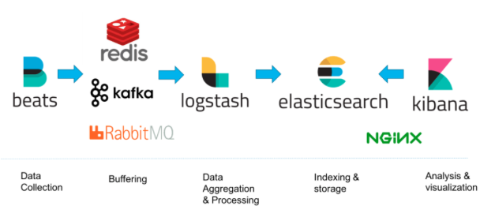

# 기초부터 다지는 ElasticSearch 운영노하우

## 8장 분석 엔진으로 활용하기
- Elastic Stack 의 의미와 시스템 구성
- Filebeat, Logstash, Kibana 설치
- Kibana 를 통한 데이터 시각화
- Elastic Stack 의 가용성 확보를 위한 이중화 방법

### Elastic Stack
- **Elastic Stack** 은 로그를 수집, 가공하고 이를 바탕으로 분석하는데 사용하는 플랫폼
  - 이전에는 ELK 라고 불렸음
- Elastic Stack 은 로그를 전송하는 Filebeat, 로그를 파싱하는 Logstash, 파싱된 문서를 저장하는 Elastic Search, 데이터를 시각화 하는 Kibana 로 구성된다.

`ELK`


`ELK with MQ`



`ES Stack Process`
1. Filebeat 가 지정된 위치에 존재하는 로그 파일을 읽어 Logstash 서버로 전송한다.
2. Logstash 는 Filebeat 로 부터 받은 파일을 파싱해서 특정한 포맷으로 가공해서 Elastic Search 에 전송한다.
3. Elastic Search 는 해당 문서를 인덱스에 적재한다. (데이터 저장소의 역할)
4. Kibana 는 Elastic Search 에 적재된 데이터를 시각화 한다.

### Filebeat 설치
- https://www.elastic.co/kr/downloads/past-releases/filebeat-7-7-1

`rpm 설치`
```shell
sudo rpm -ivh ./filebeat-7.7.1-x86_64.rpm
```

- rpm 으로 설치하면 /etc/filebeat 디렉터리에 각종 환경 설정파일이 생성된다.

| 파일 명 | 설명 |
| --- | --- |
| fields.yml | Filebeat 가 Logstash 를 통하지 않고 ES 에 직접 전송시 사용할 타입과 필드를 정의 |
| filebeat.reference.yml | filebeat.yml 파일에서 설장가능한 모든 설정들이 예시로 제공 |
| filebeat.yml | Filebeat 환경설정 파일 |
| modules.d | Filebeat 가 JSON 파싱까지 진행할 때 사용하는 환경설정을 저장하는 디렉터리 |

`filebeat.yml 예시`

```yaml
filebeat.inputs:
- type: log
  enable: true
  path: 
    - /usr/local/nginx/logs/access.log
output.logstash:
  hosts: ['logstashserver:5044']
```
- nginx 의 access log 를 수집 대상으로 지정하고, 로그스테시 서버로 전송하는 예제
- /home/deploy/elasticsearch-7.7.1/logs/ncucu.log