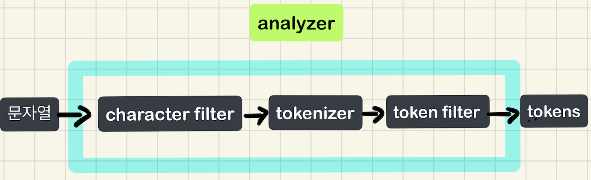

# 기초부터 다지는 ElasticSearch 운영노하우

## 9장 검색엔진으로 활용하기 
- inverted index
- analyzer
- search API
- query DSL

### Inverted Index
- 색인은, 빠른 검색을 위해 검색 될만한 것들을 미리 추출해서 빠른 탐색 자료구조를 구축해 두는것
- [역색인](https://github.com/ces518/TIL/blob/master/elasticsearch/역색인%20구조.md) 은, 특정 키워드가 주어졌을때 해당 키워드와 매칭되는 문서를 미리 매핑해 두는것

### analyzer
- Inverted Index 는 빠른 검색을 위한 매우 중요한 데이터이다.
- 이를 만드는 것이 분석기 (analyzer) 이다.
- 엘라스틱서치는 루씬을 기반으로 구축되었기 때문에, 루씬이 제공하는 다양한 분석기를 그대로 사용한다.
- 기본적으로 Standard Analyzer 를 사용한다.

> 앞선 장에서 잠깐 언급했던 내용이지만, analyzer 를 변경하려면 새롭게 인덱스를 생성해야 한다.
> 그 이유는 기존에 색인된 문서에 대해서는 이미 역색인되어 있기 때문에 변경된 analyzer 가 적용되지 않기 때문이다.

#### analyzer 의 구조

analyzer 는 크게 3가지로 구성된다.
1. Character Filter
2. Tokenizer Filter
3. Token Filter

`Character Filter`
- 문장을 분석하기 전 특정 단어를 변경하거나, HTML 태그를 제거하는 등 **전처리 역할**

`Tokenizer Filter`
- 분석기 구성시 **하나만 사용 가능** 하며, 텍스트를 어떻게 **토큰화 (나눌지)** 할지 정의한다.
- 각 언어에 맞는 적절한 Tokenizer 를 사용해야 한다.

`Token Filter`
- 불필요한 단어를 제거하거나, 영문 단어를 소문자로 변환하는 등 작업을 수행한다.
- Token Filter 는 여러 단계가 순차적으로 이루어 지며 지정된 순서에 따라 검색의 질이 달라 질 수 있다.

#### analyzer 의 동작 프로세스



1. 문장을 특정 규칙에 의해 수정한다 [Character Filter]
2. 수정한 문장을 개별 토큰으로 분리한다. [Tokenizer]
3. 개별 토큰을 특정한 규칙에 의해 변경한다. [Token Filter]

#### 대표적인 분석기 살펴보기
- 엘라스틱서치는 루씬에서 제공하는 대부분의 분석기를 제공한다.
- 그중 대표적으로 많이 사용되는 분석기를 살펴보자.

`Standard Analyzer`
- 공백 혹은 특수기호를 기준으로 토큰을 분리하고, 모든 문자를 소문자로 변경하는 필터를 사용한다.
- 필드의 데이터 타입을 Text 로 지정하면 기본으로 사용하는 분석기

| 파라미터 명 | 설명 |
| --- | --- |
| max_token_length | 최대 토큰 길이를 초과할 경우 length 간격으로 분할한다. <br/> default: 255 |
| stopwords | 사전에 정의된 불용어 사전을 사용한다. <br/> default: 사용하지 않음 |
| stopwords_path | 불용어가 포함된 파일을 사용할 경우 파일 경로 |

```shell
curl -XPOST -H 'Content-Type: application/json' http://localhost:9200/dev_analyzer/_analyze?pretty -d '
{
  "analyzer": "standard",
  "text": "hello world i am ncucu"
}
'

{
  "tokens" : [
    {
      "token" : "hello",
      "start_offset" : 0,
      "end_offset" : 5,
      "type" : "<ALPHANUM>",
      "position" : 0
    },
    {
      "token" : "world",
      "start_offset" : 6,
      "end_offset" : 11,
      "type" : "<ALPHANUM>",
      "position" : 1
    },
    {
      "token" : "i",
      "start_offset" : 12,
      "end_offset" : 13,
      "type" : "<ALPHANUM>",
      "position" : 2
    },
    {
      "token" : "am",
      "start_offset" : 14,
      "end_offset" : 16,
      "type" : "<ALPHANUM>",
      "position" : 3
    },
    {
      "token" : "ncucu",
      "start_offset" : 17,
      "end_offset" : 22,
      "type" : "<ALPHANUM>",
      "position" : 4
    }
  ]
}
```

`Whitespace Analyzer`
- 공백 문자열을 기준으로 토큰을 분리하는 분석기

```shell
curl -XPOST -H 'Content-Type: application/json' http://localhost:9200/dev_analyzer/_analyze?pretty -d '
{
  "analyzer": "whitespace",
  "text": "hello world i am ncucu"
}
'

{
  "tokens" : [
    {
      "token" : "hello",
      "start_offset" : 0,
      "end_offset" : 5,
      "type" : "word",
      "position" : 0
    },
    {
      "token" : "world",
      "start_offset" : 6,
      "end_offset" : 11,
      "type" : "word",
      "position" : 1
    },
    {
      "token" : "i",
      "start_offset" : 12,
      "end_offset" : 13,
      "type" : "word",
      "position" : 2
    },
    {
      "token" : "am",
      "start_offset" : 14,
      "end_offset" : 16,
      "type" : "word",
      "position" : 3
    },
    {
      "token" : "ncucu",
      "start_offset" : 17,
      "end_offset" : 22,
      "type" : "word",
      "position" : 4
    }
  ]
}
```

`Keyword Analyzer`
- 전체 입력 문자열을 하나의 키워드처럼 처리하여 토큰화 작업을 하지 않는다.

#### Character Filter (전처리 필터)
- analyzer 는 전처리 필터를 이용해 전처리 작업 후 본격적인 토큰 작업을 수행한다.
- 하지만 활용도가 높지 않아 기본적으로 제공되는 종류도 많지 않다.
- 그 중 한가지만 살펴보자

`Html strip char filter`
- 문장에서 HTML 을 제거하는 전처리 필터
- escaped_tags 라는 파라미터가 존재하는 이는 특정 태그만 삭제하도록 설정이 가능하며, 기본 값은 모든 태그를 제거한다.

#### Tokenizer Filter (토크나이저)
- 분석기를 구성하는 가장 핵심적인 요소
- 어떤 Tokenizer 를 사용하냐에 따라 분석기의 전체적인 성격이 결정된다.
- 대표적인 Tokenizer 를 살펴보자.

`Standard Tokenzier`
- 일반적으로 사용하는 Tokenizer 이며 대부분의 기회를 만나면 토큰화를 시도한다.
- max_token_length 라는 파라미터가 존재한다.

```shell
curl -XPOST -H 'Content-Type: application/json' http://localhost:9200/dev_analyzer/_analyze?pretty -d '
{
  "tokenizer": "standard",
  "text": "hello world i am ncucu"
}
'

{
  "tokens" : [
    {
      "token" : "hello",
      "start_offset" : 0,
      "end_offset" : 5,
      "type" : "<ALPHANUM>",
      "position" : 0
    },
    {
      "token" : "world",
      "start_offset" : 6,
      "end_offset" : 11,
      "type" : "<ALPHANUM>",
      "position" : 1
    },
    {
      "token" : "i",
      "start_offset" : 12,
      "end_offset" : 13,
      "type" : "<ALPHANUM>",
      "position" : 2
    },
    {
      "token" : "am",
      "start_offset" : 14,
      "end_offset" : 16,
      "type" : "<ALPHANUM>",
      "position" : 3
    },
    {
      "token" : "ncucu",
      "start_offset" : 17,
      "end_offset" : 22,
      "type" : "<ALPHANUM>",
      "position" : 4
    }
  ]
}
```

`Whitespace Tokenizer`
- 공백을 기준으로 토큰화를 시도한다.
- 지정된 max_token_length 에 따라 토큰을 분할한다 (기본 값은 255)

```shell
curl -XPOST -H 'Content-Type: application/json' http://localhost:9200/dev_analyzer/_analyze?pretty -d '
{
  "tokenizer": "whitespace",
  "text": "hello world i am ncucu"
}
'

{
  "tokens" : [
    {
      "token" : "hello",
      "start_offset" : 0,
      "end_offset" : 5,
      "type" : "word",
      "position" : 0
    },
    {
      "token" : "world",
      "start_offset" : 6,
      "end_offset" : 11,
      "type" : "word",
      "position" : 1
    },
    {
      "token" : "i",
      "start_offset" : 12,
      "end_offset" : 13,
      "type" : "word",
      "position" : 2
    },
    {
      "token" : "am",
      "start_offset" : 14,
      "end_offset" : 16,
      "type" : "word",
      "position" : 3
    },
    {
      "token" : "ncucu",
      "start_offset" : 17,
      "end_offset" : 22,
      "type" : "word",
      "position" : 4
    }
  ]
}
```

`Ngram Tokenizer`
- 기본적으로 한 글자씩 토큰화 하며, 특정 문자를 지정할 수 있다.
- 특정 문자를 지정하면 해당 문자를 기준으로 토큰화를 시도하며, **자동 완성** 을 만들때 유용하게 사용된다.

| 파라미터 명 | 설명 |
| --- | --- |
| min_gram | Ngram 을 적용할 문자의 최소 길이 <br/> default: 1 |
| max_gram | Ngram 을 적용할 문자의 최대 길이 <br/> default: 2 |
| token_chars | 토큰에 포함할 문자열을 지정한다. <br/> letter, digit, whitespace, punctuation, symbol |


```shell
// 3글자씩 잘라서 토큰화를 하도록 설정
curl -XPUT -H 'Content-Type: application/json' http://localhost:9200/dev_ngram_analyzer?pretty -d '
{
	"settings": {
		"analysis": {
			"analyzer": {
				"ngram_analyzer": {
					"tokenizer": "ngram_tokenizer"
				}
			},
			"tokenizer": {
				"ngram_tokenizer": {
					"type": "ngram",
					"min_gram": 3,
					"max_gram": 3,
					"token_chars": [ "letter" ]
				}
			}
		}
	}
}
'

curl -XPOST -H 'Content-Type: application/json' http://localhost:9200/dev_ngram_analyzer/_analyze?pretty -d '
{
	"tokenizer": "ngram_tokenizer",
	"text": "hello world i am ncucu"
}
'


{
  "tokens" : [
    {
      "token" : "hel",
      "start_offset" : 0,
      "end_offset" : 3,
      "type" : "word",
      "position" : 0
    },
    {
      "token" : "ell",
      "start_offset" : 1,
      "end_offset" : 4,
      "type" : "word",
      "position" : 1
    },
    {
      "token" : "llo",
      "start_offset" : 2,
      "end_offset" : 5,
      "type" : "word",
      "position" : 2
    },
    {
      "token" : "wor",
      "start_offset" : 6,
      "end_offset" : 9,
      "type" : "word",
      "position" : 3
    },
    {
      "token" : "orl",
      "start_offset" : 7,
      "end_offset" : 10,
      "type" : "word",
      "position" : 4
    },
    {
      "token" : "rld",
      "start_offset" : 8,
      "end_offset" : 11,
      "type" : "word",
      "position" : 5
    },
    {
      "token" : "ncu",
      "start_offset" : 17,
      "end_offset" : 20,
      "type" : "word",
      "position" : 6
    },
    {
      "token" : "cuc",
      "start_offset" : 18,
      "end_offset" : 21,
      "type" : "word",
      "position" : 7
    },
    {
      "token" : "ucu",
      "start_offset" : 19,
      "end_offset" : 22,
      "type" : "word",
      "position" : 8
    }
  ]
}
```

`Edge Ngram Tokenizer`
- 문자의 목록을 지정하여 하나를 만날때 마다 시작 부분을 고정시켜 단어를 자르는 토크나이저

```shell
// 최소 2 글자, 최대 10글자를 토큰화 하도록 설정
curl -XPUT -H 'Content-Type: application/json' http://localhost:9200/dev_engram_analyzer?pretty -d '
{
	"settings": {
		"analysis": {
			"analyzer": {
				"edge_ngram_analyzer": {
					"tokenizer": "edge_ngram_tokenizer"
				}
			},
			"tokenizer": {
				"edge_ngram_tokenizer": {
					"type": "edge_ngram",
					"min_gram": 2,
					"max_gram": 10,
					"token_chars": [ "letter" ]
				}
			}
		}
	}
}
'

curl -XPOST -H 'Content-Type: application/json' http://localhost:9200/dev_engram_analyzer/_analyze?pretty -d '
{
	"tokenizer": "edge_ngram_tokenizer",
	"text": "hello world i am ncucu"
}
'

{
  "tokens" : [
    {
      "token" : "he",
      "start_offset" : 0,
      "end_offset" : 2,
      "type" : "word",
      "position" : 0
    },
    {
      "token" : "hel",
      "start_offset" : 0,
      "end_offset" : 3,
      "type" : "word",
      "position" : 1
    },
    {
      "token" : "hell",
      "start_offset" : 0,
      "end_offset" : 4,
      "type" : "word",
      "position" : 2
    },
    {
      "token" : "hello",
      "start_offset" : 0,
      "end_offset" : 5,
      "type" : "word",
      "position" : 3
    },
    {
      "token" : "wo",
      "start_offset" : 6,
      "end_offset" : 8,
      "type" : "word",
      "position" : 4
    },
    {
      "token" : "wor",
      "start_offset" : 6,
      "end_offset" : 9,
      "type" : "word",
      "position" : 5
    },
    {
      "token" : "worl",
      "start_offset" : 6,
      "end_offset" : 10,
      "type" : "word",
      "position" : 6
    },
    {
      "token" : "world",
      "start_offset" : 6,
      "end_offset" : 11,
      "type" : "word",
      "position" : 7
    },
    {
      "token" : "am",
      "start_offset" : 14,
      "end_offset" : 16,
      "type" : "word",
      "position" : 8
    },
    {
      "token" : "nc",
      "start_offset" : 17,
      "end_offset" : 19,
      "type" : "word",
      "position" : 9
    },
    {
      "token" : "ncu",
      "start_offset" : 17,
      "end_offset" : 20,
      "type" : "word",
      "position" : 10
    },
    {
      "token" : "ncuc",
      "start_offset" : 17,
      "end_offset" : 21,
      "type" : "word",
      "position" : 11
    },
    {
      "token" : "ncucu",
      "start_offset" : 17,
      "end_offset" : 22,
      "type" : "word",
      "position" : 12
    }
  ]
}
```

`Keyword Tokenizer`
- 텍스트를 하나의 토큰으로 만든다.
- buffer_size 가 있으며 텀을 버퍼로 읽어들일 문자 수를 지정한다
- 기본값은 256

```shell
curl -XPOST -H 'Content-Type: application/json' http://localhost:9200/dev_analyzer/_analyze?pretty -d '
{
	"tokenizer": "keyword",
	"text": "hello world i am ncucu"
}
'

{
  "tokens" : [
    {
      "token" : "hello world i am ncucu",
      "start_offset" : 0,
      "end_offset" : 22,
      "type" : "word",
      "position" : 0
    }
  ]
}
```

#### Token Filter
- 토크나이저에서 분리된 토큰들을 변형, 추가, 삭제 시 사용한다.
- 토크나이저에 의해 토큰들이 분리되어야 동작하기 때문에 독립적으로 사용이 불가능하다.

`Ascii Folding Token Filter`
- 아스키코드에 해당하는 127개의 문자에 포함되지 않는 문자를 ASCII 로 변환한다.

`Lowercase Token Filter`
- 토큰을 구성하는 전체 문자열을 소문자로 변환한다.

`Uppercase Token Filter`
- 토큰을 구성하는 전체 문자열을 대문자로 변환한다.

`Stop Token Filter`
- 불용어로 등록할 사전을 구축해서 사용할 필터
- 불용어사전에 등록된 단어는 인덱스 또는 검색 대상에서 제외된다.

| 파라미터 명 | 설명 |
| stopwords | 불용어를 매핑에 직접 등록해서 사용한다. |
| stopwords_path | 불용어 사전이 존재하는 파일 경로를 지정한다. <br/> 엘라스틱서치 config 디렉터리 내부에 생성 |
| ignore_case | 모든 단어를 소문자로 변경해서 저장한다. <br/> default: false |

`Stemmer Token Filter`
- Stemming 알고리즘을 사용해 토큰을 변환하는 필터
- english, light_english, minimal_english, possessive_english, poter2, lovin 등 다양한 언어를 제공하지만 한글은 미지원이다.

`What is Stemming ?`
```text
형태론 및 정보 검색 분야에서 어형이 변형된 단어로부터 접사 등을 제거하고 그 단어의 어간을 분리해 내는 것을 의미한다.
여기서 어간은 반드시 어근과 같아야 할 필요는 없으며, 어근과 차이가 있더라도 관련이 있는 단어들이 일정하게 동일한 어간으로 맵핑되게 하는 것이 어간 추출의 목적이다. 
1960년대부터 컴퓨터 과학 분야에서 다양한 어간 추출 관련 알고리즘들이 연구되어 왔다. 
많은 웹 검색 엔진들은 동일한 어간을 가진 단어들을 동의어로 취급하는 방식으로 질의어 확장을 하여 검색 결과의 품질을 높인다.
```

`Synonym Token Filter`
- 동의어 처리가 가능한 필터
- ncucu -> 엔꾸꾸 로 변환이 가능하다.

| 파라미터 명 | 설명 |
| --- | --- |
| synonyms | 동의어로 사용할 단어 등록 |
| synonyms_path | 파일로 관리할 경우 config 하위에 생성 |

> 최신 버전에서는 대소문자를 구분하지 않고 동의어 처리가 된다.
> 동의어 사전은 실시간으로 적용되지 않기때문에 Index 를 Reload 해야 한다.

`Trim Token Filter`
- 앞뒤 공백을 제거하는 토큰 필터

### Search API
- 검색 API 는 기본적으로 Query 를 기반으로 동작한다.
- URI 검색과 RequestBody 검색 두가지로 나뉜다.

```shell
// URI Search
/{index}/_search?q={query}

// RequestBody Search
/{index}/_search
{
  "query": {
    ...
  }
}
```

`Request Body Options`

| 옵션 | 내용 |
| --- | --- |
| query | 검색을 위한 쿼리 |
| from/size | 검색 결과를 n 개의 단위로 나눠서 볼 때 사용한다. |
| sort | 검색 결과를 _score 가 아닌, 별도의 필드를 기준으로 정렬한다. |
| source | 검색 결과 중 특정 필드의 내용만 볼때 사용한다. |
| highlighting | 검색 결과 중 검색어와 매칭하는 부분을 강조하기 위해 사용한다. |
| boost | 검색 결과로 나온 스코어를 변형할 때 사용한다. |
| scroll | 검색 결과룰 n 개의 단위로 나눠서 볼 때 사용한다. from/size 와 유사하지만 scroll id 를 통해 다음 검색 결과를 가져올 수 있다. |


`페이징시 발생할 수 있는 예외`

```text
Result window is too large, from + size must be less than or equal to: [10000] but was [10002]. 
See the scroll api for a more efficient way to request large data sets. 
This limit can be set by changing the [index.max_result_window] index level setting.
```

> 예외가 발생하는 이유 ? -> ES 의 분산 저장 구조 때문...

- Member Index 를 생성할때, 기본 값인 5개의 프라이머리 샤드로 저장하게끔 설정이 되었다고 가정해보자.
- from/size 쿼리를 이용해서, from=0, size=10 페이징 처리를 한다고 가정했을때 5개의 프라이머리 샤드에서 각각 size 만큼의 문서인 10개를 fetch 해온다.
- 그 후 코디네이팅 노드에서 50개의 문서를 정렬한 뒤, 10개의 문서를 결과로 반환한다.
- 이는 페이징의 **depth** 가 깊어질수록 심각한 문제를 초례한다.
- 만약 10000페이지의 문서를 가져온다고 가정해보면, 각각의 프라이머리 샤드에서 10000 (from) + 10 (size) 개의 문서를 가져와 fetch 한다.
- 코디네이팅 노드는 50050 개의 문서를 정렬한뒤, 10000 번째 부터 10개의 문서를 반환해야 한다
- 이러한 문제를 **deep pagination** 문제라고 하며, 이는 성능적인 문제를 초례한다.
- 때문에 ES 에서는 max size 를 10000 개로 제한해 두었다.
    - maximum 값도 50000

> 다시 정리하면, 페이징 처리 요청 쿼리조건이 from=1000, size=10 이라고 가정했을때 \
> 1000번째 부터 10개를 가져오는것이 아니라, 1010 개를 가져와서 앞의 1000개를 버리는 구조이다. (MongoDB 도 이와 같은 방식으로 페이징 처리를 한다.)\
> ES 는 분산 저장구조이기 때문에 어떤 샤드에 우선 순위가 빠른 문서가 있는지 알 방법이 없다.\
> 따라서 프라이머리 샤드의 개수가 N 개라면, N * (from + size) 개수 만큼의 문서를 fetch 해 와서 정렬한뒤, from 에 해당하는 문서를 버리고 size 만큼의 문서를 반환하는 구조인것이다.

그럼 위의 문제를 해결하려면, 어떻게 해야할까 ?
- 이런 문제를 피하는 다양한 방법이 있지만, ES 에서는 두가지 대안을 제시한다.
1. scroll option
2. search after API


`scroll`
- scroll 은 from/size 와 유사하지만, 검색 당시의 **스냅샷** 을 제공한다.
- **scroll_id (cursor)** 가 유지되는 동안 다음 문서에 대한 정보를 알 수 있기 때문에 위와 같은 문제를 회피한다.
- 또한 **스냅샷** 을 제공하기 때문에, 대량의 **배치** 작업에 주로 활용한다.

> scroll_id 의 유지기간은 노드의 힙 메모리에 영향을 준다. \
> 따라서 지나치게 길게 유지한다면 OOM 이 발생할 수 있다.

`search after API`
- from+size 와 scroll api 를 대체하는 기능
- scroll api 는 상당히 무겁고, 메모리 이슈가 존재한다.
- [search_after](https://www.elastic.co/guide/en/elasticsearch/reference/current/paginate-search-results.html#search-after) 는 live cursor 를 제공하면서 stateless 하다.

### Query DSL
- ES 에서 제공하는 QueryDSL 을 이용하면, 여러 개의 질의를 조합하거나, 질의 결과에 대해 다시 검색하는 등 정밀한 검색이 가능하다.
- 이는 크게 **Query Context** 와 **Filter Context** 로 구분된다.
- 다음은 QueryDSL 의 기본 구조이다.

```json
// 요청
{
	// 리턴받는 결과의 개수 지정. default = 10
	"size" :

	// 몇 번째 문서부터 가져올지 지정. default = 0
	"from" :

	// 검색요청 timeout. default = unlimit
	"timeout" :

	// 검색 시 필요한 필드만 출력하고 싶을 때 사용
	"_source" : {}

	// 검색 조건문이 들어가는 공간
	"query" : {}

	// 통계 및 집계 데이터를 사용할 때 
	"aggs" : {}

	// 문서 결과를 어떻게 출력할지에 대한 조건을 사용하는 공간
	"sort" : {}
}

// 응답
{
	// 쿼리 실행한 시간
	"took":

	// 쿼리 시간이 초과할 경우 나타냄
	"timed_out":

	"_shards": {
		// 쿼리 요청한 전체 샤드 개수
		"total":
		// 겁색 요청에 성공적으로 응답한 샤드 개수
		"successful":
		// 검색 요청에 실패한 샤드 개수
		"failed":
	},

	"hits": {
		// 검색 매칭된 문서의 전체 개수
		"total":
		// 일치하는 문서의 스코어 값 중 가장 높은 값
		"max_score":
		// 각 문서 정보와 스코어 값
		"hits": []
	}
}
```


> 만약 문법에 오류가 존재할 경우 json_parse_exception 이 발생한다.

#### Query Context 와 Filter Context

| | Query Context | Filter Context |
| --- | --- | --- |
| 용도 | 전문 검색 | 조건 검색 |
| 특징 | 분석기에 의해 분석이 수행된다. <br/> 연관성 관련 계산을 수행한다. <br/>루씬 레벨에서 분석 과정을 거쳐야하기 때문에 상대적으로 느리며, 결과가 캐싱되지 않는다. | Yes/No 로 단순 판별이 가능한 조건. <br/> 연관성 관련 계산을 하지 않는다. <br/> ES 레벨에서 처리가 가능하기 때문에 상대적으로 빠르며, 결과를 캐싱한다. |
| 사용 예 | "Hello World" 와 같은 문장 분석 | "created_at" 필드 값이 2021년인지 확인 여부 |

`Query Context`

| 종류 | 설명 |
| --- | --- |
| match | 검색어가 토크나이징 된 토큰들이 존재하는지 여부를 확인한다. |
| match_phrase | match 와 유사하지만 검색어에 입력된 순서를 지켜야 한다. |
| multi_match | match 와 비슷하게 동작하지만 다수의 필드에 검색하기 위해 사용한다. |
| query_string | and, or 와 같은 검색어 간 연산이 필요할 때 사용한다. |

```shell
curl -XPOST -H 'Content-Type: application/json' http://localhost:9200/users/_doc/_search?pretty -d '
{
  "query": {
    "match": {
      "username": "ncucu"
    }
  }
}
'

{
  "took" : 22,
  "timed_out" : false,
  "_shards" : {
    "total" : 1,
    "successful" : 1,
    "skipped" : 0,
    "failed" : 0
  },
  "hits" : {
    "total" : {
      "value" : 1,
      "relation" : "eq"
    },
    "max_score" : 0.6931471,
    "hits" : [
      {
        "_index" : "users",
        "_type" : "_doc",
        "_id" : "1",
        "_score" : 0.6931471,
        "_source" : {
          "username" : "ncucu"
        }
      }
    ]
  }
}
```

`Filter Context`
- Filter Context 는 **Term Level Query** 라고도 한다.
- 문서에 대한 필터링에 사용되는 쿼리이다.
- Query Context 와의 큰 차이는 검색어를 analyze 하느냐의 여부

| 종류 | 내용 |
| --- | --- |
| term | 검색어로 입력한 단어와 정확하게 일치하는 단어가 있는지 찾는다. |
| terms | terms 과 유사하지만 여러 개의 단어를 기준으로 하나 이상 일치하는 단어가 있는지 찾는다. |
| range | 특정 범위 내에 존재하는 값이 있는지 찾는다. |
| wildcard | 와일드카드 패턴에 해당하는 값이 있는지 찾는다. |

```shell
curl -XPOST -H 'Content-Type: application/json' http://localhost:9200/users/_doc/_search?pretty -d '
{
  "query": {
    "term": {
      "username": "ncucu" 
    }
  }
}
'

{
  "took" : 6,
  "timed_out" : false,
  "_shards" : {
    "total" : 1,
    "successful" : 1,
    "skipped" : 0,
    "failed" : 0
  },
  "hits" : {
    "total" : {
      "value" : 1,
      "relation" : "eq"
    },
    "max_score" : 0.6931471,
    "hits" : [
      {
        "_index" : "users",
        "_type" : "_doc",
        "_id" : "1",
        "_score" : 0.6931471,
        "_source" : {
          "username" : "ncucu"
        }
      }
    ]
  }
}
```

> text 타입의 필드를 대상으로 할 때는, term 보다는 match 쿼리를 사용해야 한다.\
> analyzer 에 따라 검색 결과가 달라질 수 있기 때문이다.\
> wildcard 쿼리를 사용할때는 주의해야 하는데, 모든 inverted index 를 스캔하기 때문에 속도가 매우 느리다.\
> 또한 문서가 많아질수록 선형 구조의 성능을 보인다. 때문에 wildcard 쿼리보단, match 쿼리를 사용해야 한다.

#### bool query 를 사용한 쿼리 조합
- 여러개의 쿼리를 조합하여 더 높은 스코어를 가진 쿼리 조건으로 검색 수행이 가능하다.
- 이를 **Compound Query** 라고도 한다.
- 이를 구현하기 위한 Bool Query 를 제공한다.

| 항목 |스코어링 | 캐싱 |
| --- | --- | --- |
| must | O | X |
| filter | X | O |
| should | O | X |
| must_not | X | O |

`Bool Query 의 구조`
```json
{
	"query" : {
		"bool": {
			// AND 
			"must" : [],
			// NOT
			"must_not": [],
			// OR
			"should": [],
			// IN ()
			"filter": []
		}
	}
}
```

> must, should 는 Query Context 에서, filter, must_not 은 Filter Context 에서 실행된다.\
> bool Query 는 Query Context 와 Filter Context 를 혼합해서 사용할 수 있다.
> 또한 검색 성능이 중요하다면, Filter Context 에 넣을 수 있는 조건은 Filter Context 에 넣는 것이 중요하다.
> 만약 매칭의 정도가 중요한 조건이라면, Query Context 에서 실행되도록 조건을 작성해야 한다.

## 정리
- ES 는 analyzer 로 문서의 각 필드를 분석해 토큰을 생성한다.
- analyzer 를 통해 생성된 토큰은 inverted index 에 저장된다.
- analyzer 를 변경하면 기존에 생성된 inverted index 가 의미가 없기 때문에 인덱스를 재생성 해야한다.
- 어떤 analyzer 를 사용하냐에 따라 검색의 품질이 달라진다.
- search API 는 다양한 옵션을 제공하며, 이를 통해 검색 결과를 정렬하거나 페이징처리를 할 수 있다.
- query 문은 query context 와 filter context 로 구분된다.
- query context 와 filter context 의 가장 큰 차이는 검색어를 analyze 하느냐 여부이다.
- 또한 filter context 는 캐싱이 되기때문에 좋은 성능을 보여준다.
- bool query 를 통해 query context 와 filter context 를 조합해서 사용할 수 있다.


