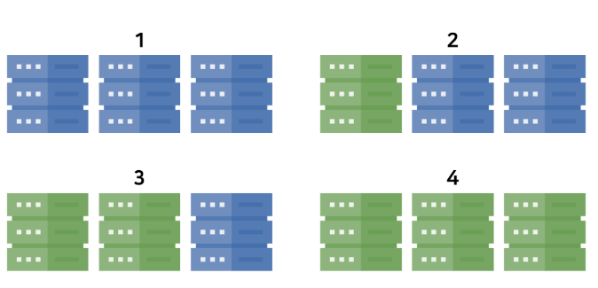
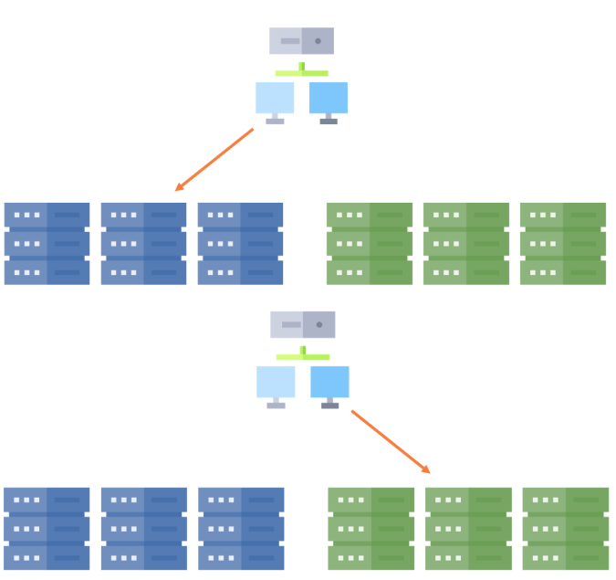
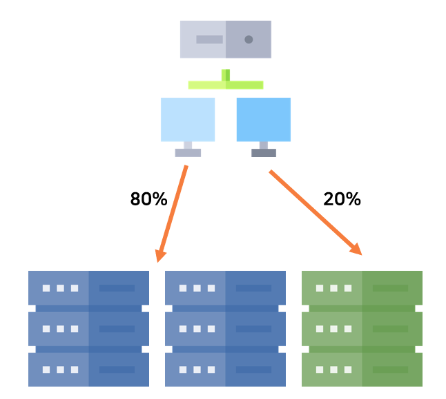

# 배포 전략

## Rolling

- 가장 일반적인 배포 방식
- 단순하게 서버를 구성하여 순차적인 배포를 진행한다.
- ES 버전업과 같은 경우 Rolling Restart 방식을 많이 취한다.

> 이는 서버의 부하에 대한 처리가 잘 되어 있어야한다.

## 블루/그린

- 구 버전이 블루 새롭게 배포할 버전을 그린 이라고 해서 붙여진 이름
- 새롭게 배포할 버전을 배포한 뒤 모든 연결을 새로운 버전을 바라보게끔 전환하는 전략
- 구 버전과 새로운 버전 서버가 동시에 구성된다.
- 빠른 롤백 / 운영 환경에서 신 버전 테스트가 가능하다는 것이 장점이다.

>  시스템 자원이 2배로 필요하다는 것이 단점이다.

## 카나리 Canary

- 카나리의 어원은 카나리아라는 새에서 왔다.
- 카나리아는 유독가스에 민감한 동물로 석탄광산에서 유독가스 누출 위험을 알리기 위한 용도로 사용되어 왔다.
- 즉 카나리 배포는 위험을 빠르게 감지할 수 있는 전략
- 특정 서버 에 배포를 먼저 진행한 뒤 정상이라면 전체 배포를 진행한다.
- 트래픽의 일부를 새로운 버전으로 분산한여 오류 여부를 확인한다.

>  A/B 테스트 / 성능 모니터링에 유용하다는 장점이 있다.

## 이미지 출저
- https://dunchi.tistory.com/69