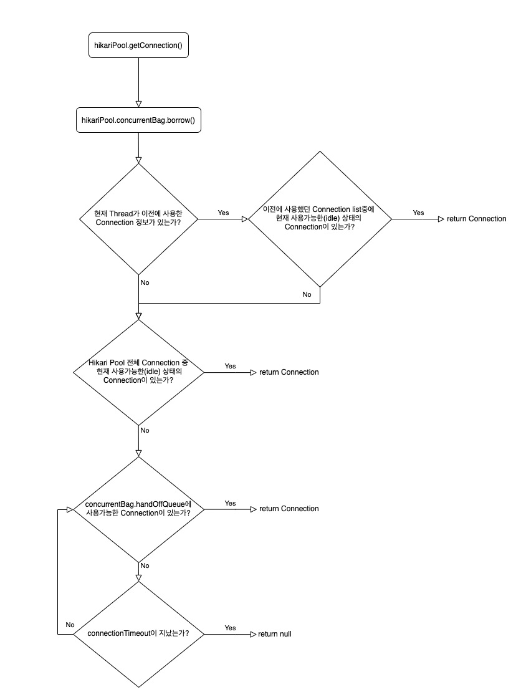
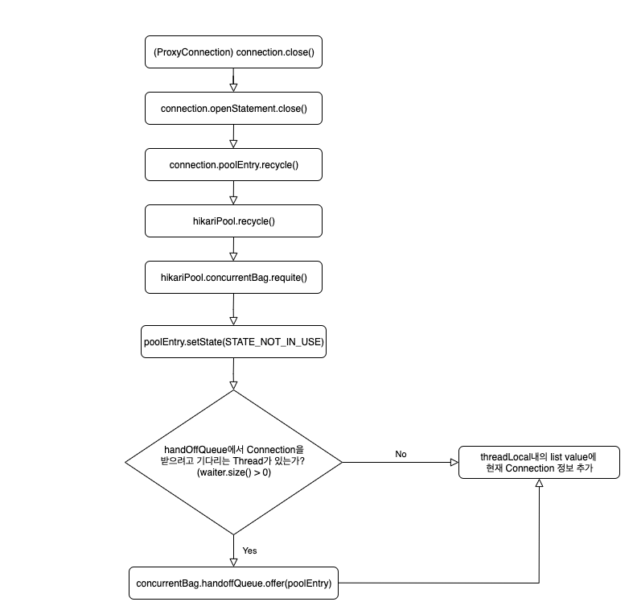

# HikariCP Dead lock 

HikariCP 환경에서 동시다발적인 커넥션 요청시, 요청수 보다 Connection Pool의 Size 가 작을 경우 데드락이 발생할 수 있다.

## 데드락이란 ?

위키 백과에서는 데드락을 다음과 같이 정의하고 있다.

```
**교착 상태 (dead lock)** 이란 두개 이상의 작업이 서로 상대방의 작업이 끝나기만을 기다리고 있기 때문에 결과적으로 아무것도 완료되지 못하는 상태를 가리킨다.
```

## HikariCP 의 동작 방식
- SpringBoot 2.x 부터는 HikariCP를 기본 JDBC Connection Pool 로 사용한다.
- 다른 Connection Pool 들에 비해 압도적인 성능을 뿜어낸다.
- HikariPool 에서는 Connection 객체를 그대로 사용하는 것이 아닌 PoolEntity 라는 타입으로 한번 래핑해서 사용한다.
- HikariPool 에서 getConnection() 시 **3단계** 에 걸쳐 커넥션을 할당한다.
- **ConcurrentBag** 라는 구조체를 이용해 커넥션들을 관리한다.

`Connection 을 요청하는 과정`



> HikariCP default Connection timeout 은 30초 이고, ProxyConnection 타입 이다.


`Connection 을 반환하는 과정`



## 데드락이 발생하는 과정

우선 아래의 상황이라고 가정한다.

1. 스레드의 개수는 1개이다.
2. HikariCP 의 최대 Pool Size 는 1ㄱ이다.
3. 한 Task 에서 동시에 요구되는 Connection 개수는 2개이다.


데드락 발생 Flow

1. Thread 가 repository.save() (insert) 를 실행하기 위해 트랜잭션을 시작한다.
2. Root 트랜잭션을 시작하기 위핸 Connection 을 얻어온다. (현재 스레드풀 상태 : total = 1, active = 1, idle = 1, waiting = 1)
3. 이때 하나의 트랜잭션이 더 필요한 상황이 발생
    1. 위 절차대로 Thread 의 이전 커넥션 획득 내역을 살펴본다 -> 등록된게 없음.
    2. Hikari Pool 에서 idle 상태의 Connection 을 살펴본다. -> 없음
    3. handOffQueue 에 누군가 반납한 커넥션이 있기를 대기한다. (30초)
    4. 30초가 지난뒤 Connection timeout 이 발생한다.
4. 이후 트랜잭션이 롤백되며 커넥션 반납 절차가 진행된다.

## 정리
- HikariCP 의 동작방식에 의해 데드락이 발생할 수 있는 상황이 존재한다.
- 데드락 발생횟수가 빈번하다면 커넥션 풀의 사이즈를 늘려주어야 한다. (무작정 늘리는것도 능사는 아님)

## 참고
- https://ko.wikipedia.org/wiki/교착_상태
- https://woowabros.github.io/experience/2020/02/06/hikaricp-avoid-dead-lock.html