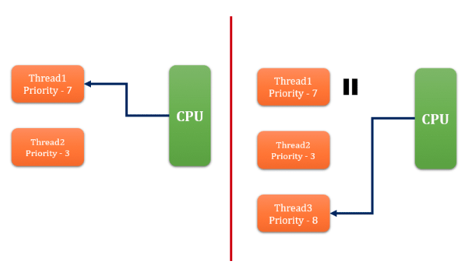

# Java Thread 기본

## Thread 란 무엇인가 ?
- 대부분의 OS 는 멀티 스레드를 지원한다. 
- 예전에는 멀티 테스킹 (Multi Processing) 만을 지언하던 시절 실행의 **최소단위** 였던 Process 가 멀티스레드 환경으로 넘어오면서 Thread 로 전환되었다.
- 실행의 최소단위가 Thread 이지만 Process 가 의미없는 것은 아니다.
- 스레드는 프로세스 내에서 독립적인 수행코드를 가지고 있으며, 프로세스는 스레드들에게 **실행환경을 제공해주는 일종의 컨테이너 역할** 을 한다.
- 스레드는 프로세스 내의 독립적인 실행 흐름을 말한다.
- 스레드별로 stack 공간을 별도로 할당받게 되며, 나머지 메모리 영역은 프로세스 내의 모든 스레드들과 공유하게 된다.
- 프로세스간의 데이터 공유는 커널레벨에서 제공해주는 서비스를 사용해야하지만, 스레드는 **메모리 영역을 공유** 하기 때문에 손쉽게 할 수 있다.
- 하지만 스레드 간의 **동기화 처리** 는 반드시 해주어야 한다.

## 특징
- 자바는 Thread 기반으로 동작하며, 언어레벨에서 스레드를 지원한다.
- 자바프로그램이 시작되면, main 함수를 기점으로 하는 Main Thread 가 생성된다.
- 스레드는 **JVM-Thread-Scheduler** 에 의해 관리되며, 각 스레드를 관리하기 위한 자료구조와 알고리즘을 가지고 있다.

### JVM Thread Scheduler
- JVM Thread Scheduler 는 JVM 에서 실행할 스레드와 대기할 스레드를 결정하는 역할을 한다.
- Thread Scheduler 는 항상 **RUNNABLE** 상태인 스레드만 실행 하도록 결정한다.
- 하지만 RUNNABLE 상태인 스레드가 여러개 인경우 어떤것이 실행될지는 보장할 수 없다.
- 스케쥴러가 실행할 스레드를 선택하는데 사용되는 여러 기준이 있다.

1. 우선순위 (Priority)
    - 각 스레드 들은 1 ~ 10 까지의 우선순위를 가지고 있다.
    - 스레드를 생성할경우, 부모스레드의 우선순위를 상속받는다.
    - 동일한 우선순위를 가지는 스레드가 여러개 있을 경우, 이중 랜덤으로 채택된다.
2. 도착 시간 (Arrival Time)
    - 스레드 스케쥴러는 스레드의 도착시간에 따라 달라진다.
    - 같은 우선순위를 가지는 여러 스레드가 있을 경우 스레드의 도착시간을 확인해 실행할 스레드를 선택한다.

- 또한 실행할 스레드들을 결정했다면, 각 스레드들을 CPU 에서 어떻게 할당해서 사용할것인지 배분하게 되는데, 이를 위한 알고리즘이 몇가지 존재한다.

1. 우선권이 있는 스케쥴링 (Preemptive-priority scheduling)
    - 이름에서 알수 있듯이, 이 알고리즘은 스레드의 우선순위를 기반으로 동작한다.
    - 스케쥴러는 우선순위가 가장 높은 스레드를 선택한다.
    - 선택된 스레드는 **특정상황** 이 발생하지 않는한 게속 실행된다.
        1. 더 높은 우선순위를 가진 스레드가 RUNNABLE 상태가 될 경우
        2. yield, sleep, join 등을 호출해서 다른 스레드에게 제어권을 넘길 경우
        3. 선택된 스레드가 지정된 time-slice 만큼 작업을 끝낸 경우
    - 실행중이던 보다 우선순위가 더 높은 스레드 (RUNNABLE 상태) 가 생기거나, time-splice 가 종료된 경우, 일시 중단되고 다른 스레드가 time-slice 를 얻게 된다.
    
2. FIFS (First come First serve Scheduling)
    - 이름에서 알수 있듯이 FIFO 에서 유례되었다.
    - 스레드의 도착시간을 확인하고, 실행에 필요한 time-splice 를 할당 한다.
3. Time-slicing scheduling
    - 이 알고리즘은 FIFS 를 기반으로 만들어 졌다.
    - 스케쥴러는 각 스레드에게 time-splice 를 할당하며, 모든 스레드가 주기적으로 실핼된다. (time-slice 는 시스템에 정의되어 있다.)

## 생성 방법
1. Thread 클래스를 상속 (서브클래싱) 하는 방법
    - 상속받는 하위 클래스를 선언한 뒤 run 메소드를 오버라이딩 한다.
    - 구현클래스의 인스턴스 생성후 start() 메소드를 호출해서 스레드를 실행한다.
2. Runnable 인터페이스를 구현한뒤 스레드의 생성자로 넘기는 방법
    - Runnable 인터페이스는 run 메소드 하나만 가지고 있다.
    - Runnable 인터페이스를 구현한 뒤 Thread 의 생성자로 넘겨 준다.
    
> Thread, Runnable 언제 사용해야 하나 ?
> Runnable 인터페이스에는 run 메소드 하나만 정의되어 있지만, Thread 클래스에는 이외에도 다양한 메소드들이 정의되어 있다.
> run 메소드만 사용한다면 Runnable, 이외 다른 메소드들도 필요하다면 Thread 클래스를 상속받아 사용해야 한다.

`Thread.start()`
- run() 메소드를 직접 호출하는것과 어떤 차이가 있는지 아는것이 중요
- start() 를 호출하는것은 단순히 run() 을 호출하는것이 아닌 **Thread 생성을 위한 사전 준비작업을 포함하는 개념**
    - 스레드의 개발 스택할당
    - JVM Thread Scheduler 에 등록
    - 해당 스레드를 RUNNABLE 한 상태로 만들어서 스케쥴러에 의해 실행될 수 있는 상태로 만듦
- 단순히 run 메소드만 호출한다면 run 메소드의 결과만 도출될 뿐 스레드로서 동작되는것이 아니다.

## 생명 주기
- NEW
    - 스레드 인스턴스가 생성되었지만, start() 되지 않은 상태
- RUNNABLE
    - 현재 실행중 혹은 실행 대기중인 상태
- BLOCKED
    - Blocking I/O 에 의해 작업이 완료될떄 까지 대기하는 상태
        - Blocking I/O 로 호출하게 되면 IO 를 수행하기 위해 system call (커널모드로 전환되어 수행) 이 발생한다.
        - NIO 는 Non-Blocking I/O 지원
    - synchronized 에 의해 대기하는 상태
        - 공유자원의 모니터락을 획득하기 위해 대기하는 상태
- WAITING
    - 특정 조건이 만족될때 까지 대기하는 상태
    - Object.wait()
        - 다른 스레드에 의해 notify 될떄까지 대기한다.
        - 소유한 모니터락의 WaitSet 에 현재 스레드를 대기시키며 소유한 락을 반환한다.
    - Thread.join()
        - 대상 스레드 (호출된 스레드) 가 종료될때 까지 현재 스레드를 대기한다.
- TIMED_WAITING
    - 특정 조건이 만족될떄 까지 특정 시간동안 대기하는 상태
    - Thread.sleep()
        - 현재 스레드를 지정 시간동안 대기한다.
    - Object.wait()
        - 다른 스레드에 의해 notify 될떄까지 지정시간 동안 대기한다.
    - Thread.join()
        - 대상 스레드 (호출된 스레드) 가 종료될때 까지 지정한 시간동안 대기한다.
- TERMINATED
    - 스레드가 종료된 상태
    - 종료된 스레드는 다시 start 할 수 없다.
    
`WAITING (TIME_WAITING) 과 Interrupt`
- WAITING (TIME_WAITING) 과 관련된 메소드들을 보면 모두 Interrupt 예외를 던진다.
- 이는 다른스레드에 의해 interrupt 되었을때 발생되는 예외
- 이 예외가 발생함으로써 대기상태로 있던 스레드가 실행가능한 상태로 전이되어 프로그램 수행을 계속할수 있다는 것이 중요하다.

## yield 와 sleep 이 static 메소드인 이유
- 인스턴스 메소드가 존재해서, 현재 스레드가 다른 스레드에 의해 sleep, yield 될때 동기화 처리에 의한 모니터락을 소유한 상태로 준비/대기 상태로 변경된다면
- **데드락이 발생할 소지가 높아진다.**
- static 메소드만 제공함으로써 현재 자신 스레드만이 sleep yield 할수 있도록 제공한다.

## stop 과 suspend 그리고 resume 이 deprecated 된 이유
- stop
    - 다른 스레드에 의해 강제로 종료하게 되면 해당 스레드가 가진 락을 모두 풀게 된다.
    - 작업이 완료되지 않은 상태에서 락이 풀리면 공유자원이 불안정한 상태가 될 수 있다.
- suspend / resume
    - 락을 소유한 상태에서 다른 스레드에 의해 중지가 된다면 데드락이 발생할 수 있다.

## 참고
- https://javagoal.com/thread-scheduler-in-java/
- https://kiwi99.tistory.com/12?category=375710