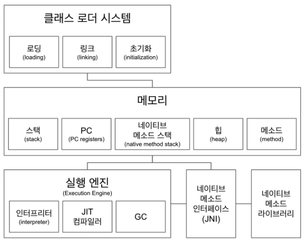

# 더 자바 코드를 조작하는 방법 - JVM의 구조

#### 클래스로더
- .class에서 바이트코드를 읽고 메모리에 저장
- 로딩: 클래스 읽어오는 과정
- 링크: 레퍼런스들을 연결한다
- 초기화: static 값들 초기화 및 변수에 할당

#### 메모리
- 크게 5가지 영역이 존재한다.
- **메소드 영역**
    - 클래스 수준의 정보
    - 클래스명(패키지명 포함), 부모클래스명(상속받은 클래스 존재시)
    - 메소드, 변수 정보를 저장한다.
    - 메소드 영역에 존재하는 자원은 공유자원이다.
    - 다른영역에서 접근이 가능하다.
- **힙 영역**
    - 인스턴스를 저장한다.
    - 클래스를 로딩만해도 .class 타입의 객체가 저장이 된다.
        - App 클래스가 로드되면 A.class 객체가 저장된다.
    - 명시적으로 생성한 객체도 저장된다.
- **스택 영역** (Thread)
    - 스레드에서 공유하는 자원
    - 스레드마다 RuntimeStack이 생성되고, 내부에 Stack Frame을 쌓는다.
    - StackFrame 은 Method Call이다.
- **PC register** (Thread)
    - Program Counter의 약자
    - 스레드 마다 스레드 내 현재 실행할 Stack Frame을 가리키는 포인터가 생성된다.
- **Native Method Stack** (Thread)
    - Native Method Stack 호출시마다 별도로 쌓이는 스택이다
    - NativeMethod는 Method에 Native 키워드가 붙어있고, **해당 구현을 자바가 아닌 C, C++ 로 구현된 메서드**를 의미한다.
    - `JNI` 를 통해 `네이티브 메소드 라이브러리`를 사용한다.

`JNI(Java Native Interface)`
- 자바 애플리케이션에서 C, C++, 어셈블리로 작성된 함수를 사용할 수 있는 방법을 제공한다.
- Native 키워드를 사용한 메소드를 호출한다.

`네이티브 메소드 라이브러리`
- C, C++ 등으로 작성된 라이브러리

#### 실행엔진
- 인터프리터: 바이트 코드를 한줄씩 실행하면서 네이티브 코드로 컴파일해서 실행한다.
- JIT컴파일러: 인터프리터의 효율을 높이기 위해, 인터프리터가 반복되는 코드를 발견하면 JIT컴파일러로 반복되는 코드를 모두 네이티브 코드로 바꿔버린다. 그 뒤 부터 인터프리터는 네이티브 코드를 실행한다.
- GC: 가비지 컬렉터, 더이상 참조되지 않는 객체를 모아 정리한다.
    - 객체 생성이 많고, Response Time이 중요할 경우 STW 를 줄이는 GC를 사용하는것이 좋다.

#### 참조
- https://javapapers.com/core-java/java-jvm-run-time-data-areas/#Program_Counter_PC_Register
- https://medium.com/@bschlining/a-simple-java-native-interface-jni-example-in-java-and-scala-68fdafe76f5f 
- https://www.geeksforgeeks.org/jvm-works-jvm-architecture/
- https://dzone.com/articles/jvm-architecture-explained
- http://blog.jamesdbloom.com/JVMInternals.html
