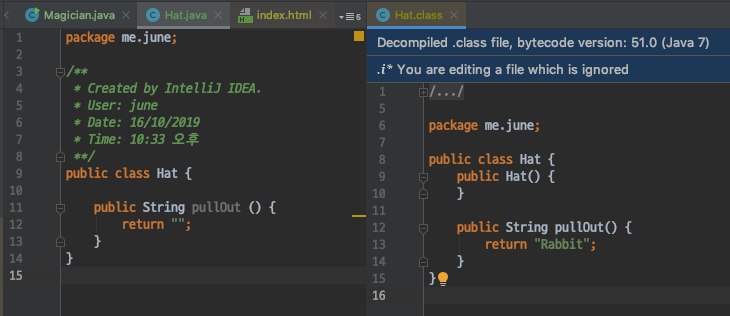

# 더 자바 코드를 조작하는 방법 - 모자에서 토끼를 꺼내는 마술
- 바이트코드 조작은 막강한 기능이다.
- 아무것도 없는 모자에서 토끼를 꺼내는 마술이 가능하다.

#### 바이트 코드 조작 라이브러리
- 바이트 코드 조작라이브러리는 크게 3가지로 주로 사용된다.
    - 1.ASM
    - 2.Javassist
    - 3.**ByteBuddy**

`ASM`
- 가장 고전적이고, 널리 쓰이는 라이브러리
- Visitor, Adapter Pattern을 잘 알고 있어야 사용이 가능하며 사용하기 어렵다.
- https://asm.ow2.io/

`Javassist`
- https://www.javassist.org/

`ByteBuddy`
- 문서가 잘 되어있고, 사용하기쉽다.
- 성능적인 면에서도 추천 하는 라이브러리이다.
- https://bytebuddy.net

#### ByteBuddy 사용하기
- ByteBuddy는 `쉽게 사용` 하는것을 목적으로 만들어진 라이브러리 이다.
- 기존의 ASM은 사용하기 위해 알아야할 지식들이 너무 많다.
- ByteCode의 구조도 잘 알아야만 사용할 수 있다.
- 하지만 ByteBuddy는 ByteBuddy API만 사용할줄 안다면 쉽게 바이트코드 조작이 가능하다.

의존성 추가
```xml
<dependency>
    <groupId>net.bytebuddy</groupId>
    <artifactId>byte-buddy</artifactId>
    <version>1.10.1</version>
</dependency>
```

`Magician`
- 모자에서 무언가를 꺼내는 마술사 클래스이다.
```java
public class Magician {

    public static void main(String[] args) {
        /* 아무것도 출력되지 않는다. */
       System.out.println(new Hat().pullOut());
    }
}
```

`Hat`
- 마술사가 사용할 모자 클래스이다.
- pullOut 메소드를 통해 모자에서 무언가를 꺼내며, 현재는 아무것도 들어있지 않다.
```java
public class Hat {

    public String pullOut () {
        return "";
    }
}
```

현재 상태에서는 마술사가 모자에서 게속해서 꺼낸다고 한들, 아무것도 나오지 않는다.

ByteBuddy를 사용해 모자에서 `토끼` 가 나오는 마술을 해보자.

```java
public class Magician {

    public static void main(String[] args) {

        /* 이 둘은 동시에 사용될 수 없다.
            ByteBuddy로 전작업을 미리한뒤 pullOut메소드를 실행해야한다.
            ASM을 내부적으로 사용한다.
        * */
        try {
            // ByteBuddy를 사용해 Hat 클래스를 재 정의한다.
            new ByteBuddy().redefine(Hat.class)
                    // pullOut 메소드를 가르채어 Rabbit이라는 값을 리턴하도록 변경한다.
                    .method(named("pullOut")).intercept(FixedValue.value("Rabbit"))
                    // 해당 파일을 target/classes 하위로 지정한다. (해당 클래스의 패키지 경로를 따라가기 때문에 me.june은 생략한다.)
                    .make().saveIn(new File("/Users/june/jvm/target/classes"));
        } catch (IOException e) {
            e.printStackTrace();
        }

        /* 아무것도 출력되지 않는다. */
//        System.out.println(new Hat().pullOut());
    }
}
```

ByteBuddy를 사용해서 Hat 클래스를 재정의 하였다.
- Hat클래스의 pullOut 메소드를 가로 챈 다음 Rabbit이라는 문자열을 리턴하도록 변경하였다.
- 변경된 Hat클래스를 해당 프로젝트의 target/classes 폴더로 저장한다.

#### 실행 결과



소스코드에서는 분명히 아무것도 리턴하지 않지만, class 파일에서는 Rabbit이라는 문자열을 리턴하도록 변경되었다.
- ByteBuddy를 이용해 바이트 코드를 수정한것이다.
- 소스코드와 클래스파일이 일치하지 않는다.
