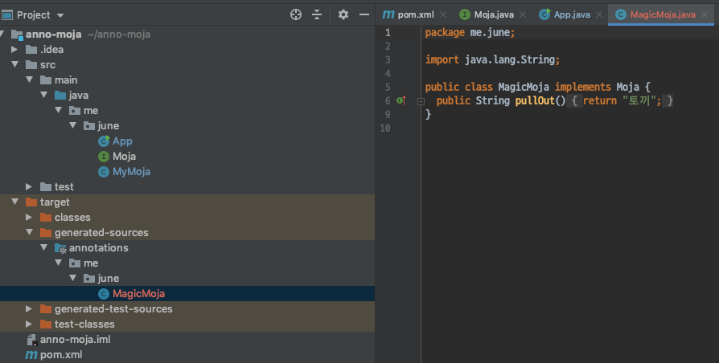

# 더 자바 코드를 조작하는 방법 - 애노테이션 프로세서 2
- 애노테이션 프로세서를 사용하여 @Magic 애노테이션을 가지고 있는 경우 Moja 타입의 인터페이스를 구현하는 MagicMoja 클래스를 생성해본다.

#### JavaPoet
- 새로운 소스코드를 생성할때 매우 유용한 라이브러리가 있다.
- 매우 직관적인것이 장점.

```xml
<dependency>
    <groupId>com.squareup</groupId>
    <artifactId>javapoet</artifactId>
    <version>1.11.1</version>
</dependency>
```

#### 애노테이션 프로세서 구현하기 2
- 지난번에 이어 애노테이션 프로세서 구현해보자.
```java
@Override
public boolean process(Set<? extends TypeElement> annotations, RoundEnvironment roundEnv) {
    /* 적절한 위치에 애노테이션을 사용했는지 체크 */
    /* 애노테이션을 사용한 엘리먼트에 대한 정보를 가져올수 있다.*/
    Set<? extends Element> elementsAnnotatedWith = roundEnv.getElementsAnnotatedWith(Magic.class);
    for (Element element : elementsAnnotatedWith) {
        /* 애노테이션이 인터페이스 아닌곳에 사용했을 경우 */
        if (element.getKind() != ElementKind.INTERFACE) {
            processingEnv.getMessager().printMessage(Diagnostic.Kind.ERROR, "@Magic 애노테이션은 Interface만 지원하는 애노테이션 입니다.");
        } else {
            // 로깅
            processingEnv.getMessager().printMessage(Diagnostic.Kind.NOTE, "Processing " + element.getSimpleName());
        }

        TypeElement typeElement = (TypeElement) element;
        // Java Poet으로 가져옴
        // 클래스 정보들을 참조할 수 있다.
        ClassName className = ClassName.get(typeElement);

        // pullOut 메소드를 구현한다.
        MethodSpec pullOut = MethodSpec.methodBuilder("pullOut")
                .addModifiers(Modifier.PUBLIC)
                .returns(String.class)
                .addStatement(String.format("return \"%s\"", "토끼"))
                .build();

        // 풀패키지 경로가아닌 클래스명만 정해주면 된다.
        TypeSpec magicMoja = TypeSpec.classBuilder("MagicMoja")
                .addSuperinterface(className)
                .addModifiers(Modifier.PUBLIC) // public class 로 정의
                .addMethod(pullOut) // 위에서 생성한 메소드를 넣어준다.
                .build();

        // 소스파일 만들기
        // 모든 process 클래스를 상속받은경우 protected한필드가 존재함.
        Filer filer = processingEnv.getFiler();
        try {
            // Java poet을 사용하면 손쉽게 만들수 있음.
            JavaFile.builder(className.packageName(), magicMoja)
                .build()
                .writeTo(filer);
        } catch (IOException e) {
            processingEnv.getMessager().printMessage(Diagnostic.Kind.ERROR, "FATAL ERROR: " + e);
        }
    }
    return true;
}
```

`ClassName`
- Element를 TypeElement로 변환한뒤, JavaPoet을 사용하여 ClassName 타입의 객체로 변환한다.
- 이 타입의 객체는 클래스 정보들을 참조할 수 있다.

`MethodSpec`
- 우리가 생성할 클래스의 메소드 스팩을 구현한다.
- methodBuilder(메소드명): 구현할 메소드의 이름을 정의한다.
- addModifireds(접근지시자를): 메소드의 접근 지시자를 정의한다.
- returns: 해당 메소드에서 리턴하는 타입을 정의한다.
- addStatement: 메소드 내부의 스테이트먼트를 정의한다.
    - return "토끼"; 
    - 우리는 모자에서 토끼를 꺼내는 마술을 부릴것이기 때문에 토끼를 리턴하도록 한다.
- build 를 통해 메소드 스팩 구현을 마친다.

`TypeSpec`
- 우리가 생성한 클래스의 스팩을 구현한다.
- classBuilder(클래스명): 구현할 클래스 명을 정의한다. (이때 풀패키지 경로가아닌 심플 네임만 지정해준다.)
- addSuperInterface(인터페이스): 우리가 생성할 클래스가 구현할 인터페이스에 대한 정보를 정의한다.
- addModifiers(접근지시자를): 클래스의 접근 지시자를 정의한다.
- addMethod(메소드스팩): 클래스에 추가할 메소드 스팩을 정의한다. (위에서 정의한 pullOut 메소드를 추가한다.)
- build 를 통해 클래스 스팩 구현을 마친다.

`Filer`
- 소스코드, 클래스 코드 및 리소스를 생성할 수 있는 인터페이스이다.
- JavaPoet를 사용한다면 보다 쉽게 생성이 가능하다.

애노테이션 프로세서 구현이 끝났다면 이전과 마찬가지로, 빌드를 해준뒤 다시 mvn install을 해주자.

#### 애노테이션 프로세서 사용해보기
- 다시 이전 프로젝트로 돌아와 메이븐 리프래시를 해주고 빌드를 실행하면 다음과 같이 target/classes/generated-sources/annotations/me/june/MagicMoja 클래스가 생성 된다.


