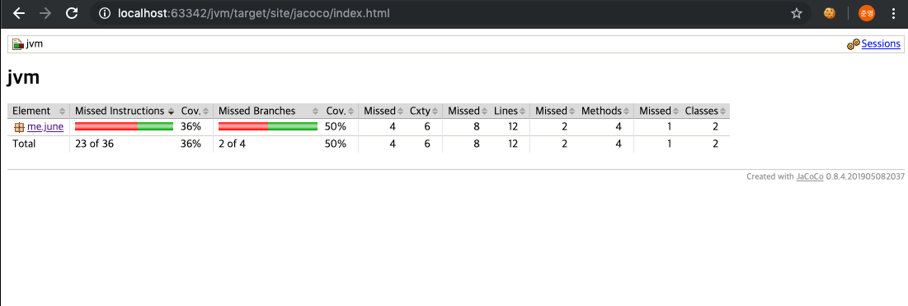
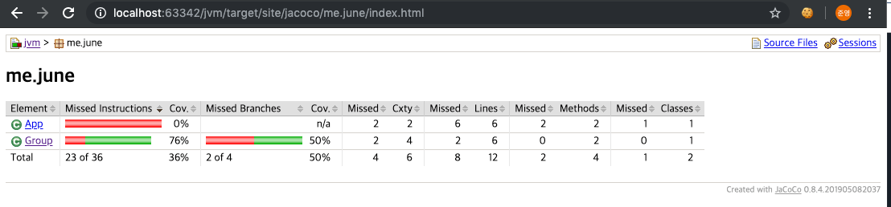
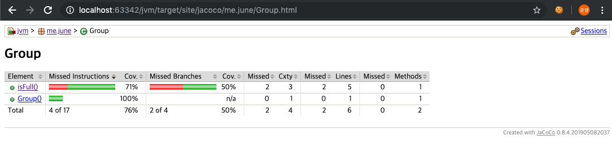

# 더 자바 코드를 조작하는 방법 - 코드 커버리지 
- 바이트 코드를 조작하는 대표적인 예인 코드 커버리지툴을 살펴본다.

#### 코드 커버리지란 ?
- 코드 커버리지는 테스트코드가 내 소스코드의 어느정도를 테스트하는지 확인하는 툴이다.
- 최근에 가장 많이 사용하는 jacoco 라는 툴을 살펴본다

#### jacoco 플러그인 추가하기
- maven pom.xml에 jacoco 플러그인 설정을 추가한다.
```xml
  <build>
      <plugins>
        <plugin>
          <groupId>org.jacoco</groupId>
          <artifactId>jacoco-maven-plugin</artifactId>
          <version>0.8.4</version>
          <executions>
            <execution>
              <goals>
                <goal>prepare-agent</goal>
              </goals>
            </execution>
            <execution>
              <id>report</id>
              <phase>prepare-package</phase>
              <goals>
                <goal>report</goal>
              </goals>
            </execution>
          </executions>
        </plugin>
      </plugins>
  </build>
```

#### 테스트 코드 작성하기
`Group`
- Group 이라는 간단한 클래스를 생성한다.
- 그룹에는 최대 참가자와 현재 신청자 정보를 가지고 있으며, isFull() 메소드를 통해 참가신청이 완료되었는지 확인할 수 있다.
- 이때 최대 참가자의 수가 0 이라면 무한 정으로 받을수 있는 그룹이다.
```java
public class Group {

    /* 최대 참가자 */
    int maxNumberOfAttendees;

    /* 현재 신청자 */
    int numberOfEnrollment;

    public boolean isFull () {
        if (maxNumberOfAttendees == 0) {
            return false;
        }
        if (numberOfEnrollment < maxNumberOfAttendees) {
            return false;
        }
        return true;
    }
}
```

`GroupTest`
- Group클래스의 isFull 메소드를 테스트하는 간단한 코드이다.
- group을 생성하고, 최대 참가자를 100명으로 설정한다.
- 현재 참가자수를 10명으로 지정한뒤, isFull() 메소드를 통해 현재 참가신청이 완료되었는지 확인해본다.
- 기대값은 false 이다.
```java
public class GroupTest {

    @Test
    public void isFull () {
        Group group = new Group();
        group.maxNumberOfAttendees = 100;
        group.numberOfEnrollment = 10;

        Assert.assertFalse(group.isFull());
    }
}
```

#### Jacoco 실행해보기
간단한 테스트 코드 작성이 완료되었다면 Jacoco를 통해 코드 커버리지를 확인해보자.

다음 메이븐 명령을 통해 Jacoco를 실행한다.
```
mvn clean verify
```

해당 명령어를 실행하고나면 Jacoco 플러그인도 함께 실행된다.
실행 결과는 `target/site/jacoco/index.html` 에서 확인할 수 있다.


#### 실행 결과





실행 결과를 보면 소스 코드레벨에서 노란색, 붉은색, 초록색 라인이 존재한다.
- 노란색 라인은 해당 조건식의 한가지 경우만 테스트했다는 것을 의미한다.
    - 즉 true, false중 하나의 케이스만 테스트된것
- 붉은색 라인은 해당 라인이 실행되는 테스트가 존재하지 않는다는 의미이다.
- 초록색 라인은 해당 라인이 통과되었다는 의미이다.

- 이 모든것이 바이트코드 조작과 관련이 존재한다.
    - 바이트 코드 조작을 통해 소스코드를 읽어들인 다음, 특정 지점마다 포인트를 지정한다.
    - 해당 포인트를 통과하는 테스트코드가 존재하는지 여부에 따라 코드 커버리지를 측정한다.


빌드시 특정 커버리지 이상을 통과하지 못하면 빌드에 실패하도록 설정도 가능하다.
- 다음은 50%이상을 통과하지 못한다면 빌드에 실패하도록 하는 설정이다.
```xml
<execution>
    <id>jacoco-check</id>
    <goals>
        <goal>check</goal>
    </goals>
    <configuration>
        <rules>
            <rule>
                <element>PACKAGE</element>
                <limits>
                    <limit>
                        <counter>LINE</counter>
                        <value>COVEREDRATIO</value>
                        <minimum>0.50</minimum>
                    </limit>
                </limits>
            </rule>
        </rules>
    </configuration>
</execution>
```
