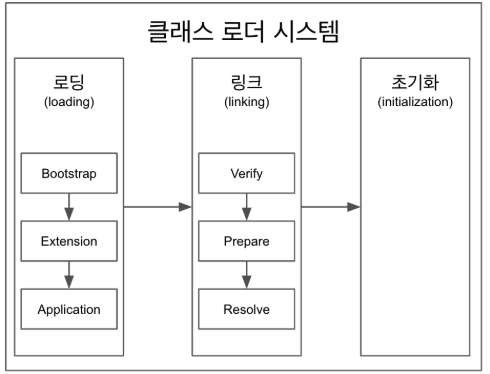

# 더 자바 코드를 조작하는 방법 - 클래스로더 시스템

#### 클래스 로더
- 클래스 로더의 처리 과정은 로딩, 링크, 초기화 3단계로 나뉜다.
- 로딩 -> 링크 -> 초기화 순으로 진행된다.

##### 로딩
- 클래스 로더가 .class파일을 읽고, 내용에 따라 적절한 바이너리 데이터를 생성하고, 메소드 영역에 저장한다.

`메소드 영역에 저장되는 데이터`
- FQCN
    - 풀패키지 경로
- 클래스 인지 인터페이스 인지 Enum 인지 구분을 한다
- 메소드와 변수
- 로드가 끝나면 해당 클래스타입의 Class객체를 생성하여 힙 영역에 저장한다.

- 클래스로더는 3개의 계층구조로 이루어져 있으며 3가지 기본 클래스 로더가 제공된다.
    - 부트스트랩 클래스 로더 (네이티브)
    - 플랫폼 클래스 로더
    - 애플리케이션 클래스 로더

`부트스트랩 클래스 로더`
- JAVA_HOME\lib에 존재하는 코어 자바 API를 제공한다.
- 최상위 우선순위를 가진다.

`플랫폼 클래스 로더`
- JAVA_HOME\lib\ext 폴더 혹은 java.ext.dirs 시스템 변수에 해당하는 위치에 존재하는 클래스를 로드한다.

`애플리케이션 클래스로더`
- 애플레케이션 클래스패스 에서 클래스를 로드한다.

`클래스로더의 로드 과정`
- 1.부트스트랩 클래스 로더에게 요청한다.
- 2.플랫폼 클래스 로더에게 요청한다.
- 3.애플리케이션 클래스로더가 로드를 시도한다.
- 4.모두 읽지 못한다면 **ClassNotFoundException** 예외가 발생한다.

##### 링크
- Verify
    - .class 파일의 형식이 유효한지 검증한다.
- Prepare
    - 클래스 변수와와 기본값에 필요한 메모리를 준비하는 과정
- Resolve (Optional)
    - 심볼릭 메모리 렌퍼런스를 메소드 영역에 존제하는 실제 레퍼런스로 교체한다.
    - 이때 발생할 수 있고, 실제로 사용할때 일어날수 도 있음

`심볼릭 레퍼런스`
- 실제 레퍼런스를 가리키고 있지 않은 상태
- 논리적인 레퍼런스이다.

##### 초기화
- static 변수의 값을 초기화한다
- statc 블럭을 초기화한다.
