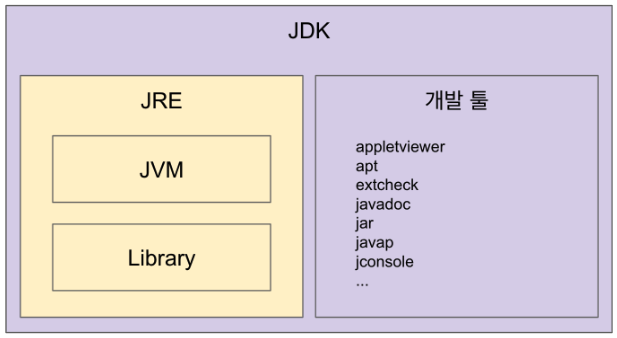

# 더 자바 코드를 조작하는 방법 - JVM, JRE, JDK 이해하기

### JVM (Java Virtual Machine)
- 자바 가상머신으로 자바 바이트 코드를 인터프리터, JIT컴파일러를 사용해서 Native OS 에 최적화된 코드로 변형한 뒤 실행하는 역할을 한다.
- 바이트 코드를 실행하는 표준이자 구현체 이다.
    - JVM 자체는 표준이며, 특정 벤더가 구현한 JVM 이 구현체이다
- JVM 스펙
    - https://docs.oracle.com/javase/specs/jvms/se11/html/
- 특정 플랫폼(OS)에 종속적이다.

`JVM의 역할`
- 클래스를 읽어 들인다.
- 메모리에 로드한다.
- 여러 구역으로 나뉘어진 메모리 공간을 관리한다.
- 바이트 코드를 실행

`벤더`
- 오라클, 아마존, Azul ...

### JRE(Java Runtime Environment)
- JVM 홀로 제공 되지않으며 최소한의 배포단위가 JRE이다.
- JVM과 몇몇 라이브러리를 같이 배포한다.
- Java 애플리케이션을 실행하도록 하는것이 목적이다.
- Java 애플리케이션을 실행하기위한 최소한의 패키지이다.
- 개발시 필요한 툴들은 제공하지 않는다.
- 자바 컴파일러는 들어있지 않음

### JDK(Java Development Kit)
- JRE + 개발에 필요한 툴
- 자바 11부터는 JDK만 제공하고, JRE를 따로 제공하지 않는다.
- Write One Run Anywhere
- Java9 부터 모듈 시스템을 제공한다.
- 모듈 시스템을 이용하여 JRE를 구성할수 있다.
    - Jlink

### 자바
- 프로그래밍 언어
- JDK에 들어있는 자바 컴파일러를 사용하여 바이트코드로 컴파일 할 수 있다.
- 자바를 JDK, JRE, JVM을 통틀어 말하는 케이스가 많다.
- 자바 유료화 ? -> 오라클에서 만든 Oracle JDK11 부터 상용으로 사용시 유료이다.
    - https://medium.com/@javachampions/java-is-still-free-c02aef8c9e04

### 타 프로그래밍 언어 지원
- JVM기반으로 작동하는 프로그래밍 언어
- 클로저, 그루비, JRuby, Jython, Kotlin, Scala..

#### 참조
- JIT 컴파일러
    - https://aboullaite.me/understanding-jit-compiler-just-in-time-compiler/
- JDK, JRE 그리고 JVM
    - https://howtodoinjava.com/java/basics/jdk-jre-jvm/
    - https://en.wikipedia.org/wiki/List_of_JVM_languages
