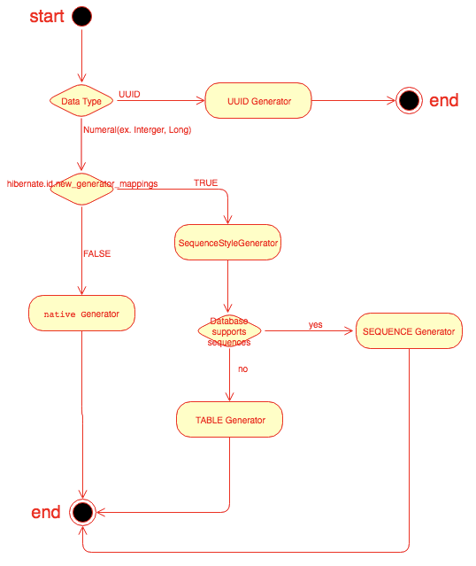

# JPA SequenceGenerator 사용시 주의점

## @GeneratedValue

JPA 에서 제공하는 애노테이션이며, 엔티티 식별자의 생성을 JPA 에게 위임하는 애노테이션이다.

`GeneratedValue.java`
```java
@Target({ElementType.METHOD, ElementType.FIELD})
@Retention(RetentionPolicy.RUNTIME)
public @interface GeneratedValue {
    GenerationType strategy() default GenerationType.AUTO;

    String generator() default "";
}
```

`GenerationType.java`
```java
public enum GenerationType {
    TABLE,
    SEQUENCE,
    IDENTITY,
    AUTO;
}
```

- 식별자의 **생성 전략** 을 지정할 수 있는데, TABLE, SEQUENCE, IDENTITY, AUTO 4가지로 구분된다.

| 전략 | 설명 |
| --- | --- |
| IDENTITY | 식별자 생성을 데이터베이스에 위임한다. |
| SEQUENCE | 데이터베이스의 시퀀스를 사용한다. |
| TABLE | 키 생성용 테이블을 사용한다. |
| AUTO | 데이터베이스 방언에 따라 자동 지정된다. default |

> 일반적으로 데이터베이스에 위임해서 사용할 것을 권장한다.

각 전략에 대해 자세히 살펴보자

#### IDENTITY
- 기본키 생성을 데이터베이스에 위임한다.
    - 키 생성의 **동시성 처리** 도 데이터베이스에 위임
- 주로 MySQL, PostgreSQL, SQL Server 등에서 사용한다.
- JPA 는 보통 트랜잭션 커밋 시점에 INSERT SQL 을 실행한다.
- 하지만 AUTO_INCREMENT 를 사용할 경우, 데이터베이스에 INSERT SQL 을 실행한 후에 엔티티의 식별자 값을 알 수 있다.
- IDENTITY 전략은, 엔티티가 persist 되는 시점에 **즉시 INSERT SQL 을 실행** 하고 DB 에서 식별자 값을 가져온다.
    - 이는 단점이 될 수 있다.
    - 영속성 컨텍스트에서 엔티티를 관리하려면 식별자가 필요하다.
    - 하지만 데이터베이스에 INSERT 되는 시점에 식별자 값을 알 수 있기 때문에, persist 를 호출하는 시점에 쿼리를 해야한다는 제약사항이 생긴다.

#### SEQUENCE
- 시퀀스는 유일한 값을 순서대로 생성하는 특별한 데이터베이스 오브젝트 이다.
- 주로 Oracle, PostgreSQL, H2 등에서 사용한다.
- 엔티티를 persist 하는 시점에 데이터베이스 INSERT SQL 을 날리지 않고, 시퀀스 값만 얻어 영속성 컨텍스트에 저장한 뒤 트랜잭션 커밋시점에 INSERT SQL 을 날린다.
- 엔티티 별로 시퀀스를 별도로 관리하고 싶다면 **@SequenceGenerator** 를 사용해야 한다.

> @SequenceGenerator 를 사용하지 않으면 기본적으로 hibernate sequence 를 전역에서 사용한다.

##### @SequenceGenerator

```java
@SequenceGenerator(
    name = "ENTITY_ID_GENERATOR",
    sequenceName = "ENTITY_SEQUENCES",
    initialValue = 1, allocationSize = 1)
```

`주요 속성 및 설명`

| 속성 명 | 설명 |
| --- | --- |
| name | 식별자 생성기의 이름 \n 필수 값 |
| sequenceName | 데이터베이스에 등록된 시퀀스 명 \n 기본 값은 hibernate_sequence |
| initialValue | 시퀀스의 시작 값 \n 최초 생성시에 사용된다. \n 기본 값은 1 |
| allocationSize | 시퀀스 호출시 마다 증가하는 값 \n 성능 최적화에 사용된다. \n 데이터베이스 시퀀스 값이 1씩 증가하도록 설정되어 있다면, 반드시 1로 지정해야 한다. \n 기본 값은 50 |

##### allocateSize 의 기본값이 50인 이유
- allocateSize 의 값이 1인 경우, 매번 persist 할 때 마다, sequence.nextVal 로 DB 를 호출하게 되어 성능 이슈가 존재한다.
- 기본 설정으로 allocateSize 가 50 이면, DB 에는 미리 50을 올려놓고, 메모리상에서 1씩 올려서 50까지 사용한다.
- 만약 50까지 다사용했다면 다시 호출하여 DB의 값은 100으로 올려 이전 과정을 반복한다.
- 이 방법을 사용하면 다수 WAS 를 사용해도 동시성 문제가 해결된다.

#### TABLE
- 키 생성용 테이블을 하나 만들어, 데이터베이스의 시퀀스를 흉내내는 전략이다.
- 모든 데이터베이스에 적용이 가능하지만, 성능이 떨어진다.
- 마찬가지로 엔티티 별로 별도로 관리하고 싶다면, **@TableGenerator** 를 사용해야 한다.

##### @TableGenerator

```java
@TableGenerator(
        name = "ENTITY_ID_GENERATOR",
        table = "ENTITY_SEQUENCES",
        pkColumnValue = "ENTITY_ID",
        allocationSize = 1)
```

`주요 속성 및 설명`

| 속성 명 | 설명 |
| --- | --- |
| name | 식별자 생성기의 이름 \n 필수 값 |
| table | 키 생성 테이블 명 \n 기본 값은 hibernate_sequences |
| pkColumnName | 시퀀스 컬럼 명 \n 기본 값은 sequence_name |
| valueColumnName | 시퀀스 값 컬럼 명 기본 값은 next_val |
| pkColumnKey | 키로 사용할 값 이름 \n 기본 값은 엔티티 명 |
| initialValue | 시퀀스의 시작 값 \n 기본 값은 0 |
| allocationSize | 시퀀스 호출시 마다 증가하는 값 \n 성능 최적화에 사용된다 |

### 하이버네이트의 자동 키 생성 전략

`Flow Charts`



1. @GeneratedValue 가 적용된 데이터 타입을 확인하고, UUID 타입이라면 UUID Generator 를 사용한다.
2. @GeneratedValue 가 적용된 데이터 타입이 숫자 타입 (Long, Integer ...) 일경우, 하이버네이트의 hibernate.id.new_generator_mappings 속성 값 을 확인한다.
    1. FALSE 일 경우 Native Generator 를 사용한다.
       - Native Generator 는 하이버네이트에 설정된 Dialect 를 참조한다.
    2. TRUE 일 경우 **SequenceStyleGenerator** 를 사용한다.
        - 데이터베이스가 시퀀스를 지원한다면, SequenceGenerator 를 사용한다.
        - 만약 시퀀스를 지원하지 않는다면 TableGenerator 를 사용한다.


SequenceStyleGenerator 는 **optimizer** 들을 제공하고, 이를 이용해 성능 최적화에 활용할 수 있도록 제공한다.
- 구현체로 Hibernate 를 사용할 경우, 기본적으로 NoopOptimizer 를 사용한다. (incrementSize 의 값에 의해 Optimizer 가 결정되는데, 기본 값은 1)

> 키 생성 전략을 AUTO 로 지정 했을 경우에는, NoopOptimizer 를 기본으로 사용하게 된다.

@SequenceGenerator (@TableGenerator) 애노테이션을 사용해서 별도의 제너레이터를 사용하는 경우에는 **pooled Optimizer** 를 사용한다.
- 이는 allocationSize 값을 참조하여 최적화를 수행한다. 

JPA 에서 제공하는 애노테이션을 사용할 경우 다양한 옵티마이저들이 존재함에도 불구하고, 정해진 옵티마이저를 사용할 수 밖에 없다.\
Hibernate 에서 제공하는 @GenericGenerator 를 사용하면 Optimizer 를 직접 지정해서 최적화가 가능해진다. 

> spring boot 를 사용한다면, boot 버전에 따라 hibernate.id.new_generator_mappings 값이 달라지므로 주의해서 사용해야 한다.\
> 1.5.x : hibernate.id.new_generator_mappings: false\
> 2.x.x : hibernate.id.new_generator_mappings: true\
> hibernate 5.x 부터 hibernate.id.new_generator_mappings 의 기본값 이 true 로 변경되었다.

## 참고
- https://dzone.com/articles/jpa-hibernates-legacy-and
- https://docs.jboss.org/hibernate/orm/5.4/userguide/html_single/Hibernate_User_Guide.html#identifiers-generators-table
- https://vladmihalcea.com/hibernate-hidden-gem-the-pooled-lo-optimizer/
- https://github.com/hibernate/hibernate-orm/blob/2efacb6f239fa03c57c0f2bc9155418bafb9736c/hibernate-core/src/main/java/org/hibernate/id/enhanced/OptimizerFactory.java#L157