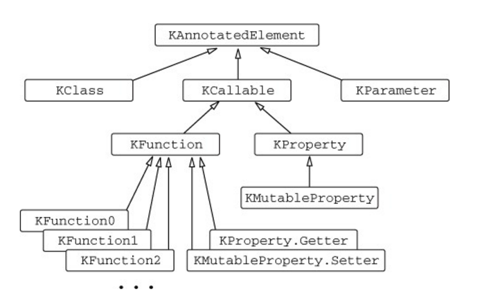

# Kotlin in Action

## 10장 애노테이션과 리플렉션

#### 애노테이션 선언과 적용
- 코틀린 애노테이션도 자바 애노테이션과 개념은 동일하다.
- 메타 데이터를 선언에 추가할 경우 애노테이션을 처리하는 도구가 컴파일 혹은 실행 시점에 적절한 처리를 한다.

#### 애노테이션 적용
- 자바와 동일한 방법으로 애노테이션 사용이 가능하다.
- @Deprecated 애노테이션을 예로 살펴보면 자바와 코틀린에서 의미는 동일하다.
- 하지만 코틀린에서는 replaceWith 파라메터를 통해 이전 버전을 대신할 패턴을 제시할 수 있다.

```kotlin
/**
 * 코틀린의 @Deprecated 는 자바와 동일한 의미를 가진다.
 * 하지만 ReplaceWith 파라메터를 통해 이전 버전을 대신할 패턴을 제시할 수 있다.
 */
@Deprecated("Use removeAt(index) instead. ", ReplaceWith("remoteAt(index)"))
fun remove(index: Int) { /* ... */ }
```

> 애노테이션의 인자는 원시 타입, 문자열, enum 클래스, 다른 애노테이션, 배열 이 들어갈 수 있다.

##### 애노테이션의 문법
- 클래스를 애노테이션 인자로 지정할 때는 @MyAnnotation(MyClass::class) 와 같이 ::class 를 클래스 명 뒤에 넣어야 함
- 다른 애노테이션을 인자로 사용 할 때 애노테이션 이름 앞에 @ 을 사용하지 않아야 함
- 배열을 인자로 지정하려면 arrayOf() 함수를 사용해야 한다.
- 애노테이션의 인자는 컴파일 시점에 알 수 있어야 한다. 프로퍼티를 인자로 사용하려면 const 변경자를 사용해 상수로 만들어야 한다.

#### 애노테이션 대상
- 애노테이션을 붙일때 예를 들어 getter 혹은 setter 에 애노테이션을 붙일지 표시할 필요가 생긴다.
- **사용 지점 대상 (use-site target)** 선언으로 애노테이션을 붙일 요소를 정할 수 있다.
```kotlin
@get:Rule
```
- 위 코드는 프로퍼티 getter 에 @Rule 애노테이션을 적용 하라는 의미이다.
- 자바에 선언된 애노테이션을 사용해서 프로퍼티에 애노테이션을 사용하는 경우 기본적으로 프로퍼티의 필드에 적용된다.
- 코틀린으로 선언된 애노테이션을 사용하면 프로퍼티에 직접 적용 가능한 애노테이션을 만들 수 있다.

`사용 지점 대상 지정시 지원 목록`
1. property - 프로퍼티 전체, 자바에서 선언된 경우에는 사용 불가능
2. field - 프로퍼티에 의해 생성되는 (뒷받침) 필드
3. get - 프로퍼티 게터
4. set - 프로퍼티 세터
5. receiver - 확장 함수 혹은 프로퍼티의 수신 객체 파라미터
6. param - 생성자 파라미터
7. setparam - 세터 파라미터
8. delegate - 위임 프로퍼티의 위임 인스턴스를 담아둔 필드
9. file - 파일 내에 선언된 최상위 함수와 프로퍼티를 담아두는 클래스

#### 자바 API를 애노테이션으로 제어
- 코틀린은 코틀린으로 선언한 내용을 자바 바이트코드로 컴파일 하는 방법과 코틀린 선언을 자바에 노출하는 방법을 제어하기 위한 애노테이션들을 제공한다.
- 예를들면 @Volatile 과 @Strictfp 애노테이션은 자바의 volatile 과 strictfp 키워드를 대신한다.

#### 애노테이션 선언
- 제이키드의 애노테이션을 예제로 애노테이션 선언하는 방법을 알아본다.

```kotlin
/**
 * 아래 선언된 애노테이션은 제이키드의 애노테이션중 하나이다.
 * 아무런 파라미터도 없는 가장 단순한 애노테이션의 형태
 * 애노테이션 선언 구문은 class 키워드앞에 annotation 변경자만 붙여주면 된다.
 */
annotation class JsonExclude
```

- 애노테이션 선언은 annotation class 로 부터 시작한다.
- 애노테이션 클래스는 선언이나 식 과 관련된 메타데이터의 구조를 정의하는 용도이기 때문에 클래스의 본문을 정의할 수 없다.
- 파라미터가 존재하는 애노테이션을 정의하려면 주 생성자에 파라메터를 다음과 같이 선언 해야한다.

```kotlin
/**
 * 애노테이션은 선언이나 식과 관련된 메타데이터 구조만을 정의한다.
 * 따라서 본문을 정의할 수 없으며, 파라미터가 존재하는 애노테이션을 정의하려면
 * 주 생성자에 파라미터를 정의해야 한다.
 */
annotation class JsonName(val name: String)
```

> 애노테이션 클래스에서는 모든 파라미터에 val 을 써야함에 주의하라.

- 위 선언을 자바 애노테이션 선언과 비교해보자.
```java
public @interface JsonName {
    String value();
}
```
- 코틀린에서는 name 이라는 프로퍼티를 사용했지만 자바에서는 value 라는 메소드를 사용했다.
- 자바에서 value 메소드는 특별한 메소드이다.
    - 자바에서 애노테이션을 적용할 때 value 를 제외한 모든 어트리뷰트에는 이름을 명시해야 한다.
- 코틀린에서 애노테이션을 적용할 때는 일반적인 생성자 호출과 동일하다.

#### 메타애노테이션 - 애노테이션을 처리하는 방법 제어
- 자바와 동일하게 코틀린에서도 메타애노테이션을 제공한다.
- **메타애노테이션 (meta-annotation)** 이란 애노테이션 클래스에 적용할수 있는 애노테이션을 말한다.
- 표준 라이브러리에도 몇가지 메타애노테이션이 존재하며 그중 대표적인 것은 @Target 이다.

```kotlin
/**
 * 표준 라이브러리에 있는 메타애노테이션인 @Target 은, 애노테이션을 적용할 수 있는 대상을 지정한다.
 * 애노테이션 클래스에 @Target 을 지정하지 않으면, 기본적으로 모든 선언에 적용이 가능하다.
 * AnnotationTarget Enum 에 적용된 Enum 들을 이용하여 클래스, 파일, 프로퍼티 등 정의를 할 수 있다.
 */
@Target(AnnotationTarget.FUNCTION)
annotation class Hello
```

#### @Retention 애노테이션
- 자바의 @Retention 애노테이션은 애노테이션을 소스 수준에서 유지할 것인지, 실행시점에 사용할 것인지 등을 지정하는 메타 애노테이션 이다.
- 자바 컴파일러의 기본 전략은 .class 파일에는 저장하지만 런타임에 사용하지 않는것이다.
- 코틀린 컴파일러의 기본 전략은 런타임에도 사용이 가능한 것이다.

#### 애노테이션 파라미터 클래스로 사용
- 클래스 참조를 파라미터로 하는 애노테이션을 선언 하면 어떤 클래스를 선언 메타데이터로 참조할 수 있다.
- 클래스를 참조타입으로 선언하려면 KClass 타입을 사용해야하며, 이는 자바의 java.lang.Class 타입과 같은 역할을 한다.
```kotlin
/**
 * 클래스 참조를 파라미터로 하는 애노테이션을 선언하면 클래스를 선언 메타 데이터로 참조할 수 있다.
 * 클래스를 참조타입으로 선언하려면 KClass 라는 타입을 사용해야한다.
 * 이는 자바의 java.lang.Class 와 같은 역할을 하는 코틀린 클래스이다.
 */
annotation class DeserializeInterface(val targetClass: KClass<out Any>)
```

- 클래스 참조를 파라미터로 넘기려면 ClassName::class 형태로 클래스명 뒤에 ::class 를 붙여 주어야한다.
```kotlin
/**
 * 클래스 참조를 파라미터로 넘기려면 <ClassName>::class 형태로 파라미터를 넘겨주어야 한다.
 */
@DeserializeInterface(String::class)
```

#### 애노테이션 파라미터로 제네릭 클래스 받기
- 제네릭 클래스를 인자로 받아야 한다면 KClass<out 클래스명<*>> 을 사용해야 한다.
    - 스타프로젝션을 사용하는 이유는 해당 제네릭에 어떤 타입이 올지 모르기 때문이다.
```kotlin
interface Animal<T>

annotation class AnnotationGenericClassParameter(
        val targetClass: KClass<out Animal<*>>
)
```

#### 리플렉션 - 실행시점에 코틀린 객체 내부 관찰
- **리플렉션** 은 실행 시점에 객체의 프로퍼티와 메소드에 접근할 수 있게 해주는 방법이다.
- JSON 직렬화 라이브러리 처럼, 타입과 관계없이 객체를 다루거나, 객체가 제공하는 메소드 혹은 프로퍼티 명을 실행 시점에서만 알수 있는 경우가 있다.
- 이런 경우 리플렉션을 사용한다.
- 코틀린에서 리플렉션을 사용하려면 두 가지 다른 리플렉션 API 를 다루어야 한다.

1. java.lang.reflect 에서 제공하는 자바 표준 리플렉션 API
    - 코틀린 클래스는 자바 바이트코드로 변환되기 때문에 자바 리플렉션 API 도 완벽히 지원한다.
2. kotlin.reflect 에서 제공하는 코틀린 리플렉션 API
    - 자바에는 없는 프로퍼티나 널이 될 수 있는 타입 과 같은 코틀린의 고유 개념에 대한 리플렉션을 제공한다.
    - 현재는 자바 리플렉션 API 를 완전히 대체가능한 복잡한 기능을 제공하지는 않는다.

#### 코틀린 리플렉션 API - KClass, KCallable, KFunction, KProperty
- KClass 는 java.lang.Class 에 해당하는 클래스이다.
- 해당 클래스를 사용하면 클래스 내에 있는 모든 선언을 열거하거나, 상위 클래스에 대한 참조를 얻는 등 작업이 가능하다.

`KClass API`
```kotlin
/**
 * KClass API 는 java.lang.Class 와 동일한 역할을 한다.
 * Person::class 라는 식을 사용하면 KClass 인스턴스를 얻을수 있다.
 * 실행 시점에 객체의 클래스를 얻으려면, 객체의 kClass 프로퍼티를 사용해, 자바클래스를 얻어야 하는데 이는 java.lang.Object.getClass() 와 동일하다.
 * 자바클래스를 얻어 .kotlin 확장 프로퍼티를 통해 코틀린 리플렉션 API 로 변환할 수 있다.
 */
fun main() {
    val person = Person("ncucu", 27)
    val kClass = person.javaClass.kotlin
    println(kClass.simpleName)
    kClass.memberProperties.forEach { println(it.name) }
}
```

`KClass interface`
- KClass 인터페이스의 일부를 살펴보면 다음과 같다.
- 여기서 주의할 점은 모든 멤버의 목록이 KCallable 인스턴스의 컬렉션이라는 것이다.
- KCallable 은 함수와 프로퍼티를 아우르는 공통 상위 인터페이스 이며 내부에는 call 메소드가 있다.
- 이를 사용하면 함수 혹은 프로퍼티의 게터를 호출할 수 있다.
```kotlin
public actual interface KClass<T : Any> : KDeclarationContainer, KAnnotatedElement, KClassifier {
    public actual val simpleName: String?
    public actual val qualifiedName: String?
    override val members: Collection<KCallable<*>>
    public val constructors: Collection<KFunction<T>>
    public val nestedClasses: Collection<KClass<*>>
    ...
}
```

`KCallable interface`
```kotlin
public actual interface KCallable<out R> : KAnnotatedElement {
    public fun call(vararg args: Any?): R
    ...
}
```

`코틀린 리플렉션 API 를 활용한 함수호출 예제`
```kotlin
fun foo(x: Int) = println(x)

/**
 * 코틀린 리플렉션 API 를 활용한 함수호출 예제
 */
fun main() {
    // ::foo 로 함수참조를 사용해 KFunction 클래스의 인스턴스를 받아온다.
    val kFunction = ::foo

    // KCallable 인터페이스의 call 메소드를 호출해서 해당 함수를 호출한다.
    kFunction.call(1)

    // KFunction 인터페이스의 invoke 메소드는 좀 더 구체적인 정보를 담고 있다.
    kFunction.invoke(1)
}
```

> call 메소드는 모든 타입의 함수에 적용할 수 있는 메소드지만, 타입 안전성을 보장해 주지 않는다.
> KFunction 의 인자와 반환 타입을 모두 안다면 invoke 메소드를 호출할 것은 권장한다.

`KFunctionN 인터페이스 ?`
- KFunction1 과 같은 타입은 파라미터 개수가 다른 여러 함수를 표현한다.
- KFunctionN 은 KFunction 을 확장한다.
- 이런 함수 타입들은 컴파일러가 생성한 **합성 타입 (synthetic compiler-generated type)** 이다.
- 코틀린에서는 컴파일러가 생성한 합성 타입을 사용하기 때문에 원하는 수 만큼 많은 파라미터를 가지는 함수 인터페이스를 사용할 수 있다.

`KProperty`
- KProperty의 call 메소드를 호출하면 프로퍼티의 게터를 호출한다.
- 프로퍼티 인터페이스는 get 메소드를 제공하기 때문에 이를 사용하는것을 권장한다.

```kotlin
/**
 * KProperty 를 이용하면 프로퍼티를 참조할 수 있다.
 * KFunction 과 마찬가지로 call 메소드를 사용할 수 있지만, set, get 과 같은 더 안전한 방법을 제공한다.
 */
var counter = 0

fun main() {
    val kProperty = ::counter

    kProperty.setter.call(1)
    kProperty.set(1)

    kProperty.getter.call()
    kProperty.get()
}
```

`Kotlin Reflection API interfaces`



