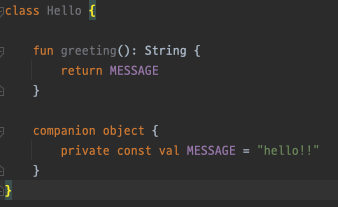
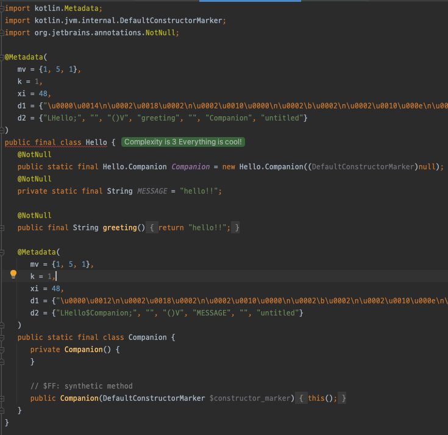

# Kotlin 1.1

## Coroutines
- Kotlin 1.1 의 새로운 주요 기능
- async / await / yield 와 같은 비동기 프로그래밍 패턴을 지원하는 방식이다.
- 코틀린의 코루틴 디자인의 핵심은, 구현이 언어가 아닌 **라이브러리의 일부** 라는 점이다.
- 때문에 특정 프로그래밍 패러다임이나, 동시성 라이브러리에 얽매이지 않는다.
- 코루틴은 **경량 스레드** 이고, 이를 일시중단 및 재개 할 수 있다.
- 코루틴은 suspend 함수를 통해 코루틴을 지원한다.
- 이 함수를 호출하면 코루틴을 일시중단 할 수 있으며, **익명함수** 를 이용해 새로운 코루틴을 시작할 수 있다. (suspend lambda)
- async / await 는 kotlinx.coroutines 에서 구현된다.

```kotlin
// 백그라운드 쓰레드 풀에서 코드 실행
fun asyncOverlay() = async(CommonPool) {
    // 두 개의 비동기 오퍼레이션 시작
    val original = asyncLoadImage("original")
    val overlay = asyncLoadImage("overlay")
    // 그리고 두 결과에 Overlay를 적용
    applyOverlay(original.await(), overlay.await())
}

// UI 컨텍스트에서 새로운 코루틴을 시작
launch(UI) {
    // 비동기 Overlay가 끝날때까지 대기
    val image = asyncOverlay().await()
    // 그리고 UI에 표시
    showImage(image)
}
```
- async {} block 을 이용해 코루틴을 시작하고, await 함수를 호출하면, 대기중인 작업이 실행되는 동안 코루틴의 실행이 일시 중단된다.
- 대기중인 작업이 완료되면 (다른 스레드) 재개된다.
- 표준 라이브러리는, yield / yieldAll 함수를 사용해 **시퀀스 지연 생성을 지원** 하게 위해 코루틴을 사용한다.

```kotlin
val seq = buildSequence {
    for (i in 1..5) {
        // i의 제곱을 생성
        yield(i * i)
    }
    // 범위를 생성
    yieldAll(26..28)
}
// 시퀀스를 출력
println(seq.toList())
// [1, 4, 9, 16, 25, 26, 27, 28]
```

## TypeAlias
- typealias 를 사용하면, 기본 타입을 다른 이름으로 정의할 수 있다.
- 이는 함수 타입이나 콜렉션과 같은 제네릭 타입에 매우 유용하다.

```kotlin
typealias OscarWinners = Map<String, String>

fun countLaLaLand(oscarWinners: OscarWinners) =
        oscarWinners.count { it.value.contains("La La Land") }

// Note that the type names (initial and the type alias) are interchangeable:
fun checkLaLaLandIsTheBestMovie(oscarWinners: Map<String, String>) =
        oscarWinners["Best picture"] == "La La Land"
```

## Bound callable references
- :: 연산자를 이용해, 특정 객체의 인스턴스로 부터 멤버 참조 (method 혹은 property)를 사용할 수 있다.
- 이전에는 람다식에서만 사용이 가능했다.

```kotlin
val numberRegex = "\\d+".toRegex()
val numbers = listOf("abc", "123", "456").filter(numberRegex::matches)
```

## sealed class 와 data class
- Kotlin 1.1 은 1.0 에 존재했던 sealed class 와 data class 에 대한 일부 제한을 제거 했다.
- top level 에 정의된 sealed class 의 하위 클래스를 top level 에 정의할 수 있있고, sealed class 의 중첩 클래스로도 정의할 수 있다.
- data class 는 다른 클래스를 구현할 수 있다. (상속 가능)

```kotlin
sealed class Expr

data class Const(val number: Double) : Expr()
data class Sum(val e1: Expr, val e2: Expr) : Expr()

object NotANumber : Expr()

fun eval(expr: Expr): Double = when (expr) {
    is Const -> expr.number
    is Sum -> eval(expr.e1) + eval(expr.e2)
    NotANumber -> Double.NaN
}

val e = eval(Sum(Const(1.0), Const(2.0)))
```

## Destructuring in lambdas
- 구조 분해 문법을 람다에서도 사용할 수 있다.

```kotlin
val map = mapOf(1 to "one", 2 to "two")
// before
println(map.mapValues { entry ->
    val (key, value) = entry
    "$key -> $value!"
})
// now
println(map.mapValues { (key, value) -> "$key -> $value!" })
```

## Underscores for unused parameters
- 여러 인자가 있는 람다가 있는 경우, _ (언더바) 를 이용해, 사용하지 않는 파라미터의 이름을 줄일 수 있다.
    - 구조분해 에서도 사용이 가능하다.
    
```kotlin
// 람다에서 사용
map.forEach { _, value -> println("$value!") }

// 구조분해 에서 사용
val (_, status) = getResult()
```

## Underscores in numeric literals
- Java8 가 마찬가지로, 리터럴 숫자에 대해 밑줄을 사용할 수 있다.

```kotlin
val oneMillion = 1_000_000
val hexBytes = 0xFF_EC_DE_5E
val bytes = 0b11010010_01101001_10010100_10010010
```

## Shorter syntax for properties
- getter 가 본문인 property (식이 본문인 함수 지원) 에 대해서 프로퍼티 타입을 생략할 수 있다.

```kotlin
data class Person(val name: String, val age: Int) {
    val isAdult get() = age >= 20 // 프로퍼티 타입을 'Boolean'으로 추론
}
```

## Inline property accessors
- property 에 backing field (뒷받침 필드) 가 없다면, inline 프로퍼티로 지정할 수 있고, 이는 inline 함수와 동일한 방식으로 컴파일 된다.
- property 전체에 inline 키워드를 사용할 수 있고 이런 경우 get, set 두가지에 대해 inline 을 적용한다.

```kotlin
public val <T> List<T>.lastIndex: Int
    inline get() = this.size - 1
```

## Local delegated properties
- 로컬 변수에 delegate property (by lazy) 를 적용할 수 있다.

```kotlin
val answer by lazy {
    println("Calculating the answer...")
    42
}
if (needAnswer()) {                     // returns the random value
    println("The answer is $answer.")   // answer is calculated at this point
}
else {
    println("Sometimes no answer is the answer...")
}
```

## Interception of delegated property binding
- provideDelegate 연산자를 사용해서 delegate property binding 이전에 가로챌 수 있다.
- 만약 property binding 이전에 값을 체크하고 싶다면 다음과 같이 수행이 가능하다.

```kotlin
class ResourceLoader<T>(id: ResourceID<T>) {
    operator fun provideDelegate(thisRef: MyUI, prop: KProperty<*>): ReadOnlyProperty<MyUI, T> {
        checkProperty(thisRef, prop.name)
        ... // property creation
    }

    private fun checkProperty(thisRef: MyUI, name: String) { ... }
}

fun <T> bindResource(id: ResourceID<T>): ResourceLoader<T> { ... }

class MyUI {
    val image by bindResource(ResourceID.image_id)
    val text by bindResource(ResourceID.text_id)
}
```

## Generic enum value access
- Enum 의 값을 일반적인 방법으로 열거할 수 있다.
- https://stackoverflow.com/questions/54998238/difference-between-enum-values-and-enumvalues-in-kotlin
```kotlin
enum class RGB { RED, GREEN, BLUE }

inline fun <reified T : Enum<T>> printAllValues() {
    print(enumValues<T>().joinToString { it.name })
}
```

## Scope control for implicit receivers in DSLs
- DSL 에서 암묵적 receiver 를 위한 범위 제어 제공
- @DslMaker 애노테이션을 사용하면, DSL Context 외부에서 receiver 들의 사용을 제한할 수 있다.

```kotlin
table {
    tr {
        td { + "Text" }
    }
}
```
- kotlin 1.0 에서는, td 에 전달한 람다에 dlT는 코드는 table, tr, td 에 전달된 세개의 암묵적인 receiver 에 접근한다.
- 이는 컨텍스트에서 의미 없는 메소드를 호출할 수 있게 허용한다.
- 예를 들면, td 안에서 td 안에 tr 태그를 넣는 등의 방식이 가능하다.
- kotlin 1.1 에서는 td 의 암묵적 receiver 에 정의된 메소드는 오직 td 에 전달된 람다에서만 접근할 수 있다.
- @DslMaker 메타애노테이션을 이용하면 된다.

## rem operator
- mod 연산자는 deprecated 되었고, rem 연산자를 대신 사용해야 한다.
- kotlin IDE Plugin 에서 발견된 known bug 때문
    - mod(Int) 에서 잘못된 결과가 나오는 이슈
    - https://youtrack.jetbrains.com/issue/KT-16372
    - https://youtrack.jetbrains.com/issue/KT-14650?_ga=2.178441060.1163326169.1626624548-14674876.1621248869&_gl=1*lfawd2*_ga*MTQ2NzQ4NzYuMTYyMTI0ODg2OQ..*_ga_0WQ2ZF5VGT*MTYyNjcyMzYyMC41LjEuMTYyNjcyMzY3Ny4w

## Standard Library

### String to number conversions
- String.toIntOrNull(): Int? , String.toDoubleOrNull(): Double? 과 같이 예외없이 숫자로 변환가능한 확장 함수 추가
- Int.toString() , String.toInt() , String.toIntOrNull() 같은 정수 변환 함수도 radix 파라미터를 가지는 함수를 추가 
    - 진수는 2~36 을 지정할 수 있다.

```kotlin
val port = System.getenv("PORT")?.toIntOrNull() ?: 80
```

### onEach()
- forEach 처럼 동작하지만, 동작 후에 iterable 을 반환한다.

```kotlin
inputDir.walk()
        .filter { it.isFile && it.name.endsWith(".txt") }
        .onEach { println("Moving $it to $outputDir") }
        .forEach { moveFile(it, File(outputDir, it.toRelativeString(inputDir))) }
```

### also(), takeIf(), and takeUnless()
- 모든 recevier 에 적용 가능한 확장함수 3가지가 추가되었다.
- **also** 는 apply 와 유사하다.
    - 수신객체를 받아, 수신 객체에 어떤 행위를 수행하고, 수신 객체를 반환한다.
    - apply 와의 차이는 apply 는 this 로 접근하지만, also 는 it 로 접근하다는 점이다.
- **takeIf** 는 filter 와 유사하다.
    - 수신객체가 조건을 충족하는지 검사하고, 수신객체를 반환하거나 null 을 반환한다.
    - 엘비스연산자와 조합하여 다음과 같이 사용할 수 있다.

```kotlin
val outDirFile = File(outputDir.path).takeIf { it.exists() } ?: return false
```

- **takeUnless** 는 takeIf 와 동일하지만 takeIf 와 반대의 조건으로 동작한다.

### groupingBy()
- key 를 이용해 콜렉션을 그루핑하고, 동시에 그룹을 fold (접을때) 사용할 수 있다.
- java 의 collect(Collectors.groupingBy(...)) 와 대응한다.

```kotlin
val frequencies = words.groupingBy { it.first() }.eachCount()
```

### Map.toMap() and Map.toMutableMap()
- 이 함수를 이용하면 map 을 쉽게 복사할 수 있다.

```kotlin
class ImmutablePropertyBag(map: Map<String, Any>) {
    private val mapCopy = map.toMap()
}
```

### Map.minus(key)
- Map 은 plus 연산자를 이용해 읽기전용 맵에 키값 쌍을 추가해 새로운 맵을 추가할 수 있었다.
- 하지만 반대의 기능을 제공되지 않았고, 맵에서 키를 제거하려면, Map.filter() 혹은 Map.filterKeys() 와 같이 쉽지 않은 방법을 사용해야 했다. 
- 이제 minus 연산자를 이용해 한개 키 삭제, 키 콜렉션 삭제, 키의 시퀀스로 삭제, 키를 배열로 삭제하는 4개의 연산자를 사용할 수 있다.

```kotlin
val map = mapOf("key" to 42)
val emptyMap = map - "key"
```

### minOf() and maxOf()
- 두  개 이상의 값 (기본 타입 혹은 Comparable 구현체) 에서 최솟값과 최대값을 찾는다., Comparable 구현체가 아닌 객체를 비교할 수 있도록 Comparator 함수를 인자로 받는 버전도 추가로 제공한다.

```kotlin
val list1 = listOf("a", "b")
val list2 = listOf("x", "y", "z")
val minSize = minOf(list1.size, list2.size)
val longestList = maxOf(list1, list2, compareBy { it.size })
```

### Array-like List instantiation functions
- 배열과 같은 리스트 생성 함수 제공
- Array 의 생성자와 유사하게, List / MutableList 에도 인스턴스 생성후 람다를 통해 초기화할 수 있도록 함수를 제공한다.

```kotlin
val squares = List(10) { index -> index * index }
val mutable = MutableList(10) { 0 }
```

### Map.getValue()
- 키가 존재하면 해당하는 값을 반환하고 키가 없다면 예외를 발생시킨다. 
- withDefault 를 사용해서 맵을 생성한 경우, 이 함수는 예외 대신 기본 값을 반환한다.

```kotlin
val map = mapOf("key" to 42)
// 널일수 없는 Int 값 42를 리턴
val value: Int = map.getValue("key")
val mapWithDefault = map.withDefault { k -> k.length }
// returns 4
val value2 = mapWithDefault.getValue("key2")
// map.getValue("anotherKey") // <- NoSuchElementException을 발생
```

### Abstract collections
- 코틀린 콜렉션 클래스를 구현할 때 추상 클래스를 기반 클래스로 사용할 수 있다. 
- 읽기 전용 콜렉션을 구현할 때에는 AbstractCollection , AbstractList , AbstractSet , AbstractMap 을 사용하고 
- 수정 가능 콜렉션은 AbstractMutableCollection , AbstractMutableList , AbstractMutableSet , AbstractMutableMap 을 사용한다. 
- JVM에서 수정 가능한 추상 콜렉션은 JDK의 추상 콜렉션의 대부분 기능을 상속한다.

### Array manipulation functions
- 표준 라이브러리로 배열의 요소간 연산을 위한 함수를 제공한다. 
- 연산에는 비교( contentEquals 와 contentDeepEquals ), 해시 코드 계산(contentHashCode 와 contentDeepHashCode ), 문자열 변환( contentToString 와 contentDeepToString )이 있다. 
- JVM(java.util.Arrays 에 대응하는 함수에 대한 별칭으로 동작)과 JS(코틀린 표준 라이브러리가 구현을 제공)에서 모두 지원한다.

```kotlin
val array = arrayOf("a", "b", "c")
println(array.toString()) // JVM 구현: 타입과 알 수 없는 해시 값 출력
println(array.contentToString()) // 리스트처럼 보기 좋게 출력
```

## JVM 백엔드

### Java 8 bytecode support
- 자바 8 바이트코드 생성 옵션을 제공한다( -jvm-target 1.8 명령행 옵션이나 대응하는 앤트/메이븐/그레이들 옵션). 
- 현재는 이 옵션이 바이트코드의 시멘틱을 변경하지 않지만(특히 인터페이스의 디폴트 메서드와 람다를 코틀린 1.0처럼 생성한다) 
- 향후에 이를 더 사용할 계획이다.

### Java 8 standard library support
- 자바 7과 8에 추가된 새로운 JDK API를 지원하는 표준 라이브러리 버전을 따로 제공한다. 
- 이를 사용 하려면 표준 kotlin-stdlib 대신에 kotlinstdlib-jre7 과 kotlin-stdlib-jre8 메이븐 아티팩트를 사용하면 된다. 
- 이 아티팩트는 kotlin-stdlib 를 일부 확장한 것으로 의존성 전이로 kotlin-stdlib 를 포함한다.

### Parameter names in the bytecode
- 파라미터 이름을 바이트코드에 저장하는 것을 지원한다.
- -java-parameters 커맨드라인 옵션을 이용해 활성화 할 수 있다.

### Constant inlining
- 컴파일러가 **const val** 프로퍼티의 값을 상수 사용 위치에 **인라인** 한다.





### Mutable closure variables
- 람다에서 수정가능한 클로저 변수를 캡쳐링하기 위해 사용된 박싱 클래스는 더이상 volatile 필드를 가지지 않는다.
- 이 변화는 성능을 향상시키지만, 매우 드물게 race condition 이 발생할 수 있다.
- 만약 동시성 문제에 영향을 받는다면, 변수 접근시 동기화 방식을 제공해야 한다.

## 참고
- https://kotlinlang.org/docs/whatsnew11.html