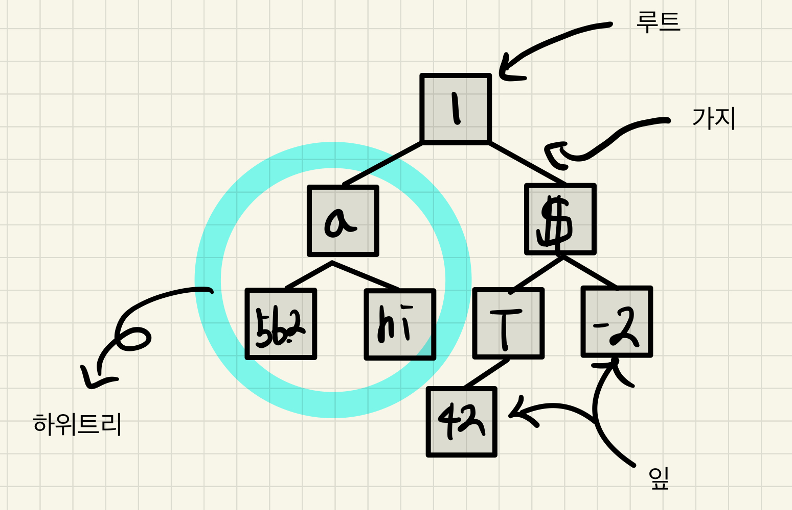
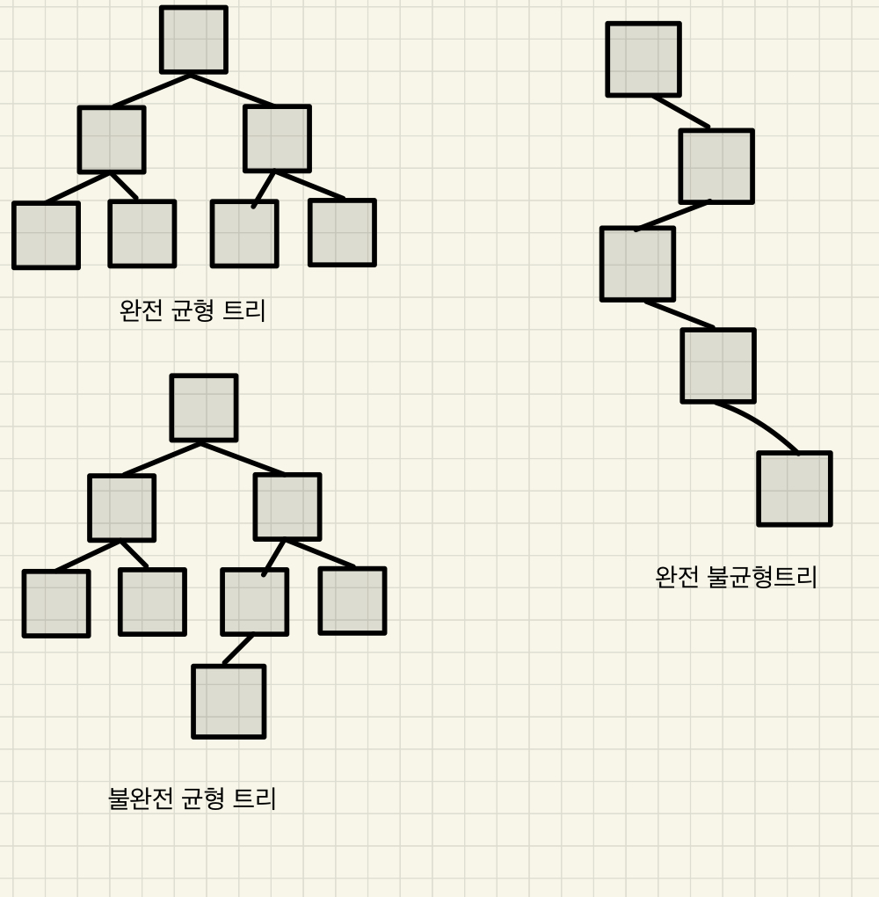

# 코틀린을 다루는 기술

## 10장 트리를 사용한 데이터 처리
- 단일 연결리스트는 불변 데이터 구조 중 많이 쓰이는 구조이지만 원소에 접근하는 복잡도가 **원소 개수에 비례한다** 는 단점이 존재한다.
- 이런 문제를 해결하는 데이터 구조인 **이진 트리 (Binary Tree)** 에 대해 알아본다.

### 이진 트리
- **데이터 트리 (data tree)** 는 각 원소가 두 개 이상의 원소와 연결된 데이터 구조이다.
- 트리에서 각 원소는 **노드 (Node)** 라고 표현한다.
- 각 원소는 어떤 개수의 다른 원소와도 연결될 수 있다.
- 이진 트리는, 이름에서 알 수 있듯이 각 노드가 최대 두개의 원소와 연결된 트리이다.
- 이런 연결을 **가지 (Branch)** 라고 한다.

`이진 트리 예`

- 위 예시는 트리의 원소의 타입이 다르기 때문에 일반적인 트리는 아니다.
- Any 의 트리를 표현한다.
- 위 그림에서 트리를 **재귀적인 구조** 로 볼 수 있다.
- 각 가지는 새로운 트리 이며 이를 **하위 트리 (Sub Tree)** 라고 한다.
- 위 그림을 보면 원소가 하나만 연결된 트리도 있는데, 해당 원소에도 빈 가지가 두 개 있는것으로 취급한다.
- 이런 끝 원소를 **잎 (leaf)** 이라고 한다.

> 모든 원소에 가지 2개가 있거나, 아에 없다면 이를 **포화된 트리** 라고 한다.

### 균형 트리와 불균형 트리
- 이진 트리는 균형잡힌 정도가 다를 수 있다.
- 완전 균형 트리는, 모든 하위 트리마다 같은 수의 원소가 들어있는 트리이다.
- 완전 균형 이진 트리는, **완벽한 (Perfect)** 트리 라고도 한다.

`트리의 종류`

### 트리의 크기 높이 깊이 살펴보기
- 원소의 개수를 트리의 **크기 (size)** 라고 한다.
- 트리 계층의 수를 **높이 (height)** 라고 한다.
  - 이때 트리 루트가 들어있는 계층은 높이에서 제외한다.
- 위 그림의 트리에서 완전 균형 트리의 높이는 2이다.
- 불완전 균형 트리는 높이가 3이고, 완전 불균형 트리는 높이가 5이다.

### 빈 트리와 트리의 재귀적 정의
- 트리의 정의를 정리하면 다음 둘 중 하나이다.
1. 빈 트리
2. 루트 원소에 가지가 두개 있고, 각 가지는 트리이다.

### 잎 트리
- 이진 트리를 다른 방식으로 표현하는 경우도 존재한다.
- 여기서의 트리는, 가지들이 값을 저장하지 않고, 끝 노드만 값을 저장한다.
- 끝 노드를 잎 이라고 부르기 때문에 이러한 트리르 **잎 트리 (leafy tree)** 라고 한다.

### 순서가 있는 이진트리와 이진 검색 트리
- 