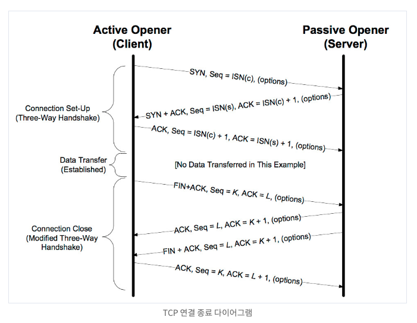

# TIME_WAIT
- TIME_WAIT 이란, TCP 상태의 가장 마지막 단계이다.
- Active Close, 먼저 close() 를 요청한 곳에서 최종적으로 남게되는 상태이고 기본 설정은 2MSL 동안 유지 된다.

## 4-WAY HANDSHAKE


- 3-way handshake 가 연결을 확립하는 과정이라면,
- 4-way handshake 는 **연결을 종료** 하는 과정이다.

`패킷 타입 플래그`
```
[S] – SYN (Start Connection)
[.] – No Flag Set
[P] – PSH (Push Data)
[F] – FIN (Finish Connection)
[R] – RST (Reset Connection)
```

## TIME_WAIT 상태는 왜 필요한가?
- TIME_WAIT 상태가 짧을 경우 발생 가능한 문제는 두가지가 있다.

1. 지연 패킷이 발생할 경우
    - 이미 다른연결로 진행된 상태라면, 지연 퍂킷이 뒤늦게 돋라해 문제가 발생한다.
    - 매우 드문 경우로 SEQ 까지 동일하다면 잘못된 데이터처리가 발생하고 데이터 무결정 문제를 초례한다.
2. 원격 종단의 연결이 닫혔는지 확인해야 할 경우
    - 마지막 ACK 유실시 상대방은 LAST_ACK 상태에 빠지게 된다.
    - 새로운 SYN 패킷 전달시 RST 를 리턴한다.
    - 새로운 연결은 오류를 내머 실패한다. (이미 연결을 시도한 상태이기 때문에 접속 오류 메시지가 출력됨)
    - 반드시 TIME_WAIT 가 일정 시간 남아있어 **패킷의 오작동** 을 막아야 한다.

> RFC 793 에는 TIME_WAIT 을 2MSL 로 규정했으며, CentOS 기준으로 기본 설정값은 1분이다.
> 이는 커널헤더 **include/net/tcp.h** 에 하드코딩 되어있으며 변경이 가능하다.


## 오해
- 서버가 또 다른 서버에 클라이언트로 접속하지만 않는다면 자신의 로컬 포트는 사용할 일이 없으며, 
- 리눅스의 로컬 포트 범위는 3만개 정도로 설정되어 있다. 마찬가지로 이론적으로는 3만개의 서버에 동시 접속이 가능하다.
- 많은 사람들이 오해하는것 처럼 서버가 로컬포트를 사용하고, 로컬포트는 단 하나의 소켓에만 바인딩 된다고 가정한다면 로컬 포트는 (2^16)-1 = 65,535개가 최대일 것이다.
- 하지만 서버가 할당하는 것은 포트가 아닌 **소켓** 이며, 서버의 포트는 최초 bind 시 하나만 사용한다.
- 로컬 포트를 할당하는 것은 **클라이언트** 이고, 클라이언트가 연결시 로컬 포트를 임의로 바인딩하며 서버의 소켓과 연결된다.

> 만약 서버투 서버로 대용량 API 콜이 발생할 경우 한대의 클라이언트에서 최대 요청수는 500RPS 이다. (3만개)

## 포트 재사용
- 위 수치를 넘어설 경우 클라이언트의 로컬 포트가 고갈될 것이며 TIME_WAIT 상태를 재사용해야 한다.
   - Cannot assign requested address 오류가 발생

1. 서버에 TIME_WAIT 상태가 남아 있으며, 클라이언트의 로컬 포트가 고갈된 경우
2. 클라이언트에 TIME_WAIT 상태가 남아 있으며, 클라이언트의 로컬 포트가 고갈된 경우
3. 클라이언트에 TIME_WAIT 상태가 남아 있으며, 클라이언트의 로컬 포트가 고갈되고, 서버의 다른 포트에 접속할 경우

