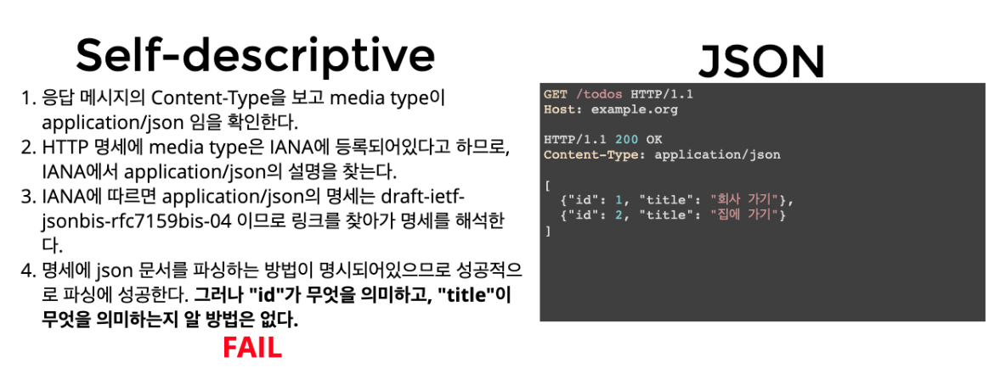
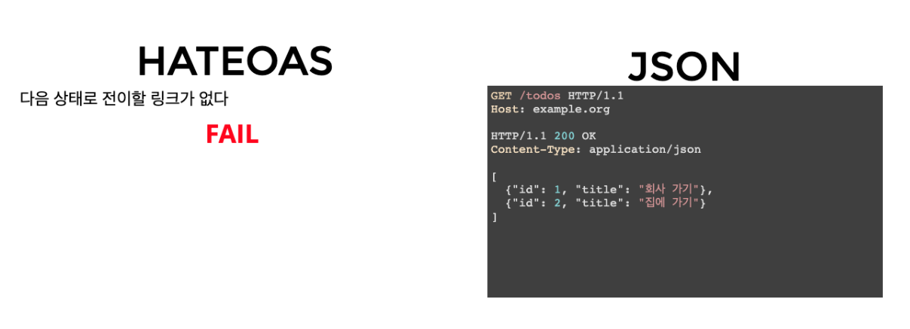

# RESTful API


RESTful API의 목적은 이해하기 쉽고 사용하기 쉬운 REST API를 만드는것


## REST


**RE**presentational **S**tate **T**ransfer 의 약자

인터넷 상의 시스템 간의 상호 운용성을 제공하는 방법중 하나이다.

웹을 깨뜨리지 않으면서 HTTP를 진화시키는 방법

시스템 제 각각의 **독립적인 진화를 보장**하기 위한 방법


> HTTP URI(Uniform Resource Identifier)를 통해 자원(Resource)을 명시하고, HTTP Method(POST, GET, PUT, DELETE)를 통해 해당 자원에 대한 CRUD Operation을 적용하는 것을 의미한다.


### 아키텍쳐


- Client-Server

- Stateless

- Cache

- **Uniform Interface**

- Layered System

- Code-On-Demand (Optional)
  - 서버로 부터 스크립트를 받아, 클라이언트에서 실행
  - 자바스크립트가 가장 대표적인 예


> REST 아키텍쳐도 결국 HTTP 프로토콜을 사용하기 때문에 대부분의 아키텍쳐는 따르지만, **Uniform Interface** 가 제대로 지켜지지 않는다.


### Uniform Interface


URI로 지정한 Resource에 대한 조작을 통일되고, 한정적인 인터페이스로 수행한다.

특정 언어나 기술에 종속되지 않고, HTTP 표준을 따르는 모든 플랫폼에서 사용이 가능하다.


- Identification of resources
  - 각 리소스는 URI 구분자를 이용해 식별이 가능해야한다.
- manipulation of resources through represneations
  - 리소스 자체를 전송하는 것이 아닌, 리소스의 표현을 전송한다.
- **self-descriptive messages**
  - 메시지가 자신을 어떻게 처리해야 할 지에 대한 정보를 포함하고 있어야 한다.
- **hypermiss as the engine of application state (HATEOAS)**
  - 하이퍼미디어를 통해 애플리케이션의 상태 변화가 가능해야한다.
  - 링크 정보를 동적으로 바꿀 수 있어야 한다.








> REST 아키텍쳐 중 Self-Description과 HATEOAS 가 가장 지켜지지 않는다.
>
> REST-API라고 주장하지만, 대부분 HTTP API, WEB API 이다.


**REST API 라고 주장하지만, REST 하지 않은 API 들**


`Naver PAPAGO API 응답`

````json
// 닮은 유명인을 찾은 경우
{
 "info": {
   "size": {
     "width": 900,
     "height": 675
   },
   "faceCount": 2
 },
 "faces": [{
   "celebrity": {
     "value": "안도하루카",
     "confidence": 0.266675
   }
 }, {
   "celebrity": {
     "value": "서효림",
     "confidence": 0.304959
   }
 }]
}

// 닮은 유명인을 찾지 못한 경우
{
	"info": {
		"size": {
			"width": 768,
			"height": 1280
		},
		"faceCount": 0
	},
	"faces": []
}
````


`카카오스토리 API 응답`

````json
HTTP/1.1 200 OK
Content-Type: application/json;charset=UTF-8
{
  "isStoryUser":true
}
````


> 응답 메시지만 보았을때, 메시지가 어떤 것을 의미하는지 전혀 알 방법이 없다.


## REST API


REST 아키텍쳐를 따르는 서비스 API


#### 기본 설계 규칙


`참고`

> 도큐먼트: 객체 인스턴스 혹은 데이터베이스 레코드와 유사
>
> 컬렉션: 서버에서 관리하는 디렉터리
>
> 스토어: 클라이언트에서 관리하는 리소스 저장소


**URI는 정보의 자원을 표현해야 한다.**

- 동사보다는 명사, 대문사보다는 소문자를 사용해야 한다.
- 도큐먼트 명은 단수 명사를 사용해야 한다.
- 컬렉션 명은 복수 명사를 사용해야 한다.
- 스토어 명은 복수 명사를 사용해야 한다.

- ex) GET /members/1


**자원에 대한 행위는 HTTP Method로 표현한다.**

- URI에 HTTP Method가 들어가서는 안된다.
- URI에 동사표현이 들어가서는 안된다.
- 경로 부분중 가변 값은 유일한 값으로 대체한다. (엔티티 식별자 등등..)

- ex) GET /members : 목록 조회
- ex) GET /members/1 : 단건 조회

- ex) POST /members : 생성
- ex) PUT /members/1 : 수정
- ex) DELETE /members/1 : 삭제


**슬래시 구분자 (/) 는 계층 관계를 표현할 때 사용한다.**

- http://store.kakao.com/products/12345


**URI 마지막 문자로 슬래시 (/) 를 포함하지 않는다.**

- REST API는 명확한 URI를 만들어 통신해야 하기 때문에 혼동을 주지 않도록 슬래시를 사용하지 않는다.


**하이픈 (-) 은 URI의 가독성을 높이는데 사용한다.**

- 불가피하게 긴 URI경로는 하이픈을 사용해 가독성을 높인다.


**밑줄 (_) 는 URI에 사용하지 않는다.**

- 보기 힘들거나 문자가 가려질 우려가 있기 때문에, 가독성을 위해 밑줄은 사용하지 않는다.


**URI 경로에는 소문자를 사용한다.**

- RFC 3986(URI 문법 형식)은 URI 스키마와 호스트를 제외하고는 대소문자를 구별한다.


**파일 확장자는 URI에 포함하지 않는다.**

- 메시지 바디 내용의 포맷을 나타내기 위한 파일 확장자는 URI에 포함하지 않는다.


**리소스간 연관관계가 있는경우 계층 관계를 이용해 표현한다.**

- /리소스명/리소스ID/연관관계 리소스 명


#### 장점


HTTP 프로토콜을 사용하기 때문에 REST API 구축을 위한 별도의 인프라 구축 비용이 들지 않는다.

HTTP 의 장점을 가지며, HTTP 표준을 따르는 모든 플랫폼에서 사용이 가능하다.

메시지가 의도하는 바를 쉽게 파악할 수 있고, 서버와 클라이언트의 역할을 명확하게 분리한다.


#### 단점


REST API에 대한 표준이 없다.

사용가능한 메소드가 4가지로 제한된다.

구형 브라우저가 제대로 지원못할 수도 있다.


### 적용 여부 ?


기존의 API 들은 REST 하다기보단 HTTP API, WEB API 의 형태에 가깝다.

특히 화면에 맞춰 개발한 API들이 많다.

RESTful 하게 개발하기 위해 소모되는 비용도 만만치 않다.


> 개발적인 측면에서 보았을때 베스트 프렉티스라도 조직에 맞지 않는다면 ?
>
> 베스트 프렉티스가 아닐수도 있다.

