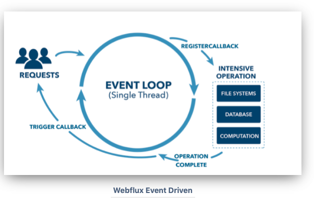
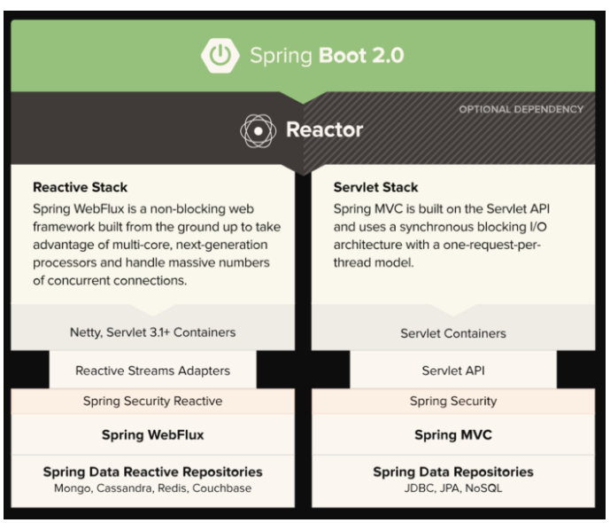
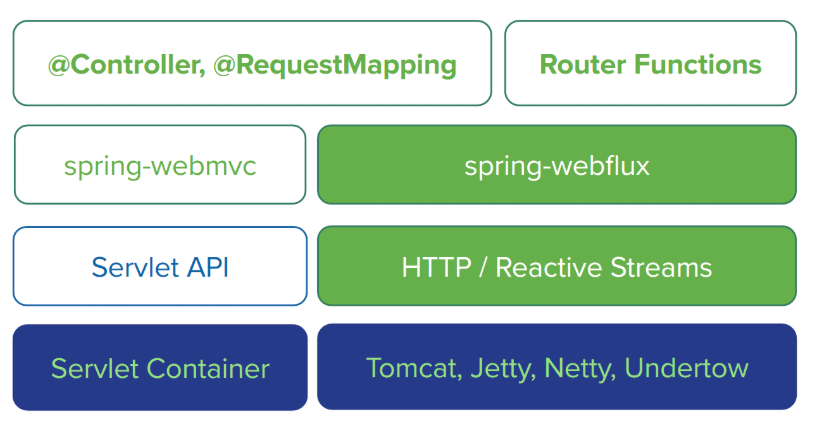

# Spring 5 in Action

## 11장 리액티브 API 개발하기

### Spring WebFlux
- 스프링 MVC 와 같은 **서블릿 기반** 의 웹 프레임워크는 스레드 블로킹과 다중 스레드로 수행된다.
  - 스레드 풀에서 작업 스레드를 가져와 요청을 처리하고, 작업 스레드 종료시까지 요청 스레드는 블로킹 상태가 된다.
- 블로킹 프레임워크는 요청 증거에 따른 확장이 어려운것이 사실이다.
- 자원 할당 / 반환 등 준비하는등 많은 시간이 걸린다.
- **비동기** 웹 프레임워크는 적은 수의 스레드 (CPU 코어당 1개) 로 높은 확장성을 가진다.
- **이벤트 루핑 (Event Looping)** 기법을 사용해서 스레드당 많은 요청을 처리할 수 있어, 적은 자원으로도 많은 요청을 처리한다.
  - ex) Node, Nginx
- Async-Non-blocking I/O 모델로 사용하면, Thread 간의 Context Switching 으로 인한 오버헤드가 존재한다.
- 이또한 해결하기 위한 방법이 바로 이벤트 루프 방식..

`Event Looping Model`


- https://devahea.github.io/2019/04/21/Spring-WebFlux는-어떻게-적은-리소스로-많은-트래픽을-감당할까/

### WebFlux 개요
- Spring 5 는 두가지 스택이 존재한다.
- Servlet Stack 과 Reactive Stack 두가지 스택이 공존한다.
- 주목할 점은, Spring MVC 에서 제공하던 @Controller, @RequestMapping 등 방식을 공유한다는 것이다.

`Spring-Servlet_Reactive_Stack`



- https://happyer16.tistory.com/entry/대용량-트래픽을-감당하기-위한-Spring-WebFlux-도입

`MVC WebFlux`



### WebFlux 시작하기
- Spring WebFlux 를 사용하려면, spring-boot-starter-webflux 를 의존성으로 추가해 주어야 한다.
- 마찬가지로 자동설정을 제공하며, 기본으로 Netty 가 사용된다.

### Reactive Spring MVC
- WebFlux 컨트롤러가 Mono, Flux 와 같은 리액티브 타입을 반환하지만, Spring MVC 가 전혀 사용하지 못하는것은 아니다.
- 마찬가지로 반환이 가능하지만, 해당 타입들이 사용되는 방법에 차이가 있다.
- WebFlux 는 요청이 이벤트 루프에 의해 처리되는 반면 MVC 는 다중 스레드에 의해 처리된다.

### 리액티브 컨트롤러 맛보기

`TacoApiController`
```java
@RestController
@RequiredArgsConstructor
@RequestMapping("/api/tacos")
public class TacoApiController {
    private final TacoReactiveRepository tacoRepository;
    private final TacoJpaRepository tacoJpaRepository;
    
    @GetMapping("/recent")
    public Flux<Taco> recent() {
        // return Flux.fromIterable(tacoJpaRepository.findAll(PageRequest.of(0, 12));
        return tacoRepository.findAll().take(12);
    }

    @GetMapping("/{id}")
    public Mono<Taco> tacoById(@PathVariable Long id) {
        return tacoRepository.findById(id);
    }
}
```
- 기존에 사용하던 Repository 는 Iterable 타입을 반환하기 때문에 Flux 타입으로 변환해주어야 한다.
- Flux.fromIterable 을 사용할 수도 있지만, 리액티브 웹 프레임워크의 장점을 극대화 하려면 완전한 end to end 리액티브 스택이 되어야 한다.
  - Spring 은 리액티브 리퍼지터리를 제공한다.

### Reactive API
- Spring MVC 의 애노테이션 기반 모델은 널리 사용되고 있지만 단점이 있다.
- 무엇 (what) 을 하는지, 어떻게 (how) 하는 지를 정의해야 한다.
  - 애노테이션은 '무엇' 을 의미하고, '어떻게' 는 코드 어딘가에 존재한다.
- 이로 인해 프로그래밍 모델을 커스터마이징 하거나 확장할때 복잡해진다.
  - 디버깅이 어렵고, 애노테이션에 브레이크포인트 설정도 불가능하다.
- Spring 5 에서 에서 WebFlux 에 대한 대안으로 리액티브 API 를 정의하기 위한 함수형 프로그래밍 모델이 소개되었다.

`Reactive API 구성요소`
- RequestPredicate : 처리될 요청의 종류 선언
- RouterFunction : 일치하는 요청이 어떻게 핸들러에게 전달되어야 하는지 선언
- ServletRequest : HTTP 요청을 나타내며, 헤더와 몸체 정보 사용가능
- ServletResponse : HTTP 응답을 나타내며, 헤더와 몸체 정보를 포함

`RouterFunctionConfig`
```java
@Configuration
@RequiredArgsConstructor
public class RouterFunctionConfig {
    private final TacoReactiveRepository tacoRepository;

    // 리액티브 API 를 정의하기 위한 함수형 프로그래밍 모델
    // 4가지 필수요소가 있다.
    // RequestPredicate : 요청의 종류 선언
    // RouterFunction : 일치하는 요청이 핸들러에 어떻게 전달되어야 하는지 선언
    // ServerRequest : HTTP 요청 / 헤더와 몸체정보 참조 가능
    // ServerResponse : HTTP 응답 / 헤더와 몸체정보 포함
    @Bean
    public RouterFunction<?> helloRouterFunction() {
            // GET hello 요청을 받는 Router 를 선언한다.
        return route(GET("/hello"), request -> ok().body(just("Hello World!"), String.class))
            // andRoute 를 통해 또다른 핸들러를 추가할 수 있다.
            .andRoute(GET("/bye"), request -> ok().body(just("See ya!"), String.class));
    }
}
```

## 정리
- Spring WebFlux 는 리액티브 웹 프레임워크를 제공하며, Spring MVC 가 많이 반영되어있다.
- Spring 5 는 WebFlux 의 대안으로 함수형 프로그래밍 모델을 제공한다.
- 리액티브 하게 동작하는 클라이언트는 WebClient 가 있으며 이는 Netty 를 사용중이라면, Netty 의 이벤트 루프를 공유한다.