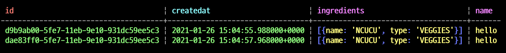

# Spring 5 in Action

## 12장 리액티브 데이터 퍼시스턴스
- WebFlux 를 사용해서, 리액티브하고 논블로킹한 컨트롤러를 생성해보았다.
- 하지만 이런 컨트롤러 혼자서만 논블로킹하다고해서 끝이 아니다.
- 함께 동작하는 다른 모듈들도 논블로킹하게 동작해야 진정한 논블로킹이고, 그 장점을 최대한 살릴수 있다.
- 컨트롤러 -> 데이터베이스 까지 전체 플로우가 리액티브하고 논블로킹하게 동작하는것이 중요하다.

### Spring data Reactive
- 스프링 데이터 Kay 릴리즈 트레인 (2016년 11월) 부터 리액티브 리퍼지터리를 지원한다.
- Cassandra, Mongodb, CouchBase, Redis 등.. 다양한 NoSQL 들에 대해서 리액티브 리퍼지토리를 지원함
- RDBMS, JPA 는 리액티브 리퍼지토리를 지원하지 않는다.
- JPA 로 리액티브 프로그래밍을 지원하려면, 관계형 데이터베이스와 JDBC 드라이버 역시 블로킹 되지않는 모델을 지원해야 한다.
- 기본적으로 Project Reactor 의 타입을 사용할수 있고, 다른 리액티브 라이브러리도 사용할 수 있다. (e.g.RxJava2CrudRepository)

### 핵심
- 스프링 데이터 리액티브의 핵심을 간단하게 요약하면 다음과 같다.
- 도메인 이나 컬렉션 대신 Mono, Flux 와 같이 리액티브 타입을 인자로 받거나 반환하는 메소드를 갖는다.
- 기존의 스프링 데이터 리포지토리와 동일한 프로그래밍 모델을 공유하고, 인자나 반환값으로 리액티브한 타입을 사용할 수 있다.

> 리액티브 리포지토리가 아니더라도 가능한 빨리 리액티브 타입으로 변환하여 상위 컴포넌트들이 리액티브의 장점을 활용하게 할 수 있다.

### Reactive Cassandra Repository
- Cassandra 는 분산처리, 고성능, 높은 가용성을 갖는 NoSQL 데이터베이스 이다.
  - https://github.com/ces518/TIL/blob/master/database/Apache%20Cassandra.md
- 스프링 데이터 카산드라는 카산드라 DB 의 자동화된 리포지토리를 지원한다.
- JPA 와 유사하면서도 다른 도메인 타입을 매핑하는 애노테이션들을 제공한다.

### 스프링 데이터 카산드라 사용하기
- 스프링 데이터 카산드라를 사용하려면 의존성이 두가지가 있는데 이중 하나를 선택해야 한다.
- spring-boot-starter-data-cassandra, spring-boot-starter-data-cassandra-reactive
- 이중 reactive 가 들어가는 의존성을 추가해야만, Reactive Type 을 지원한다.

```xml
<dependency>
    <groupId>org.springframework.boot</groupId>
    <artifactId>spring-boot-starter-data-cassandra</artifactId>
</dependency>

<dependency>
    <groupId>org.springframework.boot</groupId>
    <artifactId>spring-boot-starter-data-cassandra-reactive</artifactId>
</dependency>
```

`Keyspace 생성`
```sql
CREATE KEYSPACE tacocloud WITH replication = {'class' : 'SimpleStrategy', 'replication_factor' : 1};
```
- 카산드라의 KEYSPACE 를 생성해준다.
- MySQL 의 DB 생성이라고 생각하면 쉽다.

```yaml
spring:
  data:
    cassandra:
      keyspace-name: tacocloud
      schema-action: recreate_drop_unused
      local-datacenter: datacenter1
```
- spring boot 2.3.x 부터 로컬 데이터센터의 이름을 명시적으로 선언해야한다.
  - 카산드라 드라이버 4.x.x 를 지원하기 때문...
  - https://stackoverflow.com/questions/60668792/spring-data-with-cassandra-giving-illegalstateexception
  - https://stackoverflow.com/questions/64940864/how-install-cassandra-in-docker

### 카산드라 도메인 타입 매핑

`Ingredient`
```java
@Getter
@RequiredArgsConstructor
@NoArgsConstructor(access = AccessLevel.PROTECTED, force = true)
@Table("ingredients")
public class Ingredient {

    @PrimaryKey
    private final String id;
    private final String name;
    private final Type type;

    public enum Type {
        WRAP, PROTEIN, VEGGIES, CHEESE, SAUCE;
    }
}
```
- @Table
  - JPA 의 @Entity 와 대응되는 애노테이션
  - ingredients 테이블과 매핑된다.
- @PrimaryKey
  - JPA 의 @Id 와 대응된다.
  - 하지만 대응된다고 해서 완전 동일한것은 아니다..

`Tacos`
```java
@Getter
@Setter
@Table("tacos")
public class Taco {

    // 파티션 키로 사용한다.
    @PrimaryKeyColumn(type = PrimaryKeyType.PARTITIONED)
    private UUID id = Uuids.timeBased();

    private String name;

    // 클러스터키로 사용한다. (파티션 내부에서 행의 순서 결정)
    @PrimaryKeyColumn(type = PrimaryKeyType.CLUSTERED, ordering = Ordering.DESCENDING)
    private Date createdAt = new Date();

    // Ingredient 대신 IngredientUDT 객체 사용
    // 카산드라는 비정규화 되어 중복 데이터를 포함 가능하다.
    // 데이터 컬렉션을 포함하는 열은, 네이티브 컬렉션 혹은 사용자 정의타입 (User Defined Type, UDT) 여야 한다.
    // UDT 는 관계형 데이터베이스의 외부 키처럼 사용됨, 실제 복사될 수 있는 데이터를 가지고 있다.
    // Ingredient 클래스는 @Table 애노테이션으로 엔티티로 매핑되었기 때문에 재사용할 수 없다.
    // Ingredient 가 Taco 테이블의 ingredients 열에 어떻게 저장되어야 하는지 정의하기 위한 클래스
    @Column("ingredients")
    private List<IngredientUDT> ingredients = new ArrayList<>();
}
```
- @PrimaryKeyColumn
  - 카산드라의 PrimaryKey 컬럼으로 지정한다.
  - type 속성으로 해당 키의 타입을 지정할 수 있다.
    - PrimaryKeyType.PARTITIONED -> 파티션 키로 지정
    - PrimaryKeyType.CLUSTERED -> 클러스터키로 지정
- 유의할 점은 ingredients 관계 매핑이다.
  - 카산드라는 비정규화되어 중복데이터를 포함한다.
  - 1.2 이전버전에서의 슈퍼컬럼 (super column), 1.2이후 컬렉션 에 매핑하기 위해서는 네이티브한 컬렉션이나 사용자 정의 타입 (User Defined Type) 이여야 한다.
  - UDT 는 관계형 데이터베이스의 외부키처럼 사용되며, 실제 복사될수 있는 데이터를 가지고 있다.
  - Ingredient 클래스는 @Table 애노테이션으로 매핑되어있어 재사용할 수 없다... (불편)
  - 쉽게 생각하면 UDT 는 Ingredient 가 Taco 테이블의 ingredients 컬렉션에 어떻게 저장되어야 하는지 정의하는 클래스이다.

`IngredientUDT`
```java
@Getter
@Setter
@NoArgsConstructor(access = AccessLevel.PROTECTED)
@UserDefinedType("ingredient")
public class IngredientUDT {

  private String name;
  private Ingredient.Type type;
}
```

`Result`



### 리액티브 카산드라 리포지토리
- 리액티브 카산드라 리포지토리를 사용하려면 ReactiveCassandraRepository, ReactiveCrudRepository 중 하나를 선택해서 사용해야 한다.
- 이를 결정하는 기준은 리포지토리를 **어떻게** 사용하는지가 관건이다.
- 많은 데이터가 추가된다면, ReactiveCassandraRepository 를, 그렇지않다면 ReactiveCrudRepository 를 사용하는것이 좋다.

`Ingredient`
```java
public interface IngredientRepository extends ReactiveCrudRepository<Ingredient, String> {
}
```

`TacoRepository`
```java
public interface TacoRepository extends ReactiveCassandraRepository<Taco, UUID> {
}
```
- 등록 혹은 수정 오퍼레이션시, 아이디 값을 반드시 지정해주어야 한다.
  - When inserting or updating, the id property must be set. Apache Cassandra has no means to generate an ID.
  - https://docs.spring.io/spring-data/cassandra/docs/current/reference/html/#reference
- Auto Generate 관련 글
  - https://www.xspdf.com/resolution/31001873.html
  - UUID 타입을 써서 애플리케이션에서 생성해라...
  - timeBasedUUID 를 사용하면 시간 + 맥주소를 기반으로 생성된다..
  - 혹은 ID 테이블을 만들어 사용해라..

`UserRepository`
```java
public interface UserRepository extends ReactiveCassandraRepository<User, UUID> {

    // 카산드라는 where 절을 허용하지 않는다, allowfiltering 옵션을 주어 where 절을 허용해야한다.
    @AllowFiltering
    Mono<User> findByUsername(String username);
}
```
- 카산드라에서는 일반적인 where 절을 허용하지 않는다.
  - allowFiltering 옵션을 주어 where 절을 사용하도록 선언해주어야한다.
- allow filtering 은 잠재적으로 쿼리 성능에 영향을 주지만 수행해야 한다는 것은 카산드라에게 알려준다.
  - - 성능 저하가 되는 이유는 cluster 모두에 요청을 하기 때문에 성능에 제약을 걸린다는 얘기라 할 수 있다. 데이터 모델링을 잘 해야 한다.
- 출처: https://knight76.tistory.com/entry/cassandra-in-query-지원

### Reactive Mongo Repository
- MongoDB 는 대중적으로 사용하는 NoSQL 데이터베이스이다.
  - 대표적인 Document Database
- BSON (Binary JSON) 으로 데이터를 저장하며, 다른 데이터베이스에 쿼리하는것과 거의 유사하게 사용할 수 있다.

### 스프링 데이터 몽고 사용하기
- 카산드라와 마찬가지로 두가지 의존성중에서 선택을 해야한다.
- spring-boot-starter-data-mongodb, spring-boot-starter-mongodb-reactive

`pom.xml`
```xml
<dependency>
    <groupId>org.springframework.boot</groupId>
    <artifactId>spring-boot-starter-data-mongodb</artifactId>
</dependency>

<dependency>
    <groupId>org.springframework.boot</groupId>
    <artifactId>spring-boot-starter-data-mongodb-reactive</artifactId>
</dependency>
```

- Flapdoodle 에서 제공하는 내장 몽고DB 를 사용하면 편리한 테스트 / 학습을 할 수 있다.
- Flapdoodle 내장 데이터베이스는 H2 와 같이 인메모리에서 실행되는 몽고 DB 를 사용하는것과 같다.
`pom.xml`
```xml
<dependency>
    <groupId>de.flapdoodle.embed</groupId>
    <artifactId>de.flapdoodle.embed.mongo</artifactId>
</dependency>
```

### 몽고 DB 도메인 타입 매핑
- Spring data MongoDB 에서 제공하는 다양한 애노테이션드리 있지만 이중 3개만이 대부분의 경우에 사용된다.

`Book`
```java
@Data
@Document(collection = "books") // 몽고 DB 의 문서와 매핑 @Entity, @Table 과 동일
public class Book {

    @Id // 문서의 ID 값, String 타입일 경우 Persist 될 때, 몽고 DB 가 ID 값을 자동을 지정해줌
    private String id;
    // @Field @Column 과 동일, 생략가능
    private String title;
    private String author;

    // collection 타입은 카산드라와 유사하게 비정규화된 문서로 직접 저장한다.
    // 사용자 정의타입을 만들 필요 없이 어떤 타입도 사용이 가능하다.
    private List<String> etc;
}
```
- @Document 애노테이션은 해당 타입을 몽고 DB 에 저장되는 문서와 매핑시킨다.
  - collection 속성으로 지정한 문서와 매핑된다.
- @Id
  - 해당 필드를 문서의 ID 값으로 지정한다.
  - String 타입으로 지정한 경우, Persist 될때 값이 null 이라면 몽고 DB 가 ID 값을 자동으로 지정해준다.
  - 유의할 점은 Serializable 을 구현하고 있어야한다.
- @Field
  - @Column 과 동일하며 생략이 가능하다.
- 유의할점은 컬렉션 타입은 카산드라와 유사하게 비정규화된 문서러 직접 저장한다.
- 하지만 사용자 정의타입을 만들 필요없이 어떠한 타입도 사용이 가능하다는것이다.

> 몽고 DB 는 카산드라와 다르게 도메인 타입 매핑이 심플하다.

### 리액티브 몽고 리포지토리
- 스프링 데이터 몽고는 스프링 데이터 JPA, 카산드라와 제공하는것과 유사한 지원을 제공한다.
- ReactiveCrudRepository, ReactiveMongoRepository 중 하나를 선택해야 하며, 데이터 저장의 빈도가 높다면 ReactiveMongoRepository 를 선택하자.

`BookRepository`
```java
public interface BookRepository extends ReactiveCrudRepository<Book, String> {

    Flux<Book> findByOrderByAuthorDesc();
}
```

## 정리
- 스프링 데이터는 Cassandra, MongoDB, Couchbase, Redis의 리액티브 리퍼지토리를 지원한다.
- 리액티브 리퍼지터리는 리액티브가 아닌 리퍼지터리와 동일한 프로그래밍 모델을 따르고 Flux, Mono 와 같은 리액티브 타입을 지원한다.
- 리액티브 타입을 지원하지 않는 리퍼지토리도 리액티브 타입을 사용하도록 조정할 수 있으나, 블로킹구간이 존재한다.