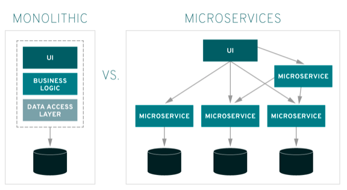
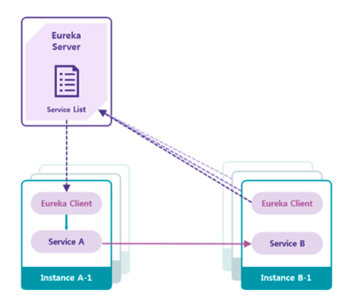
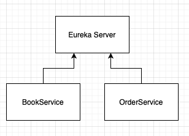
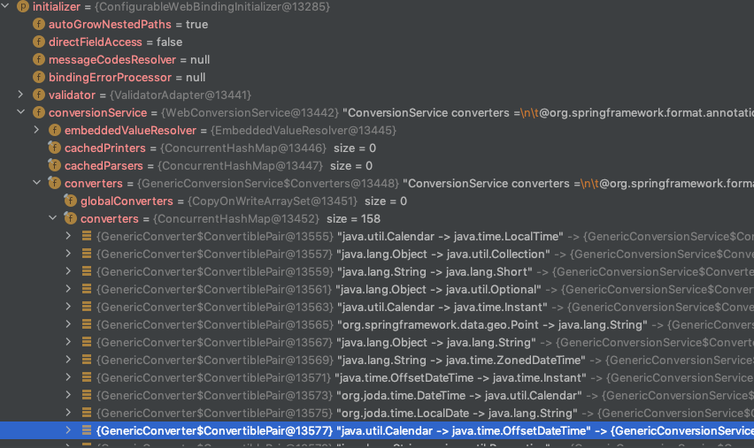
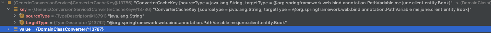

# Spring 5 in Action

## 13장 서비스 탐구하기

### 마이크로서비스 와 모놀리틱


- 전통적인 애플리케이션 -> 하나의 JAR 혹은 WAR 로 개발하여 단일 파일을 배포하는 방식 a.k.a 모놀리틱 아키텍쳐
- 각 서비스별 모듈로 분리 -> 다수의 JAR 혹은 WAR 로 배포되고 운영되는 방식 a.k.a 마이크로서비스 아키텍쳐

`모놀리틱 아키텍쳐`
- 심플하다.
- 소규모 애플리케이션에 적합하다.
- 확장하기 어렵다.
- 일부가 변경되더라도 애플리케이션 전체를 배포해야한다.
- 장애발생시 애플리케이션 전체가 마비된다.
- 모든 부하를 한 애플리케이션과 DB 가 받게된다.

`마이크로서비스 아키텍쳐`
- 관리비용의 증가
- 확장하기 쉽다.
- 일부모듈이 변경되었다면 해당 부분만 배포하면 된다.
- 특정 모듈 장애시 해당 모듈만 마비된다.
- 폴리그랏

> 마이크로서비스가 모든것에 대한 해답은 아니다.
> 네트워크 지연과 같은 문제들이 발생할 수 있으며, 애플리케이션 규모에 맞게 선택해야 한다.

### Spring Cloud 와 Netflix OSS
- Spring Cloud Netflix 는 스프링 환경 및 기타 스프링 프로그래밍 모델에 대한 자동 구성 및 바인딩을 통해 스프링 부트 앱용 넷플릭스 OSS 통합을 제공한다.
- Netflix OSS 에서 제공하는 대표적인 모듈은 다음과 같다.
1. **Service Discovery (Eureka)**
2. Circuit Breaker (Hystrix)
3. Intelligent Routing (Zuul)
4. **Client Side Load Balancing (Ribbon)**

### 서비스 디스커버리 - Eureka



- 다수의 서비스 인스턴스의 물리적인 위치를 투명하게 구성하고, 서비스 디스커버리를 사용해 실행하는 서비스 인스턴스의 개수를 수평확장 혹은 축소할 수 있음
- 실제 물리위치를 모르기 때문에, 서비스 풀에서 새로운 인스턴스 추가 및 삭제가 자유롭다.

### 클라이언트 사이드 로드 밸런서 - Ribbon


- 모놀리틱 구성에서는 부하 분산을 위해 L4 스위치같은 장비를 두고, 앞단에서 여러 서버로 분산을 하였다... (SPOF 가 될 수 있기 때문에, 그에 대한 대처도 필요..)
- 이런 중앙 집중 방식은 로드밸런서 장애시 전체 서비스에 문제가 생길 수 있고, 하드웨어 장비로는 동적인 서버 추가 삭제에 대한 대응이 한계가 존재함
- Ribbon 은 소프트웨어로 구현한 클라이언트 로드밸런서이다.

### 서비스 디스커버리 사용하기



- 우리가 구성할 서비스는 위와 같이 심플하게 구성함
- EurekaServer 를 통해 각 서비스들을 등록하고, OrderService 는 BookService 를 통해 책 정보를 조회한다.


### 유레카 서버 구성하기
- 스프링 부트 환경에서 유레카 서버를 구성하기위해, spring-cloud-starter-netflix-eureka-server 의존성을 추가해주어야 한다.
- 스프링부트 자동구성을 지원한다.
- 스프링 클라우드 버전을 명시해주어야 하는데, 현재 스프링 부트 2.4.x 기준 / 릴리즈 트레인중 최신 버전 (2020.0.x aka Ilford) 을 선택함

`Spring Cloud Release Train`

| Release Train | Boot Version |
| --- | --- |
| 2020.0.x aka Ilford | 2.4.x |
| Hoxton | 2.2.x, 2.3.x (Starting with SR5) |
| Greenwich | 2.1.x |
| Finchley | 2.0.x |
| Edgware | 1.5.x |
| Dalston | 1.5.x |

`pom.xml`
```xml
<dependency>
    <groupId>org.springframework.cloud</groupId>
    <artifactId>spring-cloud-starter-netflix-eureka-server</artifactId>
</dependency>
```

`EurekaServer`
```java
@SpringBootApplication
@EnableEurekaServer
public class Application {

    public static void main(String[] args) {
        SpringApplication.run(Application.class, args);
    }

}
```

`application.yaml`
```yaml
server.port: 8761
eureka:
  instance:
    hostname: localhost
  client:
    fetch-registry: false
    register-with-eureka: false
    service-url:
      defaultZone: http://${eureka.instance.hostname}:${server.port}/eureka/
  server:
    enable-self-preservation: false # 자체 보존모드 옵션, 유레카 서버는 서비스 인스턴스가 등록하고 갱신요청 30초마다 실행함
    # 만약 3번동안 갱신을 하지못할경우 장애로 판단되어 등록을 취소한다.
    # 이런식으로 중단되는 서비스의 수가 임계치를 초과하면 네트워크 문제로 간주하고 나머지 서비스 데이터보존을 위해 자체 보존모드로 변경됨
```
- eureka.instance.hostname
  - 유레카가 실행되는 호스트정보를 설정하며, 생략이 가능하다.
  - 생략할 경우 환경변수를 참고하여 결정함.
- eureka.client.fetchRegistry
  - false 로 지정시 유레카 서비스 시작시 레지스트리 정보를 로컬에 저장하지 않는다.
- eureka.client.registerWithEureka
  - false 로 지정해 주었을때 자신을 유레카 서비스에 등록하지 않도록 설정한다.
- 그외 다양한 설정들
  - https://docs.spring.io/spring-cloud-netflix/docs/current/reference/html/appendix.html

> 프로덕션 환경에서 고가용성을 위해 유레카 서버인스턴스가 2개 이상인 경우  fetchRegistry 와 registerWithEureka 는 true (기본값) 으로 지정해 주어야 한다.
> 각 유레카 서버가 서로 다른 유레카 서버에 자신을 등록하고 레지스트리 정보를 가져와야함

### 유레카 클라이언트 구성하기
- 심플한 구성을 위해, spring-mvc, spring-data-jpa, h2 환경에서 각 서비스 모듈들을 구성한다.
- 또한 유레카 클라이언트로 등록하기 위해 spring-cloud-starter-netflix-eureka-client 의존성을 추가주어야 한다.

`pom.xml`
```xml
<dependency>
    <groupId>org.springframework.boot</groupId>
    <artifactId>spring-boot-starter-web</artifactId>
</dependency>

<dependency>
    <groupId>org.springframework.cloud</groupId>
    <artifactId>spring-cloud-starter-netflix-eureka-client</artifactId>
</dependency>

<dependency>
    <groupId>org.springframework.boot</groupId>
    <artifactId>spring-boot-starter-data-jpa</artifactId>
</dependency>

<dependency>
    <groupId>com.h2database</groupId>
    <artifactId>h2</artifactId>
    <scope>runtime</scope>
</dependency>
```

#### BookService
- BookService 는 도서 목록 또는, 특정 도서에 대한 정보를 조회하는 매우 심플한 서비스이다.
- BookService 의 구성요소는 다음과 같다.

`Book`
```java
@Entity
@Table(name = "books")
public class Book {

    @Id @GeneratedValue
    private Long id;

    private String title;

    private String author;

    private String description;

    public Book() {
    }

    public Book(String title, String author, String description) {
        this.title = title;
        this.author = author;
        this.description = description;
    }

    public Long getId() {
        return id;
    }

    public String getTitle() {
        return title;
    }

    public String getAuthor() {
        return author;
    }

    public String getDescription() {
        return description;
    }
}
```
- Book 엔티티는 식별자, 제목, 저자, 설명 으로 구성되어 있다.

`BookController`
```java
@RestController
@RequestMapping("/books")
public class BookController {
    private final BookRepository bookRepository;

    public BookController(BookRepository bookRepository) {
        this.bookRepository = bookRepository;
    }

    @GetMapping
    public List<Book> getBooks() {
        return bookRepository.findAll();
    }

    @GetMapping("{id}")
    public Book getBook(@PathVariable("id") Book book) {
        return book;
    }
}
```
- BookController 를 살펴보면 심플하게 구성되어 있는데, 다소 생소하게 보일수 있는 부분이 @PathVariable 로 엔티티를 직접 참조하는 부분
  - JPA 를 열심히 공부했다면 알수있다...
  - DomainClassConverter 기능을 사용함...
  - Spring data Common 이 제공하는 기능중 하나
  - **EntityConverter** 와 **IdConverter** 가 등록되어있으며 **WebDataBinder** 가 이를 참조하여 활용한다.

`WebDataBinder`
- AnnotationMethodHandlerAdapter 가 
- @RequestParam, @PathVariable, @ModelAttribute 왜 같은 HTTP 요청을 변수에 바인딩하는 애노테이션을 만나면 WebDataBinder 를 사용함..

`Spring Converters..`



`DomainClassConverter`



`Formatter 와 Converter 의 차이?`
- Formatter 는 **문자열** 기반
- 문자열을 다른 타입으로 변환한다.
- 웹에 좀 더 특화되어있음.
- Converter 는 모든 타입을 제공하며, 특정 타입을 다른 타입으로 변환한다.

#### OrderService
- OrderService 는 별도 도메인은 없이 BookClient 를 이용해 BookService 의 데이터를 조회하고, Book 에 대한 정보만 서빙하고 있는 구조

`BookDto`
```java
public class BookDto {
    private Long id;
    private String title;
    private String author;
    private String description;

    public Long getId() {
        return id;
    }

    public String getTitle() {
        return title;
    }

    public String getAuthor() {
        return author;
    }

    public String getDescription() {
        return description;
    }
}
```

`WebConfig`
```java
@Configuration
public class WebConfig {

    @Bean
    @LoadBalanced
    public RestTemplate restTemplate() {
        return new RestTemplate();
    }

    @Bean
    @LoadBalanced
    public WebClient.Builder webClientBuilder() {
        return WebClient.builder();
    }
}
```
- 특이점은 @LoadBalanced 애노테이션을 사용했다는 점
- Netflix OSS 중 Ribbon > 클라이언트 사이드 로드밸런스
- Zuul, RestTemplate, FeignClient 는 Ribbon 이 내장되어 있다.
- @LoadBalanced 애노테이션을 추가해 RestTemplate, WebClient 에 로드밸런싱 인터셉터 (LoadBalancerInterceptor)를 적용한다.
- 라운드로빈, 응답 가중치 등 다양한 방식을 제공함..
- 기본값은 라운드로빈(RoundRobinLoadBalancer) 방식을 사용한다.

`BookClient`
```java
@Component
public class BookClient {
    private RestTemplate restTemplate;
    private WebClient.Builder webClientBuilder;

    public BookClient(@LoadBalanced RestTemplate restTemplate, @LoadBalanced WebClient.Builder webClientBuilder) {
        this.restTemplate = restTemplate;
        this.webClientBuilder = webClientBuilder;
    }

    public List<BookDto> findAll() {
        ResponseEntity<List<BookDto>> responseEntity = restTemplate.exchange("http://book-service/books", HttpMethod.GET, null, new ParameterizedTypeReference<List<BookDto>>() {});
        List<BookDto> results = responseEntity.getBody();
        return results;
    }

    public BookDto findById(Long bookId) {
        return restTemplate.getForEntity("http://book-serivce/books/{bookId}", BookDto.class, bookId).getBody();
    }

    public Flux<BookDto> findAllWebClient() {
        return webClientBuilder.build()
                .get()
                .uri("http://book-service/books")
                .retrieve().bodyToFlux(BookDto.class);
    }
}
```
- Client 호출 코드를 보면, bookservice 의 물리적인 위치를 명시하지 않고, 유레카 서버에 등록해둔 서비스명으로 조회한다.

`BookFeignClient`
```java
@FeignClient("book-service")
public interface BookFeignClient {

    @GetMapping("/books")
    List<BookDto> getBooks();

    @GetMapping("/books/{id}")
    BookDto getBook(@PathVariable Long id);
}
```
- FeignClient 는 선언적인 방법으로 사용 가능한 클라이언트 방식
- Spring MVC 의 다양한 애노테이션들을 공유해서 사용하지만 주의해서 사용해야함..
  - 클라이언트 구현체별로 Context 별도 생성, 애노테이션 생략시 기본적으로 RequestBody 로 사용 등등...

`BookController`
```java
@RestController
@RequestMapping("/orders")
public class OrderController {
    private final BookClient bookClient;
    private final BookFeignClient bookFeignClient;

    public OrderController(BookClient bookClient, BookFeignClient bookFeignClient) {
        this.bookClient = bookClient;
        this.bookFeignClient = bookFeignClient;
    }

    @GetMapping("/books")
    public List<BookDto> getBooks() {
        return bookClient.findAll();
    }

    @GetMapping("/books/{id}")
    public BookDto getBook(@PathVariable Long id) {
        return bookClient.findById(id);
    }

    @GetMapping("/books/flux")
    public Flux<BookDto> getBookFlux() {
        return bookClient.findAllWebClient();
    }

    @GetMapping("/books/feign")
    public List<BookDto> getBooksFeign() {
        return bookFeignClient.getBooks();
    }

    @GetMapping("/books/{id}/feign")
    public BookDto getBookFeign(@PathVariable Long id) {
        return bookFeignClient.getBook(id);
    }
}
```

## 정리
- Spring Cloud Netflix 는 MSA 에 보다 손쉽게 접근할수 있도록 해주는 프로젝트
- EurekaServer (서비스 디스커버리) 를 통해 손쉬운 확장/축소가 가능해진다.
- Ribbon (클라이언트 사이드 로드밸런서) 을 통해 로드밸런싱 및 EurekaServer 에 등록된 서비스 명으로 서비스 인스턴스를 선택한다.

## 참고
- https://joont92.github.io/spring/모델-바인딩과-검증/
- https://sup2is.github.io/2020/04/07/spring-cloud-eureka-with-netfix-feign-client-example.html
- https://www.samsungsds.com/kr/insights/msa_and_netflix.html