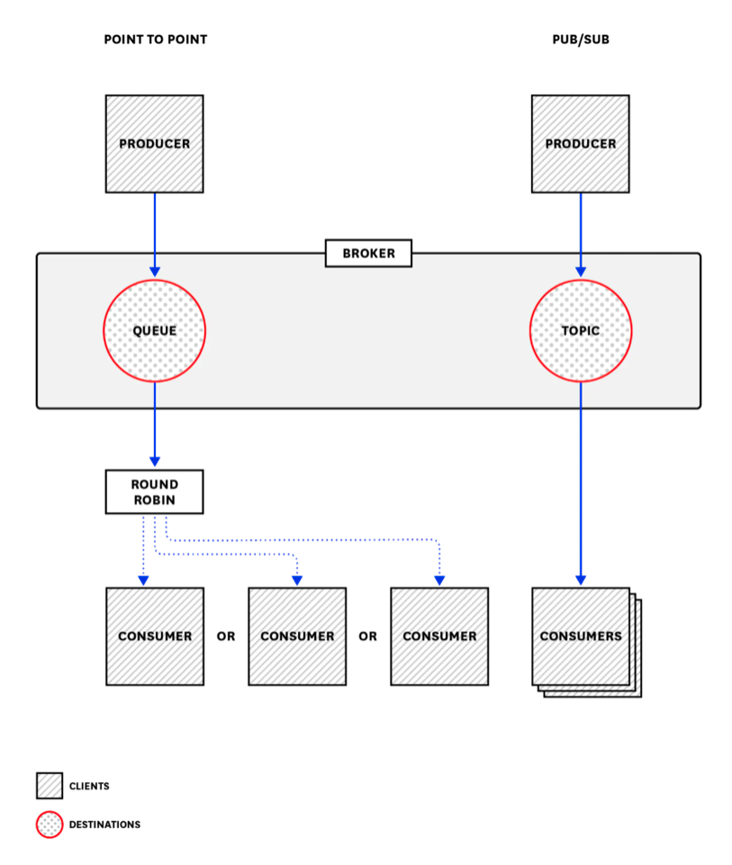
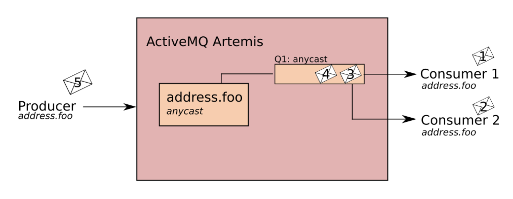
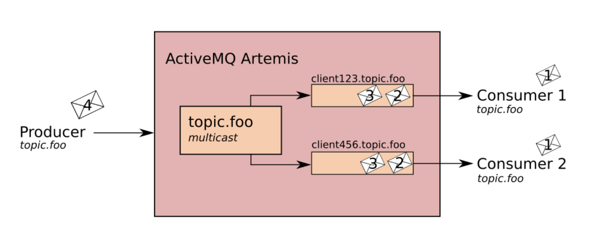

# Spring 5 in Action

## 8장 비동기 메시지 전송하기
- **비동기 (asynchronous)** 메시징은 애플리케이션간 응답을 대기하지 않고 간접적으로 메시지를 전송하는 방법
- 이는 애플리케이션의 결합도를 낮추고, 확장성을 높혀준다.
- 스프링이 제공하는 3가지 비동기 메시지가 있다.
1. JMS (Java Message Service)
2. RabbitMQ (AMQP, Advanced Message Queueing Protocol) 
3. Kafka (Apache Kafka)

### Blocking 과 NonBlocking, Synchronous 와 Asynchronous
- 차이를 설명할수 있나요 ?
- Blocking 과 NonBlocking 는 함수의 **제어권** 과 관련이 있다.
  - 이는 주로 I/O 를 예로 많이 든다.
  - 대표적으로는 JDBC.. 커넥션풀을 많이 주더라도 JDBC 는 Blocking 방식으로 동작하기 때문에, 동시에 처리가능한 것은 CPU 코어수를 넘지 못한다.
- Synchronous 와 Asynchronous 는 추상적인 개념이다.
  - 주로 작업 단위를 예로 많이 든다.
  - 작업이 완료되면 호출된 함수가 callback 함수를 실행해 완료 여부를 알려준다면 Asynchronous
  - 메인 스레드가 주기적으로 작업이 완료됨을 확인한다면 ? Synchronous
- 뭔가 비슷하면서도 다른 느낌적인 느낌 ? ...

> Blocking-Async 의 조합은 ???.. 띠용.. 왜쓰는거지 ?
> Node-MySQL, WebFlux-RDB 조합이 이런 느낌...

- 실무에 대입해보자면....
  - 모든건 상대적인 요소
  - 비즈니스가 중요한 플랫폼적인 성향을 가진 앱 -> 상품, 주문 등.. (WebMvc-RDB)
  - 사용자에게 노출하고, 전시적인 요소가 강하고, 트래픽을 받아내야한다. (WebFlux-NoSQL)

- https://homoefficio.github.io/2017/02/19/Blocking-NonBlocking-Synchronous-Asynchronous/

### JMS

#### JMS 란?
`위키 백과`
```
자바 메시지 서비스(Java Message Service; JMS)는 자바 프로그램이 네트워크를 통해 데이터를 송수신하는 자바 API이다.

자바 메시지 서비스 API는 두 개 혹은 그 이상의 클라이언트 간 메시지 통신을 위한 자바 메시지 기반 미들웨어 API(자바 메시지 지향 미들웨어 (MOM) API)이다.
JMS는 자바 플랫폼, 엔터프라이즈 에디션에 포함되어 있으며, 자바 커뮤니티 프로세스의 **JSR 914** 로 개발된 명세서에 의해 정의된다.
자바 메시지 서비스는 자바 플랫폼, 엔터프라이즈 에디션에 기반을 둔 애플리케이션 컴포넌트들끼리 메시지를 생성, 송/수신, 읽기 기능을 제공하는 메시징 표준이다. 
분산된 애플리케이션끼리 느슨하게 연결해주고 신뢰성을 보장하며, 비동기 처리가 가능하도록 해준다.
```

> 한줄 요약 -> **JMS (Java Message Service)** 란, 자바 메시징의 표준이다.
- https://docs.oracle.com/cd/E19435-01/819-2222/concepts.html
- AWS 에서 Amazon MQ 라는 형태로 Apache ActiveMQ 를 지원한다.

#### JMS 설정
- JMS 를 사용하기 위해서는 JMS 클라이언트를 클래스패스에 추가해 주어야 한다.
- JMS 구현체는 대표적으로 **ActiveMQ** 를 사용한다. 최근에는 **ActiveMQ Artemis** (차세대 ActiveMQ) 를 사용함 
  
`ActvieMQ`
- ActiveMQ 5 가 주요 릴리즈 버전으로 사용되고 있고 6버전으로 업글중..
- JMS 1.1 구현
- ActiveMQ 6 는 ActiveMQ Apollo 라는 이름으로 비동기 논블록 아키텍쳐로 재구상중이 었다.
- ActiveMQ Apolo 는 1.x 까지 잘 진행되다가, 1.7.1 에 와서 ActiveMQ Artemis 라는 이름으로 변경되었다.



- 메시지를 **생산** 하는 Producer, **전달** 하는 Broker, **소비** 하는 Consumer 모델로 이루어져 있다.
- ActiveMQ 는 Queue 방식과 Pub/Sub 방식을 지원한다. 
- **Queue** 방식은 Consumer 들에게 하나의 메시지를 Round-Robin 방식으로 하나의 Consumer 에게 처리하도록 보내는 방식
- **Pub/Sub** 방식은 Topic 에 관심이 있는 모든 Consumer 에게 메시지가 전달된다.

`ActiveMQ Artemis`
- JMS 2.0 과 1.1 지원
- High availability -> Active/Active 지원
- Scale-out -> Clustering 지원
- High performance journal for message persistence
- **Address Model**
  
`Address Model`
- 주소, 큐, 라우팅-타입 세가지 주요 개념으로 구성된다.
- **주소** 는 메시지의 엔드포인트 이며, 주소에는 고유한 이름과 0개 이상의 큐 및 라우팅-타입 이 지정된다. 
- **큐** 는 주소와 연결되어 있으며, 주소 하나당 여러 개의 큐를 가질 수 있다.
  - 수신 메시지를 주소와 일치시키면 라우팅 유형에 따라 메시지가 큐로 전송되고, 큐를 자동 생성 및 삭제하도록 구성할 수 있다.
- **라우팅-타입** 메시지를 주소와 연결된 큐로 보내는 방법을 결정한다.
  - Point-To-Point 방식을 사용하려면 라우팅 타입을 Anycast 로 지정해야 한다.
  - 다수의 컨슈머가 존재한다면, 균등하게 분배됨 (Round-Robin 방식 사용)

`Point-To-Point`



`Pub/Sub`




- https://activemq.apache.org/components/artemis/documentation/2.0.0/address-model.html
- https://www.openlogic.com/blog/exploring-activemq-artemis
- http://people.apache.org/~clebertsuconic/


- spring-boot-starter-activemq, spring-boot-starter-artemis 를 사용하려면 각각 아래 의존성을 추가해 주어야 한다.
- 우리는 spring-boot-starter-artemis 를 사용할것...

```xml
<!-- spring-boot-starter-activemq -->
<dependency>
    <groupId>org.springframework.boot</groupId>
    <artifactId>spring-boot-starter-activemq</artifactId>
</dependency>

<!-- spring-boot-starter-artemis -->
<dependency>
    <groupId>org.springframework.boot</groupId>
    <artifactId>spring-boot-starter-artemis</artifactId>
</dependency>
```

### JmsTemplate
- JmsTemplate 은 Spring JMS 의 핵심 클래스
- 이름에서도 알수 있듯이 반복적으로 사용되는 코드를 Template 화 해둔 클래스
- spring-boot-starter-xxx 를 의존성에 추가해두면 JmsTemplate 자동설정이 된다.

`JmsTemplate`
```java
public class JmsTemplate extends JmsDestinationAccessor implements JmsOperations {

  /** Internal ResourceFactory adapter for interacting with ConnectionFactoryUtils. */
  private final JmsTemplateResourceFactory transactionalResourceFactory = new JmsTemplateResourceFactory();
  
  
  @Nullable
  private Object defaultDestination;
  
  @Nullable
  private MessageConverter messageConverter;

    // ... 
}
```

- MessageConverter 를 사용해서 메시지 변환을 시도하는데, 주의할 점은 이전에 스프링이 사용하는 HttpMessageConverter 와는 다른 인터페이스라는 점이다.

#### JmsTemplate 을 사용해 메시지 전송하기

`OrderMessageService`
```java
public interface OrderMessagingService {
    void sendOrder(Order order);
}
```

`JmsOrderMessageService`
```java
@Service
@RequiredArgsConstructor
public class JmsOrderMessagingService implements OrderMessagingService {
    private final JmsTemplate jmsTemplate;
    private final Destination orderQueue; // 도착지 큐를 빈으로 등록해두고 사용한다.

    @Override
    public void sendOrder(Order order) {
        // send 메소드를 MessageCreator 를 제공해야 한다.
        jmsTemplate.send(orderQueue, session -> session.createObjectMessage(order));

        // convertAndSend 메소드 사용 MessageCreator 를 사용하지 않아도 된다.
        jmsTemplate.convertAndSend(orderQueue, order);

        // 커스텀 헤더 메시지 추가
        jmsTemplate.send(orderQueue,
                session -> {
                    Message message = session.createObjectMessage(order);
                    message.setStringProperty("X_ORDER_SOURCE", "WEB");
                    return message;
                });

        // convertAndSend 커스텀 헤더 추가
        jmsTemplate.convertAndSend(orderQueue, order, this::addOrderSource);
    }

    private Message addOrderSource(Message message) throws JMSException {
        message.setStringProperty("X_ORDER_SOURCE", "WEB");
        return message;
    }
}
```
- 도착지 (destination) 을 지정하는 방법은 문자열 매개변수로 지정해 주거나, Destination 객체를 빈으로 등록해서 재사용 하는 방법이 있다.
- 문자열로 직접 지정해주는 경우에도 내부적으로 캐싱해서 재사용 한다.

```java
public Queue createQueue(String queueName) throws JMSException {
    if (this.sessionType == 2) {
        throw new IllegalStateException("Cannot create a queue using a TopicSession");
    } else {
        try {
            Queue queue = null;
            if (this.cacheDestination) {
                queue = (Queue)this.queueCache.get(queueName);
            }

            if (queue == null) {
                queue = this.internalCreateQueue(queueName);
            }

            if (this.cacheDestination) {
                this.queueCache.put(queueName, queue);
            }

            return queue;
        } catch (ActiveMQException var3) {
            throw JMSExceptionHelper.convertFromActiveMQException(var3);
        }
    }
}
```

`Jms Config`
```java
@Configuration
public class JmsConfig {

    @Bean
    public Destination orderQueue() {
        return new ActiveMQQueue("tacocloud.order.queue");
    }

    // Jms 의 기본 전략은 SimpleMessageConverter 를 사용한다.
    // 하지만 이는 Serializable 을 구현하기 때문에 사용하기 불편하다는 단점이 있음.
    // MappingJackson2MessageConverter 을 빈으로 등록할 경우 자동 설정에 의해 MappingJackson2MessageConverter 를 사용한다.
    // 주의할점은 Spring 의 HttpMessageConverter 와 는 다른 인터페이스 라는점... 혼동해선 안된다.
    @Bean
    public MappingJackson2MessageConverter messageConverter() {
        MappingJackson2MessageConverter messageConverter = new MappingJackson2MessageConverter();
        messageConverter.setTypeIdPropertyName("_typeId");

        Map<String, Class<?>> typeIdMappings = Map.of("order", Order.class);
        messageConverter.setTypeIdMappings(typeIdMappings);
        return messageConverter;
    }
}
```
- 앞에서 JmsTemplate 은 기본 적으로 SimpleMessageConverter 를 사용한다고 했는데. 이는 Serializable 를 구현해야 하기 때문에 사용할 때 제약사항이 있다.
  - JmsTemplate > initDefaultStrategies() 메소드
- MappingJackson2MessageConverter 를 빈으로 등록해주면 자동 설정에 의해 MappingJackson2MessageConverter 를 사용하게 되는데 이는 Serializable 구현이 필요 없다.

`Jms default destination 지정`
```yaml
spring:
  jms:
    template:
      default-destination: tacocloud.order.queue
```
- spring boot 구성 설정을 활용해서 기본 destination 을 지정해 줄 수 있다.

#### JmsTemplate 을 사용해 메시지 수신하기
- 메시지를 수신하는 방식은 크게 두가지
- **풀 모델 (pull model)** 은 메시지를 요청하고, 도착할 때 까지 대기한다.
- 


