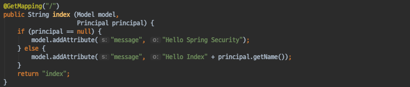
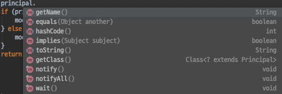
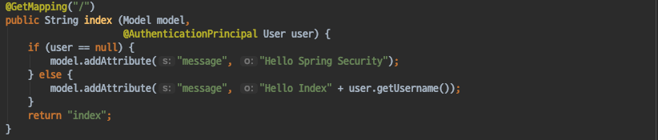
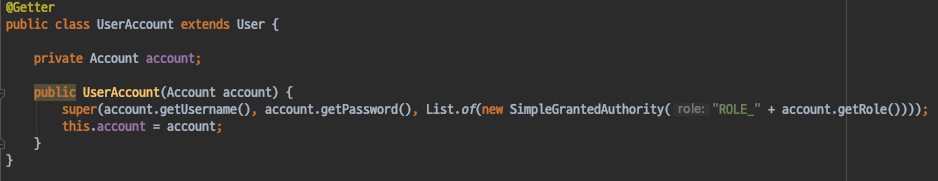
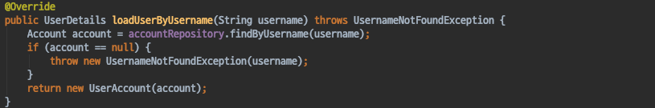
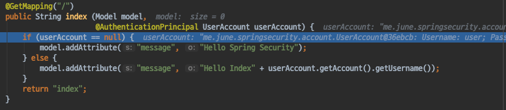
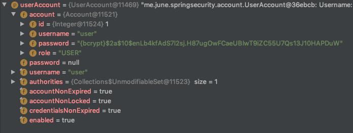
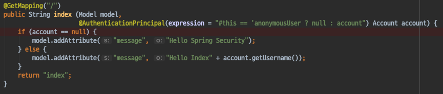
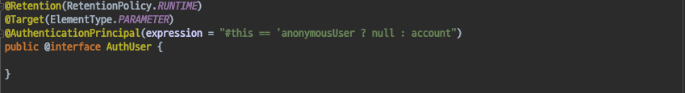
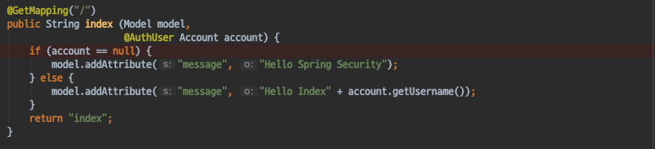

# Spring Security - @AuthenticationPrincipal

#### @AuthenticationPrincipal
로그인한 사용자의 정보를 파라메터로 받고 싶을때 기존에는 다음과 같이 Principal 객체로 받아서 사용한다.
- 하지만 이 객체는 SecurityContextHolder의 Principal과는 다른 객체이다.

이 객체는 JAVA 표준 Principal 객체이며 우리가 참조할수 있는 정보는 name 정보 밖에 없다.

@AuthenticationPrincipal 애노테이션을 사용하면 **UserDetailsService에서 Return한 객체** 를 파라메터로 직접 받아 사용할 수 있다.

- 하지만 이방법도 우리가 원하는 방법은 아니다.
> 현재 로그인한 사용자의 정보를 참조하고 싶을때 도메인의 User를 나타내는 객체 (Account)를 직접 사용하고 싶다.

#### Adapter 클래스
- UserDetailsService에서 리턴하는 타입을 변경하면, Controller에서 @AuthenticationPrincipal로 받아올수 있는 객체가 변경된다.
- 이때 사용할수 있는 방법은 두가지가 존재한다.
    - 1.Account 객체를 직접 리턴하기
    - 2.**Account 객체를 감싸는 Adapter 클래스** 사용하기

> - Account객체를 직접 리턴하는 방법은 나쁜 방법은 아니지만, Account객체가 UserDetails를 구현해야한다.
> - 도메인 객체는 특정 기술에 종속되지 않도록 개발하는것이 베스트 프렉티스이다.

Adapter 클래스를 사용하는 방법을 사용하도록 한다.

`UserAccount`

UserAccount 클래스의 내부를 살펴보자
- User클래스를 상속받는다.
- UserAccount의 멤버는 오로지 Account 객체만이 존재한다.
- 생성자 내부에서 User 클래스의 생성자를 호출하여 username, password, role을 세팅한다.

User 클래스를 상속받는 이유 ?
> - UserDetailsService에서 Return하는 객체는 UserDetails 타입이여야 한다.
> - 따라서 UserDetails를 구현하는 User 클래스를 상속 받는 방식으로 사용한다.

변경된 UserDetailsService는 다음과 같다.

#### UserAccount 사용하기
UserDetailsService에서 UserAccount 객체를 리턴하도록 변경하였으니 Controller에서도 변경되었는지 확인해보자.
- 우리가 기대한 대로 UserAccount 객체를 가져오며 내부에 account 객체를 감싸고있어 로그인한 사용자에 대한 account 객체를 참조하여 사용할 수 있다. 

하지만 이 방법은 한가지 문제가 있다.
> Account 객체를 UserAccount객체가 감싸는 구조이기 때문에 Account객체를 직접 참조하여 사용하려면 getAccount() 코드가 게속해서 중복된다.

#### Account객체 직접 사용하기
- @AuthenticationPrincipal 은 SpEL 을 지원한다.
- SpEL 을 사용해서 Adapter클래스가 아닌 Account 객체를 직접 가져올 수 있다.

> 만약 현재 참조중인 객체가 AnonymousAuthenticationFilter에 의해 생성된 Authentication 인 경우 null을 반환하고, 아니라면 UserAccount 객체로 간주하고 UserAccount객체가 감싸고 있는 Account 객체를 반환한다.

#### @AuthUser
SpEL 을 사용하여 직접 Account객체를 가져오긴 했지만 해당 코드가 너무 길다..
- 모든 컨트롤러에 해당 코드를 넣을수도 없는 노릇이다.
- 이는 커스텀 애노테이션을 생성하여 해결하자.

`@AuthUser`

`@AuthUser 적용`

#### 정리
- @AuthenticationPrincipal 를 사용하여 UserDetailsService에서 리턴한 객체를 컨트롤러의 파라메터로 직접 참조할 수 있다.
- 만약 도메인의 User를 표현하는 클래스 (Account)를 직접 참조하고 싶다면, Adapter클래스를 사용하거나, Account 객체를 직접 리턴하여야한다.
- Account 객체를 직접 리턴하는 방법은 도메인 클래스에 영향을 미치게 되므로 추천하지 않는다.
    - UserDetails클래스 를 구현해야한다
