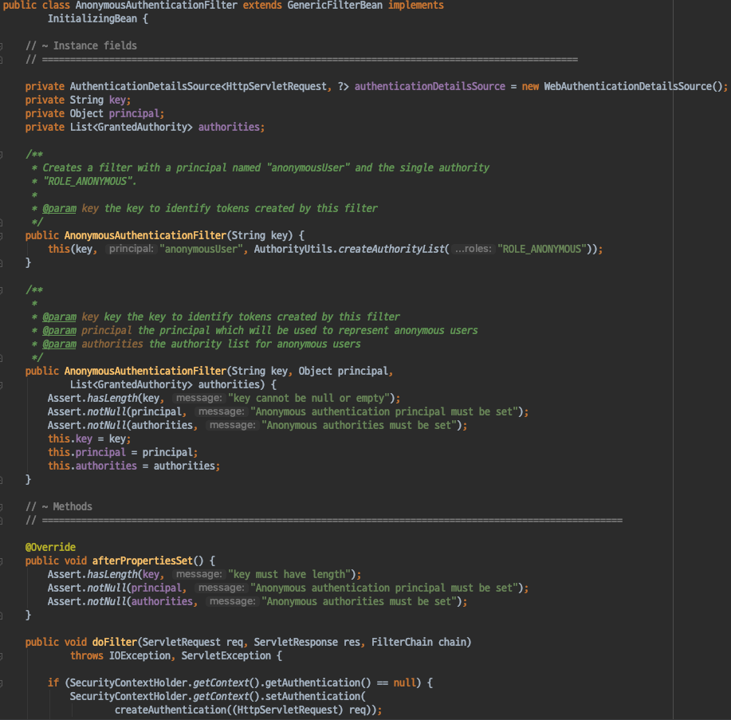
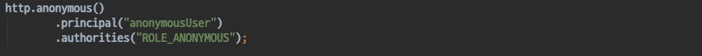
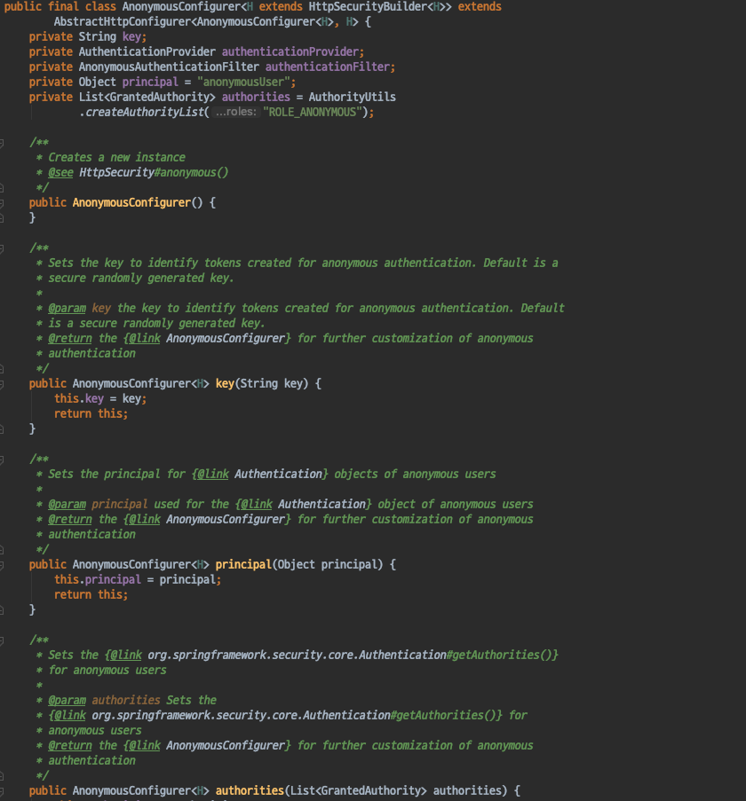
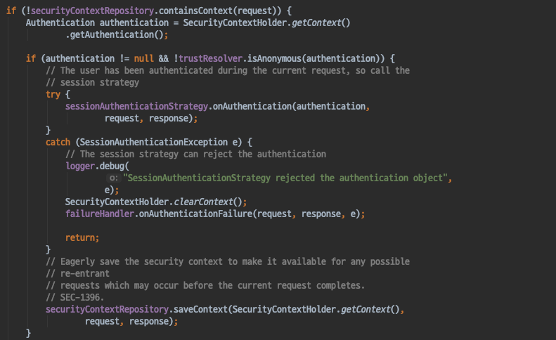

# Spring Security - AnonymousAuthenticationFilter
- Spring Security 에서 익명사용자에 대한 처리를하는 필터를 살펴보자.

#### AnonymousAuthenticationFilter

- 인증을 하지않은 요청일 경우 SecurityContextHolder에 익명 Authentication객체를 넣어주는 역할을 한다.

`AnonymousConfigurer`
- 기본으로 만들어서 사용할 익명 Authentication 객체를 설정할 수 있다.
- 기본값
    - pricial: anonymousUser
    - authorities: ROLE_ANONYMOUS

#### Null Object Pattern
- Spring Security 에서는 일종의 **Null Object Pattern** 을 사용한다.
    - Null Object Pattern 이란 코드에서 Null 체크를 하는것이 아닌 **Null을 대변하는 객체**를 생성하여 이를 대신하는 것이다.
- Security Filter 의 코드 곳곳에서 anonymous Authentication 객체인지 체크하는 코드를 사용한다

#### 참조
- https://www.geeksforgeeks.org/null-object-design-pattern/
