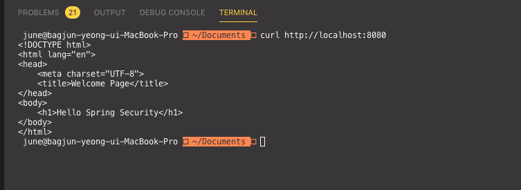
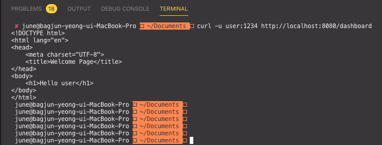
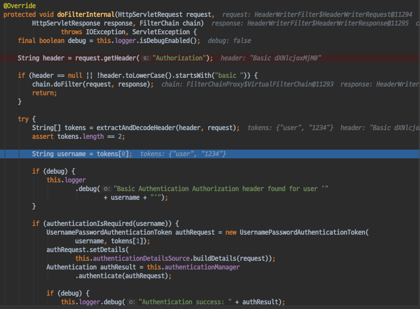

# Spring Security - BasicAuthenticationFilter
- Spring Security 에서 HttpBasic 인증을 처리하는 Filter를 살펴보자.

#### HttpBasic
- Http Spec 중 Header에 username, password 를 실어 보내면 브라우저 혹은 서버가 그 값을 읽어 인증하는 방식이다.
- 보통 브라우저 기반 요청이 클라이언트의 요청을 처리할때 자주 사용한다.
- 보안에 상당히 취약하기 때문에 반드시 HTTPS를 사용할 것을 권장한다.
    - 요청이 하나라도 Snipping 당한다면 인증정보가 노출된다.

`curl 을 활용하여 HttpBasic 인증하기`
- curl 을 사용하면 다음과같이 요청을 손쉽게 보내고 응답을 받을 수 있다.

- -u 옵션을 사용하여 username:password 을 요청과 같이 보내면 BasicAuthentication 헤더를 포함하여 요청을 보낼수 있다.

#### Spring Security에서 HttpBasic 인증 방식과 폼인증 방식의 차이
`BasicAuthenticationFilter`
- HttpBasic 인증방식도 폼인증과 마찬가지로 AuthenticationManager를 사용한다.
- 폼인증과 차이점은 BasicAuthenticationFilter는 요청 Header에서 username, password를 읽어온다.
- SecurityContextHolder에 저장하는 방식은 같지만, 폼인증과 달리 SecurityContext를 Repository에 저장하는 프로세스가 존재하지 않는다. stateless 하다.
- 매번 요청마다 인증을 시도한다.

#### 정리
- HttpBasic 인증 방식은 요청 헤더를 이용한 인증 방식이다.
- 요청헤더 username, password를 실어서 요청을 보내기때문에, 요청중 1번이라도 탈취를 당하게된다면 인증 정보가 노출이 되게 된다. Https가 권장된다.
- 또한 요청헤더를 통해 username, password를 보냈기때문에 요청헤더에서 부터 인증정보를 읽어와 인증을 시도하며, 폼인증 방식과 달리 stateless 하기때문에 매 요청마다 인증을 시도한다.

#### 참조
- https://en.wikipedia.org/wiki/Basic_access_authentication
