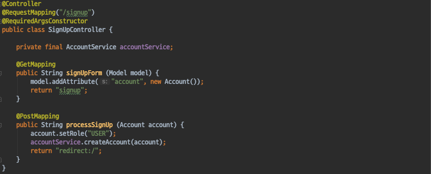
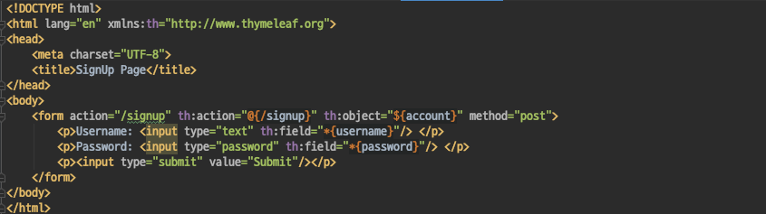
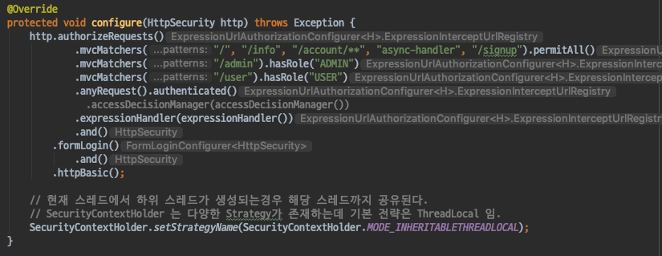
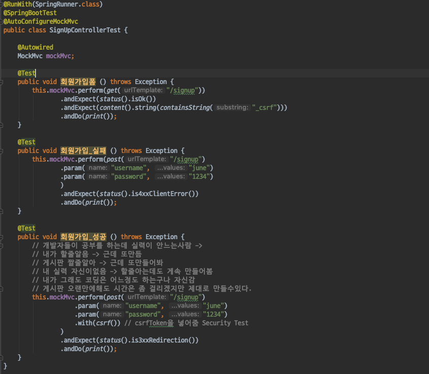
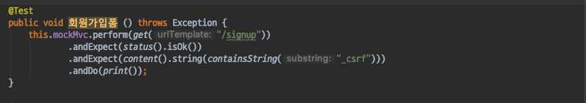
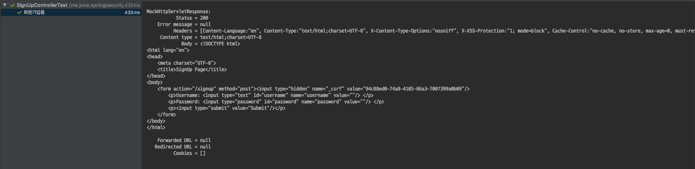
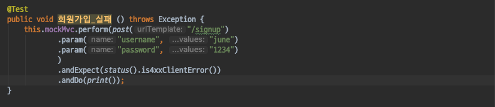
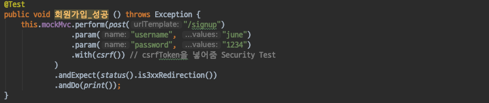
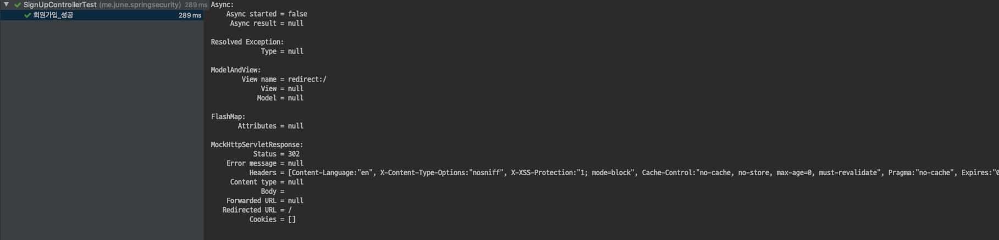

# Spring Security - CsrfToken
- CSRF Token 활용 방법을 살펴보자.

#### CSRF Token
- CSRF Attack을 방지하기 위한 매커니즘
- 임의의 토큰을 발급하여 리소스에 대한 변경 요청일 경우 Token값을 확인하여 현재 서비스에서 제공한 Form을 통해 정상적인 요청을 보낸것인지 확인한다.
- 만약 CsrfToken이 존재하지않거나, 일치하지 않는경우 4XX 응답을 보낸다.
- thyleaf2.0 이상 혹은 jsp > spring:form tag를 사용한다면 csrf token을 자동적으로 넣어준다.

#### CSRF Token 활용해보기

##### SignUpController
- CSRF Token을 활용한 Form 회원가입을 통해 테스트를 진행해 보자.
- 먼저 회원가입과 관련된 Controller를 생성한다.

`SignUpController`
- GET /signup 으로 요청을 보내면 회원가입 폼 페이지로 이동한다.
- POST /signup 으로 요청을 보내면 username,과 password를 받아 USER 권한을 가지는 회원을 생성한다.

`signup.html`
- Thymeleaf를 활용한 간단한 회원가입 폼 페이지이다.
- Thymeleaf를 활용하여 spring:form 태그와 같이 자동으로 바인딩을 해준다.

##### SecurityConfig
- 현재 Security 설정에는 /signup 에 대한 리소스 접근시 인증을 요구하기때문에 회원가입을 진행할 수 없다.
- 따라서 다음과 같이 /signup에도 인증 여부와 상관없이 접근이 가능하도록 설정을 해준다.

##### 회원가입 테스트
- JUnit을 활용하여 CSRF Token을 활용한 Form 회원가입에 대한 테스트진행해 보자.
- 먼저 SignUpControllerTest 클래스를 작성한다.

`SignUpControllerTest`

`회원가입 폼`
- GET /signup 으로 요청을 보내면, 200 응답과 함께 회원가입 폼 페이지가 응답하길 바라는 테스트코드이다.
- 이때 폼페이지에는 _csrf라는 응답이 포함되어 있어야한다.
    - _csrf라는 hiiden 필드로 thymeleaf, spring:form 태그에 자동적으로 csrf토큰을 넣어준다.

* 응답 결과
    - 기대한 대로 200응답과 함께 회원가입폼에 _csrf 라는 이름으로 csrf토큰이 존재하는것을 확인 할 수 있다.

`회원가입 실패`
- POST /signup 으로 **CSRF Token 없이** 요청을 보내면 4XX 응답과 함께 요청이 거부되는것을 기대하는 테스트코드이다.

* 응답 결과
    - 기대한 대로 4XX응답과 함께 요청이 거부되는 것을 확인할 수 있다.

`회원가입 성공`
- 이번에는 POST /signup 으로 **CSRF Token과 함께** 요청을 보내면 유저 생성을 마치고, 3XX Redirection 응답을 기대하는 테스트코드이다.
- csrf Token을 테스트코드에서 넣어주기위해 SpringSecurityTest에서 제공하는 with(csrf()) 메서드를 활용하자.

* 응답 결과
    - 회원가입이 성공하고, 302 Redirection 응답이 온것을 확인할 수 있다.

