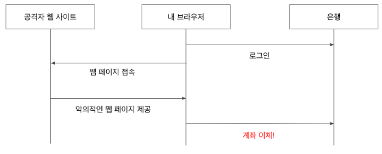

# Spring Security - CsrfFilter
- Security FilterChain에서 4번째로 실행되는 필터
- **CsrfAttack**을 방어하는 Filter이다.

#### CSRF
- 사용자가 원치않는 요청을 악의적으로 임의로 만들어 보내는 기법이다.
- **CORS** 를 사용할때 특히 주의 해야한다.
    - 타 도메인에서 보내는 요청을 허용하기 때문에 취약점이 생기기 쉬움
- **CSRF Token**을 사용하여 리소스를 변경하는 요청의 경우 서버에서 보내준 토큰 여부를 확인하여 공격을 방지한다.

`CSRF Attack`
- 특정 웹사이트에서 어떠한 은행사이트에 계좌이체요청을 하는 Form을 생성해두고 클릭을 유도한다.
- 해당 Form을 클릭하는 순간 내 은행에서 계좌이체요청이 가게되고, 내 계좌에서 공격자의 계좌로 이체가 되어버림.
- 이러한 공격을 방지하기 위해 CSRF Token을 사용한다.
- 어떠한 리소스를 생성하거나, 변경하는 요청을 할때 Token을 활용하여, 정상적인 리소스 요청인지를 판별한다.
- A라는 은행에서 생성한 CSRF 토큰과, 공격자사이트에서 임의로 생성한 CSRF Token이 일치할 확률은 매우 낮다.

#### 참고
- CSRF
    - https://www.owasp.org/index.php/Cross-Site_Request_Forgery_(CSRF)
    - https://namu.wiki/w/CSRF
- CORS
    - https://en.wikipedia.org/wiki/Cross-origin_resource_sharing
