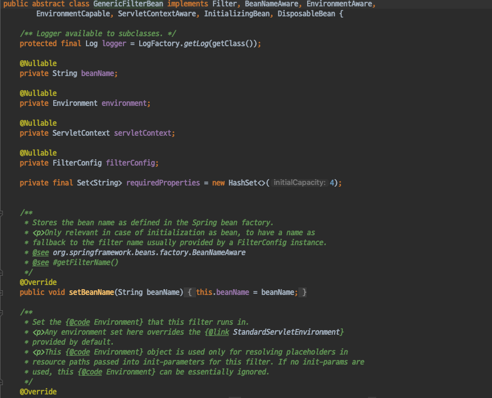
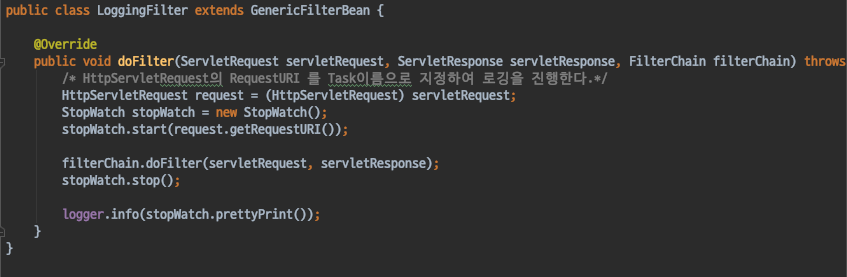
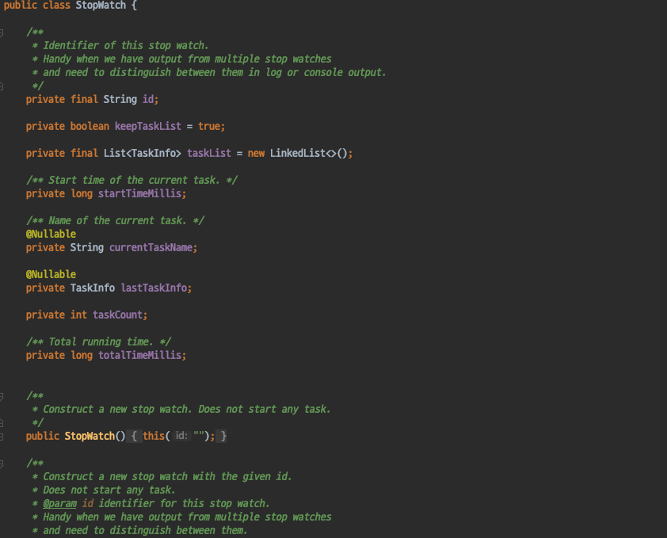
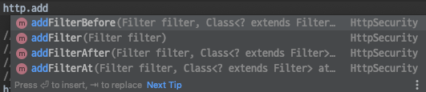
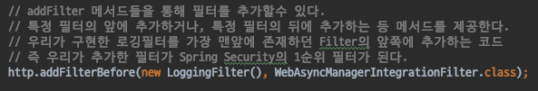
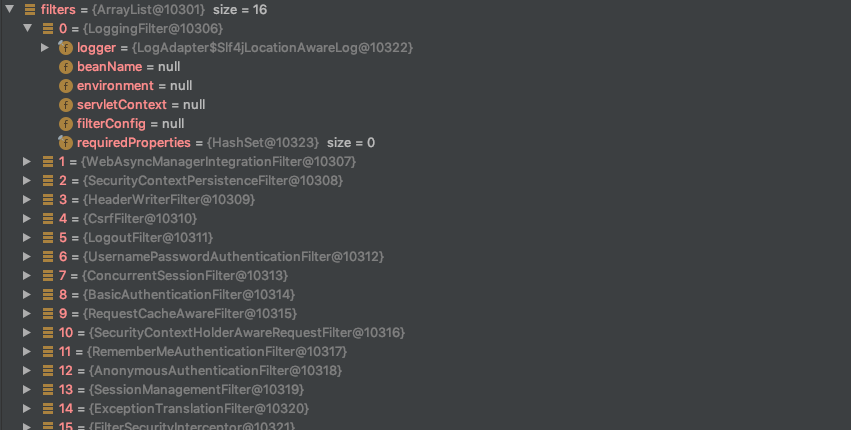

# Spring Security - CustomFilter

#### CustomFilter
- 지금까지 Spring Security가 제공하는 15개의 필터 및 Spring Security가 제공하는 Filter들을 추가 해서 사용하는 법을 알아보았다.
- 이번에는 Spring Security가 제공하지 않고 우리가 직접 생성한 Filter를 추가하는 방법을 살펴보도록 하자.
- CustomFilter의 구현은 여차 다른 Servlet필터들과 다르지 않다.
- Filter Interface를 사용해도 되고, GenericFilterBean 클래스를 상속받아 구현해도 된다.
    - Filter interface를 사용하면 doFilter, init, destory 메서드를 모두 구현해야 한다.
    - GenericFilterBean을 좀더 구현하기 쉽고, Spring 친화적인 상위클래스이다.
    - GenericFilterBean를 구현하면 doFilter 메서드만 구현해도 된다.

Spring Security와는 관련 없지만, 요청을 처리하고 응답을 처리하는데 시간이 얼마나 걸렸는지 로깅하는 간단한 필터를 구현해보자.

#### LoggingFilter
- 먼저 LoggingFilter 클래스를 생성하고, GenerericFilterBean클래스를 상속받아 구현한다.

**StopWatch** 클래스를 이용해 filter chain 처리 전/후 를 비교, 요청을 처리하는데 시간이 얼마나 걸렸는지 체크를 하도록 구현한다.

##### StopWatch
- 보통의 스톱워치 기능이라면 System클래스의 currentTimeMills() 메서드를 사용해 스톱워치 기능을 구현한다. 간단하게 사용하기엔 나쁘지 않지만 Spring 에서 제공하는 StopWatch클래스를 활용하면 좀 더 간결하고 다양한 출력방법을 제공하기 때문에 추천하는 방법이다. 
- https://docs.spring.io/spring-framework/docs/current/javadoc-api/org/springframework/util/StopWatch.html

#### CustomFilter 추가하기
- 다른 Filter 설정들과 마찬가지로 HttpSecuriry를 통해 설정이 가능하다.

- addFilter 메서드들을 통해 필터를 추가할 수 있다.
- 특정 필터의 앞에 추가하거나, 특정 필터의 뒤에 추가하는 등 메서드들을 제공한다.

- 우리가 구현한 필터를 Spring Security Filter Chain의 가장 앞에 존재하는 WebAsyncManagementIntegrationFilter 앞에 추가 하도록 하자.

필터를 추가한 뒤 요청을 보내면 FilterChainProxy의 1순위 필터로 우리가 추가한 LoggingFilter가 추가된 것을 확인할 수 있다.

