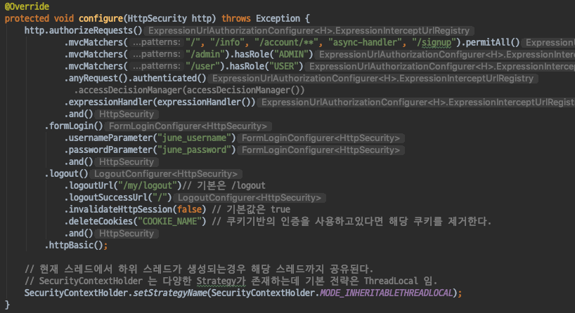
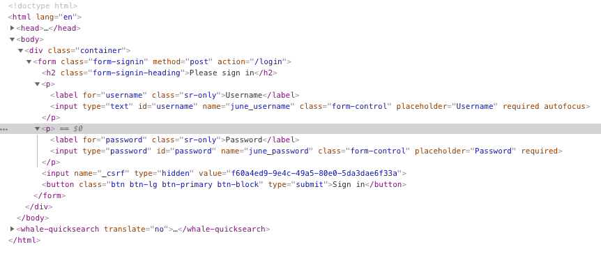
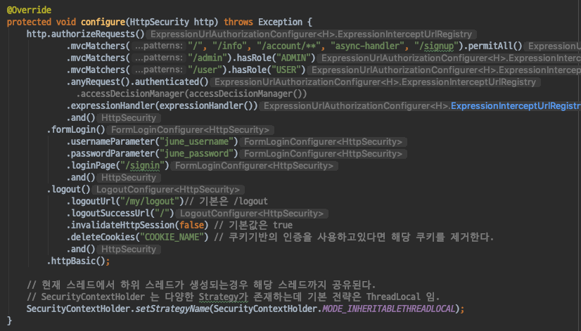
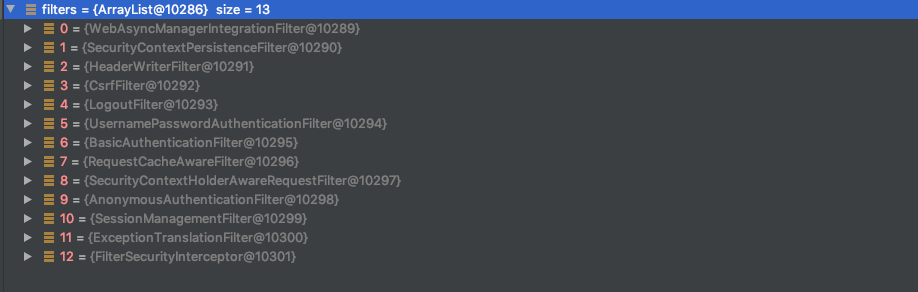

# Spring Security - DefaultLogin/LogoutPageGeneratingFilter
- Spring Security 에서 기본 로그인폼 페이지를 생성해주는 Filter이다.

#### DefaultLogin/LogoutPageGeneratingFilter
- GET /login 으로 들어오면 자동으로 기본 로그인폼 페이지를 생성해준다.

`Login관련 설정 커스터마이징`
- SpringSecurityConfig에서 formLogin 설정을 활용하면 username, passwordParameter 를 변경할 수 있다.

- username, passwordParamter를 변경하면 다음과 같이 기본 제공 LoginPage에서 필드명이 변경되는걸 확인할 수 있다.

- SpringSecurityConfig를 통해 로그인 성공, 실패시 Url설정도 가능하다.
- 커스텀한 로그인 페이지를 사용하고 싶은경우 loginPage에 대한 설정을 할 수 있다.

- loginPage에 대한 설정을 하면 DefaultLogin/LogoutPageGeneratingFilter가 등록되지 않는다. (기본 로그인 페이지를 사용할 수 없다.)
- loginPage 설정을 /signin으로 설정한 결과 FilterChainProxy에서 DefaultLogin/LogoutPageGeneratingFilter가 사라진것을 확인할 수 있다.

#### 정리
- Spring Security 기본 로그인/로그아웃 페이지는 DefaultLogin/LogoutPageGeneratingFilter가 생성해준다.
- username, password parameter를 변경할 수 있으며, loginPage도 커스텀하게 사용이 가능하다.
- 커스텀한 loginPage설정을 하게되면 DefaultLogin/LogoutPageGeneratingFilter는 등록되지 않는다.
