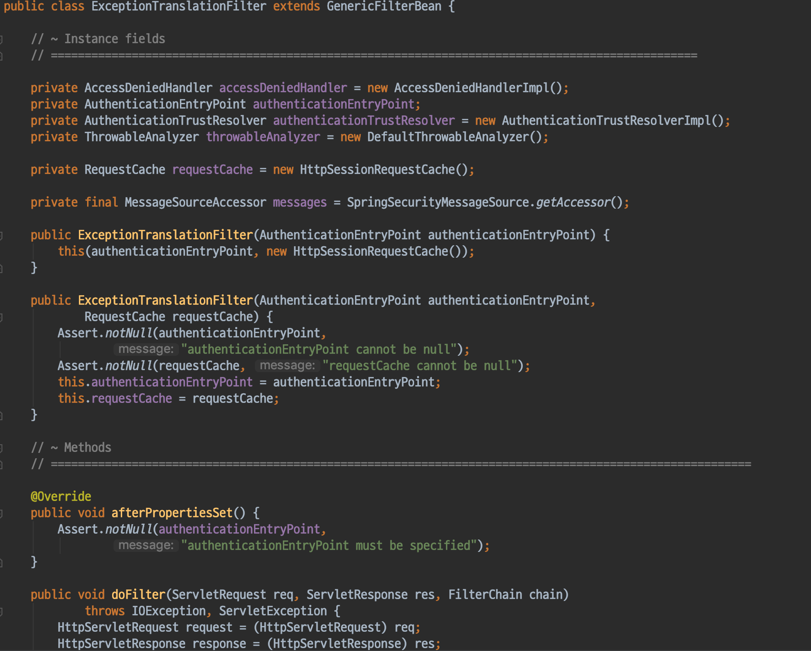
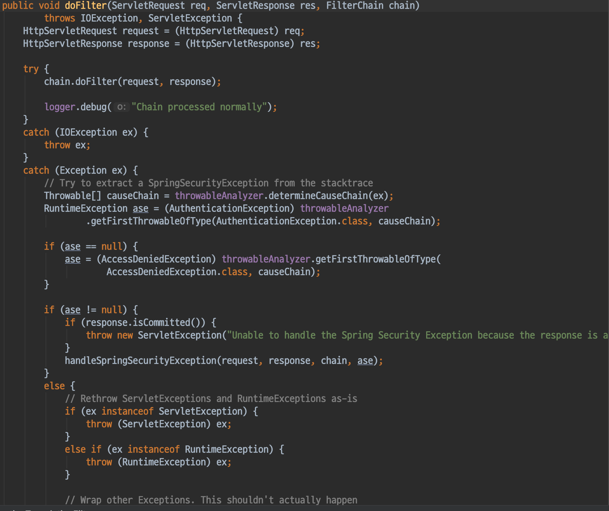
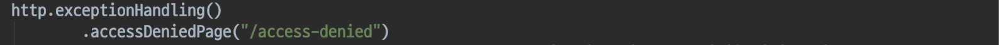
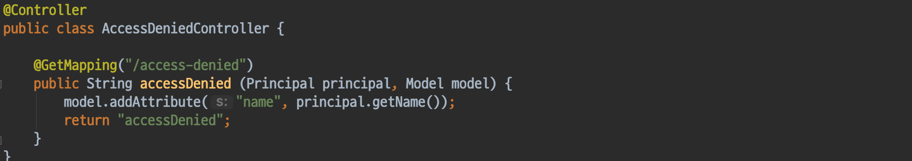
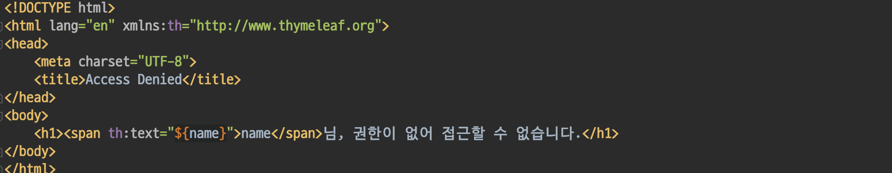
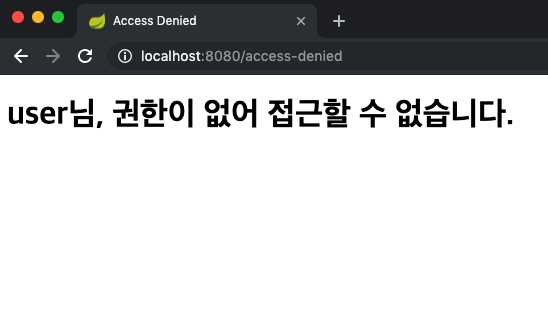

# Spring Security - ExceptionTranslationFilter
- Spring Security 에서 인증/인가 예외 처리 필터

#### ExceptionTranslationFilter

ExceptionTranslationFilter는 SecurityInterceptor와 밀접한 관계가 있다.
- ExceptionTranslationFilter가 SecurityInterceptor 이전에 존재해야한다.
- 이유 ?
    - ExceptionTranslationFilter가 try-catch 블록으로 감싼뒤 SecurityInterceptor를 실행하는 구조이다.
    - SecurityInterceptor가 인가처리를 하는 과정에서 발생하는 예외를 처리한다.

##### SecurityInterceptor
SecurityInterceptor가 AccessDecisionManager를 사용하여 실제 인가를 처리한다.
    - AccessDecisionManager의 기본 구현체인 AffirmatvieBased를 사용한다.
- 인가 처리 과정에서 두가지 예외가 발생할 수 있다.
- 1. AuthenticationException
    - 인증이 되지않은 요청인경우
    - **AuthenticationEntryPoint** 를 사용하여 처리를 한다.
- 2. AccessDeniedException
    - 인가가 되지 않은경우
    - **AccessDeniedHandler** 를 사용하여 처리를 한다.

##### AuthenticationEntryPoint
- 기본 구현 -> 해당 유저를 로그인을 하게끔 유도한다.

##### AccessDeniedHandler
- 기본 구현 -> 403 에러 페이지를 보여준다.
    - 기본 설정으로는 SpringBoot Error Page를 보여준다.

#### AccessDeniedPage 커스터마이징 하기
`AccessDeninedPageConfig`
- AccessDeninedPage를 /access-denied로 설정한다.

`AccessDeniedController`
- accessDenied.html 을 리턴하는 간단한 핸들러이다.

`accessDenied.html`
- 현재 로그인한 사용자의 이름과 함께 메시지를 출력하는 간단한 페이지이다.

#### 결과

