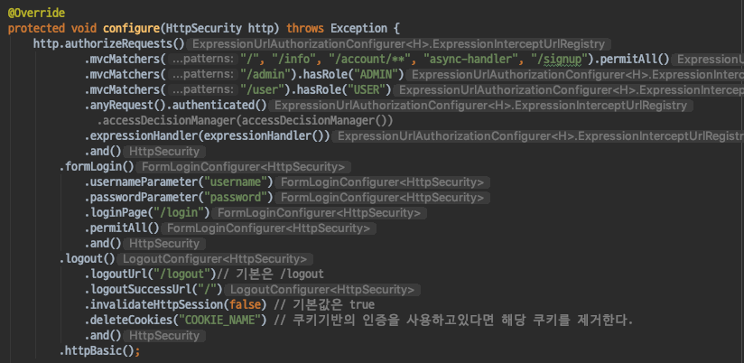
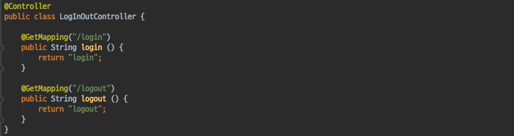
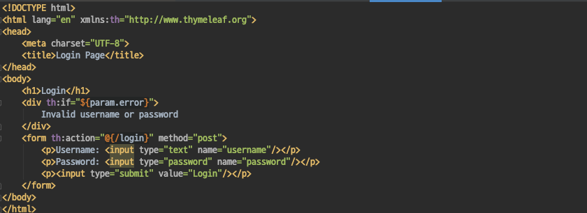
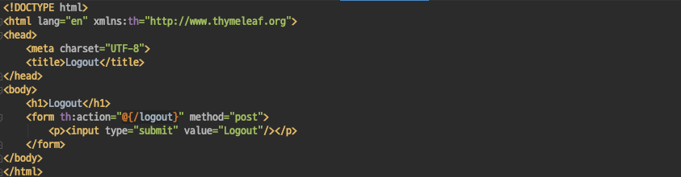
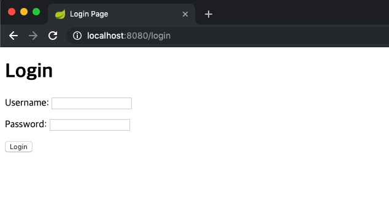
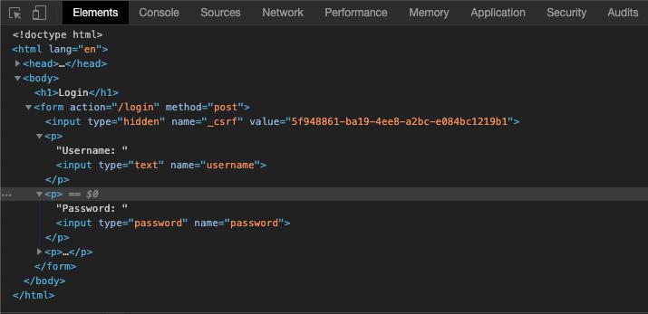
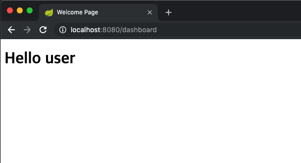
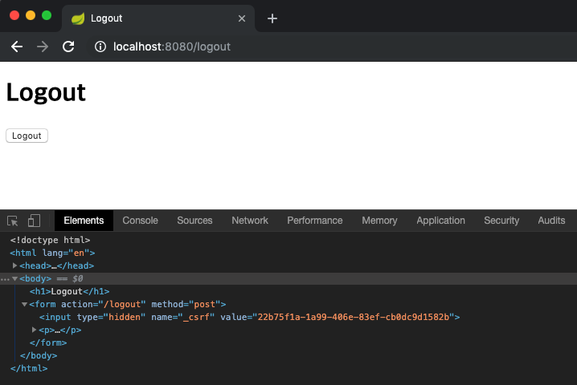
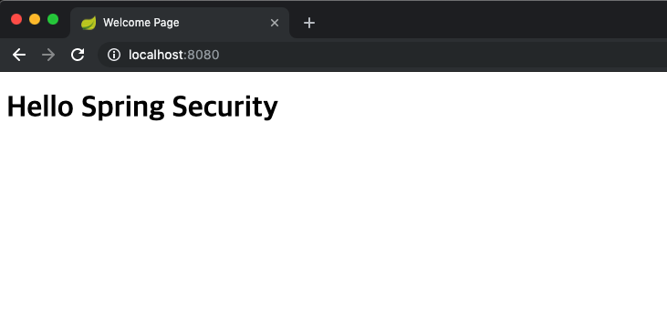

# Spring Security - Login/Logout Page 커스터마이징
- DefaultLogin/LogoutPageGeneratingFilter가 생성해주는 것이 아닌 커스텀한 페이지를 설정해 보도록 하자.

#### Login/LogoutPage
- LoginPage와 LogoutPage를 각각 /login, /logout 으로 지정해주고, loginPage와 logoutPage를 보여줄 핸들러를 작성한다.

`SecurityConfig`

`LogInOutController`
- GET /login요청을 하면 login.html 을 뷰로 보여주고, GET /logout을 요청하면 logout.html을 뷰로 보여주는 매우 간단한 핸들러이다.

- login, logout url을 지정해주면, 해당 URL의 GET 요청은 폼을 보여주고, POST 요청은 LoginFilter가 로그인 처리를 하게된다.

`login/logout.html`
- 간단한 로그인/로그아웃 폼 페이지이다.

#### 테스트
- 우리가 커스터마이징한 로그인/로그아웃 페이지가 정상적으로 작동하는지 테스트를 진행해보자.

`LoginPage Test`

먼저 유저를 생성한뒤 /dashboard로 요청을 보내면 다음과 같이 커스텀한 로그인 페이지가 나타나는것을 볼수 있다.

커스텀한 로그인 페이지는 Thymeleaf로 생성하였기 때문에 Spring Security Csrf Token도 자동적으로 들어가 있는것이 확인된다 (Thymeleaf2.1 이상)

username과 password를 입력한뒤 로그인 요청 (POST /login) 을 하게되면 UsernamePasswordAuthenticationFilter를 사용하여 인증을 시도하게되고, 인증에 성공한뒤 /dashboard 페이지를 다음과 같이 확인할 수 있다.

`LogoutPage Test`

이번엔 로그아웃 페이지에 대한 테스트를 진행해보자.
/logout 으로 요청을 보내면 우리가 생성한 커스텀한 로그아웃 페이지를 응답으로 받을수 있다.

로그아웃 요청 (POST /logout) 을 하게되면 LogoutFilter 를 사용하여 로그아웃 처리를 한뒤 / 페이지로 이동하게 된다.

