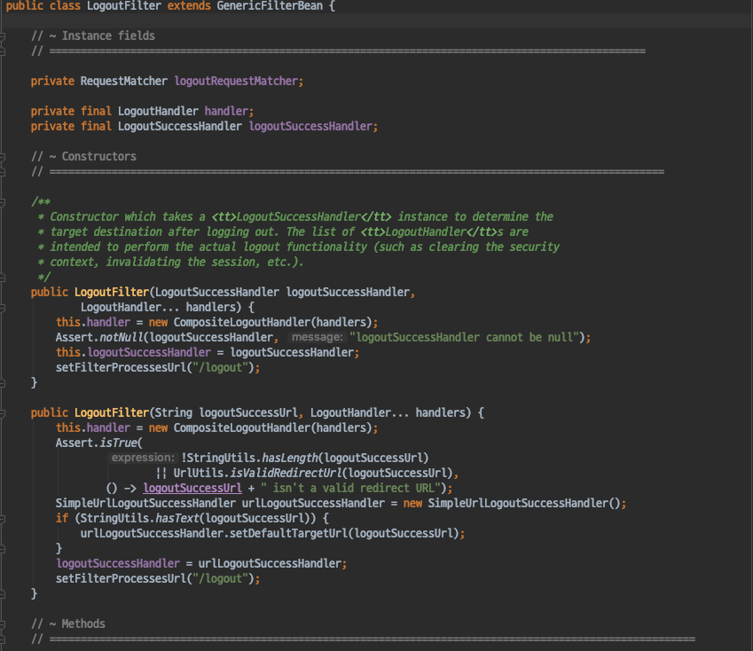
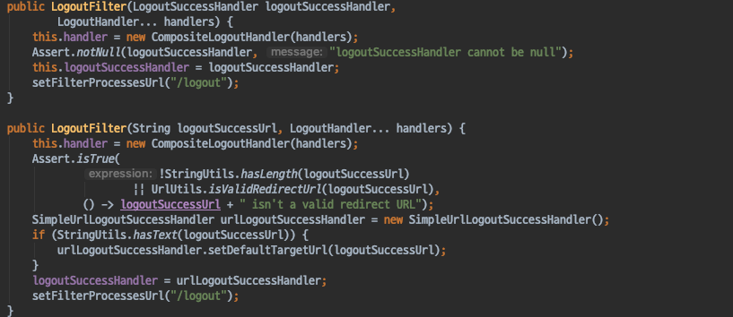
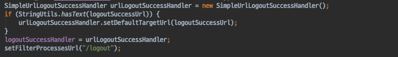
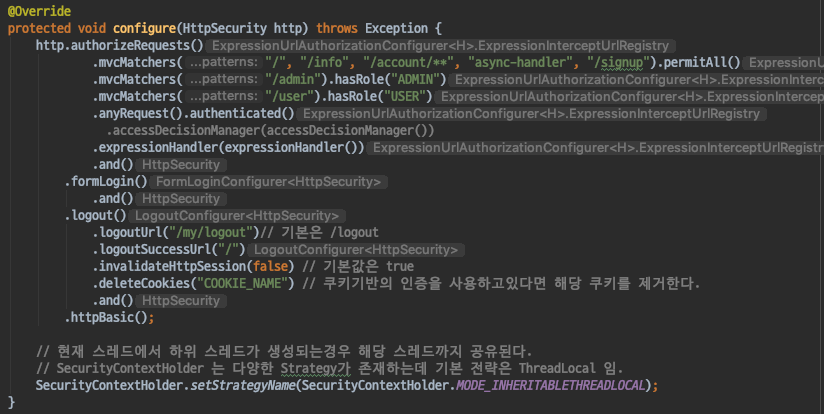

# Spring Security - Logout Filter
- Spring Security 에서 Logout 처리를 하는 Filter인 LogoutFilter를 알아보자.

#### LogoutFilter

LogoutFilter는 크게 두가지 요소로 구분된다.
- 1.Logout handler
- 2.Logout Success Handler 

`LogoutHandler`
- 다른 여러 로그아웃 핸들러를 감싸는 컴포짓 객체이다.
- 사실상 다른 여러개의 로그아웃 핸들러를 사용한다.
- 기본적으로 2개의 로그아웃 핸들러가 사용된다.
    - 1.CsrfLogoutHandler
    - 2.SecurityContextLogoutHandler

`LogoutSuccessHandler`
- 로그아웃 처리를 하고난 뒤 어떻게 처리를 할것인지 를 결정하는 핸들러이다.
- 기본 핸들러는 SimpleUrlSuccessHandler 이다.
    - 기본으로 명시되어있는 URL 로 리다이렉트 시켜준다.

* 로그아웃 페이지는 LogoutFilter가 만들어준것이 아니다.
- **DefaultLogoutPageGeneratingFilter** 가 생성해준다.

- 로그아웃 버튼을 눌렀을때 Logout Filter가 처리하는 것이다.

#### Logout 관련 설정하기
- 현재는 기본 설정에따라 logoutPage Url 은 /logout, logout을 처리하는 Url도 /logout 으로 설정되어있으며, 로그아웃 이후 다시 로그인페이지로 이동한다.
- HttpSecurity를 설정하는 과정에서 Logout 관련 설정을 변경할수 있도록 제공한다.

- logoutUrl()
    - 실질적으로 로그아웃을 처리할 Url을 설정한다.
    - 기본값은 /logout
- logoutSuccessUrl
    - 로그아웃 성공시 이동할 Url이다.
    - 기본값은 로그인페이지로 이동한다.
- invalidateHttpSession
    - 로그아웃 성공시 세션을 만료시킬지 여부를 설정한다.
    - 기본값은 true
- deleteCookies
    - 로그아웃 성공시 삭제할 쿠키를 설정한다.
    - 쿠키기반의 인증을 사용하고 있다면 필수설정이다.

* 만약 logoutUrl을 변경했다면 **기본 로그아웃 페이지는 /logout을 로그아웃 Url로 사용하고 있기때문에 기본 제공하는 로그아웃 페이지는 사용할수 없다.**

* LogoutUrl 로 지정한 Url로 Post 요청이 들어왔을때 LogoutFilter에서  logoutHandler들을 사용하여 로그아웃을 처리하고, logoutSuccessHandler를 사용하여 추가적인 처리를 하는것이다.
    - logoutSuccessHandler에 의해 로그인 페이지로 이동하게 되는것

##### 정리
- SpringSecurity에서는 LogoutFilter를 사용하여 로그아웃 관련 처리를 진행한다.
- 기본 로그아웃페이지는 /logout, 로그아웃 Url은 /logout이다.
- 기본 로그아웃 페이지는 LogoutFilter가 생성하는것이 아닌 **DefaultLogoutPageGeneratingFilter** 가 생성한다.
- HttpSecurity를 커스터마이징하는 과정에서 Logout관련 설정을 할 수 있다.
- LogoutUrl에서 지정한 Url로 Post요청이 왔을때, LogoutFilter에서 로그아웃 처리및, 성공 처리를 한다.
